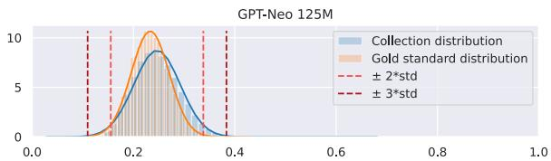
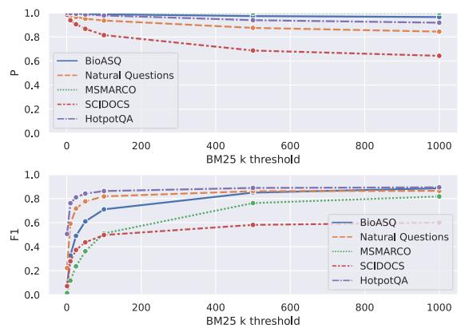
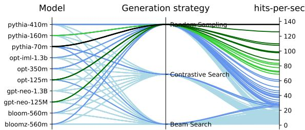
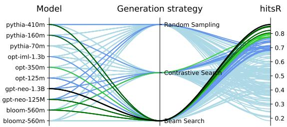
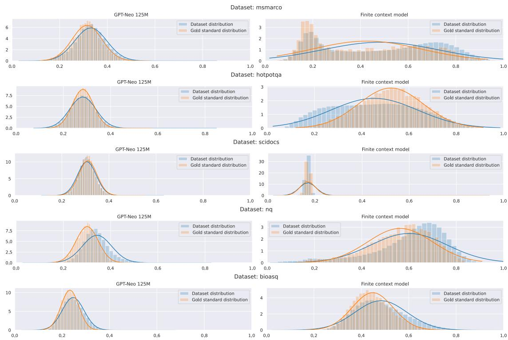
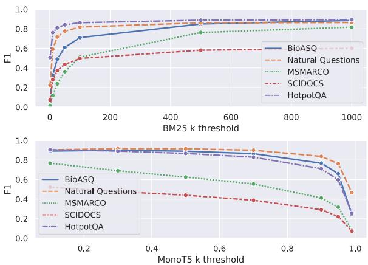
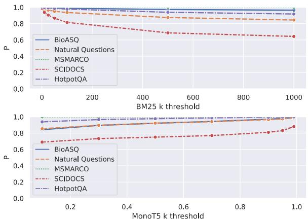
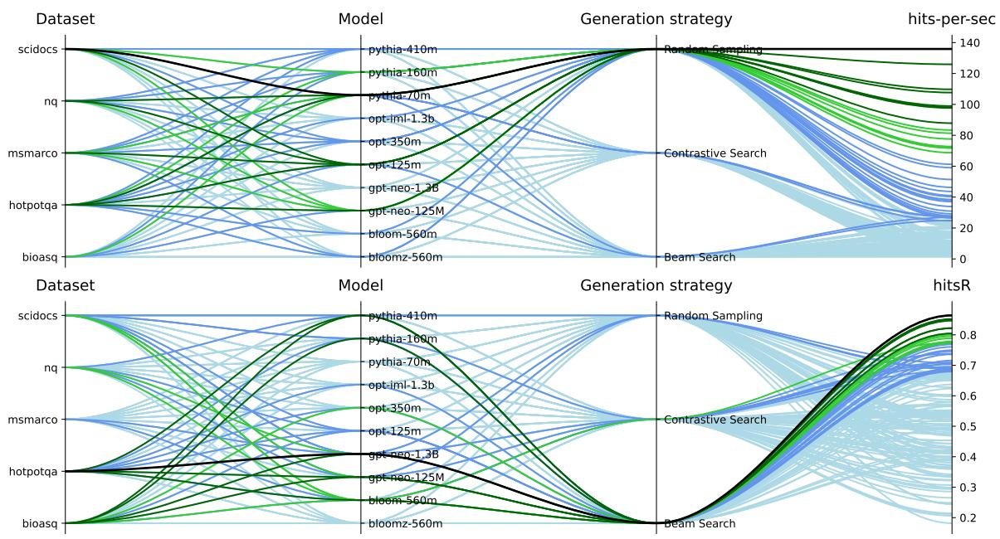

# Exploring efficient zero-shot synthetic dataset generation for Information Retrieval

Tiago Almeida

DETI/IEETA, LASI

University of Aveiro, Portugal

tiagomeloalmeida@ua.pt

Sérgio Matos

DETI/IEETA, LASI

University of Aveiro, Portugal

aleixomatos@ua.pt

# Abstract

The broad integration of neural retrieval models into Information Retrieval (IR) systems is significantly impeded by the high cost and laborious process associated with the manual labelling of training data. Similarly, synthetic training data generation, a potential workaround, often requires expensive computational resources due to the reliance on large language models. This work explored the potential of small language models for efficiently creating high-quality synthetic datasets to train neural retrieval models. We aim to identify an optimal method to generate synthetic datasets, enabling training neural reranking models in document collections where annotated data is unavailable. We introduce a novel methodology, grounded in the principles of information theory, to select the most appropriate documents to be used as context for question generation. Then, we employ a small language model for zero-shot conditional question generation, supplemented by a filtering mechanism to ensure the quality of generated questions. Extensive evaluation on five datasets unveils the potential of our approach, outperforming unsupervised retrieval methods such as BM25 and pretrained monoT5. Our findings indicate that an efficiently generated "silver-standard" dataset allows effective training of neural rerankers in unlabeled scenarios. Code is publicly available at https://github.com/ieeta-pt/SynQGen.

# 1 Introduction

Deep Learning is at the heart of many current breakthroughs in AI in a wide range of fields. Typically, such progress is attributed to better computational capabilities, superior algorithms, and a larger corpus of high-quality training data. Particularly in the Information Retrieval (IR) field, significant gains against traditional baselines are obtained when a large amount of labelled data is available (Craswell et al., 2021, 2022, 2023). However, manual data

labelling is expensive and labor-intensive, highlighting the urgency to devise methods that can automatically produce higher quality training data to unlock the potential of neural retrieval models for unlabelled data collections.

  
Figure 1: Overview of the process of generating synthetic questions with LM for information retrieval.

Recent strides in large language models offer a new avenue of generating synthetic training data to train neural retrieval models (Bonifacio et al., 2022). Present strategies largely fall into two categories, finetune-based and prompt-based. The former necessitates annotated data to train a language model to craft questions given a document text and, optionally, a correct answer. In contrast, the prompt-based method capitalizes on expensive language models to generate a question in a zero-shot fashion, using a document as context. Although both techniques are effective, they still have some drawbacks.

The finetune-based approach is a supervised method, thus requiring the acquisition of labelled data. Moreover, even though publicly available models can be adopted, these inevitably bear inherent biases from their training dataset, which can be a limiting factor in adapting to the target domain. On the other hand, the prompt-based approach, often linked to large models, comes with steeper costs, be it for model execution or through paid APIs. This particularly restricts its applicability in low-resource environments. Another overlooked problem that is rooted in both approaches is that in IR the target document collection for which synthetic questions are being generated usually contains millions of documents. It is therefore common to randomly select some documents as

seeds to generate the synthetic dataset. However, some documents can be bad examples, leading the generator to produce unuseful or invalid questions, wasting computation resources.

In this work, we explore the limits of prompt-based small language models in generating high-quality synthetic training data. Specifically, we hypothesize that these models can efficiently and quickly create a synthetic dataset, which can then empower neural retrieval models to outperform traditional unsupervised techniques such as BM25. Our approach starts with an innovative filtering technique rooted in information theory measures to identify and exclude non-representative documents. We then investigate various small language models and generation strategies across diverse document collections, gauging their capacity for producing relevant questions. To further improve the quality of the generated dataset, we also explore filtering techniques to remove less suitable questions. Lastly, we assess the performance of simple neural retrieval models trained with the best synthetic datasets.

Our contributions can be summarized as follows: (1) an innovative method grounded in information theory principles for discovering outliers within a document collection; (2) the development and validation of techniques to estimate the quality of synthetic generated questions; (3) an extensive benchmark of the quality of synthetic datasets for document retrieval, derived from several small language models and generation strategies, totalling 150 unique configurations; (4) publicly available off-the-shelf software tool for creating synthetic datasets for a given document collection available at https://github.com/ieeta-pt/SynQGen.

# 2 Related Work

The field of synthetic data generation has seen significant advances with the advent of deep learning, mostly thanks to the transformer-based large language models capability of generating coherent text (Brown et al., 2020a; Chowdhery et al., 2022). Following the same trend, generating synthetic training data for Information Retrieval became a viable option to replace the labour-intensive data annotation process (Shakeri et al., 2020; Gangi Reddy et al., 2022).

On the one hand, we have the finetune-based approaches initially popularized by Nogueira et al. (2019a,b) as the Doc2Query technique, where the

main idea was to train a sequence-to-sequence model to generate a question given a document as input. However, its purpose was not to build a synthetic dataset, but rather to add the generated questions to the document to aid lexical models. Then, Nogueira and Lin (2019) improved the initial approach by adopting T5 as the generator model. More recently, Gospodinov et al. (2023) showed that sequence-to-sequence models are prone to "hallucination", suggesting the incorporation of pretrained relevance models to weed out inaccurate questions. Meanwhile, Ma et al. (2021); Thakur et al. (2021); Wang et al. (2022) adopted a similar methodology, but with the primary objective to construct a synthetic dataset for training neural retrieval models in unlabelled document collections.

Opposed to the previous trend, zero-shot question generation, also known as prompt-based, has recently emerged as a promising alternative that involves generating questions without training a generation model specifically for that task. Large language models (LLMs) are typically used in zero-shot question generation, given their capability of generating coherent text and being easily conditioned to produce the desired output without needing extra training. For instance, Bonifacio et al. (2022) and Dai et al. (2023) obtained promising results in the creation of zero-shot synthetic datasets for information retrieval by using LLMs, namely GPT-3 (Brown et al., 2020a). Nevertheless, the deployment of LLMs on a larger scale remains challenging due to their extensive computational resource requirements.

Our work resonates most with the approach presented by Bonifacio et al. (2022), given the shared focus on zero-shot question generation utilizing language models for IR. Notwithstanding, in this work, we focused on only exploring small language models (from 70M to 1.3B parameters) while entirely concentrating on the problem of effectively and efficiently producing a synthetic dataset for information retrieval. As such, contrary to previous works, herein we explore the limits of zero-shot question generation with small language models by evaluating the impact of different language models and generation strategies, as well as a mechanism for document outlier detection.

# 3 Methods

This section details all the individual components that we explored in order to generate a synthetic

dataset for document retrieval, followed by the evaluation methodology.

# 3.1 Document sampling method

In real-world retrieval scenarios with document collections spanning millions of documents, it is impractical to generate questions for every single document. As a result, a common approach has been to randomly select a subset of documents. However, this carries the issue of potentially selecting unrepresentative documents (i.e., documents that are considerably different from the rest of the collection or contain errors), leading to questions with poor quality.

To mitigate this, we propose to estimate the information content of each document and contrast it with the collection's average. This facilitates the identification of outlier documents, which would be documents that substantially diverge from the average. By excluding these documents from the sampling process, we enhance the likelihood of choosing good documents. We leverage the information theory framework, which states that the amount of information of an event, $x$ , can be computed as the negative log-likelihood of that event, as shown in Equation 1. For clarity, in our information estimation we adopt a notation akin to Lesne (2014).

$$
I (x) = - \log (P (x)). \tag {1}
$$

In our context, we consider that the event, $x$ , represents the sequence of tokens that compose each document, $x = \{w_{1}, w_{2}, \dots, w_{N}\}$ , where $w_{i}$ represents the $i$ -th token and $N$ is the total number of tokens in the document. Then, the associated probability of that document's text can be estimated by any language model through $P(x) = \prod_{i=1}^{N} P(w_{i}|w_{1},\dots,w_{i-1})$ . When plugging this into the previous equation, we obtain a formula to estimate each document's information, as shown in Equation 2.

$$
I (x) = - \sum_ {i = 1} ^ {N} \log \left(P \left(w _ {i} \mid w _ {1}, \dots , w _ {i - 1}\right)\right). \tag {2}
$$

One challenge with the above measure is its dependence on document length, potentially causing discrepancies when comparing diverse documents. Namely, lengthier documents might seem more informative solely due to their increased token count.

To rectify this, we normalize the measure by the information estimated from a uniform model, resulting in the Normalized Information (NI) measure defined in Equation 3. This type of normalization is not new and is commonly adopted in genetics in the context of complexity and compression, and is known as Normalized Compression (Pinho et al., 2010).

$$
N I (x) = \frac {- \sum_ {i = 1} ^ {N} \log \left(P \left(w _ {i} \mid w _ {1} , \dots , w _ {i - 1}\right)\right)}{| x | \times \log (| V |)}. \tag {3}
$$

Here, $V$ represents the vocabulary set comprising all valid tokens and $|.|$ is the length operator. While NI's lower-bound is zero, its maximum is theoretically unbounded. However, a good probabilistic model would typically yield NI values that are bounded between [0, 1]. Intuitively, higher values of NI would represent documents that are close to randomness, while lower values should correspond to documents that are highly repetitive.

To estimate NI, we propose to adopt small transformer open-domain language models and finite-context-models (FCM) trained directly on the corpus. In Appendix A we address the differences between both approaches.

# 3.2 Question generation with small LM

To synthesize questions for a given document, we use an engineered prompt that conditions a language model to produce a question based on the information contained within the document. More formally, we construct the prompt, denoted as $p$ , that maximises the likelihood of the language model generating a question, denoted as $y$ . This process is conducted according to Equation 4, where $y_{1}$ represents a question initiator as discussed later,

$$
\hat {y} \sim P (y | p _ {1}, \dots , p _ {M}, y _ {1}). \tag {4}
$$

Although prompt engineering is a relatively recent topic, there is already a vast literature on the topic, ranging from simple zero-shot to few-shot (Brown et al., 2020b), chain-of-thought (Wei et al., 2022a) and ReAct (Yao et al., 2023) techniques. The central idea behind these techniques is to gradually increase the prompt complexity with actual task-related examples, such that the generated text would be better aligned with the desired output. However, while these techniques have shown promising results in large language models,

the same cannot be said for small language models (Wei et al., 2022b). Coupled with the observation that the memory requirements of transformer-based models grows quadratically with input size, we opted for a simple zero-shot prompting technique in our experiments.

To steer the model towards question generation, we infused the prompt with question-initiating phrases. By doing so, the model is more inclined to proceed with contextually appropriate wording rooted in the starting phrase. Common initiators include: {What, How, When, Is, Does}. Prompt 1 showcases our approach for questions commencing with "What." To further refine outputs, only questions culminating in a question mark were deemed valid.

Article: {selected_article}  
Question: What

Prompt 1: Zero-shot prompt for generation questions that start with the word "What".

As previously mentioned, we explored several language models and generation strategies. Specifically, we investigated beam search (Freitag and Al-Onaizan, 2017), contrastive search (Su et al., 2022), and random sampling (Fan et al., 2018) as potential methods for question generation. Random sampling, while preferred for larger models owing to its efficiency and adeptness at harnessing their robust probabilistic knowledge, may fall short with smaller models (Su et al., 2022). Consequently, we seek to ascertain if deterministic algorithms like beam and contrastive search can strike a more optimal balance between efficiency and output quality than random sampling.

# 3.3 Assessing the question quality

Although we enforce the model to generate questions, there is still a need to ensure the quality of these questions, specially considering that language models are prone to produce erroneous or unrelated outputs, a phenomenon referred to as "hallucination". Numerous studies have focused on preventing or filtering out these wrong synthetic samples. With special interest for question generation, Lu et al. (2022); Alberti et al. (2019); Dai et al. (2023); Gospodinov et al. (2023) have suggested solutions based on retrieval methods and probability-based methods. The former employs neural relevance models to estimate the relevance of the question-

document pairs, discarding those with lower relevance. Meanwhile, the latter ranks each generated question by its conditional probability, eliminating those that fall below a pre-defined K-cut-off region.

In this work, we propose two primary criteria that a good synthetic question must meet:

- Relevance to the Article: Each generated question should pertain directly to the content of the article provided in the prompt.   
- Suitability for Retrieval: Each generated question must be suitable for retrieval, i.e., must look for information within the collection.

The first criterion ensures that the generated question-article pairs serve as training examples, given that the article contains the answer to the question. The second criterion prevents overly generic questions, such as "What is this document about?", which are non-representative of genuine retrieval scenarios. In practice, we adopted unsupervised retrieval methods to fulfill both criteria. Although probability-based methods may remove questions unrelated to the article, they would struggle to filter out questions unsuitable for retrieval, as these methods do not incorporate any retrieval concept. Hence, we defined a binary function $f_{k}(x;m)$ , in Equation 5, that based on the model, $m$ , and the threshold, $k$ , evaluates if the question-document pair, $x = (q,d)$ , has higher quality (1) or not (0).

$$
f _ {k} (x; m) = \left\{ \begin{array}{l l} 1, & \text {i f (t y p e} (m) = \text {p r o b a n d} m (x) \geq k) \\ & \text {o r (t y p e} (m) = \text {r a n k a n d} m (x) \leq k) \\ 0, & \text {o t h e r w i s e .} \end{array} \right. \tag {5}
$$

During our experiments, we utilized both BM25 (Robertson and Zaragoza, 2009) and monoT5 (Nogueira et al., 2020) as potential models, represented by $m$ . It is noteworthy that while monoT5 functions as a relevance model, BM25 is a retrieval-based model. As such, the threshold $k$ for monoT5 is defined in terms of probability, whereas for BM25, it pertains to ranking position.

# 3.4 Evaluation procedure

Our main goal is to explore several small language models, generation strategies and quality assessment mechanism to discover the most cost-efficient configuration for creating a synthetic dataset for

document retrieval. To accomplish this, we first propose a two-step benchmarking process. In the first step, we benchmark all configurations based on the number of good questions that are generated. This initial evaluation will give us insight into which configuration performs best. Then, as a second step, we aim to evaluate a more realistic scenario by benchmarking the best configurations in a downstream reranking evaluation task.

# 3.4.1 Question quality benchmark

Before delving into the first benchmark, let us define a synthetically generated dataset containing a set of positive question-document pairs as $\mathbb{D}_s = (q_0,d_0),\ldots ,(q_N,d_N)$ . Likewise, let us represent $f_{k}(x;m)$ as a function capable of estimating question quality, as introduced in Section 3.3.

To assess the synthetic datasets quality, we propose a hits-ratio-based evaluation metric, defined in Equation 6. This metric quantifies the proportion of valid question-document pairs.

$$
\operatorname {h i t s} \mathrm {R} _ {k} \left(\mathbb {D} _ {s}\right) = \frac {\sum_ {x \in \mathbb {D} _ {s}} ^ {| \mathbb {D} _ {s} |} f _ {k} (x ; m)}{| \mathbb {D} _ {s} |}. \tag {6}
$$

Additionally, to account for each configuration's runtime, we propose using a hits-per-second variant, defined in Equation 7. This metric incorporates the elapsed time, $\Delta t$ , of each configuration, giving us the estimated number of good questions per second that each configuration produced. We chose to rely on elapsed time rather than counting the floating-point operations, as all experiments were conducted on the same hardware, described in Appendix B.3. Furthermore, elapsed time provides a more intuitive value for readers to comprehend.

$$
\operatorname {h i t s - p e r - s e c} _ {k} \left(\mathbb {D} _ {s}\right) = \frac {\sum_ {x \in \mathbb {D} _ {s}} ^ {| \mathbb {D} _ {s} |} f _ {k} (x ; m)}{\Delta t}. \tag {7}
$$

It's worth noting that this preliminary benchmark, while insightful, carries inherent subjectivity. This subjectivity stems from our defined metrics of quality, which rely on other retrieval models. Nevertheless, its primary aim remains exploratory, since benchmarking all the configuration directly on the downstream task would be time-consuming. Moreover, Section 4.2.2 details experiments gauging our question quality assessment method's effectiveness. These experiments offer further evidence of the reliability of this approach.

# 3.4.2 Downstream reranking benchmark

To obtain a more realistic assessment of the expected quality of the generated synthetic dataset, $\mathbb{D}_s$ , we use it to train a BERT-based (Devlin et al., 2019) top-100 reranker model for each document collection. Subsequently, we compare the performance of the trained model against the BM25 baseline and other state-of-the-art works. We evaluate the results in terms of NDCG@10 metric.

We adopt the standard BERT base checkpoint when training to keep the experiment simple and accessible. Furthermore, we also adopt a simple random negative sampling strategy for selecting negative documents for each question. We consider this setup reasonable given that our objective is not to achieve state-of-the-art results, but rather to show that it is possible to train neural reranker models in unlabelled collections with cheaply obtainable synthetic datasets.

# 4 Experiments and Results

This section outlines the performed experiments and their outcomes. We first introduce the document collections used for the benchmarks. Following this, we present experiments that validate our assumptions: the use of information theory for outlier document elimination and the employment of retrieval models for question quality assessment. Lastly, we disclose the results of the benchmarks themselves.

# 4.1 Data

During our experiments, we considered five datasets, namely, BioASQ (Tsatsaronis et al., 2015), MSMARCO (Bajaj et al., 2016), NQ (Kwiatkowski et al., 2019), SciDocs (Cohan et al., 2020) and HotpotQA (Yang et al., 2018), that represent various data domains. See Appendix B.1 for more information regarding the datasets and the selection criteria.

# 4.2 Validation experiments

We present now experiments that allow us to validate our framework for discovering document outliers and our mechanism for assessing question quality based on retrieval models.

# 4.2.1 Validating document outlier detection

Regarding document outlier detection, we follow the methodology presented in Section 3.1, in which we compute the normalized information (NI) measure using a transformer language model (gpt-neo

125M (Gao et al., 2020)) and an FCM. To validate the effectiveness of this approach, we contrasted the NI distribution of documents in each collection against the distribution of the gold standard documents, which comprises documents acknowledged as relevant. This comparison is visualized in Figure 5 for each dataset. The objective was to analyse the overlap of both distributions, where a complete overlap would imply that the documents in both extremities of the collection distribution are less likely to be relevant according to the gold-standard distribution.

  
Figure 2: NI distribution of the BioASQ dataset using GPT-Neo 125M.

As an example, Figure 2 shows the distributions for the BioASQ dataset obtained with the gpt-neo125M model. As observable, there is a clear overlap between the collection distribution and the gold standard distribution, meaning that removing documents at the extremities effectively eliminates potentially non-relevant documents. Based on this observation, we consider removing outliers that are at $k$ -standard deviation away of the mean, denoted by the vertical lines on the Figure. Regarding the adopted language models, pretrained transformer LM is preferable due to their ability to produce better dataset distributions and the advantage of direct use, whereas FCMs require prior training. See Appendix C for a follow-up discussion regarding the remaining datasets and FCM model. Furthermore, in Appendix D we present some examples of low and high NI documents.

# 4.2.2 Validating question quality method

To validate the efficacy of Equation 5 as a means of estimating the quality of questions, we propose to directly use the gold standard data of each dataset. By leveraging these already established question-document pairs, we examined how accurately Equation 5 identifies authentic questions for different values of the threshold $k$ . Another way to interpret this experiment is to imagine that a language model synthetically generated the gold questions, and, therefore, we can estimate their quality because we have manually annotated data. Addi

tionally, it is crucial to mine for strong negative questions, since the gold standard data typically only includes positive question-document pairs. To address this, we employ semantic search among the gold questions to identify questions with linguistic similarities but different positive document associations. We argue that these questions serve as strong negative examples, as they share many common words while being distinct questions. We adopted SimCSE (Gao et al., 2021) to find semantic similar questions that do not share gold standard answer documents. See Appendix E for examples of negative questions.

  
Figure 3: F1-score and precision (p) values for varying threshold $k$ with BM25 as our model.

Figure 3 depicts precision and F1-score values as functions of the threshold $k$ when adopting BM25 as our model $m$ . For the rest of the paper, we opt for BM25 due to its CPU efficiency and reusability for mining for negative documents in the downstream reranking benchmark. However, a comparison of BM25 and the monoT5 model for question quality estimation is presented in Appendix F. As observed in Figure 3, aside from the SciDocs dataset, the method can effectively distinguish correct questions from incorrect ones for thresholds exceeding 100. Notably, this approach favours higher precision values, enhancing our confidence in this method for question quality assessment.

# 4.3 Benchmarking experiments

Here, we present two performed benchmarks: the first concerns a comprehensive analysis targeting all configurations for question generation, and the second assesses the best configurations within a reranking scenario where the synthetic questions are used as training data.

# 4.3.1 Question quality benchmark

As previously mentioned, we adopted the hitsR and hits-per-sec as the main metrics to order our benchmark. We mainly adopted well-known publicly available small language models that range from 70M to 1.3B parameters, namely pythia-70M/160M/410M (Biderman et al., 2023), gpt-neo-350M/1.3B (Gao et al., 2020), opt-125M/350M/1.3B (Zhang et al., 2022) and bloom(z)-560M (Muennighoff et al., 2022) totalling 10 models from 4 families. We selected 16K representative documents from each dataset, according to Section 4.2.1, and generated 5 questions for each document, conditioned on the starting words, "What, How, Where, Is, Why", totalling 80K expected questions from each model. Additionally, we also studied the impact of the generation method by considering three different strategies, Random Sampling (RS), Contrastive Search (CS) $^{1}$ and Beam Search (BS) $^{2}$ .

Figure 4 represents a parallel plot for all the 150 benchmarked runs that summarizes the impact of each model and generation strategy, see Appendix G for a comparison between datasets. Regarding the hits-per-sec measurement, it is clear that, independently of the model, the RS strategy largely outperforms the other generation methods, being almost $5\mathrm{x}$ more efficient on average than BS and almost $6\mathrm{x}$ than CS. On the other hand, when looking at hitsR, with $k = 100$ , the best-performing generation strategy was BS reaching an average ratio of 0.68, against 0.48 and 0.47 for RS and CS, respectively. Another interesting observation is that, for all strategies, the amount of good synthetic questions seems to increase with model size, except for the opt family, where the results were similar independently of model size. The results regarding the CS strategy were surprising, since we expected them to be on par with BS. However, this could be related to less optimal hyperparameters.

# 4.3.2 Downstream reranking benchmark

Following the results obtained in the previous section, we proceeded to evaluate the synthetic datasets produced by gpt-neo-1.3B with BS and pythia-70m with RS in a downstream retrieval task, see Appendix H for additional combinations and further discussion. We believe that these two combinations cover the spectrum of configurations tested, namely, gpt-neo-1.3B with BS was the best

  
Figure 4: Parallel plot of benchmarked run impacts. Colors: black (best), dark green (top $5\%$ ), green (top $10\%$ ), blue (top $25\%$ ), light blue (rest).

configuration in terms of hitsR but one of the worst at hits-per-sec, while pythia-70m with RS showed the opposite behaviour.

Table 1: IR downstream task results.   

<table><tr><td>Models</td><td>BioASQ nDCG@10</td><td>MSMARCO MRR@10</td><td>NQ nDCG@10</td><td>HotpotQA nDCG@10</td><td>SciDocs nDCG@10</td></tr><tr><td colspan="6">Baseline (Unsupervised)</td></tr><tr><td>BM25</td><td>0.353</td><td>0.184</td><td>0.281</td><td>0.585</td><td>0.157</td></tr><tr><td colspan="6">Retrieval supervised on synthetic data</td></tr><tr><td>GenQ (TAS-B)</td><td>-</td><td>-</td><td>0.358</td><td>0.534</td><td>0.143</td></tr><tr><td colspan="6">Reranker supervised on synthetic data</td></tr><tr><td>InPars (220M)</td><td>-</td><td>0.259</td><td>0.335</td><td>-</td><td>-</td></tr><tr><td>InPars (3B)</td><td>-</td><td>0.297</td><td>0.513</td><td>-</td><td>-</td></tr><tr><td colspan="6">Ours: BM25+BERT-base (110M) trained with following syntethic dataset</td></tr><tr><td>BS gpt-neo-1.3B</td><td>0.436</td><td>0.275</td><td>0.416</td><td>0.681</td><td>0.228</td></tr><tr><td>RS pythia-70m</td><td>0.438</td><td>0.246</td><td>0.407</td><td>0.730</td><td>0.187</td></tr><tr><td colspan="6">Retrieval supervised on MSMARCO</td></tr><tr><td>ANCE</td><td>-</td><td>-</td><td>0.446</td><td>0.456</td><td>0.122</td></tr><tr><td colspan="6">Reranker supervised on MSMARCO</td></tr><tr><td>BM25+MiniLM</td><td>-</td><td>-</td><td>0.533</td><td>0.707</td><td>0.166</td></tr><tr><td>BM25+monoT5</td><td>0.444</td><td>-</td><td>0.639</td><td>0.7645</td><td>0.183</td></tr></table>

Table 1 summarizes the results and compares them with relevant approaches from the literature3. Our approach consistently improves over the BM25 baseline, supporting our main hypothesis that cheaply generated datasets can be used to train neural retrieval models. Remarkably, even when compared to InPars (Bonifacio et al., 2022), which uses GPT-3 for synthetic generation, we achieved better results when considering a similarly sized reranker model (monoT5 220M vs. BERT-base 110M). Additionally, we achieved better results than the GenQ (Thakur et al., 2021) method, which employs a trained T5 model for

synthetic generation and TAS-B as dense retrieval model. Lastly, we compared our approach to out-of-domain reranker models trained on MSMARCO, achieving competitive results. Importantly, these competitive results were obtained without extensively optimizing the training of our models and expensive architectures. Concretely, we trained the vanilla BERT-base checkpoint on the synthetic dataset using the huggingface trainer with default hyperparameters.

As a final discussion, we believe this work complements the findings of InPars (Bonifacio et al., 2022), where they demonstrate that larger models produce better synthetic dataset. However, in this work, we show that by applying a robust question quality filter, smaller and more efficient models can be harnessed to generate synthetic datasets that rival the ones produced by larger models.

# 5 Ablation studies

In this section, we present an ablation study designed to understand the impact of each proposed method on the overall pipeline.

# 5.1 Document outliers

Central to our approach for document outlier detection is the assumption that documents located at the tails of the distribution of NI values in a collection may not be truly representative. To validate this, we conducted the experiment outlined in Table 2. Here, we deliberately generate questions for documents possessing the highest and lowest NI values across each collection. Subsequently, we computed HitsR $(k = 100)$ for these documents and compare it against our synthetic datasets that avoid such documents.

Table 2: Comparison of HitsR for questions from extreme NI documents vs the synthetic dataset (Synth DS).   

<table><tr><td>Models</td><td>BioASQ HitsR</td><td>MSMARCO HitsR</td><td>NQ HitsR</td><td>HotpotQA HitsR</td><td>SciDocs HitsR</td></tr><tr><td colspan="6">Gpt-neo-1.3B BS</td></tr><tr><td>Lowest NI</td><td>0.625</td><td>0.371</td><td>0.535</td><td>0.838</td><td>0.879</td></tr><tr><td>Highest NI</td><td>0.568</td><td>0.447</td><td>0.343</td><td>0.718</td><td>0.845</td></tr><tr><td>Synth DS</td><td>0.894</td><td>0.714</td><td>0.880</td><td>0.881</td><td>0.905</td></tr><tr><td colspan="6">Pythia-70m RS</td></tr><tr><td>Lowest NI</td><td>0.358</td><td>0.101</td><td>0.034</td><td>0.285</td><td>0.707</td></tr><tr><td>Highest NI</td><td>0.058</td><td>0.064</td><td>0.027</td><td>0.120</td><td>0.439</td></tr><tr><td>Synth DS</td><td>0.391</td><td>0.196</td><td>0.672</td><td>0.267</td><td>0.641</td></tr></table>

The table clearly shows that the synthetic dataset (Synth DS) consistently achieves a higher HitsR than questions from both the lowest and highest

NI documents. This disparity is pronounced in larger collections like BioASQ, MSMARCO, and NQ, which are more affected by irregular documents. Notably, for HotpotQA and SciDocs, the models yielded comparable rate of good questions for lower NI documents and the synthetic dataset, suggesting a cleaner dataset for these collections. Moreover, it is also observable that the models find it more challenging to generate useful questions from documents with elevated NI values than those with lower NIs.

# 5.2 Question quality

Lastly, as a form to understand the impact of our question quality filtering, we trained the reranker model in two additional scenarios: using only the rejected questions (Only rejected) and without any filtering (All questions). The performance is then compared against the previously trained model (Only accepted).

Table 3: Comparison of reranker models across question subsets.   

<table><tr><td>Questions</td><td>BioASQ nDCG@10</td><td>MSMARCO nDCG@10</td><td>NQ nDCG@10</td><td>HotpotQA nDCG@10</td><td>SciDocs nDCG@10</td></tr><tr><td colspan="6">Gpt-neo-1.3B BS</td></tr><tr><td>Only rejected</td><td>0.331</td><td>0.277</td><td>0.358</td><td>0.612</td><td>0.154</td></tr><tr><td>Only accepted</td><td>0.436</td><td>0.336</td><td>0.416</td><td>0.681</td><td>0.228</td></tr><tr><td>All questions</td><td>0.433</td><td>0.340</td><td>0.381</td><td>0.658</td><td>0.176</td></tr><tr><td colspan="6">Pythia-70m RS</td></tr><tr><td>Only rejected</td><td>0.105</td><td>0.223</td><td>0.313</td><td>0.237</td><td>0.160</td></tr><tr><td>Only accepted</td><td>0.438</td><td>0.307</td><td>0.407</td><td>0.730</td><td>0.187</td></tr><tr><td>All questions</td><td>0.373</td><td>0.276</td><td>0.406</td><td>0.507</td><td>0.185</td></tr></table>

In summary, Table 3 shows the importance of our question quality filtering mechanism. This approach not only contributes to a better performance of the reranker model, but this is also achieved more cheaply by avoiding the noise and inconsistencies present in the rejected questions. In other words, the overall positive differences in performance between 'Only accepted' and 'All questions' shows that the filtering mechanism was capable of removing questions that did not contribute to the overall results, at the same time improving performance and accelerating the training.

# 6 Conclusion and Future work

This work demonstrated that smaller language models can efficiently generate high-quality synthetic datasets for neural retrieval model training. Our approach shows that utilizing information theory principles for document selection and a small language model for zero-shot question generation can outper

form methods like BM25 and pretrained monoT5 in certain scenarios.

Future work could focus on refining the downstream benchmark by also levering dense retrieval models and adopting stronger reranker models. Our findings bring us closer to broader neural retrieval model integration, mitigating data labelling and computational resource challenges.

# Acknowledgments

This work was funded by the Foundation for Science and Technology (FCT) in the context of project UIDB/00127/2020. The work was produced with the support of HPC Universidade de Evora with funds from the Advanced Computing Project FCT.CPCA.2022.01. Tiago Almeida is funded by the FCT grant 2020.05784.BD.

We thank Jorge Miguel Silva for his help reviewing the text and generating some of the figures.

# Limitations

Although our study shows meaningful progress towards efficient synthetic dataset creation for neural retrieval models, it presents some limitations that should be considered for completeness and to guide future research directions.

Firstly, our method has not been applied to dense retrieval models. Owing to the substantial computational resources required for encoding the collections, the decision was made to exclude dense retrieval from the scope of our research. Evaluating the performance on downstream tasks with dense retrieval models could further bridge the gap in the direction of adopting neural retrieval models as the default solution for information retrieval.

Secondly, we have not pursued the path of carefully optimizing every hyperparameter for metric maximization, therefore, the presented results are obtained with default parameters. For instance, we did not fine-tuned the BM25 component of our system. While BM25 serves as a key baseline in our evaluations, performance may be further optimized through additional fine-tuning. Additionally, we also did not fine-tune the prompt for question generation. The design of prompts is a crucial aspect in many language model tasks, potentially influencing the quality of generated questions. Therefore, our method's effectiveness could depend on the prompt's quality.

Thirdly, we have not explored the applicability of our approach within a Doc2Query-like scenario.

In contrast to our goal of creating synthetic datasets, Doc2Query generates questions from a document and appends them to aid index-based retrieval models like BM25.

Lastly, despite using small language models, the current setup may still require the usage of a GPU with at least 8GB of VRAM. This might also affect the scalability to longer texts, as the computational burden will increase with the length of the text.

# Ethics Statement

This study presents a methodology to efficiently generate synthetic datasets for training neural retrieval models, particularly beneficial for document collections lacking annotated data. Its broader impact lies in enabling effective neural information retrieval adoption in retrieval scenarios that lack label data. It is essential to acknowledge the possibility of the model to generate inappropriate or harmful questions, leading to harmful retrieval training data that can be learnt by models. To mitigate this problem, we used a filtering mechanism to ensure question quality. However, it is still important to be aware of the propagation of harmful information. Furthermore, we aimed to contribute to sustainable AI practices using small language models requiring fewer computational resources. Towards that goal, we will release a code repository for zero-shot synthetic question generation, promoting transparency and reproducibility. While we have strived to address the ethical implications, users should conduct a specific risk assessment based on their use-case scenarios to minimize potential harm and enhance filtering mechanisms if needed.

# References

Chris Alberti, Daniel Andor, Emily Pitler, Jacob Devlin, and Michael Collins. 2019. Synthetic QA corpora generation with roundtrip consistency. In Proceedings of the 57th Annual Meeting of the Association for Computational Linguistics, pages 6168-6173, Florence, Italy. Association for Computational Linguistics.   
Payal Bajaj, Daniel Campos, Nick Craswell, Li Deng, Jianfeng Gao, Xiaodong Liu, Rangan Majumder, Andrew McNamara, Bhaskar Mitra, Tri Nguyen, et al. 2016. Ms marco: A human generated machine reading comprehension dataset. arXiv preprint arXiv:1611.09268.   
Stella Biderman, Hailey Schoelkopf, Quentin Anthony, Herbie Bradley, Kyle O'Brien, Eric Hallahan, Mohammad Aflah Khan, Shivanshu Purohit, USVSN Sai

Prashanth, Edward Raff, Aviya Skowron, Lintang Sutawika, and Oskar van der Wal. 2023. Pythia: A suite for analyzing large language models across training and scaling.   
Luiz Bonifacio, Hugo Abonizio, Marzieh Fadaee, and Rodrigo Nogueira. 2022. Inpars: Data augmentation for information retrieval using large language models. arXiv preprint arXiv:2202.05144.   
Tom Brown, Benjamin Mann, Nick Ryder, Melanie Subbiah, Jared D Kaplan, Prafulla Dhariwal, Arvind Neelakantan, Pranav Shyam, Girish Sastry, Amanda Askell, et al. 2020a. Language models are few-shot learners. Advances in neural information processing systems, 33:1877-1901.   
Tom B. Brown, Benjamin Mann, Nick Ryder, Melanie Subbiah, Jared Kaplan, Prafulla Dhariwal, Arvind Neelakantan, Pranav Shyam, Girish Sastry, Amanda Askell, Sandhini Agarwal, Ariel Herbert-Voss, Gretchen Krueger, Tom Henighan, Rewon Child, Aditya Ramesh, Daniel M. Ziegler, Jeffrey Wu, Clemens Winter, Christopher Hesse, Mark Chen, Eric Sigler, Mateusz Litwin, Scott Gray, Benjamin Chess, Jack Clark, Christopher Berner, Sam McCandlish, Alec Radford, Ilya Sutskever, and Dario Amodei. 2020b. Language models are few-shot learners. CoRR, abs/2005.14165.   
Aakanksha Chowdhery, Sharan Narang, Jacob Devlin, Maarten Bosma, Gaurav Mishra, Adam Roberts, Paul Barham, Hyung Won Chung, Charles Sutton, Sebastian Gehrmann, Parker Schuh, Kensen Shi, Sasha Tsvyashchenko, Joshua Maynez, Abhishek Rao, Parker Barnes, Yi Tay, Noam Shazeer, Vinodkumar Prabhakaran, Emily Reif, Nan Du, Ben Hutchinson, Reiner Pope, James Bradbury, Jacob Austin, Michael Isard, Guy Gur-Ari, Pengcheng Yin, Toju Duke, Anselm Levskaya, Sanjay Ghemawat, Sunipa Dev, Henryk Michalewski, Xavier Garcia, Vedant Misra, Kevin Robinson, Liam Fedus, Denny Zhou, Daphne Ippolito, David Luan, Hyeontaek Lim, Barret Zoph, Alexander Spiridonov, Ryan Sepassi, David Dohan, Shivani Agrawal, Mark Omernick, Andrew M. Dai, Thanumalayan Sankaranarayana Pillai, Marie Pellat, Aitor Lewkowycz, Erica Moreira, Rewon Child, Oleksandr Polozov, Katherine Lee, Zongwei Zhou, Xuezhi Wang, Brennan Saeta, Mark Diaz, Orhan Firat, Michele Catasta, Jason Wei, Kathy Meier-Hellstern, Douglas Eck, Jeff Dean, Slav Petrov, and Noah Fiedel. 2022. Palm: Scaling language modeling with pathways.   
Arman Cohan, Sergey Feldman, Iz Beltagy, Doug Downey, and Daniel S. Weld. 2020. Specter: Document-level representation learning using citation-informed transformers. In ACL.   
Nick Craswell, Bhaskar Mitra, Emine Yilmaz, and Daniel Campos. 2021. Overview of the trec 2020 deep learning track. In Text REtrieval Conference (TREC). TREC.   
Nick Craswell, Bhaskar Mitra, Emine Yilmaz, Daniel Campos, and Jimmy Lin. 2022. Overview of the trec

2021 deep learning track. In Text REtrieval Conference (TREC). NIST, TREC.   
Nick Craswell, Bhaskar Mitra, Emine Yilmaz, Daniel Campos, Jimmy Lin, Ellen M. Voorhees, and Ian Soboroff. 2023. Overview of the trec 2022 deep learning track. In Text REtrieval Conference (TREC). NIST, TREC.   
Zhuyun Dai, Vincent Y Zhao, Ji Ma, Yi Luan, Jianmo Ni, Jing Lu, Anton Bakalov, Kelvin Guu, Keith Hall, and Ming-Wei Chang. 2023. Promptagator: Few-shot dense retrieval from 8 examples. In The Eleventh International Conference on Learning Representations.   
Jacob Devlin, Ming-Wei Chang, Kenton Lee, and Kristina Toutanova. 2019. BERT: Pre-training of deep bidirectional transformers for language understanding. In Proceedings of the 2019 Conference of the North American Chapter of the Association for Computational Linguistics: Human Language Technologies, Volume 1 (Long and Short Papers), pages 4171-4186, Minneapolis, Minnesota. Association for Computational Linguistics.   
Angela Fan, Mike Lewis, and Yann N. Dauphin. 2018. Hierarchical neural story generation. CoRR, abs/1805.04833.   
Markus Freitag and Yaser Al-Onaizan. 2017. Beam search strategies for neural machine translation. In Proceedings of the First Workshop on Neural Machine Translation, pages 56-60, Vancouver. Association for Computational Linguistics.   
Revanth Gangi Reddy, Vikas Yadav, Md Arafat Sultan, Martin Franz, Vittorio Castelli, Heng Ji, and Avirup Sil. 2022. Towards robust neural retrieval with source domain synthetic pre-finetuning. In Proceedings of the 29th International Conference on Computational Linguistics, pages 1065-1070, Gyeongju, Republic of Korea. International Committee on Computational Linguistics.   
Leo Gao, Stella Biderman, Sid Black, Laurence Golding, Travis Hoppe, Charles Foster, Jason Phang, Horace He, Anish Thite, Noa Nabeshima, et al. 2020. The pile: An 800gb dataset of diverse text for language modeling. arXiv preprint arXiv:2101.00027.   
Tianyu Gao, Xingcheng Yao, and Danqi Chen. 2021. SimCSE: Simple contrastive learning of sentence embeddings. In Empirical Methods in Natural Language Processing (EMNLP).   
Mitko Gospodinov, Sean MacAvaney, and Craig Macdonald. 2023. Doc2query: When less is more. arXiv preprint arXiv:2301.03266.   
Tom Kwiatkowski, Jennimaria Palomaki, Olivia Redfield, Michael Collins, Ankur Parikh, Chris Alberti, Danielle Epstein, Illia Polosukhin, Matthew Kelcey, Jacob Devlin, Kenton Lee, Kristina N. Toutanova, Llion Jones, Ming-Wei Chang, Andrew Dai, Jakob

Uszkoreit, Quoc Le, and Slav Petrov. 2019. Natural questions: a benchmark for question answering research. Transactions of the Association of Computational Linguistics.   
Annick Lesne. 2014. Shannon entropy: a rigorous notion at the crossroads between probability, information theory, dynamical systems and statistical physics. Mathematical Structures in Computer Science, 24(3):e240311.   
Jing Lu, Keith Hall, Ji Ma, and Jianmo Ni. 2022. Hyrr: Hybrid infused reranking for passage retrieval.   
Ji Ma, Ivan Korotkov, Yinfei Yang, Keith Hall, and Ryan McDonald. 2021. Zero-shot neural passage retrieval via domain-targeted synthetic question generation. In Proceedings of the 16th Conference of the European Chapter of the Association for Computational Linguistics: Main Volume, pages 1075-1088, Online. Association for Computational Linguistics.   
Craig Macdonald, Richard McCreadie, Rodrygo LT Santos, and Iadh Ounis. 2012. From puppy to maturity: Experiences in developing terrier. Proc. of OSIR at SIGIR, pages 60-63.   
Craig Macdonald and Nicola Tonellotto. 2020. Declarative experimentation in information retrieval using pyterrier. In Proceedings of ICTIR 2020.   
Niklas Muennighoff, Thomas Wang, Lintang Sutawika, Adam Roberts, Stella Biderman, Teven Le Scao, M Saiful Bari, Sheng Shen, Zheng-Xin Yong, Hailey Schoelkopf, et al. 2022. Crosslingual generalization through multitask finetuning. arXiv preprint arXiv:2211.01786.   
Rodrigo Nogueira, Zhiying Jiang, Ronak Pradeep, and Jimmy Lin. 2020. Document Ranking with a Pre-trained Sequence-to-Sequence Model. In *Findings of the Association for Computational Linguistics: EMNLP* 2020, pages 708–718, Online. Association for Computational Linguistics.   
Rodrigo Nogueira and Jimmy Lin. 2019. From doc2query to docctttttquery.   
Rodrigo Nogueira, Wei Yang, Jimmy Lin, and Kyunghyun Cho. 2019a. Document expansion by query prediction. arXiv preprint arXiv:1904.08375.   
Rodrigo Frassetto Nogueira, Wei Yang, Jimmy Lin, and Kyunghyun Cho. 2019b. Document expansion by query prediction. CoRR, abs/1904.08375.   
Armando J Pinho, António JR Neves, Daniel A Martins, Carlos AC Bastos, and PJSG Ferreira. 2010. Finite-context models for dna coding. Signal Processing, pages 117-130.   
Stephen Robertson and Hugo Zaragoza. 2009. The Probabilistic Relevance Framework: BM25 and Beyond. Foundations and Trends® in Information Retrieval, 3(4):333-389.

Siamak Shakeri, Cicero Nogueira dos Santos, Henghui Zhu, Patrick Ng, Feng Nan, Zhiguo Wang, Ramesh Nallapati, and Bing Xiang. 2020. End-to-end synthetic data generation for domain adaptation of question answering systems. In Proceedings of the 2020 Conference on Empirical Methods in Natural Language Processing (EMNLP), pages 5445-5460, Online. Association for Computational Linguistics.   
Yixuan Su, Tian Lan, Yan Wang, Dani Yogatama, Lingpeng Kong, and Nigel Collier. 2022. A contrastive framework for neural text generation. In Advances in Neural Information Processing Systems.   
Nandan Thakur, Nils Reimers, Andreas Rückle, Abhishek Srivastava, and Iryna Gurevych. 2021. BEIR: A heterogeneous benchmark for zero-shot evaluation of information retrieval models. In Thirty-fifth Conference on Neural Information Processing Systems Datasets and Benchmarks Track (Round 2).   
George Tsatsaronis, Georgios Balikas, Prodromos Malakasiotis, Ioannis Partalas, Matthias Zschunke, Michael R Alvers, Dirk Weissenborn, Anastasia Krithara, Sergios Petridis, Dimitris Polychronopoulos, Yannis Almirantis, John Pavlopoulos, Nicolas Baskiotis, Patrick Gallinari, Thierry Artieres, Axel Ngonga, Norman Heino, Eric Gaussier, Lilliana Barrio-Alvers, Michael Schroeder, Ion Androutsopoulos, and Georgios Paliouras. 2015. An overview of the bioasq large-scale biomedical semantic indexing and question answering competition. BMC Bioinformatics, 16:138.   
Kexin Wang, Nandan Thakur, Nils Reimers, and Iryna Gurevych. 2022. GPL: Generative pseudo labeling for unsupervised domain adaptation of dense retrieval. In Proceedings of the 2022 Conference of the North American Chapter of the Association for Computational Linguistics: Human Language Technologies, pages 2345-2360, Seattle, United States. Association for Computational Linguistics.   
Jason Wei, Xuezhi Wang, Dale Schuurmans, Maarten Bosma, Ed H. Chi, Quoc Le, and Denny Zhou. 2022a. Chain of thought prompting elicits reasoning in large language models. CoRR, abs/2201.11903.   
Jason Wei, Xuezhi Wang, Dale Schuurmans, Maarten Bosma, Ed H. Chi, Quoc Le, and Denny Zhou. 2022b. Chain of thought prompting elicits reasoning in large language models. CoRR, abs/2201.11903.   
Thomas Wolf, Lysandre Debut, Victor Sanh, Julien Chaumond, Clement Delangue, Anthony Moi, Pierric Cistac, Tim Rault, Remi Louf, Morgan Funtowicz, Joe Davison, Sam Shleifer, Patrick von Platen, Clara Ma, Yacine Jernite, Julien Plu, Canwen Xu, Teven Le Scao, Sylvain Gugger, Mariama Drame, Quentin Lhoest, and Alexander Rush. 2020. Transformers: State-of-the-art natural language processing. In Proceedings of the 2020 Conference on Empirical Methods in Natural Language Processing: System Demonstrations, pages 38-45, Online. Association for Computational Linguistics.

Zhilin Yang, Peng Qi, Saizheng Zhang, Yoshua Bengio, William Cohen, Ruslan Salakhutdinov, and Christopher D. Manning. 2018. HotpotQA: A dataset for diverse, explainable multi-hop question answering. In Proceedings of the 2018 Conference on Empirical Methods in Natural Language Processing, pages 2369-2380, Brussels, Belgium. Association for Computational Linguistics.

Shunyu Yao, Jeffrey Zhao, Dian Yu, Nan Du, Izhak Shafran, Karthik Narasimhan, and Yuan Cao. 2023. React: Synergizing reasoning and acting in language models.

Susan Zhang, Stephen Roller, Naman Goyal, Mikel Artetxe, Moya Chen, Shuohui Chen, Christopher Dewan, Mona Diab, Xian Li, Xi Victoria Lin, Todor Mihaylov, Myle Ott, Sam Shleifer, Kurt Shuster, Daniel Simig, Punit Singh Koura, Anjali Sridhar, Tianlu Wang, and Luke Zettlemoyer. 2022. Opt: Open pretrained transformer language models.

# A NI values with transformer-based LM and FCM LM

As previously mentioned, to estimate the NI values, we consider both small transformer open-domain language models and finite-context-models. We explain below, for each model, how they are used to estimate the NI values.

# A.1 Using small open-domain transformer models

Transformer-based language models are a natural choice since they will also be used for zero-shot question generation. Secondly, it has been shown that they excel in language prediction (Brown et al., 2020a), producing strong probability estimates for large sequences. We aim to use open-domain models since these were already trained and can be applied in a zero-shot fashion to the document collection. Theoretically speaking, using open-domain LM as a probabilistic source for estimating the information means that each document depends on the current LM knowledge and biases.4

# A.2 Using Finite-context-models

On the other hand, we also used finite-context models (FCM), a type of Markovian model where the probability of the next outcome depends on a finite number of recent past outcomes, known as the context (Pinho et al., 2010). One difference to the

previous transformer-based LM is that we need to estimate the parameters for the FCM.

The primary benefit of Finite Context Models (FCM) lies in their capability to consider the whole document collection when estimating probabilities for individual documents, as the parameters of the FCM are derived from a comprehensive traversal of the entire collection. However, for either small or excessively diverse collections, FCMs might yield sub-optimal probability estimates.

The process of building an FCM model consists in iterating through the target collection and building a co-occurrence table, $MT$ , between the current token, $w_{i}$ , and the previous $k$ -tokens, denoted as $c = \{w_{i - 1 - k}, \dots, w_{i - 1}\}$ (context). The probability estimation is given by Equation 8, where Laplace smoothing, $\alpha$ , assigns small probability values to unseen co-occurrences. In $MT$ , the rows correspond to the context tokens $c$ , while the columns are associated with the current token $w_{i}$ . Each entry within the $MT$ specifies the frequency of instances where the context $c$ is succeeded by the token $w_{i}$ .

$$
P \left(w _ {i} \mid k\right) = \frac {M T \left(k , w _ {i}\right) + \alpha}{\sum_ {j = 1} ^ {| V |} M T \left(k , w _ {j}\right) + \alpha | V |}. \tag {8}
$$

# B Experimental details

# B.1 Dataset details

Regarding the dataset selection, we mainly rely on the pool of datasets offer by BEIR (Thakur et al., 2021) benchmark. Then, to build our pool of datasets, we decided to only include datasets used in the evaluation of models that retrieve information to answer questions. Furthermore, we would also like to have varied datasets in terms of domain and number of documents.

Several datasets were excluded based on these criteria. For instance, Quora and CQADupStack, centred around retrieving similar questions, which did not fit our purpose. The Robust dataset, although important, dates back to 2004 and its questions are not framed in natural language. Practical constraints, like time and computational resources, also limited our choices.

Ultimately, we settled on five datasets: BioASQ, MSMARCO, NQ, HotPotQA, and Scidocs. It's worth noting that while BEIR offers a version of the BioASQ dataset, we opted for the official 2022 BioASQ dataset. This comprehensive version comprises 33M documents (tripling the BEIR variant)

and includes 38k question-document pairs. Below is a more detailed breakdown:

- BioASQ: An annual challenge focused on biomedical document retrieval and question answering. We make use of the dataset from the 10th edition of the BioASQ, which contains 38,933 question-document pairs and uses the 33 million document 2022 PubMed baseline as the document collection (Tsatsaronis et al., 2015).   
MSMARCO: A well-known dataset for benchmarking deep learning neural reranking models in open-domain scenarios. It includes 4,102 question-document pairs and a document collection of over 8 million documents (Bajaj et al., 2016).   
- NQ (Natural Questions): An open-domain dataset aimed at benchmarking question answering systems. It consists of 4,201 question-document pairs and a document collection of over 2 million documents (Kwiatkowski et al., 2019).   
- Scidocs: A dataset primarily focused on scientific documents. It contains 4,928 question-document pairs, with a document collection of approximately 25,000 documents (Cohan et al., 2020).   
- Hotpotqa: A challenging question answering dataset designed to test models capabilities for multi-hop reasoning and answering complex questions. It includes 14,810 question-document pairs, with a document collection of over 5 million documents (Yang et al., 2018).

# B.2 Software

Here we present the main packages used during the development of our work. For BM25 we adopted pyterrier (Macdonald and Tonelloto, 2020), a python wrapper of the Terrier (Macdonald et al., 2012) search engine. Regarding the training, inference and generation with neural models, we mainly rely on HuggingFace package (Wolf et al., 2020). More precisely, the BERT-base model that we trained corresponds to the "bert-base-uncased" checkpoint, while for monoT5 we used the "castorini/monot5-base-msmarco-10k" checkpoint. Regarding the generative models, we also used the checkpoints that were publicly available on the HuggingFace hub.

# B.3 Hardware

All of our experiments run on the following desktop, Intel(R) Core(TM) i9-9900K CPU @ 3.60GHz, 2x NVIDIA GeForce RTX 2070 8GB VRAM and 32GB of RAM. Although the machine is equipped with two RTX 2070, during our experiments we did not take advantage of a multiGPU setup. Therefore, all the experiments presented in this paper would run on a single GPU. For producing the results for both ablation studies, we relied on a DGX A100 system to streamline the experiences in parallel. However, the code and the parameters were the same as the ones used in our previous machine to keep the experiments comparable.

# C Document outlier detection for each dataset

Figure 5, similarly to Figure 2, shows the distribution of NI values for each individual dataset. More precisely, each row corresponds to a dataset, the left column panels correspond to the NI estimative produced by the gpt-neo-125M model, and right column panels correspond to the NI estimative from the FCM model.

Starting by analysing the distributions produced by the gpt-neo-125M model, it is evident that each dataset exhibits a bell-shaped distribution with a high degree of alignment compared to the gold standard distribution. Notably, the NQ dataset shows the most significant deviation in terms of an alignment. Inclusively, it is observable that the gold standard data tends to favour lower NI values compared to the dataset distribution. This may be indicative that the documents in the gold standard are potentially more easily discoverable than the average ones from the entire collection. However, more experiments would be required to examine this.

Moving on to the FCM, it produced distributions that deviate slightly from a bell curve, specially, in the case of the MSMARCO dataset. We attribute this deviation to the dataset's high diversity, which encompasses multiple sources from different domains, making it challenging to obtain accurate estimates when building the FCM.

Nevertheless, the alignment between dataset distribution and the gold standard distribution is still present. This further supports the notion that we can exclude the trailing documents from the distribution, as they are less likely to be considered as

  
Figure 5: NI distribution for every dataset using the GPT-Neo 125M and a finite context model.

gold documents.

# D Examples of higher and lower NI documents.

Table 4 presents the top two documents with the highest and lowest Normalized Information (NI) scores from each dataset. A manual inspection of these examples reveals a distinct trend: documents with lower NI scores typically display nonsensical, repetitive, or overly generic content. Conversely, documents with higher NI scores often contain brief or complex information that may be challenging to interpret on its own. This trend clearly aligns with our expectations about the behaviour of NI, as discussed in Section 3.1. It underscores the premise that documents at both extremes of the NI spectrum—high and low—are often unrepresentative of the broader documents in these datasets, emphasizing NI's effectiveness in identifying outlier documents.

# E Similarity between questions for negative mining

Table 5 show some examples of different gold standard questions that are similar but do not share any positive document. As previously described, the fundamental assumption is that the set of positively labeled gold standard documents for one question

should serve as a robust set of negatively labeled documents for a similar question. To illustrate, let us consider the first example in Table 5 from the NQ dataset. We can observe that both questions pertain to movies from the Planet of the Apes trilogy, where the question on the left relates to the 2017 film, while the question on the right pertains to the 2011 film. Consequently, the positive documents for the first question should be regarded as strong negative documents for the second question, and vice versa, given that both documents address the same topic but do not contain the correct answer.

Moreover, it becomes evident that this negative mining technique is most effective when applied to a gold standard with a deep set of relevance per question. If the gold standard has a shallow set of relevance the probability of finding similar questions that share positive documents which are not annotated in the dataset would be too high. Lastly, due to the limited number of questions in the gold set for MSMARCO (only 43 questions), we were unable to mine strong negatives, as the number of questions was insufficient to find any match.

Table 4: Documents with highest and lowest NI values from the BioASQ, MSMARCO, NQ, HotpotQA and SciDocs datasets.   

<table><tr><td>Document ID</td><td>NI</td><td>Document Text</td></tr><tr><td colspan="3">BioASQ dataset</td></tr><tr><td>31265710</td><td>0.021</td><td>nullnullnull (...) nullnullnullnull.</td></tr><tr><td>31265710</td><td>0.026</td><td>Erratum for Spinal Cord Series and Cases content published prior to July 2016. [This corrects the article DOI: 10.1038/scsandc.2015.1.] [This corrects the article DOI: 10.1038/scsandc.2015.42.]</td></tr><tr><td>28686167</td><td>0.683</td><td>[Forensic aspects of sexual assault]. No abstract available.</td></tr><tr><td>27852973</td><td>0.688</td><td>[Psychological note to Pilinszky&#x27;s evangelical aesthetics]. no abstract available.</td></tr><tr><td colspan="3">MSMARCO dataset</td></tr><tr><td>5769203</td><td>0.020</td><td>Part one The Cultural Context. A Beginningá lá lá lá lá lá lá lá lá lá lá lá lá lá lá lá lá lá lá lá lá lá lá lá lá lá lá lá lá lá lá lá lá lá lá lá lá lá lá lá lá lá lá lá lá lá lá lá lá lá lá t</td></tr><tr><td>432523</td><td>0.021</td><td>Lorem ipsum dolor sit amet, (...) eu fugiat nulla parietur.</td></tr><tr><td>7814021</td><td>0.867</td><td>New listing Fashion Boxing Mitt Training Target Focus Punch Pad Glove MMA Karate EFFU 02</td></tr><tr><td>8683863</td><td>0.868</td><td>GE Cafe Optional 27 in.</td></tr><tr><td colspan="3">Natural Questions (NQ) dataset</td></tr><tr><td>doc1166578</td><td>0.020</td><td>Initial Lorem ipsum dolor sit amet, (...) mollit anim id est laborum.</td></tr><tr><td>doc1754395</td><td>0.021</td><td>Help:Pictures Lorem ipsum dolor sit amet, consectetur adipiscing elit, (...) deserunt mollit anim id est laborum.</td></tr><tr><td>doc598598</td><td>0.832</td><td>Figure skating Pair camel spin</td></tr><tr><td>doc2663269</td><td>0.834</td><td>Sword Beach Initial ground campaignAmerican Sector</td></tr><tr><td colspan="3">HotpotQA dataset</td></tr><tr><td>39036034</td><td>0.066</td><td>Phosphatidylinositol-3,4,5-trisphosphate 5-phosphatase Phosphatidylinositol-3,4,5-trisphosphate 5-phosphatase</td></tr><tr><td>14457229</td><td>0.067</td><td>Phosphatidylinositol-3,4,5-trisphosphate 3-phosphatase Phosphatidylinositol-3,4,5-trisphosphate 3-phosphatase</td></tr><tr><td>44332454</td><td>0.843</td><td>Renforth Gateway} } TTC</td></tr><tr><td>26328234</td><td>0.856</td><td>Bingham Loop} } TTC buses</td></tr><tr><td colspan="3">SciDocs dataset</td></tr><tr><td>97a3e1c23fb18</td><td>0.108</td><td>Effects of Small-Group Learning on Undergraduates in Science, Mathematics, Engineering, and Technology: A Meta-Analysis . (...). 29</td></tr><tr><td>bf5e64480afc2</td><td>0.121</td><td>BTS guidelines for the insertion of a chest drain. D Laws, E Neville, J Duffy, on behalf of the British (...).</td></tr><tr><td>a3faa972480bb</td><td>0.617</td><td>Large air gap coupler for inductive charger A novel magnetic coupler of large r r gap IS presented It IS developed for the eleehlo reluc e s aumahe mduchve charger The (...) a flat non plate, to whch the inductive charger IS attached, Bre calculated The conversion efXciency with the coupler and a MOSFETs full-bndge inverter of IW IrHq IS 97% at 8 3 kW output</td></tr><tr><td>2bcdc111f96df</td><td>0.638</td><td>Sustainable Passenger Transportation : Dynamic RideSharing AND</td></tr></table>

Table 5: Examples of different gold questions that are similar from the NQ, BioASQ, HotpotQA, SciDocs and MSMARCO datasets.   

<table><tr><td>Gold question</td><td>Similar gold question</td><td>SimCSE</td></tr><tr><td colspan="3">Natural Questions (NQ) dataset</td></tr><tr><td>where was the war of the planet of apes filmed</td><td>where was the rise of the planet of the apes filmed</td><td>0.905</td></tr><tr><td>when did world war 2 end in the pacific</td><td>who did us fight in world war 1</td><td>0.703</td></tr><tr><td colspan="3">BioASQ dataset</td></tr><tr><td>What is the mechanism of action of Fremanezumab?</td><td>What is mechanism of action of Benralizumab?</td><td>0.930</td></tr><tr><td>Which mutations of alpha-myosin heavy chain gene are implicated in hypertrophic cardiomyopathy?</td><td>which mutations of phospholamban gene have been found to cause hypertrophic cardiomyopathy?</td><td>0.910</td></tr><tr><td colspan="3">HotpotQA dataset</td></tr><tr><td>Which genus has more species, Xanthoceras or Ehretia?</td><td>Which Genus has more species Eucryphia or Lepidozamia ?</td><td>0.924</td></tr><tr><td>Between Greyia and Calibanus, which genus contains more species?</td><td>Which has more species, Cianthus or Callicoma?</td><td>0.866</td></tr><tr><td colspan="3">SciDocs dataset</td></tr><tr><td>Wideband millimeter-wave SIW cavity backed patch antenna fed by substrate integrated coaxial line</td><td>Broadband millimetre-wave passive spatial combiner based on coaxial waveguide</td><td>0.845</td></tr><tr><td>Reinforcement Learning for Coreference Resolution</td><td>Deep Reinforcement Learning for Dialogue Generation</td><td>0.776</td></tr><tr><td colspan="3">MSMARCO dataset</td></tr><tr><td>types of dysarthria from cerebral palsy</td><td>causes of left ventricular hypertrophy</td><td>0.608</td></tr><tr><td>when was the salvation army founded</td><td>who formed the commonwealth of independent</td><td>0.562</td></tr></table>

# F Comparison between BM25 and monoT5 for estimating question quality

Firstly, it is important to make a distinction in terms of both models. More precisely, BM25 is a retrieval model that provides a ranked order of documents for each question, while monoT5 predicts the relevance between question-document pairs. Therefore, based on our definition of question quality, BM25 appears to be the more suitable model. It directly encodes the notion of retrieval, while monoT5 is trained solely to differentiate between relevant and irrelevant question-document pairs. For instance, let's consider an article that is a literature review discussing information retrieval (IR), and the question is "What is the main subject of this literature review?" Since monoT5 is a relevance model, it would likely predict this as relevant, violating the second criterion in our definition. Nonetheless, monoT5 is trained using retrieval data, which might compel the model to capture a weak notion of retrieval. Therefore, we decided to make a judgment analysis against the BM25.

Secondly, it is equally important to consider the computation complexity of both solutions, since we aim to benchmark multiple configuration and therefore a high-performing method is preferable. BM25 is a CPU-bounded algorithm that can be easily scalable by the number of available $\mathrm{CPU(s)}$ , while monoT5 is a GPU-bounded algorithm, that can be also easily scalable by the number of $\mathrm{GPU(s)}$ . In a general point of view, we consider BM25 as the method with the lower computation cost, given that CPU-time is more easily accessible than GPU-time.

  
Figure 6: F1-score for varying threshold k for BM25 and monoT5.

Figure 6 and 7 present a comparison of both models, following the same methodology outlined

  
Figure 7: Precision (p) for varying threshold k for BM25 and monoT5.

in Section 4.2.2, in terms of F1 and precision, respectively, across varying thresholds. Overall, it appears that monoT5 performs comparably to BM25 for the different thresholds. However, considering the aforementioned points, we have decided to proceed with BM25 for the remainder of our experiments.

Furthermore, another advantage of BM25 is that when used as a quality filter, we also store all the retrieved documents during that process. This allows us to reuse these list of previously retrieved documents for subsequent negative document sampling during the training of neural retrieval models.

# G Question quality benchmark per dataset

Figure 8, presents a more complete visualization of our benchmark metrics over each individual dataset. In general, the conclusions previously mentioned in Section 4.3.1 remain consistent. However, a more detailed analysis per dataset reveals that the models faced the most difficulty in generating questions for the MSMARCO dataset, as indicated by the relatively lower values of hitsR. The SciDocs dataset also posed challenges for the models. On the other hand, the dataset with the highest overall question generation success rate was BioASQ, meaning it was easier for the models to generate questions.

One possible explanation for this difference in performance may be the nature of the BioASQ dataset, which uses abstracts from biomedical scientific articles. These abstracts condense a large amount of diverse information, providing the models with a broader range of valid questions to generate.

Another interesting observation is that the diffi

  
Figure 8: Parallel plot summarizing impacts across benchmarked runs. Color coding: black (best value), dark green (top $5\%$ ), green (top $10\%$ ), blue (top $25\%$ ), and light blue (remaining).

culty in generating questions seems to be aligned with the average NI value of each dataset. For instance, recalling Figure 5, the dataset with the lowest average NI value was also the BioASQ dataset, while the MSMARCO was the dataset with the highest NI value. This suggests a possible relationship between the NI value and the difficulty of question generation by the models.

This relationship could be attributed to the model's ability to comprehend the documents used as context for question generation, which should be captured by the NI measurement. In other words, a lower NI value may be indicative that a document is more easily interpreted by the language model, because the language model itself was able to produce better probability estimation for that document. However, further experiments are necessary to draw any definitive conclusions.

# H Additional results on the downstream IR task

Table 6 presents two additional results for the same synthetic generative models, but with different generation strategies, RS for gpt-neo-1.3B and BS for pythia-70m. Upon comparing these strategies, it appears that RS achieves slightly better results, except for the SciDocs dataset. This unexpected outcome raises an interesting point that the synthetic dataset obtained with RS may exhibit better quality than that of BS. Initially, we believed that the

BS generation strategy would produce more coherent questions, therefore, resulting in a stronger dataset. However, we hypothesize that this observation could be explained by dataset diversity. When employing the BS strategy, the model generates 5 questions for each document based on different starting words. Consequently, there is a higher likelihood of generating semantically similar questions for different starting words. On the other hand, the stochastic nature of RS avoids such repetition. To further investigate this, we propose analyzing the diversity of each synthetic generated dataset. Furthermore, we also believe that would be beneficial to conducting a downstream evaluation under a time budget constraint. By doing so, we may gain additional insights into the performance of the different methods, since when recalling Figure 4, we observe significant variations in the number of questions generated per second across the different generation methods.

Table 6: IR downstream task results with both generation strategies for gpt-neo-1.3B and RS-pythia-70m.   

<table><tr><td>Models</td><td>BioASQ
nDCG@10</td><td>MSMARCO
MRR@10</td><td>NQ
nDCG@10</td><td>HotpotQA
nDCG@10</td><td>SciDocs
nDCG@10</td></tr><tr><td colspan="6">Baseline (Unsupervised)</td></tr><tr><td>BM25</td><td>0.353</td><td>0.184</td><td>0.281</td><td>0.585</td><td>0.157</td></tr><tr><td colspan="6">Retrieval supervised on synthetic data</td></tr><tr><td>GenQ (TAS-B)a</td><td>-</td><td>-</td><td>0.358</td><td>0.534</td><td>0.143</td></tr><tr><td colspan="6">Reranker supervised on synthetic data</td></tr><tr><td>InPars (220M)b</td><td>-</td><td>0.259</td><td>0.335</td><td>-</td><td>-</td></tr><tr><td>InPars (3B)b</td><td>-</td><td>0.297</td><td>0.513</td><td>-</td><td>-</td></tr><tr><td colspan="6">Ours: BM25+BERT-base trained with following syntethic dataset</td></tr><tr><td>BS gpt-neo-1.3B</td><td>0.436</td><td>0.275</td><td>0.416</td><td>0.681</td><td>0.228</td></tr><tr><td>RS gpt-neo-1.3B</td><td>0.451</td><td>-</td><td>0.448</td><td>0.727</td><td>0.194</td></tr><tr><td>BS pythia-70m</td><td>0.418</td><td>-</td><td>0.379</td><td>0.691</td><td>0.181</td></tr><tr><td>RS pythia-70m</td><td>0.438</td><td>0.246</td><td>0.407</td><td>0.730</td><td>0.187</td></tr><tr><td colspan="6">Retrieval supervised on MSMARCO</td></tr><tr><td>ANCEa</td><td>-</td><td>-</td><td>0.446</td><td>0.456</td><td>0.122</td></tr><tr><td colspan="6">Reranker supervised on MSMARCO</td></tr><tr><td>BM25+MiniLMa</td><td>-</td><td>-</td><td>0.533</td><td>0.707</td><td>0.166</td></tr><tr><td>BM25+monoT5c</td><td>0.444</td><td>-</td><td>0.639</td><td>0.7645</td><td>0.183</td></tr></table>

${}^{a}$ These results are from Thakur et al.,2021   
These results belong to Bonifacio et al., 2022   
${}^{c}$ This result was obtained by us.