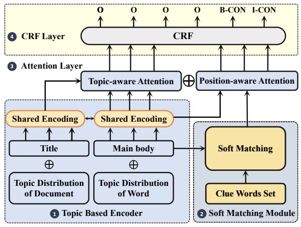
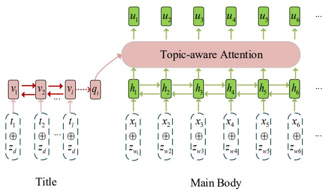
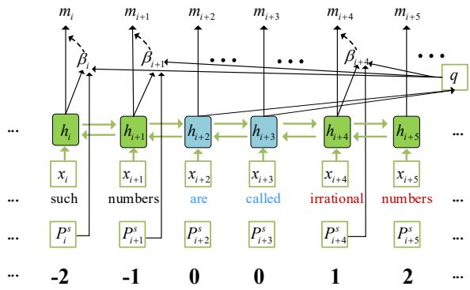
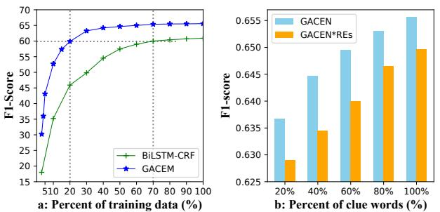
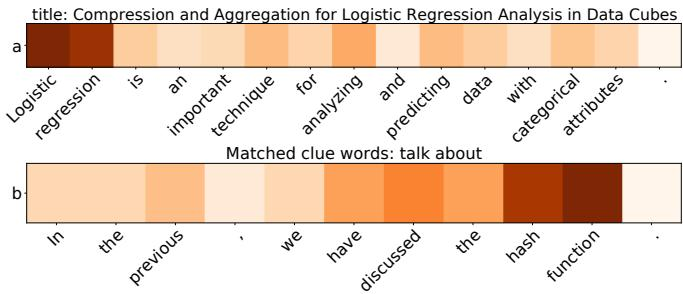

# Guided Attention Network for Concept Extraction

Songtao Fang $^{1}$ , Zhenya Huang $^{1*}$ , Ming He $^{2,3}$ , Shiwei Tong $^{1}$ , Xiaqing Huang $^{1}$ , Ye Liu $^{1}$ , Jie Huang $^{1}$ , Qi Liu $^{1}$

1Anhui Province Key Laboratory of Big Data Analysis and Application,

School of Computer Science and Technology, University of Science and Technology of China

$^{2}$ Department of Electronic Engineering, Shanghai Jiao Tong University

3Didi Chuxing, Beijing, China;

songtao $@$ mail.ustc.edu.cn, huangzhy $@$ ustc.edu.cn, heming01 $@$ foxmail.com

{tongsw, xqhuang, liuyer, jiehuang} $@$ mail.ustc.edu.cn, qiliuql@ustc.edu.cn

# Abstract

Concept extraction aims to find words or phrases describing a concept from massive texts. Recently, researchers propose many neural network-based methods to automatically extract concepts. Although these methods for this task show promising results, they ignore structured information in the raw textual data (e.g., title, topic, and clue words). In this paper, we propose a novel model, named Guided Attention Concept Extraction Network (GACEN), which uses title, topic, and clue words as additional supervision to provide guidance directly. Specifically, GACEN comprises two attention networks, one of them is to gather the relevant title and topic information for each context word in the document. The other one aims to model the implicit connection between informative words (clue words) and concepts. Finally, we aggregate information from two networks as input to Conditional Random Field (CRF) to model dependencies in the output. We collected clue words for three well-studied datasets. Extensive experiments demonstrate that our model outperforms the baseline models with a large margin, especially when the labeled data is insufficient.

# 1 Introduction

Concept extraction aims at extracting words or phrases describing a concept (e.g., logistic regression, hash function, and infinite set) from a given corpus (e.g., research papers and textbooks). It plays an essential role in constructing knowledge bases [Song et al., 2019], transforming unstructured text into structured information [Shang et al., 2018], and supporting downstream analytical tasks [Xiong et al., 2017; Huang et al., 2017; Liu et al., 2018].

Most previous concept extraction approaches operate in an extractive manner [Gelfand et al., 1998; Pan and Wang, 2017], which usually consists of two steps: 1) Selecting important text spans as candidate phrases based on statistical

# Title:Properties of Sets

Main Body: A set is a well-defined collection of items. Each item is called an element. A set is usually named with a capital letter and may be defined in three ways. ... whose elements cannot be counted or listed is called an infinite set. If all of the elements can be counted or listed, the set is called a finite set.

concepts: set, element, infinite set, finite set

Table 1: An example of concept extraction from textbook. Red words are clue words, bold words are concepts.

information. 2) Ranking the candidates to determine which is a concept. Although these studies have provided many workable solutions, they are difficult to capture the deep semantics behind the textual data, which leads to the absence of low-frequency phrases. Recently, with the rapid development of deep learning techniques, researchers proposed some sequence-to-sequence frameworks based on neural networks to automatically extract quality phrases. Zhu et al. [2018] and Lange et al. [2020] formulated phrases extraction as a sequence labeling problem using Bi-directional Long Short-Term Memory (Bi-LSTM). Yang et al. [2020] applied BERT to clinical concept extraction. They all show that neural-based methods can improve the performance over baseline models for this task.

Although neural models outperform various competitive benchmarks, training these methods in a new domain often requires many labels. However, each label only provides limited information. As humans, we recognize a concept from a document based on various information. As shown in Table 1, when we recognize concepts from textbooks, we first perceive the topic of the text and then recognize a concept based on certain words as cues. For instance, we could infer that "infinite set" is likely to be a concept in the sentence "whose elements cannot be counted or listed is called an infinite set" based on the following facts. First, we can perceive from the title and body that the topic of the text is about "set", and "infinite set" is closely related to it. Second, we recognize this concept because of the clue words "is called an", which suggests there should be a concept following the word "an". It can be seen that traditional hand-constructed labels

do not provide information about the human decision-making process when recognizing a concept. Similar to the way the topic and clue words guide our recognition process, we argue that they can also guide the model to make decisions. Specifically, we define "clue words" as a group of words that can help explain the recognition process of a particular concept in the same sentence. The clue words can be regarded as a form of expression of domain knowledge and they are concise, interpretable, and does not rely on much training data to generate (e.g., clue words such as "is a", "is called an" in textbooks, and "we introduce/propose/study/explore/describe" in scholarly documents).

However, there are many challenges for concept extraction using structured information (title, topic, clue words). First, title and topic as global information play the leading role in concept extraction. The key concept phrases have close semantics to topic [Liu et al., 2010]. Thus, how to combine the global information to pay attention to the topic-related words according to the semantic relatedness plays a crucial role in the recognition process. Second, it is difficult to collect a complete set of clue words. Clue words have large numbers of linguistic variants, which makes it difficult to generalize them to unseen sentences that are semantically equivalent but having different word usage. For example, if "discuss" is not included in the collection of clue words but its synonym "talk about" is included. When we perform exact matching with clue words we have collected for the sentence "In the previous, we have discussed the hash function," the "discussed" fails to match with its synonyms "talk about". Third, there is an implicit relation between clue words and concept. Humans can recognize concepts through accumulated experience, but it is difficult for the machine. How to model the relationship between clue words and concept is challenging.

To address these challenges, we propose GACEN based on Long-Short Term Memory (LSTM) network. In GACEN, to incorporate the topic information into the feature representation, we design a shared topic-based encoder to model the title and main body of the document with topic vectors at the document- and word-level separately. To solve the problem of variants of clue words and improve the generalization ability, we pre-train a soft matching module with neural networks to capture semantically similar words. Then, we design two attention modules, one of them is to gather the relevant global topic information for each context word according to the semantic relatedness based on topic enhanced representation, and the other aims to model the complex implicit relationship between clue words and concept with the semantic and position information of clue words. Finally, we aggregate information from two attention networks as input to Conditional Random Field (CRF) to model dependencies in the output. We crowd clue words for three well-studied datasets. Extensive experiments demonstrate the effectiveness of our model, especially when the labeled data is insufficient.

# 2 Related Work

Concept Extraction. Concept extraction has been studied intensively in previous works. Conventional extractive methods usually use the two-step strategy that first extracts the

candidate phrases using rules (hand-crafted or syntactic pattern matching) and then ranks them based on supervised or unsupervised methods [Liu et al., 2020; Pan and Wang, 2017; Gelfand et al., 1998]. The main drawback is that these methods mainly use statistical features, which are unable to capture the semantics behind the text. Recently, Deep Neural Networks (DNN) based models are used to solve concept extraction problems. Yang et al. [2020] applied an encoder-decoder framework to extract the concept directly from the text. Zhu et al. [2018] and Lange et al. [2020] formulated concept extraction as a sequence labeling problem. Yang et al. [2020] applied BERT to clinical concept extraction. They all showed that deep learning methods can improve the performance over baseline models for this task.

Keyphrase Extraction. Keyphrase extraction aims to extract phrases that provide a concise summary of a document. Generally, keyphrase extraction techniques can be classified into two groups: supervised methods and unsupervised methods. Among them, in unsupervised methods, keyphrase extraction is formulated as a ranking problem using different techniques, such as graph-based ranking [Liu et al., 2010], clustering [Liu et al., 2009] and language modeling. In supervised methods, keyphrase extraction is treated as a classification problem: each phrase in the document is either a key phrase or not. Recently, many researchers have studied the neural network-based solutions [Zhang et al., 2016; Chen et al., 2019]. Keyphrase extraction can be seen as generating top concepts for each document. Compared with concept extraction, there is a big difference in quantity.

Named Entity Recognition. Both NER and concept extraction can be defined as sequence labeling problems. NER aims at locating and classifying named entities into predefined categories from free text. The early works applied CRF, Support Vector Machine (SVM), and perception models with hand-crafted features [Luo et al., 2015; Downey et al., 2007]. With the advanced performance of deep learning, research has been shifting towards deep neural networks (DNN), which requires little feature engineering. Chiu et al. [2016] presented a bidirectional LSTM-CNNs architecture that detects word and character level feature. Chiu et al. [2019] further extended it into LSTM-CNNs-CRF architecture, where the CRF model was added to optimize the output label sequence. NER seeks to locate and classify named entities mentioned in unstructured text. This is quite different from our goal.

# 3 Problem Formulation

We assume that we have collected clue words (the collection process of clue words is discussed in Section 5.1). We let $\mathbf{c} = \{c_1, c_2, \dots, c_k\}$ denote the clue words set we have collected, $c_i$ represents the $i$ -th clue words in this set. Given a sentence $\mathbf{x} = \{x_1, x_2, \dots, x_n\}$ with corresponding title $\mathbf{t} = \{t_1, \dots, t_l\}$ , $x_i$ represents the $i$ -th word in the sentence and $t_i$ represents the $i$ -th word in the title. Our goal is to predict labels $\mathbf{y} = \{y_1, y_2, \dots, y_n\}$ for $\mathbf{x}$ based on $\mathbf{c}, \mathbf{t}$ . For $x_i$ in the sentence, its label $y_i \in \{S - CON, B - CON, I - CON, E - CON, O\}$ indicating current word is a Single concept word, the Begin-

  
Figure 1: The architecture for GACEN. The model is composed of four components: Topic-based encoder; Soft Matching module; Attention Layer and CRF Layer.

ning of a concept, the Middle part of the concept, the End of the concept, or Out of a concept, respectively.

# 4 Our Proposed Model

In this section, we present our framework GACEN for concept extraction. As shown in Figure 1, the GACEN model includes four components: Topic-based Encoder, Soft Matching module, Attention Layer (Topic-aware Attention, Position-aware Attention), and CRF layer. Specifically, the topic-based encoder and Topic-aware attention module are used to gather the relevant information from the topic and title to each context word in the document. Soft matching and Position-aware attention modules are used to match the sentence with clue words and model the positional and semantic relationship between clue words and other words in the same sentence. The CRF is used to model dependencies in the output.

# 4.1 Topic-based Encoder

As we all know, both documents and words can be represented by a mixture of semantic topics. A word will play different important roles in different topics of the document. The concept words in the document are the key to representing the topic of the document. Thus, the topic distribution of key concepts and the document should be similar [Liu et al., 2010]. To incorporate the topic distributions into the text representation, we first get the topic distributions $\mathbf{z_d}$ of documents and the topic distributions $\mathbf{z_w}$ of words using Latent Dirichlet Allocation (LDA) [Blei et al., 2003] model, where $\mathbf{z_d}, \mathbf{z_w} \in \mathbb{R}^k$ and $k$ is the hyper-parameter indicating the number of topics in the document.

Meanwhile, we consider the title and main body of the document separately. As shown in Figure 2, given the input sentence $\mathbf{x} = (x_{1}, x_{2}, \ldots, x_{n})$ where $n$ is the length of the sentence, and Corresponding title $\mathbf{t} = (t_{1}, \ldots, t_{l})$ where $l$ is the length of the title. We first map the words in sentence and title to word embedding $\mathbf{E}_{\text{sen.}} = (\mathbf{e}_{x_{1}}, \mathbf{e}_{x_{2}}, \ldots, \mathbf{e}_{x_{n}})$ , $\mathbf{E}_{\text{title}} = (\mathbf{e}_{t_{1}}, \ldots, \mathbf{e}_{t_{l}})$ by looking up word embedding matrix $\mathbf{W}_{e} \in \mathbb{R}^{d_{e}}$ . Next, concatenate each word vector in title with

  
Figure 2: Tpoic-aware Attention module

topic vector of document $\mathbf{z_d}$ to get $\mathbf{T} = (\mathbf{e}_{t_1} \oplus \mathbf{z_d}, \dots, \mathbf{e}_{t_l} \oplus \mathbf{z_d})$ and concatenate word vector in main body with topic vector of words $\mathbf{z_w}$ to get $\mathbf{X} = (\mathbf{e}_{x_1} \oplus \mathbf{z_{w_1}}, \mathbf{e}_{x_2} \oplus \mathbf{z_{w_2}}, \dots, \mathbf{e}_{x_n} \oplus \mathbf{z_{w_n}})$ . $\oplus$ can be arbitrary operations, where we take as concatenation. Finally, a Bi-LSTM is used to obtain hidden states of title and main body, respectively:

$$
\overrightarrow {\mathbf {h}} _ {i} = \operatorname {L S T M} \left(\left(\mathbf {e} _ {\mathbf {x} _ {i}} \oplus \mathbf {z} _ {\mathbf {w} _ {i}}\right), \overrightarrow {\mathbf {h}} _ {i - 1}\right), \tag {1}
$$

$$
\overleftarrow {\mathbf {h}} _ {i} = \operatorname {L S T M} \left(\left(\mathbf {e} _ {\mathbf {x} _ {\mathrm {i}}} \oplus \mathbf {z} _ {\mathbf {w} _ {\mathrm {i}}}\right), \overleftarrow {\mathbf {h}} _ {i + 1}\right).
$$

The final hidden representation of position $i$ is:

$$
\mathbf {h} _ {i} = \left[ \overrightarrow {\mathbf {h}} _ {i}; \overleftarrow {\mathbf {h}} _ {i} \right]. \tag {2}
$$

Similarly, we can obtain the contextualized word representations $\mathbf{v}_i$ for each token $\mathbf{t}_i$ of title.

# 4.2 Soft Matching Module

The soft matching module is used to match the corresponding clue words for the unseen sentences and locate where the clue words appear. Previous work implements this operation by regular expressions matching, which has a poor generalization ability because all synonyms and variations in a regular expression must be explicitly specified. To improve the generalization ability, we pre-train a soft matching module to enable capturing semantically similar words. Given an input sentence $X = \{x_{1}, x_{2}, \dots, x_{n}\}$ and a clue words query $q$ from clue words set. The soft matching module $f_{s}(X, q)$ returns a sequence of similarity scores $S = \{s_{1}, s_{2}, \dots, s_{n}\}$ between each token $x_{i}$ and the query $q$ . Inspired by [Li et al., 2018; Wang et al., 2019], for token $x_{i}$ , we first extract $N_{c}$ different levels contexts for each token by sliding windows of different sizes. For example, if the maximum window size is 2, the different levels contexts of token $x_{i}$ are $[c_{i0}, c_{i1}, c_{i2}]$ , where $c_{i0}, c_{i1}, c_{i2}$ are $[x_{i}]$ , $[x_{i-1}; x_{i}]$ and $[x_{i}; x_{i+1}]$ , respectively. Each of the different contexts $c_{ij}$ is encoded to a fixed-length vector $\mathbf{z}_{\mathbf{c}_{ij}}$ by a shared Bi-LSTM encoder. Also the clue words query $q$ is encoded to a fixed-length vector by the same shared encoder and then are summarized as $z_{q}$ by an attention layer. Finally, we calculate scores of each token in the sentence $X$ and query $q$ by aggregating similarity scores from different sliding windows:

$$
S _ {i j} (X, q) = \operatorname {S c o r e} \left(z _ {c _ {i j}}, z _ {q}\right) = \cos \left(z _ {c _ {i j}} D, z _ {q} D\right), \tag {3}
$$

$$
f _ {s} (X, q) = S (X, q) v, \tag {4}
$$

where $\mathrm{D}$ is a trainable diagonal matrix, $\nu \in R^{N_c}$ is the trainable weight of each sliding window.

In order to learn the parameters of the soft matching model, we construct training data in the form of (sentence, query, label). To build training data, we randomly select spans of consecutive words as queries in the training data. Each query is paired with the sentence it comes from. The training set is denoted as $\{X_{i}, q_{i}, l_{i}\}_{i=1}^{N}$ , where $l_{ij}$ takes the value of 0 or 1 (1 indicates query $q_{i}$ is extracted from $x_{ij}$ and 0 otherwise). The loss function is defined as the binary cross-entropy loss, as follows:

$$
L _ {f i n d} = - \frac {1}{N} \sum_ {i = 1} ^ {N} \frac {1}{\left| l _ {i} \right|} \left(l _ {i} \log f _ {s} \left(X _ {i}, q _ {i}\right) + \right. \tag {5}
$$

$$
(1 - l _ {i}) \log (1 - f _ {s} (X _ {i}, q _ {i}))).
$$

After training, given a sentence $\mathbf{x}$ , we can use it to match the sentence with clue words and return the positions of clue words in this sentence by comparing the similarity score with the threshold $\theta$ .

# 4.3 Attention Layer

Topic-aware Attention. The topic-based encoder above only considers the local context of each word, while the key concepts should be relevant to the global information of the document [Liu et al., 2010] (i.e., the title of the document, the major topics of document). So it is necessary to pay more attention to the words related to the documents topics. Note that, the title can be seen as an explicit topic [Chen et al., 2019]. The topic-aware attention is engaged to aggregate the relevant information from the global information for each word within the context. As shown in Figure 2, we define a summary vector $\mathbf{q}_t = \mathbf{v}_t$ as the query (i.e., the output state of the Bi-LSTM). Following the conventional attention method [Luong et al., 2015], we create a sequence of topic-aware token representations, $\mathbf{u}_i$ :

$$
\mathbf {u} _ {i} = \alpha_ {i} \mathbf {h} _ {i}, \tag {6}
$$

$$
\alpha_ {i} = \operatorname {S o f t M a x} \left(\nu_ {1} ^ {\top} \tanh  \left(W _ {1} \mathbf {h} _ {i} + W _ {2} \mathbf {q} _ {t}\right)\right), \tag {7}
$$

where $W_{1}, W_{2}, \nu_{1}$ are trainable parameters for computing the attention scores of each token.

Position-aware Attention. Although modern sequence models such as LSTM networks have gating mechanisms to control the relative influence of each individual word to the next token representation, these mechanisms do not explicitly model the position and semantic relationship between clue words and concept words in the sentence. The module aims at enforcing local attention, and adapting the attention weights so as to put more emphasis on clue-words-surrounded context by incorporating word position embedding. Inspired by the position encoding vectors used in [Zeng et al., 2014], we define a position sequence relative to the clue words:

$$
p _ {i} = \left\{ \begin{array}{l l} i - s _ {1}, & i <   s _ {1} \\ 0, & s _ {1} \leq i \leq s _ {2} \\ i - s _ {2}, & i > s _ {2} \end{array} , \right. \tag {8}
$$

  
Figure 3: Position-aware Attention module

Table 2: Dataset Statistics   

<table><tr><td>Datasets</td><td>#titles</td><td>#tokens</td><td>#labeled</td><td>#clue words</td></tr><tr><td>CSEN</td><td>690</td><td>1,242,156</td><td>4,096</td><td>36</td></tr><tr><td>KP-20K</td><td>20,000</td><td>4,040,212</td><td>50,768</td><td>95</td></tr><tr><td>MTB</td><td>284</td><td>691,534</td><td>1,092</td><td>24</td></tr></table>

where $s_1, s_2$ are the starting and ending indices of the clue words, respectively, and $p_i$ can be viewed as the relative distance of token $x_i$ to the clue words.

We first locate where the clue words appear by soft matching module and assign a position number to each token in the sentence according to formula (8). Then, we obtain position embedding vectors $\mathbf{p}^s = [\mathbf{p}_1^s,\dots ,\mathbf{p}_n^s ]$ using a shared position embedding matrix $\mathbf{P}$ . As shown in Figure 3, in order to explicitly model the position and semantic relationship between clue words and concept words, we average the hidden vectors of all tokens inside the clue words as the attention query $\mathbf{q}$ . Then for each hidden state $\mathbf{h}_i$ , we calculate an attention weight $\alpha_{i}$ , then we create a sequence of position-based token representations, $\mathbf{m}_i$ :

$$
\mathbf {m} _ {i} = \beta_ {i} \mathbf {h} _ {i}, \tag {9}
$$

$$
\beta_ {i} = \operatorname {S o f t M a x} \left(\mathbf {v} _ {2} ^ {\top} \tanh  \left(\mathbf {W} _ {3} \mathbf {h} _ {i} + \mathbf {W} _ {4} \mathbf {q} + \mathbf {W} _ {5} \mathbf {p} _ {i} ^ {s}\right)\right), \tag {10}
$$

where $\mathbf{W}_3, \mathbf{W}_4, \mathbf{W}_5$ and $\mathbf{v}_2$ are learnable parameters of the network.

# 4.4 Representation-enhanced Sequence Tagging

After encoding the context into the topic-aware representation $\mathbf{u}_i$ and position-aware representation $\mathbf{m}_i$ , we aggregate them as $\mathbf{h}'$ by the following formula:

$$
\mathbf {h} _ {i} ^ {\prime} = \lambda \mathbf {u} _ {i} + (1 - \lambda) \mathbf {m} _ {i}, \tag {11}
$$

where $\lambda \in (0,1)$ is the corresponding hyperparameter.

Finally, we concatenate the original token representation $\mathbf{h}_i$ with the enhanced one $\mathbf{h}_i'$ as the input ( $[\mathbf{h}_i;\mathbf{h}_i^{\prime}]$ ) to the final CRF tagger. Our learning objective is the same as conventional sequence tagging, which is to correctly predict the tag for each token.

# 5 Experiments

In this section, we first describe the datasets and discuss how to collect clue words, then extensive experiments are con

Table 3: Overall performance.   

<table><tr><td></td><td colspan="3">CSEN</td><td colspan="3">KP-20K</td><td colspan="3">MTB</td></tr><tr><td>Method</td><td>Pr%</td><td>Re%</td><td>F1%</td><td>Pr%</td><td>Re%</td><td>F1%</td><td>Pr%</td><td>Re%</td><td>F1%</td></tr><tr><td>TextRank</td><td>23.46</td><td>27.82</td><td>25.45</td><td>15.29</td><td>23.01</td><td>18.37</td><td>24.78</td><td>30.65</td><td>27.40</td></tr><tr><td>TPR</td><td>31.46</td><td>29.21</td><td>30.29</td><td>14.83</td><td>25.12</td><td>18.65</td><td>25.19</td><td>32.75</td><td>28.48</td></tr><tr><td>Positionrank</td><td>31.80</td><td>30.37</td><td>31.07</td><td>18.92</td><td>25.47</td><td>21.71</td><td>28.37</td><td>39.04</td><td>32.86</td></tr><tr><td>CopyRNN</td><td>28.12</td><td>41.08</td><td>33.39</td><td>27.71</td><td>36.79</td><td>31.61</td><td>37.46</td><td>39.12</td><td>38.27</td></tr><tr><td>Joint-layer RNN</td><td>61.31</td><td>46.23</td><td>52.71</td><td>57.83</td><td>31.85</td><td>41.08</td><td>60.37</td><td>55.71</td><td>59.86</td></tr><tr><td>BERT-CRF</td><td>58.73</td><td>52.17</td><td>55.26</td><td>54.19</td><td>33.93</td><td>41.73</td><td>63.80</td><td>56.98</td><td>60.20</td></tr><tr><td>GACEN-topic</td><td>68.21</td><td>57.94</td><td>62.66</td><td>57.67</td><td>34.90</td><td>43.48</td><td>65.83</td><td>62.63</td><td>64.19</td></tr><tr><td>GACEN-position</td><td>64.13</td><td>61.08</td><td>62.57</td><td>52.78</td><td>37.74</td><td>44.01</td><td>60.55</td><td>64.71</td><td>62.56</td></tr><tr><td>GACEN*REs</td><td>70.12</td><td>57.12</td><td>62.96</td><td>59.23</td><td>34.71</td><td>43.77</td><td>66.97</td><td>62.98</td><td>64.91</td></tr><tr><td>GACEN</td><td>69.70</td><td>60.21</td><td>64.60</td><td>58.10</td><td>37.65</td><td>45.69</td><td>66.43</td><td>64.72</td><td>65.56</td></tr></table>

duced to verify the effectiveness of our proposed model.

# 5.1 Datasets Description

We use three datasets to evaluate our model. The details are described as follows:

CSEN [Pan and Wang, 2017]: this dataset contains 690 video captions in Massive Open Online Courses (MOOCs) for Computer Science courses.

KP-20K [Chen et al., 2018]: KP20K consists of 567,830 high-quality scientific publications from various computer science domains. We randomly select 20,000 articles from KP20K to form the KP-20K. We have collected concept phrases related to the computer field and automatically annotated the concept phrases in each article.

MTB [Huang et al., 2019]: this dataset consists of mathematics textbooks for elementary, middle, and high schools.

The statistics of datasets are listed in Table 2. #Titles denotes the number of video titles, article titles, and section titles in each dataset, and #Token is the number of words in each dataset. The column #labeled presents the ground-truth number after dedduplication for each dataset. #clue words denotes the size of the final clue words set. Note that the CSEN does not provide an explicit title. We use the first sentence of each lesson as the title, which summarizes the content of this lesson. On all datasets, we use $70\%$ as a training set, $10\%$ as a validation set, and $20\%$ as a testing set.

Preparing Clue Words. Our clue words are written by three experts with corresponding background knowledge. The development of the clue words set is considered completed when the annotator observes a fixed amount of training data. It takes the annotator in total less than 10 hours to develop all the clue words. We take the intersection of them as the final clue words set.

# 5.2 Baseline Approaches and Evaluation Metrics

To investigate the effectiveness of our model, we compare the performance of our algorithm with several baselines, including TextRank [Mihalcea and Tarau, 2004], Topical PageRank (TPR) [Liu et al., 2010] and Positionrank [Florescu and Caragea, 2017]. TextRank, TPR and Positionrank are three state-of-the-art graph-based keyphrase extraction approaches. We also employ three supervised baseline methods. The details are as follows:

- Joint-layer RNN [Zhang et al., 2016] is a neural tagging method, which combines keywords and context information to perform the keyphrase extraction task.   
- CopyRNN [Chen et al., 2018] is an RNN-based generative model for predicting keyphrases in scientific text. It is the first application of the encoder-decoder model to the phrase prediction task.   
- BERT-CRF [Yang et al., 2020] is a BERT-based model for concept extraction in clinical data. We set up all the parameters following the optimal setting.

For these unsupervised and generation-based methods we keep the top $k$ of the extracted phrases, $k$ is determined by the actual number of concepts in the document. Similar to previous methods, we use the precision (Pr), recall (Re), F1-score (F1) to evaluate the performance.

# 5.3 Implementation Details

In our experiments, we run all experiments on one Tesla V100 GPU and 16 Intel CPUs. All words embeddings $W_{e}$ are initialized as 300-dimensional vectors by word2vec [Goldberg and Levy, 2014]. The hidden state dimensions of the Bi-LSTM encoder are set to 200. All weight matrices are randomly initialized by a uniform distribution $\mathcal{U}(-0.1, 0.1)$ . In order to compute topic distributions of words and documents, we use LDA implementation in the topic modeling toolkit [Rehurek and Sojka, 2010] to train the topic model. The topic numbers are set to 50, 100, and 50 in the CSEN, KP-20K, and MTB respectively. The aggregation parameter $\lambda$ in the attention layer is set to 0.5. The model is optimized by Adam with batch size 10 and dropout rate=0.1.

Soft Matching Module Hyperparameters. The threshold $\theta$ is set to 0.75 and the maximum window size is set to 3. We train the soft matching module until the loss does not decrease for about 20 epochs.

# 5.4 Results and Analysis

Overall Performance. Table 3 shows the performance of concept extraction on three datasets. From the table, we find that the proposed model outperforms all baselines on the datasets, which indicates the robustness and effectiveness of GACEN. The overall performance of unsupervised methods is worse than supervised methods. In unsupervised methods,

  
Figure 4: The experimental results on MTB

they all mainly use statistical information within the corpus and have a strong reliance on term frequency, which hampers their performances. Specifically, TPR performs better than TextRank, perhaps because TPR also leverages the topic information. But they both perform worse than Positionrank which incorporates information from all positions of a word's occurrences into a biased PageRank. As for the supervised methods, we note that our GACEN model achieves the best performance on all datasets with significant margins. For instance, it achieves close to $10\%$ of improvement on the F1-score of the CSEN dataset compared with the second-best method BERT-CRF, which demonstrates the effectiveness of using topic, title, and clue words.

Ablation Study. We also perform an ablation study to better understanding the contributions of the main parts of our model. In Table 3, GACEN-topic, GACEN-position represent removing topic-aware attention module, position-aware attention module in GACEN, respectively. The GACEN*REs is a model, which replaces the soft matching module in GACEN with Regular Expression matching. As shown in Table 3, GACEN consistently achieves the best result on all three datasets in terms of F1-score. After we remove the topic-aware attention module, the recall decreases dramatically compared to precision on three datasets, indicating that the global topic information plays an important role in improving the recall. After we remove the position-aware attention module, the precision has dropped significantly, but the recall achieves the best result on CSEN and KP-20K. Conversely, when we replace soft matching with Regular Expression matching, GACEN*REs achieves the best result on all three datasets in terms of precision, whereas the recall decreases dramatically. They all show that clue words play a major role in improving the precision of the models and GACEN can better balance recall and precision.

Learning Efficiency. We study the learning efficiency of the model. We compare the performance of GACEN with BiLSTM-CRF for different percentages of the training data. As shown Figure 4(a), We can see that by using $20\%$ of the training data, The GACEN model shows comparable performance as the base model using $70\%$ training data. The drastic improvement in the model performance reflects the importance of title and clue words in concept extraction and justifies the slightly additional cost incurred in collecting clue words.

  
Figure 5: Two case studies of attention during inference. The darker cells have higher attention weights.

Generalization Ability. We further study the effect of the number of clue words on the results. Figure 4(b) shows the experimental results on different percentages of clue words. As the percentage of clue words increases, the performance of both GACEN and GACEN*REs continues to improve. As the number of clue words increases, synonymous clue words are added, the performance gap between the two models is decreasing. The result shows that the soft matching module can better generalize clue words to unseen sentences, especially when there are few clue words.

# 5.5 Case Study

Figure 5 shows two examples illustrating that the topic-aware attention and position-aware attention scores help GACEN recognize concepts. Figure 5(a) shows topic-aware attention scores, the concept "logistic regression", which is a title phrase that has high attention scores. For the position-aware attention module, in Figure 5(b), we find that the concept "hash function" gets high attention scores and the word "discussed" in this sentence is matched with "talk about" by soft matching. These results not only support our argument that the global information and clue words enhanced model such as GACEN can effectively learn, but also demonstrate that they can provide reasonable interpretation, something that lacks in other neural models such as Joint-layer RNN and CopyRNN.

# 6 Conclusion

In this paper, we proposed a novel model GACEN for the concept extraction task, which explicitly considered the structured information in the raw textual data. The experiment results on three real-world datasets exhibited the effectiveness of our model for concept extraction, especially when the labeled training data is limited.

# Acknowledgements

This research was partially supported by grants from the National Key Research and Development Program of China (No. 2018YFC0832101), the National Natural Science Foundation of China (Grants No. 61922073 and 71802068), and the Fundamental Research Funds for the Central Universities (Grants No. WK2150110021).

# References

[Blei et al., 2003] David M Blei, Andrew Y Ng, and Michael I Jordan. Latent dirichlet allocation. Journal of machine Learning research, 3(Jan):993-1022, 2003.   
[Chen et al., 2018] Jun Chen, Xiaoming Zhang, Yu Wu, Zhao Yan, and Zhoujun Li. Keyphrase generation with correlation constraints. arXiv preprint arXiv:1808.07185, 2018.   
[Chen et al., 2019] Wang Chen, Yifan Gao, Jiani Zhang, Irwin King, and Michael R Lyu. -guided encoding for keyphrase generation. In Proceedings of the AAAI Conference on Artificial Intelligence, volume 33, pages 6268-6275, 2019.   
[Chiu and Nichols, 2016] Jason PC Chiu and Eric Nichols. Named entity recognition with bidirectional lstm-cnns. Transactions of the Association for Computational Linguistics, 4:357-370, 2016.   
[Downey et al., 2007] Doug Downey, Matthew Broadhead, and Oren Etzioni. Locating complex named entities in web text. In IJCAI, volume 7, pages 2733-2739, 2007.   
[Florescu and Caragea, 2017] Corina Florescu and Cornelia Caragea. Positionrank: An unsupervised approach to keyphrase extraction from scholarly documents. In Proceedings of the 55th Annual Meeting of the Association for Computational Linguistics (Volume 1: Long Papers), pages 1105-1115, 2017.   
[Gelfand et al., 1998] Boris Gelfand, Marilyn Wulfekuler, and WF Punch. Automated concept extraction from plain text. In AAAI 1998 Workshop on Text Categorization, pages 13-17, 1998.   
[Goldberg and Levy, 2014] Yoav Goldberg and Omer Levy. word2vec explained: deriving mikolov et al.'s negative-sampling word-embedding method. arXiv preprint arXiv:1402.3722, 2014.   
[Huang et al., 2017] Zhenya Huang, Qi Liu, Enhong Chen, Hongke Zhao, Mingyong Gao, Si Wei, Yu Su, and Guoping Hu. Question difficulty prediction for reading problems in standard tests. In Proceedings of the AAAI Conference on Artificial Intelligence, volume 31, 2017.   
[Huang et al., 2019] Xiaoqing Huang, Qi Liu, Chao Wang, Haoyu Han, Jianhui Ma, Enhong Chen, Yu Su, and Shijin Wang. Constructing educational concept maps with multiple relationships from multi-source data. In 2019 IEEE International Conference on Data Mining (ICDM), pages 1108-1113. IEEE, 2019.   
[Lange et al., 2020] Lukas Lange, Xiang Dai, Heike Adel, and Jannik Strötgen. Nnde at cantemist: Neural sequence labeling and parsing approaches for clinical concept extraction. arXiv preprint arXiv:2010.12322, 2020.   
[Li et al., 2018] Shen Li, Hengru Xu, and Zhengdong Lu. Generalize symbolic knowledge with neural rule engine. arXiv preprint arXiv:1808.10326, 2018.   
[Liu et al., 2009] Zhiyuan Liu, Peng Li, Yabin Zheng, and Maosong Sun. Clustering to find exemplar terms for keyphrase extraction. In Proceedings of the 2009 conference on empirical methods in natural language processing, pages 257-266, 2009.   
[Liu et al., 2010] Zhiyuan Liu, Wenyi Huang, Yabin Zheng, and Maosong Sun. Automatic keyphrase extraction via topic decomposition. In Proceedings of the 2010 conference on empirical methods in natural language processing, pages 366-376, 2010.   
[Liu et al., 2018] Qi Liu, Zai Huang, Zhenya Huang, Chuanren Liu, Enhong Chen, Yu Su, and Guoping Hu. Finding similar exercises in online education systems. In Proceedings of the 24th ACM SIGKDD International Conference on Knowledge Discovery & Data Mining, pages 1821-1830, 2018.

[Liu et al., 2020] Ye Liu, Han Wu, Zhenya Huang, Hao Wang, Jianhui Ma, Qi Liu, Enhong Chen, Hanqing Tao, and Ke Rui. Technical phrase extraction for patent mining: A multi-level approach. In 2020 IEEE International Conference on Data Mining (ICDM), pages 1142-1147. IEEE, 2020.   
[Luo et al., 2015] Gang Luo, Xiaojiang Huang, Chin-Yew Lin, and Zaiqing Nie. Joint entity recognition and disambiguation. In Proceedings of the 2015 Conference on Empirical Methods in Natural Language Processing, pages 879-888, 2015.   
[Luong et al., 2015] Minh-Thang Luong, Hieu Pham, and Christopher D Manning. Effective approaches to attention-based neural machine translation. arXiv preprint arXiv:1508.04025, 2015.   
[Ma and Hovy, 2019] Xuezhe Ma and Eduard Hovy. End-to-end sequence labeling via bi-directional lstm-cnns-crf [eb/ol]. 2019.   
[Mihalcea and Tarau, 2004] Rada Mihalcea and Paul Tarau. Textrank: Bringing order into text. In Proceedings of the 2004 conference on empirical methods in natural language processing, pages 404-411, 2004.   
[Pan and Wang, 2017] Liangming Pan and Wang. Course concept extraction in moocs via embedding-based graph propagation. In Proceedings of the Eighth International Joint Conference on Natural Language Processing (Volume 1: Long Papers), pages 875-884, 2017.   
[Rehurek and Sojka, 2010] Radim Rehurek and Petr Sojka. Software framework for topic modelling with large corpora. In In Proceedings of the LREC 2010 Workshop on New Challenges for NLP Frameworks. CiteSeer, 2010.   
[Shang et al., 2018] J. Shang, J. Liu, M. Jiang, X. Ren, C. R. Voss, and J. Han. Automated phrase mining from massive text corpora. IEEE Transactions on Knowledge and Data Engineering, 30(10):1825-1837, 2018.   
[Song et al., 2019] Lihong Song, Chin Wang Cheong, Kejing Yin, William K Cheung, Benjamin CM Fung, and Jonathan Poon. Medical concept embedding with multiple ontological representations. In *IJCAI*, pages 4613-4619, 2019.   
[Wang et al., 2019] Ziqi Wang, Yujia Qin, Wenxuan Zhou, Jun Yan, Qinyuan Ye, Leonardo Neves, Zhiyuan Liu, and Xiang Ren. Learning from explanations with neural execution tree. arXiv preprint arXiv:1911.01352, 2019.   
[Xiong et al., 2017] Chenyan Xiong, Russell Power, and Jamie Callan. Explicit semantic ranking for academic search via knowledge graph embedding. In Proceedings of the 26th international conference on world wide web, pages 1271-1279, 2017.   
[Yang et al., 2020] Xi Yang, Jiang Bian, William R Hogan, and Yonghui Wu. Clinical concept extraction using transformers. Journal of the American Medical Informatics Association, 27(12):1935-1942, 2020.   
[Zeng et al., 2014] Daojian Zeng, Kang Liu, Siwei Lai, Guangyou Zhou, and Jun Zhao. Relation classification via convolutional deep neural network. In Proceedings of COLING 2014, the 25th International Conference on Computational Linguistics: Technical Papers, pages 2335-2344, 2014.   
[Zhang et al., 2016] Qi Zhang, Yang Wang, Yeyun Gong, and Xuan-Jing Huang. Keyphrase extraction using deep recurrent neural networks on twitter. In Proceedings of the 2016 conference on empirical methods in natural language processing, pages 836-845, 2016.   
[Zhu et al., 2018] Henghui Zhu, Ioannis Ch Paschalidis, and Amir Tahmasebi. Clinical concept extraction with contextual word embedding. arXiv preprint arXiv:1810.10566, 2018.