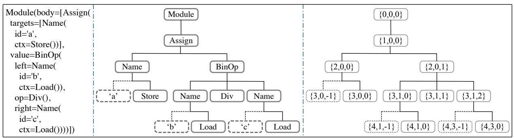
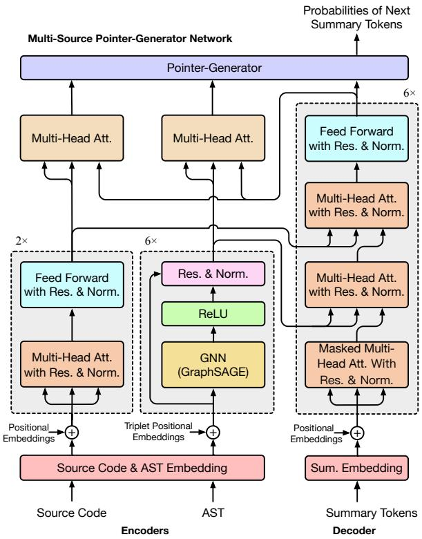

# Modeling Hierarchical Syntax Structure with Triplet Position for Source Code Summarization

Juncai Guo $^{1}$ , Jin Liu $^{1, \boxtimes}$ , Yao Wan $^{2}$ , Li Li $^{3}$ , Pingyi Zhou $^{4}$

$^{1}$ School of Computer Science, Wuhan University, China

$^{2}$ School of Computer Sci. and Tech., Huazhong University of Science and Technology, China

$^{3}$ Faculty of Information Technology, Monash University, Australia

4Noah's Ark Lab, Huawei, China

{guojuncai1992,jinliu}@whu.edu.cn，wanyao@hust.edu.cn,

Li.Li@monash.edu, zhoupingyi@huawei.com

# Abstract

Automatic code summarization, which aims to describe the source code in natural language, has become an essential task in software maintenance. Our fellow researchers have attempted to achieve such a purpose through various machine learning-based approaches. One key challenge keeping these approaches from being practical lies in the lacking of retaining the semantic structure of source code, which has unfortunately been overlooked by the state-of-the-art methods. Existing approaches resort to representing the syntax structure of code by modeling the Abstract Syntax Trees (ASTs). However, the hierarchical structures of ASTs have not been well explored. In this paper, we propose CODEDESCRIBE to model the hierarchical syntax structure of code by introducing a novel triplet position for code summarization. Specifically, CODEDESCRIBE leverages the graph neural network and Transformer to preserve the structural and sequential information of code, respectively. In addition, we propose a pointer-generator network that pays attention to both the structure and sequential tokens of code for a better summary generation. Experiments on two real-world datasets in Java and Python demonstrate the effectiveness of our proposed approach when compared with several state-of-the-art baselines1.

# 1 Introduction

Code documentation in the form of code comments has been an integral component of software development, benefiting software maintenance (Iyer et al., 2016), code categorization (Nguyen and Nguyen, 2017) and retrieval (Gu et al., 2018). However, few real-world software projects are well-documented with high-quality comments. Many projects are either inadequately documented due to missing important code comments or inconsistently documented due to different naming conven

tions by developers, e.g., when programming in legacy code bases, resulting in high maintenance costs (de Souza et al., 2005; Kajko-Mattsson, 2005). Therefore, automatic code summarization, which aims to generate natural language texts (i.e., a short paragraph) to describe a code fragment by extracting its semantics, becomes critically important for program understanding and software maintenance.

Recently, various works have been proposed for code summarization based on the encoder-decoder paradigm, which first encodes the code into a distributed vector, and then decodes it into natural-language summary. Similarly, several works (Iyer et al., 2016; Allamanis et al., 2016) proposed to tokenize the source code into sequential tokens, and design RNN and CNN to represent them. One limitation of these approaches is that they only consider the sequential lexical information of code. To represent the syntax of code, several structural neural networks are designed to represent the Abstract Syntax Trees (AST) of code, e.g., TreeLSTM (Wan et al., 2018), TBCNN (Mou et al., 2016), and Graph Neural Networks (GNNs) (LeClair et al., 2020). To further improve the efficiency on AST representation, various works (Hu et al., 2018a; Alon et al., 2019) proposed to linearize the ASTs into a sequence of nodes or paths.

Despite much progress on code summarization, there are still some limitations in code comprehension for generating high-quality comments. Particularly, when linearizing the ASTs of code into sequential nodes or paths, the relationships between connected nodes are generally discarded. Although the GNN-based approaches can well preserve the syntax structure of code, they are insensitive to the order of nodes in AST. For example, given the expressions $a = b / c$ and $a = c / b$ , current approaches cannot capture the orders of variables $b$ and $c$ . However, these orders are critical to accurately preserve the semantics of code.

To address the aforementioned limitation, this

  
Figure 1: The AST of Python code snippet "a = b / c". The left is the text form of AST, the middle shows the tree structure of AST, and the right specifies triplet positions for all nodes of AST structure.

paper proposes to model the hierarchical syntax structure of code using triplet position, inspired by the positional encoding used in sequence modeling (Gehring et al., 2017; Vaswani et al., 2017), and incorporates the triplet position into current GNNs for better code summarization. The triplet position records the depth, width position of its parent, and width position among its siblings for each node.

To utilize the triplet position in AST, this paper proposes CODESCRIBE, an encoder-decoder-based neural network for source code summarization. Specially, we initialize the embedding of each AST node by incorporating the triplet positional embeddings, and then feed them into an improved GNN, i.e., GraphSAGE (Hamilton et al., 2017) to represent the syntax of code. In addition, we also account for the sequential information of code by using a Transformer encoder (Vaswani et al., 2017). In such a case, the decoding process is performed over the learned structural features of AST and sequential features of code tokens with two multi-head attention modules. To generate summaries with higher quality, we further design a pointer-generator network based on multi-head attention (Vaswani et al., 2017), which allows the summary tokens to be generated from the vocabulary or copied from the input source code tokens and ASTs. To validate the effectiveness of our proposed CODESCRIBE, we conduct experiments on two real-world datasets in Java and Python.

Overall, the primary contributions of this paper are as follows.

- It is the first time that we put forward a simple yet effective approach of triplet position to preserve the hierarchical syntax structure of source code accurately. We also incorporate the triplet position into an adapted GNN (i.e., GraphSAGE) for source code summarization.

- We conduct comprehensive experiments on two real-world datasets in Java and Python to evaluate the effectiveness of our proposed CODESCRIBE. Experimental results on both datasets demonstrate the superiority of CODESCRIBE when comparing with several state-of-the-art baselines. For example, we get $3.70 / 5.10 / 4.77\%$ absolute gain on BLEU/Meteor/ROUGE-L metrics on the Java dataset, when comparing with the most recent mAST+GCN (Choi et al., 2021).

# 2 Hierarchical Syntax in Triplet Position

Recent studies have showed promising results by using AST context for tasks based on code representation learning (Yao et al., 2019; Zhang et al., 2019; Choi et al., 2021). Therefore, our work also relies on AST information besides source code tokens. As a type of intermediate representation, AST represents the hierarchical syntactic structure for source code, which is an ordered tree with labeled nodes (cf. Figure 1). In this work, we divide the nodes into two categories: (1) function node that controls the structure of AST and function realization, e.g., Module and Assign in Figure 1, and (2) attribute node that provides the value or name of its parent function node, which is always visualized as leaf node, such as 'a' and 'b' in dotted boxes of Figure 1.

Due to the strict construction rules of AST, positions are crucial for AST nodes. For example in Figure 1, the node BinOp has two children with the same label Name. If the positions of the two siblings are swapped, the source code will become $a = c / b$ , which is totally different from the intent of the code $a = b / c$ . However, GNNs are insensitive to the positions of neighbouring nodes when encoding such tree structures. Based on this obser

  
Figure 2: The architecture of CODESCRIBE model. Att., Res., and Norm. denote attention, residual connection, and layer normalization, respectively.

vation, we specify triplet positions for AST nodes to retain accurate structural information in AST learning. The triplet position of a node includes: (1) the depth of the node in the AST, (2) the width position of its parent node in the layer, and (3) the node's width position among its siblings, which can also distinguish function node from attribute node. That is, the width position of a function node is a non-negative integer starting from 0, while the width position of an attribute node is a negative integer counting from -1. Note that, width positions are estimated in a breadth traversal from left to right. With such triplet indices specified, all nodes can be marked with unique positions in a given AST.

Taking a Python code snippet $\mathbf{a} = \mathbf{b} / \mathbf{c}$ as an example, Figure 1 illustrates its AST structure with triplet positions of nodes. Specifically, by traversing the tree, we can represent the function node (Name, {2,0,0}) as the first child node of node (Assign, {1,0,0}): the depth position 2 means the third level (counting from the top to bottom starting with 0); the second width position 0 means that the parent node Assign is the first function node at this level (counting from the left to right); and the third position 0

indicates that the node is the first (counting from left to right) among its siblings (i.e., all children nodes of node Assign). Another example is the node ('a', {3, 0, -1}). The difference lies in the third position that represents it is an attribute node and it is the first among the siblings. In particular, we set the position of root node Module to $\{0, 0, 0\}$ as it has no parent node. This triplet positioning is very precise and unique, allowing to track and discriminate among the Name nodes which also include (Name, {3, 1, 0}) and (Name, {3, 1, 2}).

# 3 CODESCRIBE Approach

# 3.1 Notations and Framework Overview

Given a code snippet with $l_{c}$ tokens $\mathbf{T}_c = (c_1, c_2, \ldots, c_{l_c})$ and sequential positions $\mathbf{P}_c = (1, 2, \ldots, l_c)$ , and its AST with $l_n$ nodes $\mathbf{T}_n = (n_1, n_2, \ldots, n_{l_n})$ and triplet positions $\mathbf{P}_n = (\{x_1, y_1, z_1\}, \{x_2, y_2, z_2\}, \ldots, \{x_{l_n}, y_{l_n}, z_{l_n}\})$ , CODESCRIBE predicts the next summary token $s_m$ based on the existing tokens $\mathbf{T}_s = (</s>, s_1, s_2, \ldots, s_{m-1}, \ldots)$ with the sequential positions $\mathbf{P}_s = (1, 2, \ldots, l_s)$ , where $<//s>$ is a special starting tag for summary input. Note that $\mathbf{T}_s$ is padded to a maximum length of $l_s$ with special padding tags (e.g., <pad>s).

Figure 2 illustrates the architecture of CODE-SCRIBE model, which is mainly composed of four modules: source code encoder, AST encoder, summary decoder and multi-source pointer-generator network (MPG) for output. As shown in Figure 2, the source code, AST, and summary tokens are firstly mapped into embedding vectors $\mathbf{E}_c^0\in \mathbb{R}^{l_c\times d}$ , $\mathbf{E}_n^0\in \mathbb{R}^{l_n\times d}$ , and $\mathbf{E}_s^0\in \mathbb{R}^{l_s\times d}$ where $d$ is the embedding size. In the encoding process, the embedded code and AST are fed into Transformer encoder (Vaswani et al., 2017) and GNN layers respectively for learning the source code representation $\mathbf{E}_c^\prime \in \mathbb{R}^{l_c\times d}$ and the AST representation $\mathbf{E}_n^\prime \in \mathbb{R}^{l_n\times d}$ . Then, the decoding process is performed to yield the decoded vector $\mathbf{e}_s^\prime \in \mathbb{R}^d$ for the predicted summary token by fusing the learned source code and AST features (i.e., $\mathbf{E}_c^\prime$ and $\mathbf{E}_n^\prime$ ) as an initial state for decoding $\mathbf{E}_s^0$ . At the decoding stage, we build MPG stacked on the decoder and encoders to predict the next summary token $s_m$ by selecting from summary vocabulary or copying from the input source code and AST tokens. The detailed process will be further described in the following sub-sections.

# 3.2 Initial Embeddings

Before feeding code tokens, AST nodes, and summary tokens into neural networks, it is essential to embed them into dense numerical vectors. In this work, the source code tokens $\mathbf{T}_c$ , AST nodes $\mathbf{T}_n$ , and summary tokens $\mathbf{T}_s$ are all embedded into numeric vectors with their related positions $\mathbf{P}_c$ , $\mathbf{P}_n$ , and $\mathbf{P}_s$ incorporated through learnable positional embeddings (Gehring et al., 2017). In particular for AST, we take each triplet position $\{x_i, y_i, z_i\}$ in $\mathbf{P}_n$ as an individual tuple, and directly map it into a positional embedding vector $\mathbf{e}_i \in \mathbb{R}^d$ . The embedded triplet positional information is then added to the node embeddings for initializing the AST representation. The embedding processes are formulated as follows:

$$
\mathbf {E} _ {c} ^ {0} = C N E m b \left(\mathbf {T} _ {c}\right) * \sqrt {d} + C P E m b \left(\mathbf {P} _ {c}\right),
$$

$$
\mathbf {E} _ {n} ^ {0} = C N E m b \left(\mathbf {T} _ {n}\right) * \sqrt {d} + N P E m b \left(\mathbf {P} _ {n}\right), \tag {1}
$$

$$
\mathbf {E} _ {s} ^ {0} = S E m b \left(\mathbf {T} _ {s}\right) * \sqrt {d} + S P E m b \left(\mathbf {P} _ {s}\right),
$$

where $CNEmb$ denotes the shared embedding operation for source code tokens and AST nodes; $SEmb$ means the token embedding operation for summary text; $CPEmb$ , $NPEmb$ , and $SPEmb$ are the corresponding positional embedding operations. Afterwards, the initialized representations $\mathbf{E}_c^0$ , $\mathbf{E}_n^0$ , and $\mathbf{E}_s^0$ are fed into the encoders and decoder of CODESCRIBE for in-depth processing.

# 3.3 Code Representation

Source Code Encoder. As shown in Figure 2, the code encoder is composed of two identical layers. And each layer consists of two sub-layers: multi-head attention mechanism and fully connected position-wise feed-forward network (FFN). In addition, residual connection (He et al., 2016) and layer normalization (Ba et al., 2016) are performed in the two sub-layers for the sake of vanishing gradient problem in multi-layer processing and high offset of vectors in residual connection. For the $k$ -th layer, the process can be formulated as:

$$
\mathbf {H} _ {c} ^ {k} = \text {L a y e r N o r m} \left(\mathbf {E} _ {c} ^ {k - 1} + \operatorname {A t t} \left(\mathbf {E} _ {c} ^ {k - 1}, \mathbf {E} _ {c} ^ {k - 1}, \mathbf {E} _ {c} ^ {k - 1}\right)\right), \tag {2}
$$

$$
\mathbf {E} _ {c} ^ {k} = \text {L a y e r N o r m} \left(\mathbf {H} _ {c} ^ {k} + F F N \left(\mathbf {H} _ {c} ^ {k}\right)\right),
$$

where $\mathbf{E}_c^{k - 1}\in \mathbb{R}^{l_c\times d}$ is the output vectors from the $(k - 1)$ -th layer; LayerNorm denotes layer normalization; and Att means the multi-head attention (Vaswani et al., 2017) that takes query, key, and value vectors as inputs.

AST Encoder. Considering that AST is a kind of graph, it can be learned by GNNs. Since GraphSAGE (Hamilton et al., 2017) shows high efficiency and performance dealing with graphs, we introduce the idea of GraphSAGE and improve it by adding residual connection for AST encoding, as shown in Figure 2. The encoding layer processes the AST by firstly aggregating the neighbors of the nodes with edge information and then updating the nodes with their aggregated neighborhood information. For a node $i$ and its neighbors in the $k$ -th layer, the process can be formulated as follows:

$$
\mathbf {h} _ {i} ^ {k} = \mathbf {W} _ {1} \cdot \mathbf {e} _ {i} ^ {k - 1} + \mathbf {W} _ {2} \cdot A g g r \left(\left\{\mathbf {e} _ {j} ^ {k - 1}, \forall j \in \mathcal {N} (i) \right\}\right), \tag {3}
$$

where $\mathbf{e}_i^{k - 1}\in \mathbb{R}^d$ means the vector representation of $i$ -th node from the $(k - 1)$ -th layer; $\mathcal{N}(i)$ is the neighbors of the node $i$ ; $\mathbf{e}_j^{k - 1}\in \mathbb{R}^d$ denotes the $j$ -th neighbor vector for node $i$ ; $\mathbf{W}_1, \mathbf{W}_2\in \mathbb{R}^{d\times d}$ are learnable weight matrices; Aggr represents aggregation function.

After updating the node information, the node vectors are put together into a $ReLU$ activation for non-linear transformation:

$$
\mathbf {H} _ {n} ^ {k} = R e L U \left(\left[ \mathbf {h} _ {1} ^ {k}, \mathbf {h} _ {2} ^ {k}, \dots , \mathbf {h} _ {i} ^ {k}, \dots \right]\right). \tag {4}
$$

With the increase of the number of layers, a node aggregates the neighborhood information from a deeper depth. In order to achieve strong capability of aggregation, the AST encoder is composed of six layers. And to mitigate gradient vanishing and high offset caused by multi-layer processing, we adopt residual connection (He et al., 2016) and layer normalization (Ba et al., 2016) in each layer for improvement, which is formulated as follows:

$$
\mathbf {E} _ {n} ^ {k} = \operatorname {L a y e r N o r m} \left(\mathbf {H} _ {n} ^ {k} + \mathbf {E} _ {n} ^ {k - 1}\right). \tag {5}
$$

Note that, $\mathbf{E}_n^{k - 1}\in \mathbb{R}^{l_n\times d}$ in this formula denotes the output vectors of nodes from the $(k - 1)$ -th layer.

# 3.4 Summary Decoder

The decoder of CODESCRIBE is designed with six stacks of modified Transformer decoding blocks. Given the existing summary tokens, the $k$ -th decoding block firstly encodes them by masked multi-head attention with residual connection and layer normalization, which is formalized as:

$$
\mathbf {H} _ {s} ^ {k} = \text {L a y e r N o r m} \left(\mathbf {E} _ {s} ^ {k - 1} + \operatorname {M a s k A t t} \left(\mathbf {E} _ {s} ^ {k - 1}, \mathbf {E} _ {s} ^ {k - 1}, \mathbf {E} _ {s} ^ {k - 1}\right)\right), \tag {6}
$$

where $\mathbf{E}_s^{k - 1}\in \mathbb{R}^{l_s\times d}$ is the output vectors from the $(k - 1)$ -th layer and MaskAtt denotes the masked multi-head attention (Vaswani et al., 2017).

After that, we expand the Transformer block by leveraging two multi-head attention modules to interact with the two encoders for summary decoding. One multi-head attention module is performed over the AST features to get the first-stage decoded information, which will then be fed into the other over the learned source code for the second-stage decoding. Then the decoded summary vectors are put into FFN for non-linear transformation. The process can be formalized as follows:

$$
\mathbf {H} _ {s, n} ^ {k} = \text {L a y e r N o r m} \left(\mathbf {H} _ {s} ^ {k} + A t t \left(\mathbf {H} _ {s} ^ {k}, \mathbf {E} _ {n} ^ {\prime}, \mathbf {E} _ {n} ^ {\prime}\right)\right),
$$

$$
\mathbf {H} _ {s, c} ^ {k} = \operatorname {L a y e r N o r m} \left(\mathbf {H} _ {s, n} ^ {k} + \operatorname {A t t} \left(\mathbf {H} _ {s, n} ^ {k}, \mathbf {E} _ {c} ^ {\prime}, \mathbf {E} _ {c} ^ {\prime}\right)\right), \tag {7}
$$

$$
\mathbf {E} _ {s} ^ {k} = L a y e r N o r m (\mathbf {H} _ {s, c} ^ {k} + F F N (\mathbf {H} _ {s, c} ^ {k})) ,
$$

where $\mathbf{E}_n^{\prime}$ and $\mathbf{E}_c^\prime$ are the learned features of AST nodes and code tokens, respectively.

# 3.5 Multi-Source Pointer-Generator Network

We present a multi-source pointer-generator network (MPG) on top of the decoder and encoders to yield the final probability of the next summary token. Considering that tokens such as function names and variable names appear both in code and summary text (Ahmad et al., 2020), MPG is designed to allow CODESCRIBE to generate summary tokens both from the summary vocabulary and from the AST and source code.

Taking the $m$ -th output token as an example, three probability distributions $\mathbf{p}_v,\mathbf{p}_c$ and $\mathbf{p}_n$ will be calculated from decoded summary, code, and AST and determine the probabilities for the token. To get the first probability distribution $\mathbf{p}_v$ , a Linear sub-layer with Softmax is applied over the decoded summary token vector $\mathbf{e}_s^{\prime}\in \mathbb{R}^{d}$ , as follows:

$$
\mathbf {p} _ {v} = \operatorname {S o f t m a x} \left(\operatorname {L i n e a r} \left(\mathbf {e} _ {s} ^ {\prime}\right)\right). \tag {8}
$$

For a token $w$ , $\mathbf{p}_v(w) = 0$ if $w$ is an out-of-vocabulary word to the summary vocabulary.

As for the distributions $\mathbf{p}_c$ and $\mathbf{p}_n$ , we only describe $\mathbf{p}_c$ since the two have the similar calculation process. In detail, our model applies an additional multi-head attention layer stacked on the last code encoding block and summary decoding block. It takes the decoded summary token vector $\mathbf{e}_s' \in \mathbb{R}^d$ as query and the encoded code information $\mathbf{E}_c' \in \mathbb{R}^{l_c \times d}$ as key and value:

$$
\begin{array}{l} \boldsymbol {\delta} _ {c} = A t t \left(\mathbf {e} _ {s} ^ {\prime}, \mathbf {E} _ {c} ^ {\prime}, \mathbf {E} _ {c} ^ {\prime}\right), \\ \boldsymbol {\alpha} _ {c} = \operatorname {S o f t m a x} \left(\operatorname {M e a n} \left(\mathbf {a} _ {1}, \mathbf {a} _ {2}, \dots , \mathbf {a} _ {i}, \dots\right)\right), \\ \mathbf {a} _ {i} = \operatorname {S o f t m a x} \left(\frac {\mathbf {e} _ {s} ^ {\prime} \mathbf {W} _ {i} ^ {Q} (\mathbf {E} _ {c} ^ {\prime} \mathbf {W} _ {i} ^ {K}) ^ {T}}{\sqrt {d}}\right) \left(\mathbf {E} _ {c} ^ {\prime} \mathbf {W} _ {i} ^ {V}\right), \\ \end{array}
$$

where $\mathbf{W}_i^Q, \mathbf{W}_i^K$ , and $\mathbf{W}_i^V$ are learnable parameters. The context vector $\delta_c \in \mathbb{R}^d$ will be used for the final distribution. Through the function Mean and Softmax, the attention vectors $(\mathbf{a}_1, \mathbf{a}_2, \ldots, \mathbf{a}_i, \ldots)$ of all heads are averaged as $\alpha_c \in \mathbb{R}^{l_c}$ . For the token $w$ , its probability $\mathbf{p}_c(w)$ is formulated as follows:

$$
\mathbf {p} _ {c} (w) = \sum_ {i: w _ {i} = w} \alpha_ {c i}, \tag {10}
$$

where $w_{i}$ means the $i$ -th token in the source code.

Similarly, we can get $\delta_{n}$ and $\mathbf{p}_n$ corresponding to the AST. After that, the final probability $p_s(w)$ of the token $w$ is defined as a mixture of the three probabilities:

$$
\begin{array}{l} \mathbf {p} _ {s} (w) = \lambda_ {v} \cdot \mathbf {p} _ {v} (w) + \lambda_ {c} \cdot \mathbf {p} _ {c} (w) + \lambda_ {n} \cdot \mathbf {p} _ {n} (w), \tag {11} \\ \left[ \lambda_ {v}, \lambda_ {c}, \lambda_ {n} \right] = \operatorname {S o f t m a x} \left(\operatorname {L i n e a r} \left(\left[ \mathbf {e} _ {s} ^ {\prime}, \boldsymbol {\delta} _ {c}, \boldsymbol {\delta} _ {n} \right]\right)\right), \\ \end{array}
$$

where $\lambda_v, \lambda_c,$ and $\lambda_n$ are the weight values for $\mathbf{p}_v(w),\mathbf{p}_c(w)$ ,and $\mathbf{p}_n(w)$ .The higher the probability $\mathbf{p}_s(w)$ is, the more likely the token $w$ is considered as the next summary token.

# 4 Experiments

We conduct experiments to answer the following research questions: (1) How effective is CODE-SCRIBE compared with the state-of-the-art baselines? (2) How effective is the structure design of CODE-SCRIBE? (3) What is the impact of model size on the performance of CODE-SCRIBE? We also perform a qualitative analysis of two detailed examples.

# 4.1 Datasets

The experiments are conducted based on two benchmarks: (1) Java dataset (Hu et al., 2018b) and (2) Python dataset (Wan et al., 2018). The two datasets are split into train-valid/test sets with 69,708/8,714/8,714 and 55,538/18,505/18,502, respectively. In the experiments, we follow the divisions for the fairness of the results.

In the data preprocessing, NLTK package (Bird, 2006) is utilized for the tokenization of source code and summary text. And we apply javalang ${}^{2}$ and ast ${}^{3}$ packages to parsing Java and Python code into ASTs. In addition, the tokens in forms of "Cammel-Case", "snake(case)", and "concatenatecase" are split into sub-tokens as "Cammel Case", "snake case", and "concatenate case".

Table 1: Comparison with the baselines on the Java and Python datasets.   

<table><tr><td rowspan="2">Model</td><td colspan="3">Java</td><td colspan="3">Python</td></tr><tr><td>BLEU</td><td>METEOR</td><td>ROUGE-L</td><td>BLEU</td><td>METEOR</td><td>ROUGE-L</td></tr><tr><td>CODE-NN (Iyer et al., 2016)</td><td>27.60</td><td>12.61</td><td>41.10</td><td>17.36</td><td>09.29</td><td>37.81</td></tr><tr><td>Tree2Seq (Eriguchi et al., 2016)</td><td>37.88</td><td>22.55</td><td>51.50</td><td>20.07</td><td>08.96</td><td>35.64</td></tr><tr><td>RL+Hybrid2Seq (Wan et al., 2018)</td><td>38.22</td><td>22.75</td><td>51.91</td><td>19.28</td><td>09.75</td><td>39.34</td></tr><tr><td>DeepCom (Hu et al., 2018a)</td><td>39.75</td><td>23.06</td><td>52.67</td><td>20.78</td><td>09.98</td><td>37.35</td></tr><tr><td>API+CODE (Hu et al., 2018b)</td><td>41.31</td><td>23.73</td><td>52.25</td><td>15.36</td><td>08.57</td><td>33.65</td></tr><tr><td>Dual Model (Wei et al., 2019)</td><td>42.39</td><td>25.77</td><td>53.61</td><td>21.80</td><td>11.14</td><td>39.45</td></tr><tr><td>CopyTrans (Ahmad et al., 2020)</td><td>44.58</td><td>26.43</td><td>54.76</td><td>32.52</td><td>19.77</td><td>46.73</td></tr><tr><td>mAST+GCN (Choi et al., 2021)</td><td>45.49</td><td>27.17</td><td>54.82</td><td>32.82</td><td>20.12</td><td>46.81</td></tr><tr><td>CODESCRIBE</td><td>49.19</td><td>32.27</td><td>59.59</td><td>35.11</td><td>23.48</td><td>50.46</td></tr></table>

# 4.2 Implementation Details

We leverage PyTorch 1.9 for CODESCRIBE implementation. The model runs under the development environment of Python 3.9 with NVIDIA 2080 Ti GPUs and CUDA 10.2 supported.

We follow the previous works (Ahmad et al., 2020; Choi et al., 2021) and set all the embedding sizes of code tokens, AST nodes, and summary tokens to 512, and the number of attention headers to 8. As described in Section 3, the numbers of layers of code encoder, AST encoder, and summary decoder are 2, 6, and 6, respectively.

The model is trained with Adam optimizer (Kingma and Ba, 2015). We initialize the learning rate as $5e^{-4}$ that will be decreased by $5\%$ after each training epoch until to $2.5e^{-5}$ . The dropout rate is set to 0.2. We set the batch size to 96 and 160 for the Java and Python datasets, respectively. The training process will terminate after 100 epochs or stop early if the performance does not improve for 10 epochs. In addition, we leverage beam search (Koehn, 2004) during the model inference and set the beam width to 5.

# 4.3 Baselines

We introduce eight state-of-the-art works as baselines for comparison, including six RNN-based models and two Transformer-based models.

RNN-based Models. Among these baselines, CODE-NN (Iyer et al., 2016), API+CODE (Hu et al., 2018b), and Dual Model (Wei et al., 2019) learn source code for summarization. Tree2Seq (Eriguchi et al., 2016) and DeepCom (Hu et al., 2018a) generate summaries from AST features. RL+Hybrid2Seq (Wan et al., 2018) combines source code and AST based on LSTM.

Transformer-based Models. The two base-

lines include CopyTrans (Ahmad et al., 2020) and mAST+GCN (Choi et al., 2021), both of which leverage Transformer for code summary generation. The main difference is that CopyTrans learns sequential source code, and mAST+GCN is built based on AST.

For the model evaluation, three metrics are introduced: BLEU (Papineni et al., 2002), METEOR (Banerjee and Lavie, 2005), and ROUGE (Lin, 2004). All the scores are presented in percentage.

# 4.4 Comparison with the Baselines (RQ1)

We first evaluate the performance of CODESCRIBE by comparing it with eight state-of-the-art baselines. The results of baselines are all from Choi et al. (2021) and are shown in Table 1.

The overall results in Table 1 illustrate that the recent Transformer-based models (Ahmad et al., 2020; Choi et al., 2021) are superior to the previous works based on RNNs (Iyer et al., 2016; Eriguchi et al., 2016; Wan et al., 2018; Hu et al., 2018a,b; Wei et al., 2019). Although the two models CopyTrans and mAST+GCN have high performance in code summarization, our approach CODESCRIBE performs much better than them both on the two datasets. Intuitively, CODESCRIBE improves the performance (i.e., BLEU/Meteor/ROUGE-L) by $4.46 / 5.84 / 4.83\%$ on the Java dataset and $2.59 / 3.71 / 3.73\%$ on the Python dataset compared to CopyTrans. In comparison with mAST+GCN, the performance of CODE-SCRIBE improves by $3.70 / 5.10 / 4.77\%$ on the Java dataset and $2.29 / 3.36 / 3.65\%$ on the Python dataset.

The comparison demonstrates the outperformance of CODESCRIBE. It indicates that: (1) Transformer-like models are more effective than

RNN-based models in code summarization task; (2) AST information contributes significantly to code comprehension; and (3) by incorporating both AST and source code into CODESCRIBE based on GraphSAGE and Transformer, the performance can be greatly improved due to its more comprehensive learning capacity for code and better decoding for summary generation.

# 4.5 Ablation Study (RQ2)

This section validates the effectiveness of CODE-SCRIBE's structure to by performing an ablation study on the Java dataset. We firstly design five models for comparison that remove one of important components in CODE-SCRIBE including: (1) the AST encoder (R-AST), (2) the source code encoder (R-Code), (3) the triplet positions (R-ASTPos), (4) the MPG (R-Copy), and (5) the residual connection in the AST encoder (R-ASTRes). We further investigate the rationality of CODE-SCRIBE's structure by comparison with five variants: (1) V-Copy that replaces MPG with the copying mechanism (See et al., 2017) used in Ahmad et al. (2020), (2) V-GCN that replaces GraphSAGE with GCN (Kipf and Welling, 2017), (3) V-GAT that replaces GraphSAGE with GAT (Kipf and Welling, 2017), (4) V-Emb that replaces the shared embedding layer for code tokens and AST nodes with two independent embedding layers, and (5) V-Dec that reverses the decoding order for the source code and AST features.

Table 2: Ablation study on the Java dataset.   

<table><tr><td>Model</td><td>BLEU</td><td>METEOR</td><td>ROUGE-L</td></tr><tr><td>R-AST</td><td>46.45</td><td>29.37</td><td>56.42</td></tr><tr><td>R-Code</td><td>47.06</td><td>30.06</td><td>57.03</td></tr><tr><td>R-ASTPos</td><td>48.53</td><td>31.62</td><td>58.84</td></tr><tr><td>R-Copy</td><td>48.64</td><td>31.71</td><td>58.68</td></tr><tr><td>R-ASTRes</td><td>13.03</td><td>2.59</td><td>5.89</td></tr><tr><td>V-Copy</td><td>48.59</td><td>31.82</td><td>58.73</td></tr><tr><td>V-GCN</td><td>48.84</td><td>31.96</td><td>58.95</td></tr><tr><td>V-GAT</td><td>48.84</td><td>32.03</td><td>59.23</td></tr><tr><td>V-Emb</td><td>49.05</td><td>31.93</td><td>58.95</td></tr><tr><td>V-Dec</td><td>48.99</td><td>32.11</td><td>59.31</td></tr><tr><td>CODESCRIBE</td><td>49.19</td><td>32.27</td><td>59.59</td></tr></table>

As shown in Table 2, the performance of CODE-SCRIBE is affected if the components are removed. The results of R-AST and R-Code show that the two encoders are the most significant learning components to CODE-SCRIBE. Moreover, the AST en

coder is more important than the code encoder as R-Code performs better than R-AST. The performances of R-ASTPos and R-Copy indicate that the triplet positions for nodes and copying mechanism (MPG) we proposed are effective for CODESCRIBE in code summarization. In addition, we find that R-ASTRes suffers from under-fitting on the Java dataset, which indicates that the residual connection in AST encoder has a powerful influence on CODESCRIBE.

As illustrated in Table 2, CODESCRIBE improves the performance by $0.26 / 0.22 / 0.30\%$ on the Java dataset compared with V-Copy. It indicates that our proposed MPG is more effective than the copying mechanism in Ahmad et al. (2020). As for the GNN module in AST encoding, it can be observed that CODESCRIBE still has the higher performance than V-GCN and V-GAT. This demonstrates the superiority of GrahpSAGE for the architecture of CODESCRIBE compared to GCN and GAT. Compared with V-Emb, it shows that the shared embedding layer works better than two separated embedding layers for AST and source code. The result of V-Dec turns out that the performance will not be affected significantly if the order of decoding over AST and code features is reversed. The results on the Python dataset are presented in Table 7 in Appendix A.

# 4.6 Study on the Model Size (RQ3)

This section studies the performance of CODE-SCRIBE with the change of model size $^4$ on the Java dataset. To that end, we modify the number of layers of the encoders and the decoder respectively for performance observation and comparison.

Table 3: Performance of CODESCRIBE with different numbers of AST encoding layers on the Java dataset.   

<table><tr><td>AST Layers</td><td>Model Size(×106)</td><td>BLEU</td><td>METEOR</td><td>ROUGE-L</td></tr><tr><td>2</td><td>38.89</td><td>48.68</td><td>31.76</td><td>58.77</td></tr><tr><td>4</td><td>39.94</td><td>48.76</td><td>31.99</td><td>59.10</td></tr><tr><td>6</td><td>40.99</td><td>49.19</td><td>32.27</td><td>59.59</td></tr><tr><td>8</td><td>42.05</td><td>49.11</td><td>32.20</td><td>59.49</td></tr><tr><td>10</td><td>43.10</td><td>48.97</td><td>32.12</td><td>59.23</td></tr><tr><td>12</td><td>44.15</td><td>48.84</td><td>32.06</td><td>59.10</td></tr></table>

Table 3 presents the performance of CODE-SCRIBE when the number of AST encoding layers

varies from 2 to 12. The results show that the performance improves as the number of AST encoding layers increases from 2 to 6. With the increase of the number from 6 to 12, the performance does not improve any more and is even impacted slightly. As illustrated in Table 4, CODESCRIBE has the best performance with 2 code encoding layers. With the number of code layers growing from 4 to 12, there is a trend of gradual decrease of the performance. For the model size concerned with summary decoding layers, as shown in Table 5, the performance is getting better when the number of layers ranges from 2 to 6, and can not be improved as the number continues to increase. The overall results show that it the performance of CODESCRIBE will not be improved if the encoders and the decoder become too deep (i.e. with more layers), especially for the source code encoder. More experimental results are provided in Table 8 - 11 in Appendix B.

# 4.7 Case Study

Table 6 shows the qualitative examples of R-AST, R-Copy, V-GCN, V-Dec, and CODESCRIBE on the two datasets. From the table, it can be observed that CODESCRIBE with the whole architecture generates better code summaries compared with the four variants. In the case on the Java dataset, only R-Copy and CODESCRIBE get the right intent of the code. The other variants miss out the key word "history". In the case on the Python dataset, CODE

Table 4: Performance of CODESCRIBE with different numbers of code encoding layers on the Java dataset.   

<table><tr><td>Code Layers</td><td>Model Size(×106)</td><td>BLEU</td><td>METEOR</td><td>ROUGE-L</td></tr><tr><td>2</td><td>40.99</td><td>49.19</td><td>32.27</td><td>59.59</td></tr><tr><td>4</td><td>47.30</td><td>48.80</td><td>32.15</td><td>59.32</td></tr><tr><td>6</td><td>53.60</td><td>48.92</td><td>32.10</td><td>59.30</td></tr><tr><td>8</td><td>59.91</td><td>48.73</td><td>31.95</td><td>58.95</td></tr><tr><td>10</td><td>66.21</td><td>49.11</td><td>31.97</td><td>59.09</td></tr><tr><td>12</td><td>72.52</td><td>48.36</td><td>31.59</td><td>58.59</td></tr></table>

Table 5: Performance of CODESCRIBE with different numbers of decoding layers on the Java dataset.   

<table><tr><td>Summary Layers</td><td>Model Size(x106)</td><td>BLEU</td><td>METEOR</td><td>ROUGE-L</td></tr><tr><td>2</td><td>19.97</td><td>47.99</td><td>31.21</td><td>58.50</td></tr><tr><td>4</td><td>30.48</td><td>48.80</td><td>32.02</td><td>59.32</td></tr><tr><td>6</td><td>40.99</td><td>49.19</td><td>32.27</td><td>59.59</td></tr><tr><td>8</td><td>51.51</td><td>49.16</td><td>32.20</td><td>59.33</td></tr><tr><td>10</td><td>62.02</td><td>49.16</td><td>32.33</td><td>59.56</td></tr><tr><td>12</td><td>72.53</td><td>49.24</td><td>32.31</td><td>59.41</td></tr></table>

SCRIBE generates the most accurate summary compared to the other variants. In contrast, although the four variants output the first half of the summary (i.e., "create an image"), the rest information "from the value dictionary." can not be generated correctly. More qualitative examples are referred to Table 12 and 13 in Appendix C.

# 5 Related Work

With the development of deep learning, most works have considered code summarization as a sequence generation task. In many of the recent approaches, source code snippets are modeled as plain texts based on RNNs (Iyer et al., 2016; Hu et al., 2018b; Wei et al., 2019; Ye et al., 2020). For example, Hu et al. (2018b) proposed an RNN-based model that learns API knowledge from a different but related task and incorporates the knowledge into code summarization. Wei et al. (2019) presented a dual learning framework based on LSTMs to train code generation and code summarization and improve the performances of both tasks. Ye et al. (2020) combined code summarization and code generation to train the code retrieval task via multi-task learning, which achieved competitive performance for the code summarization task. Most recently, Ahmad et al. (2020) applied Transformer to encoding the source code sequence to improve the summarization performance.

Since considering source code as plain text ignores the structural information in code, recent works have explored the AST of code and modeled the tree-based structure for code summarization. Typically, Hu et al. (2018a) proposed a structure-based traversal (SBT) method to traverse ASTs into node sequences and used a sequence-to-sequence model based on LSTMs to generate code comments. Alon et al. (2019) represented a code snippet as a set of compositional paths in its AST and used LSTMs to encode these paths. Shido et al. (2019) extended Tree-LSTM (Tai et al., 2015) to Multi-way Tree-LSTM to learn the representation of AST for code summary generation. Liu et al. (2020) built code property graph (CPG) (Yamaguchi et al., 2014) based on AST and combined retrieval method and GNNs for describing $C$ programming language. The latest work (Choi et al., 2021) performed graph convolutional networks (GCNs) (Kipf and Welling, 2017) before Transformer framework to learn AST representation for summary generation.

Table 6: Qualitative examples on the Java and Python datasets.   

<table><tr><td></td><td>Java</td><td>Python</td></tr><tr><td>Code</td><td>public void addMessage(String → message) { messages.addLast(message); if (messages.size() &gt; → MAX_HISTORY) { messages.removeFirst(); } pointer=messages.size();}</td><td>@_get_client def image_create(client, values, → v1_mode=False): return client(image_create(values=values, → v1_mode=v1_mode)</td></tr><tr><td>Summary</td><td>Gold: add a message to the history R-AST: add a message to the end of the list R-Copy: add a message to the history . V-GCN: add a message to the list V-Dec: add a message to the list CODESCRIBE: add a message to the history.</td><td>Gold: create an image from the value dictionary . R-AST: create an image cli example : . R-Copy: create an image mode that can exist from the give value . V-GCN: create an image from a v &lt;number&gt; image . V-Dec: create an image object . CODESCRIBE: create an image from the value dictionary .</td></tr></table>

To represent the code comprehensively, more and more works have paid attention to both the source code and the AST for code summarization. For example, Hu et al. (2020) integrated both AST node sequence and source code into a hybrid learning framework based on GRUs. Wei et al. (2020) and Zhang et al. (2020) both utilized the information retrieval techniques to improve the quality of code summaries that are generated from the code snippets and ASTs. Wan et al. (2018) incorporated AST as well as sequential content of code snippet into a deep reinforcement learning framework based on LSTM and AST-based LSTM. LeClair et al. (2020) proposed a graph-based neural architecture for code summarization, which uses GRUs and GCN to encode AST and GRUs to learn source code sequence. Wang et al. (2022) presented the first hierarchical-attention based learning approach for code summarization by integrating source code, type-augmented AST, and control-flow graphs.

Recently, several pre-trained models, e.g., CodeBERT (Feng et al., 2020), CodeT5 (Wang et al., 2021), PLBART (Ahmad et al., 2021) and CoTexT (Phan et al., 2021), have been proposed to better represent the source code, and verified on code summarization. For example, CodeBERT (Feng et al., 2020) is a pre-trained model based on ELECTRA (Clark et al., 2020), which has achieved promising performance on downstream tasks including code summarization. CodeT5 (Wang et al., 2021) considers the token type information in code and builds on the T5 architecture (Raffel et al., 2020) that utilizes denoising sequence-to-sequence pre-training. PLBART (Ahmad et al., 2021) is another start-of-the-art pre-trained model on an extensive collection of Python and Java functions,

as well as their natural language summaries via denoising auto-encoding. Note that, our work is aim to introduce an encoder network with a novel triplet position to better represent the hierarchical structure of programs, rather than pre-training a language model for source code. We think that our introduced encoder can be easily incorporated into the pre-training models through masking and predicting code tokens or code graphs. We leave the comparison between our model and those mentioned pre-trained code models to future work.

# 6 Conclusion

This paper has presented CODEDESCRIBE, an encoder-decoder-based neural network for source code summarization. CODEDESCRIBE designs a triplet position to model the hierarchical syntax structure of code, which is then incorporated into the Transformer and GNN based framework for better representation of lexical and syntax information of code, respectively. The performance of CODEDESCRIBE is further enhanced by the introduced multi-source pointer generator in decoding. Experiments on two benchmarks reveal that the summaries generated by CODEDESCRIBE are of higher quality when compared with several recent state-of-the-art works.

# Acknowledgements

This work is supported by the National Natural Science Foundation of China under Grants 61972290. Yao Wan is partially supported by the National Natural Science Foundation of China under Grant No. 62102157. We would like to thank all the anonymous reviewers for their constructive comments on improving this paper.

# References

Wasi Ahmad, Saikat Chakraborty, Baishakhi Ray, and Kai-Wei Chang. 2020. A transformer-based approach for source code summarization. In Proceedings of the 58th Annual Meeting of the Association for Computational Linguistics, pages 4998-5007.   
Wasi Ahmad, Saikat Chakraborty, Baishakhi Ray, and Kai-Wei Chang. 2021. Unified pre-training for program understanding and generation. In Proceedings of the 2021 Conference of the North American Chapter of the Association for Computational Linguistics: Human Language Technologies, pages 2655-2668.   
Miltiadis Allamanis, Hao Peng, and Charles Sutton. 2016. A convolutional attention network for extreme summarization of source code. In Proceedings of the 33nd International Conference on Machine Learning, ICML 2016, pages 2091-2100.   
Uri Alon, Shaked Brody, Omer Levy, and Eran Yahav. 2019. code2seq: Generating sequences from structured representations of code. In 7th International Conference on Learning Representations (ICLR).   
Lei Jimmy Ba, Jamie Ryan Kiros, and Geoffrey E. Hinton. 2016. Layer normalization. CoRR, abs/1607.06450.   
Satanjeev Banerjee and Alon Lavie. 2005. METEOR: an automatic metric for MT evaluation with improved correlation with human judgments. In Proceedings of the Workshop on Intrinsic and Extrinsic Evaluation Measures for Machine Translation and/or Summarization, pages 65-72.   
Steven Bird. 2006. NLTK: the natural language toolkit. In ACL 2006, 21st International Conference on Computational Linguistics and 44th Annual Meeting of the Association for Computational Linguistics, Proceedings of the Conference, pages 69-72.   
YunSeok Choi, JinYeong Bak, CheolWon Na, and JeeHyong Lee. 2021. Learning sequential and structural information for source code summarization. In *Findings of the Association for Computational Linguistics: ACL/IJCNLP* 2021, pages 2842-2851.   
Kevin Clark, Minh-Thang Luong, Quoc V. Le, and Christopher D. Manning. 2020. ELECTRA: pretraining text encoders as discriminators rather than generators. In 8th International Conference on Learning Representations, ICLR 2020.   
Sergio Cozzetti B. de Souza, Nicolas Anquetil, and Kathia Marcal de Oliveira. 2005. A study of the documentation essential to software maintenance. In Proceedings of the 23rd Annual International Conference on Design of Communication: documenting & Designing for Pervasive Information, SIGDOC 2005, pages 68-75.   
Akiko Eriguchi, Kazuma Hashimoto, and Yoshimasa Tsuruoka. 2016. Tree-to-sequence attentional neural

machine translation. In Proceedings of the 54th Annual Meeting of the Association for Computational Linguistics, pages 823-833.   
Zhangyin Feng, Daya Guo, Duyu Tang, Nan Duan, Xiaocheng Feng, Ming Gong, Linjun Shou, Bing Qin, Ting Liu, Daxin Jiang, and Ming Zhou. 2020. Codebert: A pre-trained model for programming and natural languages. In *Findings of the Association for Computational Linguistics: EMNLP* 2020, pages 1536-1547.   
Jonas Gehring, Michael Auli, David Grangier, Denis Yarats, and Yann N. Dauphin. 2017. Convolutional sequence to sequence learning. In Proceedings of the 34th International Conference on Machine Learning, volume 70 of Proceedings of Machine Learning Research, pages 1243-1252. PMLR.   
Xiaodong Gu, Hongyu Zhang, and Sunghun Kim. 2018. Deep code search. In 2018 IEEE/ACM 40th International Conference on Software Engineering (ICSE), pages 933-944.   
William L. Hamilton, Zhitao Ying, and Jure Leskovec. 2017. Inductive representation learning on large graphs. In Advances in Neural Information Processing Systems 30: Annual Conference on Neural Information Processing Systems 2017, pages 1024-1034.   
Kaiming He, Xiangyu Zhang, Shaoqing Ren, and Jian Sun. 2016. Deep residual learning for image recognition. In Proceedings of the IEEE Conference on Computer Vision and Pattern Recognition, pages 770-778.   
Xing Hu, Ge Li, Xin Xia, David Lo, and Zhi Jin. 2018a. Deep code comment generation. In ICPC '18: Proceedings of the 26th Conference on Program Comprehension, pages 200-210.   
Xing Hu, Ge Li, Xin Xia, David Lo, and Zhi Jin. 2020. Deep code comment generation with hybrid lexical and syntactical information. Empirical Software Engineering, 25:2179-2217.   
Xing Hu, Ge Li, Xin Xia, David Lo, Shuai Lu, and Zhi Jin. 2018b. Summarizing source code with transferred API knowledge. In Proceedings of the Twenty-Seventh International Joint Conference on Artificial Intelligence, IJCAI 2018, pages 2269-2275.   
Srinivasan Iyer, Ioannis Konstas, Alvin Cheung, and Luke Zettlemoyer. 2016. Summarizing source code using a neural attention model. In Proceedings of the 54th Annual Meeting of the Association for Computational Linguistics (Volume 1: Long Papers), pages 2073-2083.   
Mira Kajko-Mattsson. 2005. A survey of documentation practice within corrective maintenance. Empirical Software Engineering, 10(1):31-55.   
Diederik P. Kingma and Jimmy Ba. 2015. Adam: A method for stochastic optimization. In 3rd International Conference on Learning Representations.

Thomas N. Kipf and Max Welling. 2017. Semi-Supervised Classification with Graph Convolutional Networks. In Proceedings of the 5th International Conference on Learning Representations, ICLR '17.   
Philipp Koehn. 2004. Pharaoh: A beam search decoder for phrase-based statistical machine translation models. In Machine Translation: From Real Users to Research, 6th Conference of the Association for Machine Translation in the Americas, AMTA 2004, pages 115-124.   
Alexander LeClair, Sakib Haque, Lingfei Wu, and Collin McMillan. 2020. Improved code summarization via a graph neural network. In 2020 IEEE/ACM International Conference on Program Comprehension (ICPC), pages 184-195.   
Chin-Yew Lin. 2004. ROUGE: A package for automatic evaluation of summaries. In Proceedings of the ACL Workshop: Text Summarization Braches Out 2004, pages 74-81.   
Shangqing Liu, Yu Chen, Xiaofei Xie, Jingkai Siow, and Yang Liu. 2020. Automatic code summarization via multi-dimensional semantic fusing in GNN. CoRR, abs/2006.05405.   
Lili Mou, Ge Li, Lu Zhang, Tao Wang, and Zhi Jin. 2016. Convolutional neural networks over tree structures for programming language processing. In Proceedings of the 30th AAAI Conference on Artificial Intelligence, pages 1287-1293.   
Anh Tuan Nguyen and Tien N. Nguyen. 2017. Automatic categorization with deep neural network for open-source java projects. In Proceedings of the 39th International Conference on Software Engineering, ICSE 2017, pages 164-166.   
Kishore Papineni, Salim Roukos, Todd Ward, and Wei-Jing Zhu. 2002. Bleu: a method for automatic evaluation of machine translation. In Proceedings of the 40th Annual Meeting of the Association for Computational Linguistics, pages 311-318.   
Long N. Phan, Hieu Tran, Daniel Le, Hieu Nguyen, James T. Anibal, Alec Peltekian, and Yanfang Ye. 2021. Cotext: Multi-task learning with code-text transformer. CoRR, abs/2105.08645.   
Colin Raffel, Noam Shazeer, Adam Roberts, Katherine Lee, Sharan Narang, Michael Matena, Yanqi Zhou, Wei Li, and Peter J. Liu. 2020. Exploring the limits of transfer learning with a unified text-to-text transformer. Journal of Machine Learning Research, 21(140):1-67.   
Abigail See, Peter J. Liu, and Christopher D. Manning. 2017. Get to the point: Summarization with pointer-generator networks. In Proceedings of the 55th Annual Meeting of the Association for Computational Linguistics, ACL 2017, pages 1073-1083.

Yusuke Shido, Yasuaki Kobayashi, Akihiro Yamamoto, Atsushi Miyamoto, and Tadayuki Matsumura. 2019. Automatic source code summarization with extended tree-lstm. In 2019 International Joint Conference on Neural Networks (IJCNN), pages 1-8.   
Kai Sheng Tai, Richard Socher, and Christopher D. Manning. 2015. Improved semantic representations from tree-structured long short-term memory networks. In Proceedings of the 53rd Annual Meeting of the Association for Computational Linguistics and the 7th International Joint Conference on Natural Language Processing of the Asian Federation of Natural Language Processing, ACL 2015, pages 1556-1566.   
Ashish Vaswani, Noam Shazeer, Niki Parmar, Jakob Uszkoreit, Llion Jones, Aidan N. Gomez, Lukasz Kaiser, and Illia Polosukhin. 2017. Attention is all you need. In Advances in Neural Information Processing Systems 30: Annual Conference on Neural Information Processing Systems, pages 5998-6008.   
Yao Wan, Zhou Zhao, Min Yang, Guandong Xu, Haochao Ying, Jian Wu, and Philip S Yu. 2018. Improving automatic source code summarization via deep reinforcement learning. In Proceedings of the 33rd ACM/IEEE International Conference on Automated Software Engineering, pages 397-407.   
Wenhua Wang, Yuqun Zhang, Yulei Sui, Yao Wan, Zhou Zhao, Jian Wu, Philip S. Yu, and Guandong Xu. 2022. Reinforcement-learning-guided source code summarization using hierarchical attention. IEEE Trans. Software Eng., 48(2):102-119.   
Yue Wang, Weishi Wang, Shafiq R. Joty, and Steven C. H. Hoi. 2021. Codet5: Identifier-aware unified pre-trained encoder-decoder models for code understanding and generation. In Proceedings of the 2021 Conference on Empirical Methods in Natural Language Processing, EMNLP 2021, pages 8696-8708.   
Bolin Wei, Ge Li, Xin Xia, Zhiyi Fu, and Zhi Jin. 2019. Code generation as a dual task of code summarization. In Advances in Neural Information Processing Systems, pages 6563-6573.   
Bolin Wei, Yongmin Li, Ge Li, Xin Xia, and Zhi Jin. 2020. Retrieve and refine: Exemplar-based neural comment generation. In 35th IEEE/ACM International Conference on Automated Software Engineering, ASE 2020, pages 349-360.   
Fabian Yamaguchi, Nico Golde, Daniel Arp, and Konrad Rieck. 2014. Modeling and discovering vulnerabilities with code property graphs. In 2014 IEEE Symposium on Security and Privacy, SP 2014, pages 590-604.   
Ziyu Yao, Jayavardhan Reddy Peddamail, and Huan Sun. 2019. Coacor: Code annotation for code retrieval with reinforcement learning. In *The World Wide Web Conference*, WWW 2019, pages 2203-2214.

Wei Ye, Rui Xie, Jinglei Zhang, Tianxiang Hu, Xiaoyin Wang, and Shikun Zhang. 2020. Leveraging code generation to improve code retrieval and summarization via dual learning. In Proceedings of The Web Conference 2020, pages 2309-2319.   
Jian Zhang, Xu Wang, Hongyu Zhang, Hailong Sun, and Xudong Liu. 2020. Retrieval-based neural source code summarization. In ICSE '20: 42nd International Conference on Software Engineering, pages 1385-1397.   
Jian Zhang, Xu Wang, Hongyu Zhang, Hailong Sun, Kaixuan Wang, and Xudong Liu. 2019. A novel neural source code representation based on abstract syntax tree. In Proceedings of the IEEE/ACM 41st International Conference on Software Engineering, pages 783-794.

# A Results of Ablation Study

Table 7 shows the results of ablation study on the Python dataset. It can be observed that CODE-SCRIBE has the best performance in contrast with all the variants except V-Dec. Although there is no under-fitting for R-ASTRes on the Python dataset, we can find that the performance (i.e., BLEU/Meteor/ROUGE-L) is reduced by $1.02 / 0.89 / 1.51$ if the residual connection in AST encoder is excluded. So it also demonstrates the effectiveness of this component to the AST encoder. In addition, the result of V-Dec still confirms the conclusion that the order of decoding over AST and source code features won't impact the performance of CODE-SCRIBE.

Table 7: Ablation study on the Python dataset.   

<table><tr><td>Model</td><td>BLEU</td><td>METEOR</td><td>ROUGE-L</td></tr><tr><td>R-AST</td><td>32.97</td><td>21.24</td><td>47.70</td></tr><tr><td>R-Code</td><td>33.54</td><td>21.91</td><td>48.61</td></tr><tr><td>R-ASTPos</td><td>34.50</td><td>22.91</td><td>49.79</td></tr><tr><td>R-Copy</td><td>34.55</td><td>23.16</td><td>49.88</td></tr><tr><td>R-ASTRes</td><td>34.09</td><td>22.59</td><td>48.95</td></tr><tr><td>V-Copy</td><td>34.85</td><td>23.26</td><td>50.16</td></tr><tr><td>V-GCN</td><td>34.73</td><td>23.24</td><td>50.11</td></tr><tr><td>V-GAT</td><td>34.88</td><td>23.27</td><td>50.25</td></tr><tr><td>V-Emb</td><td>34.55</td><td>22.80</td><td>49.16</td></tr><tr><td>V-Dec</td><td>35.04</td><td>23.41</td><td>50.40</td></tr><tr><td>CODESCRIBE</td><td>35.11</td><td>23.48</td><td>50.46</td></tr></table>

# B Results of Study on the Model Size

The additional results of study on the model size on the Python dataset are described in the Table 8, 9, and 10. The performances show the similar change

trends with that on the Java dataset. For example, Table 9 shows that the performance of CODE-SCRIBE does not improve with the number increasing from 2 to 12.

Table 8: Performance of CODESCRIBE with different numbers of AST encoding layers on the Python dataset.   

<table><tr><td>AST Layers</td><td>Model Size(×106)</td><td>BLEU</td><td>METEOR</td><td>ROUGE-L</td></tr><tr><td>2</td><td>38.89</td><td>34.81</td><td>23.27</td><td>50.12</td></tr><tr><td>4</td><td>39.94</td><td>34.76</td><td>23.26</td><td>50.25</td></tr><tr><td>6</td><td>40.99</td><td>35.11</td><td>23.48</td><td>50.46</td></tr><tr><td>8</td><td>42.05</td><td>35.02</td><td>23.38</td><td>50.34</td></tr><tr><td>10</td><td>43.10</td><td>34.88</td><td>23.35</td><td>50.22</td></tr><tr><td>12</td><td>44.15</td><td>34.97</td><td>23.26</td><td>50.14</td></tr></table>

Table 9: Performance of CODESCRIBE with different numbers of code encoding layers on the Python dataset.   

<table><tr><td>Code Layers</td><td>Model Size(×106)</td><td>BLEU</td><td>METEOR</td><td>ROUGE-L</td></tr><tr><td>2</td><td>40.99</td><td>35.11</td><td>23.48</td><td>50.46</td></tr><tr><td>4</td><td>47.30</td><td>34.99</td><td>23.43</td><td>50.37</td></tr><tr><td>6</td><td>53.60</td><td>34.86</td><td>23.32</td><td>50.33</td></tr><tr><td>8</td><td>59.91</td><td>35.08</td><td>23.58</td><td>50.61</td></tr><tr><td>10</td><td>66.21</td><td>35.16</td><td>23.41</td><td>50.18</td></tr><tr><td>12</td><td>72.52</td><td>34.94</td><td>23.21</td><td>49.87</td></tr></table>

Table 10: Performance of CODESCRIBE with different numbers of summary decoding layers on the Python dataset.   

<table><tr><td>Summary Layers</td><td>Model Size(x106)</td><td>BLEU</td><td>METEOR</td><td>ROUGE-L</td></tr><tr><td>2</td><td>19.97</td><td>34.16</td><td>22.92</td><td>49.70</td></tr><tr><td>4</td><td>30.48</td><td>34.75</td><td>23.32</td><td>50.29</td></tr><tr><td>6</td><td>40.99</td><td>35.11</td><td>23.48</td><td>50.46</td></tr><tr><td>8</td><td>51.51</td><td>34.90</td><td>23.43</td><td>50.37</td></tr><tr><td>10</td><td>62.02</td><td>35.08</td><td>23.49</td><td>50.56</td></tr><tr><td>12</td><td>72.53</td><td>35.19</td><td>23.59</td><td>50.58</td></tr></table>

We further provide the results of CODESCRIBE by varying the embedding size from 128 to 1024 with the interval of 128. As depicted in Table 11, CODESCRIBE has the worst performance with the embedding size 128, and performs much better when the size becomes 256. Then the performance improves steadily as the embedding size increases until to 512. After that, although CODESCRIBE can be boosted with the growth of embedding size (from 512 to 1024), the improvement is not so obvious. These observations suggest that expanding the embedding size properly is indeed effective to CODESCRIBE. However, excessive expansion will not help much for the improvement.

Table 11: Performance of CODESCRIBE with different embedding sizes on the Java and Python datasets.   

<table><tr><td rowspan="2">Emb. Size</td><td rowspan="2">Model Size(×106)</td><td colspan="3">Java</td><td colspan="3">Python</td></tr><tr><td>S-BLEU</td><td>METEOR</td><td>ROUGE-L</td><td>S-BLEU</td><td>METEOR</td><td>ROUGE-L</td></tr><tr><td>128</td><td>2.58</td><td>33.55</td><td>22.31</td><td>47.89</td><td>26.83</td><td>18.53</td><td>43.68</td></tr><tr><td>256</td><td>10.27</td><td>44.24</td><td>28.62</td><td>55.36</td><td>32.19</td><td>21.50</td><td>47.54</td></tr><tr><td>384</td><td>23.08</td><td>48.16</td><td>31.56</td><td>58.67</td><td>34.34</td><td>22.99</td><td>49.73</td></tr><tr><td>512</td><td>40.99</td><td>49.19</td><td>32.27</td><td>59.59</td><td>35.11</td><td>23.48</td><td>50.46</td></tr><tr><td>640</td><td>64.02</td><td>49.17</td><td>32.29</td><td>59.45</td><td>35.31</td><td>23.62</td><td>50.59</td></tr><tr><td>768</td><td>92.16</td><td>49.20</td><td>32.32</td><td>59.28</td><td>35.35</td><td>23.69</td><td>50.59</td></tr><tr><td>896</td><td>125.41</td><td>49.19</td><td>32.26</td><td>59.34</td><td>35.55</td><td>23.75</td><td>50.56</td></tr><tr><td>1024</td><td>163.78</td><td>49.32</td><td>32.29</td><td>59.35</td><td>35.20</td><td>23.56</td><td>50.29</td></tr></table>

# C Qualitative Examples

Table 12 and 13 provide qualitative examples of R-AST, R-Copy, V-GCN, V-Dec, and our CODE-SCRIBE on the Java and Python datasets for case study. The overall results show that CODE-SCRIBE generates better summaries for the given code snippets. For instance, in the first case in Table 12, only R-Copy and CODE-SCRIBE get the right intent of the code. In the third case in Table 12, only CODE-SCRIBE grasps the key information, i.e., "status panel". In the first case in Table 13, CODE-SCRIBE generates the most accurate summary compared to the other variants, which is the same in the second case.

Table 12: Qualitative examples on the Java dataset.   

<table><tr><td>Code</td><td>public void addMessage(String message) { 
    messages.addLast(message); 
    if (messages.size() &gt; MAX_HISTORY) { 
        messages.removeFirst(); 
    } 
    pointer=messages.size();</td></tr><tr><td>Summary</td><td>Gold: add a message to the history 
R-AST: add a message to the end of the list 
R-Copy: add a message to the history . 
V-GCN: add a message to the list 
V-Dec: add a message to the list 
CODESCRIBE: add a message to the history .</td></tr><tr><td>Code</td><td>public void hspan(double start, double end, Paint color, String legend) { 
    LegendText legendText=new LegendText(color, legend); 
    comments.add(legendText); 
    plotElements.add(new HSpan(start, end, color, legendText)); 
}</td></tr><tr><td>Summary</td><td>Gold: draw a horizontal span into the graph and optionally add a legend . 
R-AST: plot request data a vertical and optionally add a legend . 
R-Copy: draw a vertical span into the graph and optionally add a legend . 
V-GCN: draw the current legend . 
V-Dec: plot request data a line , use the color and the line width specify . 
CODESCRIBE: draw a vertical span into the graph and optionally add a legend .</td></tr><tr><td>Code</td><td>public CStatusPanel(final BackEnd DebuggerProvider debuggerProvider) { 
    super(new BorderLayout()); 
    Preconditions.checkNotNull(null(debugProvider,&quot;IE1094: Debugger provider argument can not be 
    ← null&quot;); 
    m_label.setForeground(Color.BLACK); 
    add(m_label); 
    m_synchronizer=new CStatusLabelSynchronizer(m_label, debuggerProvider); 
}</td></tr><tr><td>Summary</td><td>Gold: create a new status panel. 
R-AST: create a new panel. 
R-Copy: create a new panel object. 
V-GCN: create a new debugger panel. 
V-Dec: create a new panel object. 
CODESCRIBE: create a new status panel object .</td></tr><tr><td>Code</td><td>private Spannable highlightHashtags(Spannable text) { 
    if (text == null) { 
        return null; 
    } 
    final Matcher matcher=PATTERNHAShtags.matcher(text); 
    while (matcher.find()) { 
        final int start=matcher.start(1); 
        final int end=matcher.end(1); 
        text.setSpan(new 
        → ForegroundColorSpan(mHighlightColor), start, end, Spanned.SPAN_EXCLUSIVE_EXCLUSIVE); 
        text.setSpan(new 
        → StyleSpan.android.graphics.Typeface.BOLD), start, end, Spanned.SPAN_EXCLUSIVE_EXCLUSIVE); 
    } 
    return text; 
}</td></tr><tr><td>Summary</td><td>Gold: highlight all the hash tag in the pass text . 
R-AST: highlight all the text in the pass text . 
R-Copy: highlight all the hash text in the pass text . 
V-GCN: highlight all the span of the text . 
V-Dec: highlight all the occurrence of a match tag in the pass text . 
CODESCRIBE: highlight all the hash line in the pass text .</td></tr></table>

Table 13: Qualitative examples on the Python dataset.   

<table><tr><td>Code</td><td>@get_client
def image_create(client, values, v1_mode=False):
return client(image_create(values=values, v1_mode=v1_mode)</td></tr><tr><td>Summary</td><td>Gold: create an image from the value dictionary.
R-AST: create an image cli example :
R-Copy: create an image mode that can exist from the give value .
V-GCN: create an image from a v &lt;number&gt; image .
V-Dec: create an image object .
CODESCRIBE: create an image from the value dictionary .</td></tr><tr><td>Code</td><td>def test_help_command_should_exit_status.ok_when_no_cmd_is_specified.script):
result = script.pip(&#x27;help&#x27;)
assert (result.returncode == SUCCESS)</td></tr><tr><td>Summary</td><td>Gold: test help command for no command .
R-AST: test help command for exist command .
R-Copy: test help command for exist command .
V-GCN: test help command for exist command .
V-Dec: test help command for exist command .
CODESCRIBE: test help command for no command .</td></tr><tr><td>Code</td><td>def all editable_exts():
exts = []
for (language, extensions) in sourcecode.ALL)Languages.items():
exts.append(list(extensions))
return [&#x27;.&#x27; + ext) for ext in exts])</td></tr><tr><td>Summary</td><td>Gold: return a list of all editable extension .
R-AST: return a list of all python extension .
R-Copy: return a list of tuples extension for all editable s .
V-GCN: return a list of all file extension that be editable by the extension .
V-Dec: return a list of all available extension .
CODESCRIBE: return a list of all editable s extension .</td></tr><tr><td>Code</td><td>def updatefeaturedActivity_references(featuredActivity_references):
for activity_reference in featuredActivity_references:
activity_referenceValidate()
activity Diamonds = [reference.get_hash() for reference in featuredActivity_references]
if (len(activity Diamonds) != len(set(activity Diamonds)):
raise Exception(&#x27;The activity reference list should not have duplicates.&#x27;)
featured_model_instance =
← activity_models.ActivityReferencesModel.get_or_create(activity_models. \ 
ACTIVITY.Reference_LIST_FEATURED)
featured_model_instance活性 references = [reference.to_dict() for reference in
← featuredActivity_references]
featured_model_instance.put()</td></tr><tr><td>Summary</td><td>Gold: update the current list of feature activity reference .
R-AST: add the specify activity reference to the list of feature activity reference .
R-Copy: update the specify activity reference from the list of feature activity reference .
V-GCN: update the specify activity reference from the list of feature activity reference .
V-Dec: update the specify activity reference from the list of feature activity reference .
CODESCRIBE: update the list of feature activity reference .</td></tr></table>