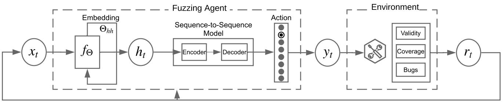
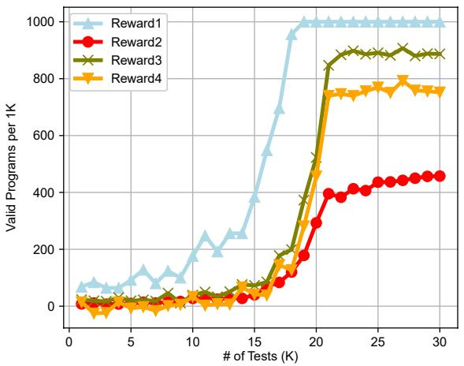
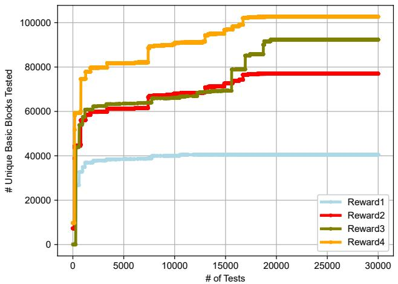
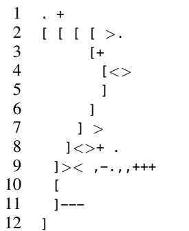
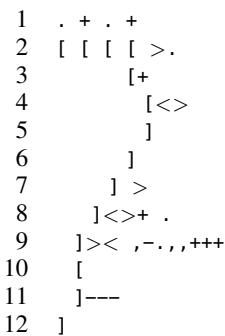

# ALPHALOG: Reinforcement Generation of Valid Programs for Compiler Fuzzing

Xiaoting Li $^{1*}$ , Xiao Liu $^{2*†}$ , Lingwei Chen $^{3†}$ , Rupesh Prajapati $^{1}$ , Dinghao Wu $^{1}$

1Pennsylvania State University, University Park, PA, USA

$^{2}$ Facebook, Inc., USA

$^{3}$ Wright State University, Dayton, OH, USA

xxl237@psu.edu, bamboo@fb.com, lingwei.chen@wright.edu, rxp338@psu.edu, duw12@psu.edu

# Abstract

Fuzzing is a widely-used testing technique to assure software robustness. However, automatic generation of high-quality test suites is challenging, especially for software that takes in highly-structured inputs, such as the compilers. Compiler fuzzing remains difficult as generating tons of syntactically and semantically valid programs is not trivial. Most previous methods either depend on human-crafted grammars or heuristics to learn partial language patterns. They both suffer from the completeness issue that is a classic puzzle in software testing. To mitigate the problem, we propose a knowledge-guided reinforcement learning-based approach to generating valid programs for compiler fuzzing. We first design a naive learning model which evolves with the sequential mutation rewards provided by a target compiler we test. By iterating the training cycle, the model learns to generate valid programs that can improve the testing efficacy as well. We implement the proposed method into a tool called ALPHAPROG. We analyze the framework with four different reward functions and our study reveals the effectiveness of ALPHAPROG for compiler testing. We also reported two important bugs for a compiler production that were confirmed and addressed by the project owner, which further demonstrates ALPHAPROG's applied value in practice.

# Introduction

Compilers are the most critical components of computing systems. Although vast research resources have been deployed to verify production compilers, they still contain bugs and their robustness requires improvements (Sun et al. 2016). Different from application bugs, errors in compilers are usually harder to find, which are not the first place to put breakpoints at when a developer tries to debug an unexpected behavior during compilation. They are presumably correct for most application developers; however, such compiler-bugs can be exploited to launch attacks, resulting in serious security threats. For example, as demonstrated by researchers (David 2018), an attacker can enable a stealth backdoor in Microsoft Visual Studio software with legitimate code by merely exploiting a simple bug in MASM

compiler. Therefore, it is critical to enforce the validity of compilers with more advanced techniques.

Testing is widely adopted (Chen et al. 2013; Regehr et al. 2012) to verify the correctness and robustness of compilers. As a random test case generation paradigm, fuzzing has been proven to be effective to improve testing efficacy and detect software bugs (Kossatchev and Posypkin 2005; Zalewski 2014; Chen et al. 2016; Takanen et al. 2018), which can be categorized as black-box fuzzing and white-box fuzzing. The main difference between fuzzing and testing is that, fuzzing focuses on program crashes and hangs but testing is more general that aims at detecting kinds of syntactical and semantic errors with well-defined sanitizers. Although black-box fuzzing is efficient for general software, existing techniques are not applicable in the scenario of compiler testing where highly-structured inputs are taken in.

To generate high-quality programs in the context of compiler testing, researchers propose to use rigorous generation engines that encodes formal language grammars for whole program generation (Yang et al. 2011). Typically, they conform both syntactic and semantic rules for generating effective programs for compiler testing. However, it takes human efforts and expert knowledge to construct the grammars in generation engines where only a subset of the whole language grammars are encoded as claimed by most of the owners of fuzzing engines in this type. To reduce human labor, researchers propose to use deep neural networks to learn language patterns from existing programs (Cummins et al. 2018; Liu et al. 2019; Godefroid, Peleg, and Singh 2017). Based on a sequence-to-sequence model, language patterns in terms of production rules can be acquired and then used for new program generations. The neural networks can automatically capture most syntactical features and generate new tests effectively. But their success rate depends on the chosen data used for training the model and serving as the seeds. Without valid and diverse testsuites built by programmers, the proposed machine-learning-based approach usually won't work as expected.

To address this challenge, in this study, we build a deep-learning-based framework free from the dataset dependency. Specifically, we propose a reinforcement learning framework (Sutton, Barto et al. 1998) to bootstrap the neural networks that encode language patterns from scratch with the oracle of returning messages and runtime information dur-

ing compilation. Reinforcement learning shows its potential in program analysis (Bunel et al. 2018; Böttinger, Godefroid, and Singh 2018; Verma et al. 2018) due to its capability of achieving learning goals in uncertain and complex environments. In our case, we use it to generate new programs within a limited length. Then we ask compiler to compile the generated program and collect both returning message and runtime information, i.e., execution traces, for calculating a designed reward to train the model. With more programs generated, the neural network will be better trained to craft new programs towards our anticipations. To achieve the goal of high compiler testing efficacy, we construct the coverage-guided reward functions to balance the program validity and testing coverage improvement of the target compilers. In such a manner, the trained neural network will eventually learn to generate valid and diverse test suites for testing.

We built the proposed framework into a prototyping tool called ALPHAPROG. To evaluate the practicability of our approach, we deployed ALPHAPROG on an esoteric language called BrainFuck (Müller 1993) (we use BF in later context) which is a Turing-complete programming language that only contains eight operators. We explored the effectiveness of ALPHAPROG by testing an industrial-grade BF compiler called BFC (Hughes 2019). We compared the results of ALPHAPROG under four different reward functions for compiler fuzzing, ALPHAPROG achieves promising performance in terms of validity and testing efficacy. During the analysis, we also detected two important bugs of this target compiler. After reporting both issues, they were actively addressed by the project owner and already fixed in the new release.

# Overview

If we see a program as a string of characters of such language, we can model program generation task as a Markov Decision Process (MDP) (Markov 1954) process. An MDP is a 4-tuple $(S,A,P_{a},R_{a})$ , where $S$ is a finite set of states, $A$ is a finite set of actions and it is a transition between two states. Given each different state $s\in S$ , the probability of taking action $a\in A$ is $P_{a}(s,s^{\prime})$ ; accordingly, it receives an immediate reward $R_{a}(s,s^{\prime})$ , where $s\in S$ is the current state and $s^{\prime}\in S$ is the state after action. Starting at the training iteration $t$ , one action $a_{t}\in A(s_{t})$ will be selected and performed. Once the environment receives the current state $s_t$ and action $a_{t}$ , it responds with a numerical reward $r_{t + 1}$ and finds model a new state $s_{t + 1}$ . In our context, we choose the best character to generate based on current program state and append new characters iteratively to current character string until EOF. The generation of EOF may vary and a simple implementation is set EOF at a fixed length. The core problem of MDP is to find a policy $\pi$ for making action decisions on a specific state $s$ . That is an update of the probability matrix, $P_{a}(s,s^{\prime})$ , which achieves the optimal reward $R_{a}(s,s^{\prime})$ . In the fuzzing task, the probability for each transition will be learning by neural networks to achieve an optimal reward which combines two important metrics (1) the validity of generated programs and (2) compiler testing coverage. The validity of generated strings will be confirmed by return

ing messages of compilations and it demonstrates how the policy conforms formal language production rules. And for compiler testing coverage, it will be calculated by analyzing the runtime information of each compilation.

# Designed Framework

In this work, we propose a reinforcement learning framework based on Q-learning to generate BF code for fuzzing BF compilers. The designed generation process is illustrated in Figure 1. In this framework, there are essentially two main components, the fuzzing agent and the environment. The fuzzing agent, i.e. the provided neural network, will try to generate a new program with best practice, and the environment, i.e. the compiler, will provide a scalar reward for evaluating this synthesized program. To generate a new program, the neural network will take in a base string $x_{t}$ for predicting new characters. The generated program $y_{t}$ is a new string by appending a new character to the base string. The model will evaluate the quality of this new program and calculate a scalar reward $r_{t}$ according to the message and execution trace from the compilation to train the neural networks iteratively. The model will evolve and optimize gradually as more and more strings are generated and evaluated. In this section, we will detail the model configuration in our framework and elaborate on the defined reward function.

# Action-State Value

Unlike traditional Q-learning, deep Q-learning leverages deep neural network to improve the scalability of model for tasks with large state-action space. In our design, once observing a current state, the trained action-state network will predict an action that selecting a character from the BF language to append in the next step. To deal with different length of strings, we use a simple LSTM model for sequence embedding. In particular, we derive a LSTM layer with 128 neurons followed by two fully-connected hidden layers with 100 and 512 neurons respectively. For each layer, we adopt ReLU (Maas, Hannun, and Ng 2013) as the activation function. The size of the output layer is 8 (corresponding to BF's eight different characters) that allows to predict the character to append with highest value.

# Reward

The reward function is key to reinforcement learning frameworks that indicates the learning direction. In the compiler fuzzing task, there are two main goals: (a) the generated programs should be valid; (b) the generated programs should be as diverse as possible. For validity, the generated programs are supposed to be both syntactically and semantically valid. There are stages during the compilation process and if the test code is rejected during early stages, such as the syntax analysis, the compilation will be terminated and the rest execution paths won't be tested. Thus, the validity of generated test programs is important for the fuzzing task. In addition to validity, diversity is another goal from the perspective of testing efficacy. If similar tests are generated, although they are valid to be successfully compiled by target compilers, we cannot achieve any testing coverage improvement that we

  
Figure 1: Compiler Fuzzing Process of ALPHAPROG

won't be able to trigger more unknown flaws or vulnerabilities in compilers. In other words, we prefer more legitimate language patterns are explored and encoded into the neural networks rather than synthesizing test code in vain with the same patterns. In our design, we set up four different reward functions for the learning process which demonstrates the two different learning goals and how to achieve the balance in between.

Reward 1 First, considering the syntactic and semantic validity, we set the reward function as

$$
R _ {1} = \left\{ \begin{array}{l l} 0, & \text {l e n g t h i s l e s s t h a n l i m i t} \\ - 1, & \text {c o m p i l a t i o n e r r o r} \\ 1, & \text {c o m p i l a t i o n s u c c e s s} \end{array} \right. \tag {1}
$$

where for any intermediate programs during a generation episode, we give it a reward of 0 until its length hits our restriction. To collect the compilation feedback and verify the validity of a synthesized program, we use a production compiler to parse the generated program and evaluate its correctness based on the compilation messages.

Compilation Message: Usually, there are five kinds of compilation messages: no errors or warning means that the program is successfully compiled to an executable without any conflict to the hard or soft rules defined by the compiler; (2) errors represents that the program does not conform syntactic or semantic checks and hits the exceptions that terminate the compilation process; (3) internal errors indicates an error (bug) of the compiler where the compiler does not conform the pre-defined assertions during the compilation; (4) warnings is the sign that the compilation succeeds but there are some soft rules that have not been met, such as the program contains some meaningless sequences; and (5) hangs depicts the compilation falls into some infinite loops and it cannot exit in a reasonable time. We consider three cases among these compilation messages as the indicator for a valid program: no errors or warning, warnings, and internal errors. Theoretically, this reward metric should guide the model to synthesize programs that are valid with least effort such that the same character can be repeatedly generated all the time in a synthesized program.

Reward 2 Second, to measure the diversity of the synthesized program, we use the unique tested basic blocks on the compilation trace by the generated test suite as the testing coverage. In compiler construction, a basic block of an execution trace is defined as a straight-line code sequence with

no branches except for the entry and exit points, which is considered as one of the important atomic units to measure code coverage. In this regard, we have the reward

$$
R _ {2} = B \left(\mathrm {T} _ {p}\right) / \sum_ {\rho \in I ^ {\prime}} B \left(\mathrm {T} _ {\rho}\right). \tag {2}
$$

In this reward function, $B(\mathrm{T}_p)$ is the number of unique basic blocks of the execution trace of a program $p$ and $I'$ is all the programs generated from this test suite where we compute the total number of unique basic blocks created so far.

Reward 3 Third, to consider both code validity and diversity, we further formulate a combination of their reward metrics as the new reward function, which is accordingly specified as

$$
R _ {3} = \left\{ \begin{array}{l l} 0, & \text {l e n g t h i s l e s s t h a n l i m i t} \\ - 1, & \text {c o m p l i b a t i o n e r r o r} \\ 1 + R _ {2}, & \text {c o m p l i b a t i o n s u c c e s s} \end{array} \right. \tag {3}
$$

In this reward function, for all the generated programs that are compiled successfully, we use the portion of the newly tested basic blocks as the reward. For the other two cases, we still return reward 0 when the program length does not hit the limit, and $-1$ when the program is not compileable.

Reward 4 In the fourth scenario, we further add a control-flow complexity of the synthesized programs into consideration based on the previous reward metrics. According to Zhang et al.'s study (Zhang, Sun, and Su 2017), the increase of control-flow complexity of programs in the test suites will remarkably improve the testing efficacy of the corresponding compilers. The effective testing coverage can be improved up to $40\%$ by simply switching the positions of variables in each program within the GCC test suite. In our design, we add the cyclomatic complexity (Watson, Wallace, and McCabe 1996) of the synthesized programs into our reward metrics which is used to describe program control-flow complexity. Then we have new reward function,

$$
R _ {4} = R _ {3} + C (p) / \max  \left(C \left(\rho : \rho \in I ^ {\prime}\right)\right). \tag {4}
$$

In this function, $C(*)$ is the cyclomatic complexity of a program. We simply add the cyclomatic complexity of a synthesized program divided by the max value we get till now in the previous reward function $R_{3}$ . In other words, if the synthesized program does not hit the length limit, we give it a reward of 0 and if it is not valid, we give it reward -1. Otherwise, the reward will be a combination of program validity, testing coverage, and program control-flow complexity.

# Training

During the training stage, we bootstrap the deep neural network for program generation that takes in a current program $x$ with state $s$ , the action $a$ that generates $x$ to a next state $s'$ , the reward $r$ that is calculated based on compilation, and an original Q-network. For a given state, this Q-network predicts the expected rewards for all defined actions simultaneously. We update the Q-network to adapt the predicted value $Q(s_{t},a_{t})$ according to the target $r + \gamma \max_{a}Q(s_{t + 1},a)$ by minimizing the loss of the deviation in between, where $\gamma$ is a discounted rate between 0 and 1. A value closer to 1 indicates a goal that is targeted on long-term reward while a value closer to 0 means the model is more greedy. The tradeoff between the exploration and exploitation during training is a dilemma that we frequently face in reinforcement learning. In our program generation problem, exploitation pays more attention to take advantage of a trained model to search new conform programs as much as possible, while exploration means the fuzzing agent will randomly choose a character that allows the generated sequences to vary. In our method, we employ the $\epsilon$ -greedy method in the training process to balance exploration and exploitation, where with probability $\epsilon$ , our model will choose a random action and with probability $1 - \epsilon$ , it will follow the prediction from a neural network. In the implementation, we make the value for $\epsilon$ decaying, such that at earlier stages of training, the chance to choose a random action is higher but the probability goes down proportionally to the number of predictions. It indicates that we gradually rely on the trained neural network rather than random guesses to explore as model becomes more matured.

# Experiment

To evaluate our prototyping tool ALPHAPROG, we perform studies on training the model towards the two different goals by setting reward functions as described in Reward section. We log the valid rate and testing coverage improvement during the learning process. The analysis will confirm our guess on the leading role of the different reward functions. To demonstrate the testing ability, we compare our tool with random fuzzing with 30,000 newly generated programs, in terms of testing efficacy. To elaborate its effectiveness on generating more diverse programs, we also study the generated programs to explain the evolving process of the training model. In this section, we report the detailed implementation of ALPHAPROG, and discuss the experiments we conducted.

# Settings

We build ALPHALOG by applying an existing framework of binary instrumentation and neural network training. The core framework of the deep Q-learning module is implemented in Python 3.6. In our implementation, the program execution trace is generated by Pin (Luk et al. 2005), a widely-used dynamic binary instrumentation tool. We develop a plug-in of Pin to log the executed instructions. Additionally, we develop another coverage analysis tool based on the execution trace to report all the basic block touched so far. It will also report whether and the number of new

basic blocks are covered by a certain new program in the compiler code. Additionally, our environment will also log and report abnormal crashes, memory leaks or failing assertions of compilers with the assistance of internal errors alarms from the compiling messages.

Besides, the Q-learning network is implemented in Tensorflow (Abadi et al. 2016) using a LSTM layer for sequence embedding that is connected with a 2-layer encoder-decoder network. The initialized weights are randomly and uniformly distributed within $w \in [0,0.1]$ . We choose a discounted rate $\gamma = 1$ to address long-term goal and a learning rate $\alpha = 0.0001$ for the gradient descent optimizer. We assign $\epsilon_{max} = 1$ and $\epsilon_{min} = 0.01$ with a decaying value of $(\epsilon_{max} - \epsilon_{min}) / 100000$ after each prediction. Therefore, the model stops exploration after episode 20,000. We will open source our prototyping tool ALPHAPROG for public dissemination after the paper is accepted.

# Validity

Generating valid programs is one of our important goals. We evaluate the valid rate of the generated programs during the training process. Four different reward functions are designed towards two different goals for program generation. We report the number of valid program numbers per 1,000 generated programs in Figure 2.

Reward 1: Reward 1 demonstrates the learning towards generating only valid programs. From the Figure 2 we can find that, with the increasing number of programs generated, the valid rate grows fast and by 20,000 generated programs, the valid rate reaches $100\%$ . The generation result implies that, once the easiest pattern to generate a valid program is found by a random generation, e.g., $\dots$ , $\dots$ , $\dots$ , or $\dots$ , the network converges quickly to it and stops learning anything new. The model trained by this reward function achieves the highest rate of valid programs in the synthesis procedure.

Reward 2: Reward 2 demonstrates the learning towards generating diverse programs for improving testing coverage for a target compiler. Without balancing with syntactic and semantic validity, using this reward, we anticipate more diverse programs patterns will be generated but less of them should be valid. The results in Figure 2 show that the valid rate stays the lowest for most of the time which means the generation engine has a low efficiency to learn a valid program through the reward on pure coverage.

Reward 3: Reward 3 sets up the goal of combining validity and diversity. In a high-level, to generate valid and diverse programs are two conflicting goals. To generate valid programs, the model only needs to know one simple way that fits language grammar. For example, in the experiment of using Reward 1, the model only learns that by appending $r$ , to whatever prefix; it can generate valid programs out of it. However, if the goal becomes generating diverse programs, different characters should be tried which makes validity easy to be violated. The model trained by this reward function achieves the second place in the rate of valid programs in the synthesis procedure. From Figure 2, we observe that the valid rate keeps fluctuating, but overall, it is increasing and approximates to $90\%$ at the final stage.

  
Figure 2: Code validity under four reward functions

Reward 4: Reward 4 sets up the goal of adding program control-flow complexity together with the synthesis validity and diversity. By studying related studies, we know that the control-flow complexity of programs in test suites is one of the most important factors that improve testing efficacy for compilers. We anticipate the add-on of this factor into the reward function will help us to improve the testing coverage of target compilers while not compromising the program validity that much. From Figure 2 we find that the model trained by this reward function achieves the third place in the rate of valid programs in the synthesis procedure.

# Testing Coverage

Coverage improvement is the most important metric for software testing. Traditionally, it denotes the overall lines/branches/paths in target software being visited with certain test cases. In the design of ALPHAPROG, to improve the performance in this end-to-end learning process, we adopt an approximation to describe the overall testing coverage, which is the accumulated number of unique basic blocks being executed with the generated new programs. A basic block of an execution trace is a straight-line code sequence with no branches except for the entry and exit point in compiler constructions. To capture the overall number of unique basic blocks, we first capture the unique basic blocks $B(\mathrm{T}_p)$ with respect to each execution trace $\mathrm{T}_p$ , and then calculate a store of accumulated unique basic blocks number $B(I')$ by unionizing the new basic blocks on current trace with existing ones that are visited before. In the experiments, we log the accumulated testing coverage for the four different reward functions we adopt in the framework. We compare their coverage improvements and display the results in Figure 3.

Reward 1: The blue line shows the accumulated compiler testing coverage by generating programs under Reward 1. In this reward, we find the coverage improves drastically at the beginning of training. But it stops growing since episode 11,000. In the corresponding figure that shows the validity distribution, we also notice that the valid rate achieves $100\%$ since episode 11,000 which is very close to the converging

  
Figure 3: Testing coverage under four reward functions

point of coverage. It is because our model finally converges at the point that the model keeps producing, or $>$ for every action. Although the generated programs are $100\%$ valid, they do not improve the testing coverage anymore. This result confirms the analysis from the validity test experiment.

Reward 2: The red line shows the accumulated compiler testing coverage by generating programs under Reward 2. In this reward, we find that coverage results also increase drastically at the beginning stages of training. It still slowly grows after the improvement stops with Reward 1 but the pace is not as fast as the improvement under Reward 3. In the corresponding figure that shows the code validity, although our model scarcely generates valid programs under Reward 2, these generated ones are inspired to be diverse to hit different parts inside the target compiler which eventually improves the testing coverage with lower efficiency.

Reward 3: The green line shows the accumulated compiler testing coverage by generating programs under Reward 3. In this reward, we find that the testing coverage goes up dramatically at early stages and it keeps increasing until the second-highest coverage is achieved eventually. We also notice that the coverage improves periodically. In the figure 2 that shows the code validity, we can observe the regularity of increasing wave. We interpret it as that the model is always driven to generate valid programs according to the frequent validity reward stimulation; meanwhile, it is periodically guided to generate new patterns towards higher reward. In this case, the generated programs are trained to achieve a good trade-off between validity and diversity.

Reward 4: The orange line shows the accumulated compiler testing coverage by generating programs under Reward 4. In this reward, we can observe that the coverage improves as drastically as the synthesis under Reward 3 at early learning stages. The coverage keeps increasing until the highest value is achieved among the 4 designed reward functions. Although the final program valid rate under Reward 4 is lower than those under Reward 1 and Reward 3, the testing coverage beats both of them. The reason why Reward 4 achieves better testing coverage than Reward 1 is straightforward as the latter one naively depends on the validity of

Table 1: Synthesis Examples   

<table><tr><td>Episode</td><td>Cyclomatic Complexity</td><td>Program</td></tr><tr><td>101</td><td>2</td><td>[+, &lt;&gt;++[&gt;.], -+&lt;+[, ]-, [&lt;].&lt;- [], &gt;, [&gt;. &lt;[+]]+&gt;&lt;]</td></tr><tr><td>1786</td><td>11</td><td>[&gt;, [., [... - [&lt;]++, .+-, .-.], ], ].&gt; , +[&gt;]&gt;. +..+</td></tr><tr><td>5096</td><td>32</td><td>&lt;-+[. &lt;, [., -] +] &gt; -.+++&lt;++-.&gt;, [&gt;, +, ] -&lt;- -- []</td></tr><tr><td>10342</td><td>39</td><td>-&lt;[&gt;.&lt;.&gt;.&lt;, ]&lt;-&lt;[&lt;.-]. -, [&gt; - &lt;&gt;++- [, .] &gt;&gt;-+ [, &lt;]</td></tr></table>

codes. However, it is more complex for Reward 4 to outperform Reward 3. We may interpret it as the side effect learned from the program control-flow complexity. On one hand, the higher control-flow complexity is a more direct and instant reward to improve the testing coverage, which enforces the fuzzing agent to generate programs that require more optimizations in the compilation process. On the other hand, it sets up the goal of synthesizing complex program in every episode which is not considered under Reward 3. To improve testing coverage under Reward 3, the fuzzing agent needs to learn new language patterns, while Reward 4 needs the fuzzing agent to additionally learn how to combine the newly learned language patterns in an efficient way because the entire sequence length is limited.

# Synthesis Examples

To demonstrate how the control-flow complexity of synthesized programs grows, we show four cases that generated during different episodes using the model under Reward 4. The synthesized programs are displayed in Table 1. We extract their abstracted control-flow graphs based on the control-flow graphs generated from the LLVM machine-independent optimizer and observe an obvious trend towards complexity. We can also observe that, with the learning moves forward, the fuzzing agent learns to synthesize more complex programs which have higher cyclomatic complexities. Moreover, we calculate the average cyclomatic complexities of programs generated from four reward functions, the results increase from 4 to 18 which is consistent with the test coverage metric. It confirms that with more designed heuristics integrated into the learning rewards, the fuzzing agent can be potentially aware of and thus reinforce the generation goal to craft more effective code patterns.

# Comparison with AFL

AFL (Zalewski 2014) is a matured fuzzing production that has been widely used for different applications. Here we compare ALPHAPROG with AFL in the two perspectives we focus on: validity and coverage. We use AFL with a single empty seed to generate 30,000 programs for fuzzing BFC and record the highest valid rate per 1,000 samples, and the accumulated coverage achieved. As a result, the highest valid rate for AFL is $35\%$ and the accumulated coverage in terms of basic blocks tested is 43, 135. It covers 162 paths but has found no crashes or hangs (actually we ran AFL for 24 hours and no crashes or hangs were found). By contrast, ALPHAPROG manages to achieve the valid rate around $80\%$ under Reward 4 which is the most efficient one for fuzzing, where over 100,000 basic blocks are tested with 30,000 test samples, and two bugs were detected. With this result, we

  
Listing 1: Bug 1

  
Listing 2: Bug 2

can claim that ALPHAPROG is better than AFL in generating valid and diverse programs for compiler fuzzing.

# Deployment for Bug Detection

With the improved testing efficacy, our tool has the potential to be deployed for discovering more compiler bugs compared with pure random fuzzing in practice. During our analysis, our developed tool ALPHAPROG has already helped to detect two important bugs for the target compiler BFC, which is the industrial-grade BF compiler with the most stars (207) and folks (8) on GitHub. We reported two programs that enforce BFC to hang due to compile-time evaluations. The first program triggers the bug during the BF IR optimization, while the second one triggers the bug because the compiler aggressively unrolls the loop as compile-time evaluation sends a huge amount of IR to LLVM, and then spends ages trying to optimize the IR. After we reported both issues, they were addressed by the project owner and fixed in the new release. Here we show the two bugs we found, reported and confirmed1.

# Discussion and Conclusions

In this paper, we propose a reinforcement learning-based approach to continuously generate programs for compiler fuzzing. We practically evaluate our method on fuzzing BF compiler. Our study reveals the overall effectiveness of ALPHAPROG for compiler testing and yields great applied value of our tool. However, there are also two main limitations in our current work. The scalability of ALPHAPROG is restricted, especially for complex programming language, e.g., $C$ . As the C language structures are difficult to synthesize where the entire search space is $141^{20}$ , almost $8e + 24$ times of the BF language with the same length limit, it can

take days for our prototype to just find one single valid C program. We still need more grammars to be encoded in the generation engine to make it applicable for complex languages. The second difficulty is that it is hard to determine the end of a training cycle. Unlike the game of Go, the learning goal for reinforcement fuzzing is hard to strictly define only with the current reward metrics. We need more in-depth study to overcome existing challenges and leave that as our future work.

# Acknowledgments

We gratefully acknowledge the support of NVIDIA Corporation with the donation of the Titan Xp GPU used for this research. This research was supported in part by the National Science Foundation (NSF) grant CNS-1652790.

# References

Abadi, M.; Barham, P.; Chen, J.; Chen, Z.; Davis, A.; Dean, J.; Devin, M.; Ghemawat, S.; Irving, G.; Isard, M.; et al. 2016. Tensorflow: A system for large-scale machine learning. In 12th USENIX symposium on operating systems design and implementation (OSDI 16), 265-283.   
Bötttinger, K.; Godefroid, P.; and Singh, R. 2018. Deep reinforcement fuzzing. In 2018 IEEE Security and Privacy Workshops (SPW), 116-122. IEEE, San Francisco, CA, USA: IEEE.   
Bunel, R.; Hausknecht, M.; Devlin, J.; Singh, R.; and Kohli, P. 2018. Leveraging grammar and reinforcement learning for neural program synthesis. arXiv preprint arXiv:1805.04276, 1: 265-283.   
Chen, J.; Hu, W.; Hao, D.; Xiong, Y.; Zhang, H.; Zhang, L.; and Xie, B. 2016. An empirical comparison of compiler testing techniques. In 2016 IEEE/ACM 38th International Conference on Software Engineering (ICSE), 180-190. IEEE, Austin, TX, USA: IEEE.   
Chen, Y.; Groce, A.; Zhang, C.; Wong, W.-K.; Fern, X.; Eide, E.; and Regehr, J. 2013. Taming Compiler Fuzzers. In Proceedings of the 34th ACM SIGPLAN conference on Programming language design and implementation (PLDI), 197-208. New York, NY, USA: ACM.   
Cummins, C.; Petoumenos, P.; Murray, A.; and Leather, H. 2018. Compiler fuzzing through deep learning. In Proceedings of the 27th ACM SIGSOFT International Symposium on Software Testing and Analysis, 95-105. ACM, Amsterdam, Netherlands: ACM.   
David, B. 2018. How a simple bug in ML compiler could be exploited for backdoors? arXiv preprint:1811.10851, 1: 1.   
Godefroid, P.; Peleg, H.; and Singh, R. 2017. Learn&fuzz: Machine learning for input fuzzing. In Proceedings of the 32nd IEEE/ACM International Conference on Automated Software Engineering, 50-59. Piscataway, NJ, USA: IEEE Press.   
Hughes, W. 2019. BFC: An industrial-grade brainfuck compiler. https://bfc.wilfred.me.uk/.   
Kossatchev, A. S.; and Posypkin, M. A. 2005. Survey of compiler testing methods. Programming and Computer Software, 31(1): 10-19.

Liu, X.; Li, X.; Prajapati, R.; and Wu, D. 2019. DeepFuzz: Automatic Generation of Syntax Valid C Programs for Fuzz Testing. In Proceedings of the 33th AAAI Conference on Artificial Intelligence, 1044-1051. USA: Proceedings of the AAAI Conference on Artificial Intelligence.   
Luk, C.-K.; Cohn, R.; Muth, R.; Patil, H.; Klauser, A.; Lowney, G.; Wallace, S.; Reddi, V. J.; and Hazelwood, K. 2005. Pin: Building Customized Program Analysis Tools with Dynamic Instrumentation. In Proceedings of the 2005 ACM SIGPLAN Conference on Programming Language Design and Implementation, 190-200. Chicago, IL, USA: ACM. ISBN 1-59593-056-6.   
Maas, A. L.; Hannun, A. Y.; and Ng, A. Y. 2013. Rectifier nonlinearities improve neural network acoustic models. In Proceedings of the 30th International Conference on Machine Learning (ICML), volume 30.   
Markov, A. A. 1954. The theory of algorithms. Trudy Matematicheskogo Instituta Imeni VA Steklova, 42: 3-375.   
Müller, U. 1993. Brainfuck—an eight-instruction Turing-complete programming language. Available at the Internet address http://en.wikipedia.org/wiki/Brainfuck.   
Regehr, J.; Chen, Y.; Cuoq, P.; Eide, E.; Ellison, C.; and Yang, X. 2012. Test-case Reduction for C Compiler Bugs. In Proceedings of the 33rd ACM SIGPLAN Conference on Programming Language Design and Implementation, PLDI '12, 335-346. New York, NY, USA: ACM. ISBN 978-1-4503-1205-9.   
Sun, C.; Le, V.; Zhang, Q.; and Su, Z. 2016. Toward understanding compiler bugs in GCC and LLVM. In Proceedings of the 25th International Symposium on Software Testing and Analysis (ISSTA), 294-305. ACM.   
Sutton, R. S.; Barto, A. G.; et al. 1998. Reinforcement Learning: An Introduction. USA: MIT Press.   
Takanen, A.; Demott, J. D.; Miller, C.; and Kettunen, A. 2018. Fuzzing for software security testing and quality assurance. Artech House.   
Verma, A.; Murali, V.; Singh, R.; Kohli, P.; and Chaudhuri, S. 2018. Programmatically Interpretable Reinforcement Learning. arXiv preprint arXiv:1804.02477.   
Watson, A. H.; Wallace, D. R.; and McCabe, T. J. 1996. Structured testing: A testing methodology using the cyclomatic complexity metric, volume 500. USA: US Department of Commerce, Technology Administration.   
Yang, X.; Chen, Y.; Eide, E.; and Regehr, J. 2011. Finding and understanding bugs in C compilers. In Proceedings of the 32nd ACM SIGPLAN conference on Programming language design and implementation (PLDI), volume 46, 283-294. USA: ACM.   
Zalewski, M. 2014. American fuzzy lop. https://lcamtuf.coredump.cx/afl/.   
Zhang, Q.; Sun, C.; and Su, Z. 2017. Skeletal Program Enumeration for Rigorous Compiler Testing. In Proceedings of the 38th ACM SIGPLAN Conference on Programming Language Design and Implementation, PLDI 2017, 347-361. New York, NY, USA: ACM. ISBN 978-1-4503-4988-8.