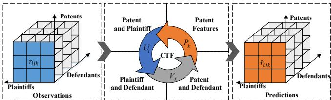
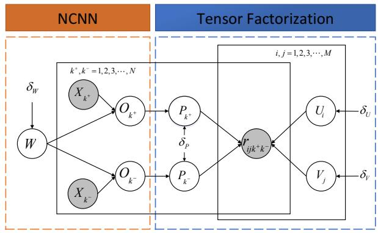
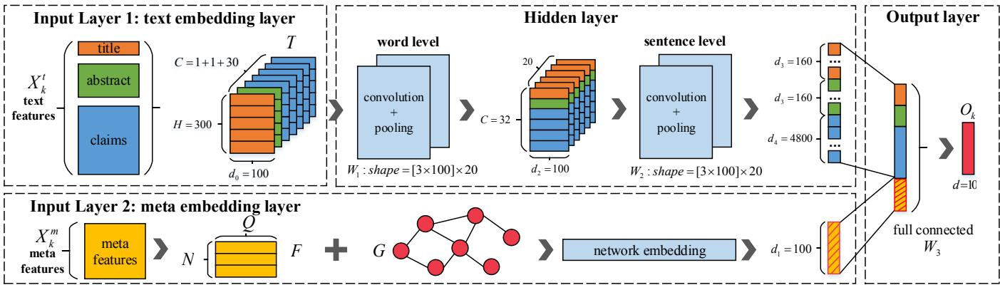
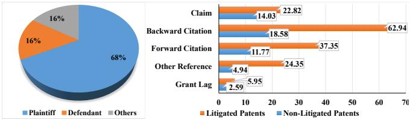
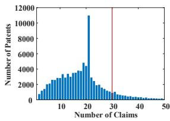
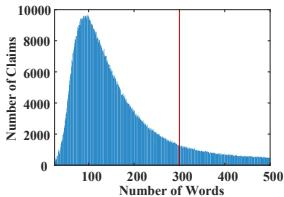
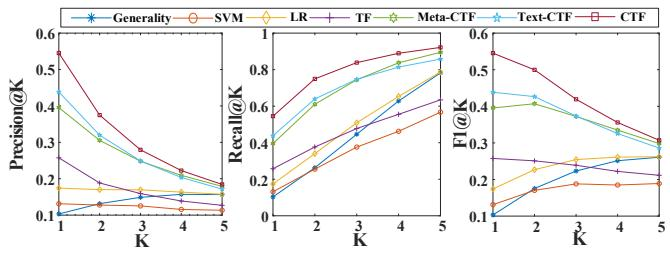
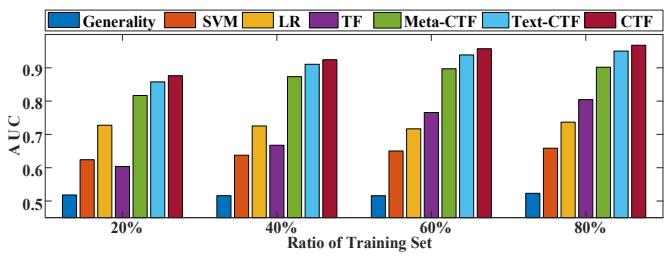

# Patent Litigation Prediction: A Convolutional Tensor Factorization Approach

Qi Liu†, Han Wu†, Yuyang Ye†, Hongke Zhao†*, Chuanren Liu‡ and Dongfang Du†

†Anhui Province Key Lab. of Big Data Analysis and Application, University of S&T of China

$^{\ddagger}$ Decision Sciences & MIS Department, Drexel University

qiliuql@ustc.edu.cn, {wuhanhan, yeyuyang, zhhk, dfdu} @ mail.ustc.edu.cn, chuanren.liu@drexel.edu

# Abstract

Patent litigation is an expensive legal process faced by many companies. To reduce the cost of patent litigation, one effective approach is proactive management based on predictive analysis. However, automatic prediction of patent litigation is still an open problem due to the complexity of lawsuits. In this paper, we propose a data-driven framework, Convolutional Tensor Factorization (CTF), to identify the patents that may cause litigations between two companies. Specifically, CTF is a hybrid modeling approach, where the content features from the patents are represented by the Network embedding-combined Convolutional Neural Network (NCNN) and the lawsuit records of companies are summarized in a tensor, respectively. Then, CTF integrates NCNN and tensor factorization to systematically exploit both content information and collaborative information from large amount of data. Finally, the risky patents will be returned by a learning to rank strategy. Extensive experimental results on real-world data demonstrate the effectiveness of our framework.

# 1 Introduction

Recently, according to statistics of World Intellectual Property Organization1, for the first time, more than 3 million patent applications were filed worldwide in 2016, up $8.3\%$ from 2015. Indeed, more and more individuals, organizations and companies have realized the power of patents, not only in economic benefit but also in legal effect [Cohen et al., 2016].

In view of the importance of patents, a new research area, called patent mining, aiming to assist patent analysts in processing and analyzing patent documents, emerges in recent years [Zhang et al., 2015]. The existing researches include patent retrieval [Azzopardi et al., 2010], patent classification [Loh et al., 2006], patent visualization [Huang et al., 2003], patent valuation [Hasan et al., 2009; Jin et al., 2011;

Lin et al., 2018] and patent litigation analysis [Marco and Miller, 2017]. Since patent litigation is an effective manner to protect the benefit and proprietary of companies [Jin et al., 2016], many efforts have been made to research the major causes (e.g. protecting product features and exclusivity) as well as the influential features (e.g. number of patent claims) in patent litigation [Lim, 2014]. However, it is still an open problem for the automatic prediction of potential patent litigations, i.e. identifying the possible patents that may cause litigations given two companies, for providing an early litigation warning and leaving companies more time to develop business strategies.

As a matter of fact, there are many technological and domain challenges inherent in designing an effective solution for patent litigation prediction. First, the intentions of patent litigations are both complex and various, including protecting market shares, protecting product features and exclusivity, and for revenge2. The companies (plaintiffs) may even file a lawsuit against another one (defendants) not only with their own patents, e.g. Core Wireless have sued Apple several times by using the patents of Nokia. Therefore, the hidden interactions in lawsuits cannot be easily captured. Second, patent litigation records are much fewer and sparser to be predicted compared with the whole patent dataset. According to the statistics of USPTO, there are more than 6,000,000 granted patents while only no more than 100,000 patent lawsuit cases until now. Third, the diverse content information of patents should also be taken into consideration when predicting patent litigation. According to the findings in [Cremers, 2004], the relatively valuable patents (e.g. with more claims and citations) are more likely to be involved in lawsuit cases.

To conquer these challenges, in this paper, we propose a novel data-driven framework i.e. Convolutional Tensor Factorization (CTF) to precisely identify the patents that may cause litigations for given company pairs. Indeed, CTF is a hybrid modeling approach by leveraging the heterogeneous factors of patent litigations. Specifically, we first develop a deep learning method (Network embedding-combined Convolutional Neural Network, NCNN) to represent the content features of patents, including the meta features (e.g. the

  
Figure 1: The visualization of Convolutional Tensor Factorization.

number of claims and citations) and the text features (e.g. the patent title and abstracts), simultaneously. Meanwhile, we summarize the lawsuit records of companies as a three-dimensional tensor, where the axes indicate plaintiffs, defendants and patents, respectively. Then, by combining NCNN with tensor factorization, CTF can systematically exploit both the content and the collaborative information. In this way, not only the data sparsity of litigation records can be addressed, but also the complex interactions among plaintiffs, defendants and patents can be well captured by the factorized latent factors. Next, we further use a learning to rank strategy to generate the final ranking list of candidate patents. Finally, we conduct extensive experiments on real-world data, whose results clearly prove that CTF can help companies more precisely identify the risky patents by exploiting the hybrid information. To the best of our knowledge, it is the first comprehensive attempt for automatically predicting whether two given companies will involve a lawsuit related to a specific patent.

# 2 Related Work

We classify the related works into the following three research aspects: Patent Litigation, Tensor Factorization and Convolutional Neural Network.

Patent Litigation. Most of the existing works of patent litigation focus on analyzing the major causes and the potential factors in patent litigation. For instance, Lanjouw and Schankerman [2001] examined the characteristics of litigated patents and their owners and found the substantial variation across patents in their exposure to litigation risk. Cremers [2004] statistically analyzed citation, number of claims, and family size to identify the characteristics of patents most prone to litigations. In more detail, Lim [2014] analyzed the relationship between citations and patent litigations between plaintiff and defendant firms, and found that the indirect and latent citations have more influences than direct citations to patent litigation. Recently, Marco and Miller [2017] tried to model the relationship between patent examination quality and litigation, and found that some examination characteristics can also predict litigation. Different from the above studies, Jin et al. [2016] developed a collaborative filtering framework, which aimed at predicting the litigation risk in a specific industry category for high-tech companies.

Tensor Factorization. Collaborative Filtering (CF) is one type of the widely-accept approaches in Recommender Systems [Schafer et al., 2007; Aggarwal, 2016] and it can be further classified into memory-based CF methods and model-based CF methods (e.g. Matrix factorization, MF). Specially,

Table 1: Several important mathematical notations.   

<table><tr><td>Notation</td><td>Description</td></tr><tr><td>SU</td><td>The set of plaintiff companies</td></tr><tr><td>SV</td><td>The set of defendant companies</td></tr><tr><td>SP</td><td>The set of patents</td></tr><tr><td>R</td><td>The observed litigation record tensor</td></tr><tr><td>Ui</td><td>The latent vector of plaintiff i</td></tr><tr><td>Vj</td><td>The latent vector of defendant j</td></tr><tr><td>Pk</td><td>The latent vector of patent k</td></tr><tr><td>rijk</td><td>The litigation prediction between i and j because of k</td></tr><tr><td>Xk</td><td>The patent features, i.e. the input of NCNN</td></tr><tr><td>Ok</td><td>The output of NCNN for representing patent k</td></tr><tr><td>W</td><td>The parameters of NCNN</td></tr></table>

Tensor Factorization (TF) can be considered as a generalization of MF [Liu et al., 2011; 2015], in which a n-dimension data cube is factorized, rather than a 2-dimension matrix [Rendle et al., 2011], and the newly added dimensions can represent the context such as time, location and social information. For instance, to integrate the context information into traditional CF, Karatzoglou et al. [2010] modeled the data as a User-Item-Context N-dimensional tensor instead of the traditional 2D User-Item matrix, leading to a compact model of the data for providing context-aware recommendations.

Convolutional Neural Network. Convolutional neural network (CNN) is a variant of the feed-forward artificial neural network, which is originally designed for computer vision. Recently, CNN has also been successfully applied to Natural Language Processing (NLP) [Goldberg, 2016], including text similarity measures [Yih et al., 2011], search query retrieval [Shen et al., 2014], sentence modeling [Kalchbrenner et al., 2014], text understanding [Huang et al., 2017] and other traditional NLP tasks [Kim et al., 2016; Zhang et al., 2017]. It is notable that Kim et al. [2016] proposed a novel context-aware recommendation model, convolutional matrix factorization (ConvMF) that integrates convolutional neural network (CNN) into probabilistic matrix factorization (PMF). Similarly, in this paper, we design a two-layer CNN for representing patent contents.

# 3 Convolutional Tensor Factorization

In this section, we first give the problem definition of patent litigation prediction, and then show the details of the proposed Convolutional Tensor Factorization (CTF) framework, which combines Network embedding-combined Convolutional Neural Network with Tensor Factorization. For better illustration, Table 1 lists several mathematical notations.

Problem Definition. Suppose we have $M$ companies that could potentially be plaintiffs or defendants, $N$ patents and the summarized historical litigation records $R$ , and our goal is to precisely identify the patents that may cause patent litigations between any two companies in the future.

Let's take the plaintiff set as $S_U = \{i | i = 1, 2, 3, \dots, M\}$ , the defendant set as $S_V = \{j | j = 1, 2, 3, \dots, M\}$ , and the patent set as $S_P = \{k | k = 1, 2, 3, \dots, N\}$ . Note that, one company can be a plaintiff in a lawsuit and be a defendant in another. Given a plaintiff $i$ and a defendant $j$ , we usually call

  
Figure 2: The graphic model of $CTF$ .

them as a company pair. If plaintiff $i$ filed a lawsuit against defendant $j$ related to patent $k$ , we can observe $r_{ijk} = 1$ in tensor $R$ . Then, our research problem becomes identifying the potential patent litigations, e.g. in terms of patent $k^{-}$ , by estimating the unobserved value of $r_{ijk^{-}}$ (noted as $\hat{r}_{ijk^{-}}$ ).

# 3.1 The Graphic Model of CTF

As shown in Figure 1, for the prediction of patent litigations, we try to capture the collaborative information among plaintiffs, defendants and patents. Meanwhile, we hope to exploit the content information of the patents, as they have a strong connection with the lawsuit cases, and in this way, the challenge of sparsity in litigation records can be addressed.

Actually, the proposed CTF is a hybrid modeling approach and its graphic representation is given in Figure 2, which consists of two parts: (1) Network embedding-combined Convolutional Neural Network (NCNN); (2) Tensor Factorization (TF). Specifically, the inputs of NCNN are the observed patent contents $X_{k}$ , including text features $(X_{k}^{t})$ and meta features $(X_{k}^{m})$ . For simplicity, we use $k$ to represent both the patent $k^{+}$ and patent $k^{-}$ .

After learning in NCNN with weights $W$ , $O_{k}$ is produced for representing $k$ , i.e. $O_{k} = NCNN(W, X_{k})$ . In addition, a three-dimensional tensor is generated from the litigation records, and through TF, it can be decomposed into $U_{i}$ , $V_{j}$ and $P_{k}$ , corresponding to the latent vector of the plaintiff $i$ , defendant $j$ and patent $k$ , respectively, where $P_{k}$ is restricted by $O_{k}$ , and the details will be given later. As the litigation records are implicit feedbacks, we resort to the learning to rank strategy [Rendle et al., 2009] and estimate the personalized (for each company pair) ranking order of two patents $(k^{+}$ and $k^{-}$ ) in CTF. This estimator $\hat{r}_{ijk+k^{-}}$ for the observed $r_{ijk+k^{-}}$ could be defined as $\hat{r}_{ijk+k^{-}} = \hat{r}_{ijk^{+}} - \hat{r}_{ijk^{-}}$ , for $(i, j, k^{+}) \in R \land (i, j, k^{-}) \notin R$ . Without loss of generality, we compute each $\hat{r}_{ijk}$ by:

$$
\hat {r} _ {i j k} = U _ {i} ^ {T} V _ {j} + U _ {i} ^ {T} P _ {k} + V _ {j} ^ {T} P _ {k}, \tag {1}
$$

where $U_{i}^{T}V_{j}, U_{i}^{T}P_{k}$ and $V_{j}^{T}P_{k}$ are exactly corresponding to the latent interactions between the plaintiff and defendant, the plaintiff and patent, the defendant and patent, respectively.

If using $k^{+} > _{i,j}k^{-}$ to denote the ranking order of two patents given company pair $(i,j)$ , we further define the probability that the companies $(i,j)$ have a lawsuit with $k^{+}$ while

Table 2: Meta features and text features of patents.   

<table><tr><td>Meta features</td><td>Descriptions</td></tr><tr><td>Forward citations</td><td>The number of citations received by subsequent patents.</td></tr><tr><td>Backward citations</td><td>The number of patents cited in the patent document.</td></tr><tr><td>Number of claims</td><td>The number of claims in a patent document.</td></tr><tr><td>Number of pictures</td><td>The number of pictures in a patent document.</td></tr><tr><td>Number of sheets</td><td>The number of sheets in a patent document.</td></tr><tr><td>Patent classifications</td><td>The CPC groups a patent belongs to.</td></tr><tr><td>Grant lag</td><td>The time elapsed between application and grant dates.</td></tr><tr><td>Patent group trend</td><td>The variation grant trend of patents in the given group.</td></tr><tr><td>Patent assignee trend</td><td>The variation grant trend of patents of their assignee.</td></tr><tr><td>Text features</td><td>Descriptions</td></tr><tr><td>Patent title</td><td>The title of the given patent.</td></tr><tr><td>Patent abstract</td><td>The abstract of the given patent.</td></tr><tr><td>Patent claims</td><td>The first thirty claims of the patent.</td></tr></table>

not with $k^{-}$ as Eq. (2), where $\sigma$ is the sigmoid function.

$$
p \left(k ^ {+} > _ {i, j} k ^ {-}\right) = \sigma \left(\hat {r} _ {i j k ^ {+}} - \hat {r} _ {i j k ^ {-}}\right). \tag {2}
$$

Then, in probabilistic point of view, the problem of finding the best patent ranking $>_{i,j} \subset S_P \times S_P$ for a given company pair $(i,j)$ can be formalized as maximizing the probability by Eq. (3), where $U, V, P$ and $W$ are the model parameters.

$$
p (U, V, P, W | > _ {i, j}) \propto p (> _ {i, j} | U, V, P, W) p (U, V, P, W). \tag {3}
$$

Assuming independence of company pairs, we can maximum the posterior estimator (MAP) of the model parameters:

$$
\underset {U, V, P, W} {\operatorname {a r g m a x}} \prod_ {(i, j) \in S _ {U} \times S _ {V}} p \left(\text {>} _ {i, j} \mid U, V, P, W\right) p (U, V, P, W), \tag {4}
$$

where the conditional distribution over all the observed litigation preferences is given by

$$
\begin{array}{l} p \left(\left. > _ {i, j} \right| U, V, P, W\right) = \\ = \prod_ {(i, j, k ^ {+}, k ^ {-}) \in D _ {R}} p \left(k ^ {+} > _ {i, j} k ^ {-} | U, V, P, W\right), \tag {5} \\ \end{array}
$$

where $D_{R} = \{(i,j,k^{+},k^{-})|(i,j,k^{+})\in R\land (i,j,k^{-})\notin R\}$ stores all the pairwise preferences. As a generative model, we place a zero-mean spherical Gaussian prior on plaintiff latent vectors $U$ with variance $\delta_U^2 I$ ( $I$ is the identity matrix) as:

$$
p \left(U | \delta_ {U} ^ {2} I\right) = \prod_ {i = 1} ^ {M} N \left(U _ {i} \mid 0, \delta_ {U} ^ {2} I\right). \tag {6}
$$

Similar with plaintiff latent vectors, we have the defendant latent vectors $V$ with variance $\delta_V^2 I$ as:

$$
p (V | \delta_ {V} ^ {2} I) = \prod_ {j = 1} ^ {M} N (V _ {j} | 0, \delta_ {V} ^ {2} I). \tag {7}
$$

In the following, we will show how to represent the patent latent vectors $P$ by NCNN. Actually, several researches [Campbell et al., 2016; Liu et al., 2017] have proved that there is a strong relation between patent litigation status and patent meta features, such as patent classification, forward citations and backward citations. In addition, the patent documents include a rich resource of text materials, where the

  
Figure 3: The architecture for NCNN in CTF.

patent title provides the most important topic about the invention, the abstract gives us a general outline, and the most crucial texts are the patent claims because they are the direct evidence of patent litigation. To better represent patents and to deal with the data sparsity of litigation records, we extract both the meta features and the text features as the input of CTF (NCNN, more specifically), which are shown in Table 2. Then, inspired by [Kim et al., 2016], we assume that a patent latent vector is generated from two variables: internal weights $W$ in NCNN and the input features $X_{k}$ of patents, and the details will be illustrated in the next subsection. Thus, the final patent latent vector is obtained by the following equations.

$$
\begin{array}{l} P _ {k} = O _ {k} + \epsilon_ {k}, \\ \epsilon_ {k} \sim N \left(0, \delta_ {P} ^ {2} I\right). \tag {8} \\ \end{array}
$$

Since $O_{k} = NCNN(W,X_{k})$ , we will have:

$$
p (P | W, X, \delta_ {P} ^ {2} I) = \prod_ {k = 1} ^ {N} N \left(P _ {k} | N C N N (W, X _ {k}), \delta_ {P} ^ {2} I\right), \tag {9}
$$

where for each weight $W_{q}$ in $W$ , we also place zero-mean spherical Gaussian prior, which is shown as Eq. (10).

$$
p \left(W \mid \delta_ {W} ^ {2} I\right) = \prod_ {q = 1} ^ {| W |} N \left(W _ {q} \mid 0, \delta_ {W} ^ {2} I\right). \tag {10}
$$

In this way, the output of NCNN is used as the mean of Gaussian distribution for learning the patent latent vector, which plays an important role as a bridge between NCNN and TF, because it helps to fully analyze both the patent contents and the historical litigation records between companies.

# 3.2 The Architecture for NCNN in CTF

We show details of the proposed Network embedding-combined Convolutional Neural Network (NCNN) for generating the $O_{k}$ . Figure 3 shows its architecture, which consists of two input layers, one hidden layer and one output layer.

Input layer. Since there are two kinds of inputs for a patent $k$ , e.g. text materials $(X_{k}^{t})$ and meta features $(X_{k}^{m})$ , we design two different methods to deal with them, which can be found in: (1) text embedding layer and (2) meta embedding layer.

(1) Text embedding layer. We name each text material (the title, abstract and claims) as a slice, and every slice can be regarded as a sequence of words. Then, we aim at transforming $X_{k}^{t}$ into a tensor $T^{C\times H\times d_0}$ , where $C$ is the total number of slices, $H$ is the number of words in each slice, and $d_0$ is the pre-trained word embedding size [Mikolov et al., 2013].

Hidden layer for text embedding. For representing the text information of $T^{C \times H \times d_0}$ , we design a two-layer Convolutional Neural Network. As shown in Figure 3, the first hidden layer is at the word level and the second one is at the sentence level, which is consistent with the nature of patent document analysis in the following terms. First, as a strict logic, patent descriptions are often sensitive to the word sequences in patent documents because different sequences with the same words may have quite different meanings, which can be well learned through the hidden layer at word level. Second, there are several independent claims following by many dependent ones, and in general, each dependent claim is narrower than the independent claim from which it depends, so the order of claims is also of great significance, which can be well learned at the sentence level. Note that both layers contain a convolution and a pooling operation, and the weights and bias variables here are parts of $W$ defined in CTF.

(2) Meta embedding layer. In this layer, we first establish the citation network of patents, and the meta features are summarized as attributes of the patent in that network. Then, inspired by network representation learning, we intend to produce a $d_{1}$ -dimension representation of each patent via attribute network embedding. Here are some considerations. First, the strong relations between patent litigation status and patent meta features have been proved before [Campbell et al., 2016]. Second, citation relations also play a significant role in patent litigation[Lim, 2014] as a typical network structure (e.g. following relations in Twitter), which are completely suitable for processing with network representation learning, especially for integrating more attribute information.

Specifically, we connect the meta features of each patent as an attribute vector, and the details will be given in the experiments. By integrating all the attribute vectors, we generate an attribute matrix $F_{N \times Q}$ , where a row $f_k$ is the attribute vector of patent $k$ . Following the idea of DeepWalk [Perozzi et al.,

  
Figure 4: The distribution statistics of litigated patents.

2014], we first design a method to generate sample paths from the patent citation network $G$ , which involves each patent as the root, and then takes the random permutations of the neighbour nodes of this patent into the path. We acquire many paths in the form of $\langle \text{root}, \text{neighborhood1}, \text{neighborhood2}, \ldots \rangle$ . After that, for each patent in generated paths, we except to maximize the probability for predicting the central patent $k$ given the surrounding patents $\{k - l, \ldots, k + l\} \setminus \{k\}$ donated as $\text{context}(k)$ , where $l$ is the size of the window. Therefore, we have:

$$
\begin{array}{l} \max  \sum_ {k} \log p (k | c o n t e x t (k)) = \\ \max  \sum_ {k} \log \frac {\exp \left(e _ {k} ^ {\prime T} e _ {\text {c o n t e x t} (k)}\right)}{\sum_ {j} \exp \left(e _ {j} ^ {\prime T} e _ {\text {c o n t e x t} (k)}\right)}, \tag {11} \\ \end{array}
$$

where $e_k'$ and $e_{\text{context}(k)}$ are the output embedding and context embedding of patent $k$ , respectively. In network embedding, $e_{\text{context}(k)}$ is usually defined as the average of input embedding of the $2l$ surrounding patents of $k$ :

$$
e _ {\text {c o n t e x t} (k)} = \frac {1}{2 l} \sum_ {j \in [ k - l, k + l ] \backslash \{k \}} e _ {j}. \tag {12}
$$

Moreover, for integrating attribute information $F$ into the embedding process, we define the input embedding of patent $k$ as $e_k = E^T f_k$ , where $E_{Q \times d_1}$ is the transformation matrix needed to be trained. Finally, we employ wildly-used negative sampling to approximate this objective function, and obtain the output embedding (e.g. $e_k'$ for patent $k$ ) by Adaptive Moment Estimation [Kingma and Ba, 2014] algorithm.

Output layer. This layer targets at generating the representation vector $O_{k}$ for patent $k$ , with the input generated by both the hidden layer and the meta embedding layer. There are two operations here. The first one is concatenating the text embedding and meta embedding together, and the second one is mapping through the full connection layer. Eventually, after all these operations, an alphabetic patent document is turned into a simple numeric latent vector $O_{k}$ with the patent content information retained, and this vector is further used to learn the patent latent vectors $P$ (Eq.s (8) and (9)) in CTF.

# 3.3 The Optimization for CTF

This subsection provides the method for the variables to be optimized in CTF, including the plaintiff latent vectors $U$ , the defendant latent vectors $V$ , the patent latent vectors $P$ , and the weights and bias variables $W$ in NCNN. Combining Eq.s (4)-(10) and through maximizing the posterior distribution, we have the formulation as Eq. (13):

  
Figure 5: The distribution of observed patent claims and words.

$$
\begin{array}{l} \operatorname *{argmax}_{U,V,P,W}\prod_{(i,j)\in S_{U}\times S_{V}}p(U,V,P,W| > _ {i,j},X,\delta_{U}^{2}I,\delta_{V}^{2}I,\delta_{P}^{2}I,\delta_{W}^{2}I) \\ = \operatorname {a r g m a x} _ {U, V, P, W} \prod_ {(i, j) \in S _ {U} \times S _ {V}} p \left(\geqslant_ {i, j} | U, V, P, W\right) p \left(U \mid \delta_ {U} ^ {2} I\right) p \left(V \mid \delta_ {V} ^ {2} I\right) \tag {13} \\ \end{array}
$$

$$
p (P | W, X, \delta_ {P} ^ {2} I) p (W | \delta_ {W} ^ {2} I).
$$

Then, the negative log of the above posterior distribution is given by Eq.(14), where $\lambda_U$ is $1 / (2\delta_U^2)$ , $\lambda_V$ is $1 / (2\delta_V^2)$ , $\lambda_P$ is $1 / (2\delta_P^2)$ and $\lambda_W$ is $1 / (2\delta_W^2)$ :

$$
\begin{array}{l} L(U,V,P,W) = \sum_{(i,j,k^{+},k^{-})\in D_{R}} - [\ln \sigma (\hat{r}_{ijk^{+}} - \hat{r}_{ijk^{-}})] \\ + \lambda_ {U} \sum_ {i} ^ {M} | | U _ {i} | | _ {F} ^ {2} + \lambda_ {V} \sum_ {j} ^ {M} | | V _ {j} | | _ {F} ^ {2} + \lambda_ {W} \sum_ {q = 1} ^ {| W |} | | W _ {q} | | _ {F} ^ {2} \\ + \lambda_ {P} \sum_ {k} ^ {N} \left\| P _ {k} - N C N N (W, X _ {k}) \right\| _ {F} ^ {2}. \tag {14} \\ \end{array}
$$

In order to minimize the above object function, we adopt Adadelta optimizer [Zeiler, 2012] to update the model parameters with back propagation algorithm, which can be implemented automatically through Tensorflow3.

Finally, we could apply $\tilde{U}$ , $V$ and $P$ to estimate the preferences of the company pairs on the testing set, and thus, the risky patent $k$ can be identified based on $\hat{r}_{ijk}$ (i.e. by Eq. (1)).

# 4 Experiments

We provide empirical validation on a real-world dataset which contains two parts: patent lawsuit cases crawled from Patexia and patent documents collected from the USPTO.

# 4.1 Dataset Description

The USPTO dataset includes 6,422,962 granted US patents and the Patexia dataset totally contains 60,081 patent lawsuits from 2005-2016. For preprocessing, we first match the lawsuit cases with the USPTO data through the relevant patent numbers, and match the litigated companies and patent assignees by their names. Then, after removing the companies whose litigation records are less than a threshold (i.e. 2), we finally get 13,024 lawsuit pairs related to 1,283 companies and 4,397 litigated patents. For the model training, we further randomly sample totally 100,000 non-litigated patents from these companies.

  
Figure 6: The experimental results on Leave one out.

Some statistics of the data are shown in Figure 4. Specifically, the left part is a pie chart denoting the distribution of the owners of the litigated patents, where we can find that around $16\%$ patents don't belong to the plaintiff nor the defendant of that lawsuit. This implies the complexity of relation between patents and companies. The right part shows the differences of the average content statistics (e.g. the number of claims) between litigated patents and non-litigated ones, which supports the idea that the relatively valuable patents are more likely to be involved in litigations. Therefore, it is necessary to exploit content features for predicting patent litigations.

# 4.2 Baseline Approaches

Since there have been few prior works to directly predict the patent litigation between two given companies, we introduce some variants of CTF to highlight the effectiveness of each component of our framework. Since the probability of litigation increases with the value of the patent [Marco and Miller, 2017], we also apply patent value, calculated by Generality, as an indicator for litigation prediction. The details of variants are as follows:

- Meta-CTF: The framework is similar to CTF, but only uses the meta features as the input of NCNN.   
- Text-CTF: The framework is also similar to CTF, but only uses the text features as the input of NCNN.   
- TF: TF only uses the lawsuit records for generating tensor factorization based prediction [Rendle et al., 2011].   
- SVM: Instead of tensor factorization (TF), the well-trained patent vectors in NCNN are put into the SVM classifier for making predictions.   
- $LR$ : LR has the same operations as in SVM.   
- Generality: This is a widely used method for patent evaluation, and the prediction is made by the value of $\text{Generality}_k = 1 - \sum_{c \in A_k} \text{Cite}_c^2$ , where $A_k$ is set of classes patent $k$ belongs to, and $\text{Cite}_c$ is the share of forward citations to patent $k$ from class $c$ out of all the forward citations to $k$ [Hall and Trajtenberg, 2004].

# 4.3 Feature Extraction

First, we extract the patent title, abstract and claims as the text features of patents, then remove stop words from them and get the pre-trained word embeddings. Second, we extract meta features of patents. The first 6 meta features in Table 1 are all numeric features that can be directly obtained from the patent documents. Specifically, the patent classification

  
Figure 7: The experimental results on Percentage wise.

is consistent with CPC (Cooperative Patent Classification)6, and there are totally 656 groups. Since the patent authorization numbers have changed greatly over years and their variation trends differ in different domains and companies, in order to grasp the relative novelty of given patents, we define two trend features (e.g. group trend and assignee trend), which record the numerical features from 1976 to 2016 in the group and the assignee that patent belongs to, respectively. By integrating all the meta features, we get a 742-dimension (i.e. $Q$ in NCNN equals to 742) vector of a given patent, which is the attribute of a patent node in patent citation network for network embedding.

# 4.4 Parameter Validation and Experimental Settings

The size of latent dimension of $U_{i}$ , $V_{j}$ , and $P_{k}$ is set as 10, and they are initialized with Gaussian distribution $N(0,0.01I)$ . According to statics in Figure 5, we set the number of slices in NCNN as 32, including the title, abstract, and 30 claims, and the number of words in each slice is set as 300. Through our test, the best performing values of $\lambda_{U}$ , $\lambda_{V}$ , $\lambda_{P}$ and $\lambda_{W}$ are listed as $10^{-4}$ , $10^{-3}$ , $10^{-5}$ and $10^{-6}$ and the learning rate is set as 0.1. For better proving the effectiveness of our CTF, we develop two ways of dataset partition:

- Leave one out. To get testing set, we randomly select one litigated patent for each company pair $(i,j)$ from their litigation history, and by combining it with $n$ nonlitigated patents, we get $n + 1$ testing samples for companies $(i,j)$ . Then, the rest of litigated patents serve as training set integrated with the same number of nonlitigated patents. In our experiments, we set $n$ as 10. To evaluate the performance of each method, we use Precision@K, Recall@K and F1@K as metrics on the testing set, which are commonly used for measuring the ranking results.   
- Percentage wise. Different from Leave one out, we first collect all samples using both the litigated patents and the same number of non-litigated ones. Then, to observe how each method behaves at different sparsity levels of litigation records, we randomly sample training set according to the ratio ranging from $20\%$ to $80\%$ and the rest serve as testing set. Without loss of generality, we report the evaluation result of predicted patent rankings by the average AUC, similar with [Rendle et al., 2009].

Table 3: A case study on patent litigation prediction output by CTF.   

<table><tr><td colspan="2">Companies</td><td colspan="2">Patents</td><td colspan="5">Lawsuits</td></tr><tr><td>Plaintiff (i)</td><td>Defendant (j)</td><td>ID (k)</td><td>Title</td><td>\( U_i^T V_j \)</td><td>\( U_i^T P_k \)</td><td>\( V_j^T P_k \)</td><td>\( \hat{r}_{ijk} \)</td><td>\( r_{ijk} \)</td></tr><tr><td rowspan="2">MobileMedia Ideas</td><td rowspan="2">Apple</td><td>5479476</td><td>Mobile telephone having groups of user adjustable...</td><td>0.0022</td><td>5.9228</td><td>5.1808</td><td>11.1058</td><td>1</td></tr><tr><td>6698825</td><td>Sunshade for a vehicle</td><td>0.0022</td><td>-0.6931</td><td>-3.4731</td><td>-4.1640</td><td>/</td></tr><tr><td rowspan="2">Apple</td><td rowspan="2">Oracle International</td><td>5434872</td><td>Apparatus for automatic initiation of data transmission</td><td>0.0027</td><td>14.1623</td><td>19.7895</td><td>33.9545</td><td>1</td></tr><tr><td>6956752</td><td>Coolant sensor and bleed valve</td><td>0.0027</td><td>-3.7096</td><td>7.1919</td><td>3.4850</td><td>/</td></tr></table>

# 4.5 Experimental Results

All the experiments are run on a Tesla K20m GPU, and Figure 6 and Figure 7 show the experimental results on Leave one out and Percentage wise, respectively. From Figure 6 we can observe that CTF performs better than the baselines under all the metrics with respect to different K. For instance, it achieves more than $10\%$ of improvement on the precision of Top-1 prediction (i.e. Precision@1) compared with the second best method Text-CTF, which is consistent with the existing discoveries of many researches [Campbell et al., 2016] that meta features plays a significant role in patent litigation analysis. On the other hand, Meta-CTF has a similar performance with Text-CTF while both of them outperform TF, which means the content information (both meta features and content features) are helpful for patent litigation prediction, which can be well represented by NCNN. One step further, though the same content information is exploited in LR, SVM and CTF, CTF performs much better than both LR and SVM, which proves the effectiveness of tensor factorization by integrating the collaborative information. In terms of Figure 7, CTF still gets the best results at different sparsity levels. Since TF and Generality can exploit few of the content information of patents, they do not perform very well. For instance, when the ratio of training set is $20\%$ and $40\%$ , TF performs much worse than LR and SVM. These experimental results demonstrate the rationality of integrating NCNN and tensor factorization in CTF for exploiting the hybrid information.

# 4.6 Case Study

In Table 3, we present a case study of CTF on three companies, Apple, Oracle International and MobileMedia Ideas, respectively. From the first case between MobileMedia Ideas and Apple, we find that CTF successfully predict that there will be a lawsuit about patent "5479476" instead of "6698825" in the test set. It is because both companies care more about the core technologies of mobile phones than vehicles, and this is indicated by $U_{i}^{T}P_{k}$ , $V_{j}^{T}P_{k}$ and $\hat{r}_{ijk}$ . Actually, the assignee of patent "5479476" is Nokia, which verifies that companies might get involved in a lawsuit not only with their own patents, and this phenomenon can be well captured by CTF. The second case is between Apple and Oracle International, from which we can see both patents are very important to Oracle International, but Apple shows more concern about the first one, so there is a lawsuit for patent "5434872" while not for "6956752".

# 5 Conclusion

In this paper, we presented a focused study on patent litigation prediction and proposed a hybrid modeling approach Convolutional Tensor Factorization (CTF) for this problem. Specifically, a deep learning method (Network embedding-combined Convolutional Neural Network, NCNN) was developed to represent the content features from the patents. Meanwhile, the lawsuit records were summarized as a three-dimensional tensor. By integrating NCNN and tensor factorization, CTF could systematically exploit both the content information and the collaborative information. Finally, extensive experimental results on the real-world data proved that CTF can help companies more precisely identify the risky patents. We hope this work could lead to more future studies.

# Acknowledgements

This research was partially supported by grants from the National Key Research and Development Program of China (Grant No. 2016YFB1000904), the National Natural Science Foundation of China (Grants No. 61672483 and U1605251), the Young Talent Program of China Association for Science and Technology (Grant No. CCF-QNRCFZ (7-19)3) and the Youth Innovation Promotion Association of CAS (No. 2014299).

# References

[Aggarwal, 2016] Charu C Aggarwal. Recommender systems. Springer, 2016.   
[Azzopardi et al., 2010] Leif Azzopardi, Wim Vanderbiltauwhede, and Hideo Joho. Search system requirements of patent analysts. In ACM SIGIR, pages 775-776. ACM, 2010.   
[Campbell et al., 2016] W Campbell, L Li, C Dagli, K Greenfield, E Wolf, and J Campbell. Predicting and analyzing factors in patent litigation. In NIPS2016, ML and the Law Workshop, 2016.   
[Cohen et al., 2016] Lauren Cohen, Umit G Gurun, and S-cott Duke Kominers. The growing problem of patent trolling. Science, 352(6285):521-522, 2016.   
[Cremers, 2004] Katrin Cremers. Determinants of patent litigation in germany. 2004.   
[Goldberg, 2016] Yoav Goldberg. A primer on neural network models for natural language processing. J. Artif. Intell. Res.(JAIR), 57:345-420, 2016.   
[Hall and Trajtenberg, 2004] Bronwyn H Hall and Manuel Trajtenberg. Uncovering gpts with patent data. Technical report, National Bureau of Economic Research, 2004.

[Hasan et al., 2009] Mohammad Al Hasan, W Scott Spangler, Thomas Griffin, and Alfredo Alba. Coa: Finding novel patents through text analysis. In ACM SIGKDD, pages 1175-1184. ACM, 2009.   
[Huang et al., 2003] Mu-Hsuan Huang, Li-Yun Chiang, and Dar-Zen Chen. Constructing a patent citation map using bibliographic coupling: A study of taiwan's high-tech companies. Scientometrics, 58(3):489-506, 2003.   
[Huang et al., 2017] Zhenya Huang, Qi Liu, Enhong Chen, and et al. Question difficulty prediction for reading problems in standard tests. In AAAI, pages 1352-1359, 2017.   
[Jin et al., 2011] Xin Jin, Scott Spangler, Ying Chen, Keke Cai, Rui Ma, Li Zhang, Xian Wu, and Jiawei Han. Patent maintenance recommendation with patent information network model. In IEEE ICDM, pages 280-289. IEEE, 2011.   
[Jin et al., 2016] Bo Jin, Chao Che, Kuifei Yu, Yue Qu, Li Guo, Cuili Yao, Ruiyun Yu, and Qiang Zhang. Minimizing legal exposure of high-tech companies through collaborative filtering methods. In ACM SIGKDD, pages 127-136. ACM, 2016.   
[Kalchbrenner et al., 2014] Nal Kalchbrenner, Edward Grefenstette, and Phil Blunsom. A convolutional neural network for modelling sentences. arXiv preprint arXiv:1404.2188, 2014.   
[Karatzoglou et al., 2010] Alexandros Karatzoglou, Xavier Amatriain, Linas Baltrunas, and Nuria Oliver. Multiverse recommendation: n-dimensional tensor factorization for context-aware collaborative filtering. In ACM RecSys, pages 79-86. ACM, 2010.   
[Kim et al., 2016] Donghyun Kim, Chanyoung Park, Jinoh Oh, Sungyoung Lee, and Hwanjo Yu. Convolutional matrix factorization for document context-aware recommendation. In ACM RecSys, pages 233-240. ACM, 2016.   
[Kingma and Ba, 2014] Diederik Kingma and Jimmy Ba. Adam: A method for stochastic optimization. arXiv preprint arXiv:1412.6980, 2014.   
[Lanjouw and Schankerman, 2001] Jean O Lanjouw and Mark Schankerman. Characteristics of patent litigation: a window on competition. RAND journal of economics, pages 129-151, 2001.   
[Lim, 2014] Jiyoun Lim. Analysis of the relationship between patent litigation and citation: Subdivision of citations. Applied Mathematics & Information Sciences, 8(5):2515, 2014.   
[Lin et al., 2018] Hongjie Lin, Hao Wang, Dongfang Du, Han Wu, Biao Chang, and Enhong Chen. Patent quality valuation with deep learning models. pages 474-490, 2018.   
[Liu et al., 2011] Qi Liu, Yong Ge, Zhongmou Li, Enhong Chen, and Hui Xiong. Personalized travel package recommendation. In IEEE ICDM, pages 407-416. IEEE, 2011.   
[Liu et al., 2015] Qi Liu, Xianyu Zeng, Hengshu Zhu, Enhong Chen, Hui Xiong, Xing Xie, et al. Mining indeciseness in customer behaviors. In IEEE ICDM, pages 281-290. IEEE, 2015.

[Liu et al., 2017] Chia-Yi Liu, Hsueh-Liang Wu, and Cheng-Yu Lee. The relationship between patent attributes and patent litigation: Considering the moderating effects of managerial characteristics. Asia Pacific Management Review, 2017.   
[Loh et al., 2006] Han Tong Loh, Cong He, and Lixiang Shen. Automatic classification of patent documents for triz users. World Patent Information, 28(1):6-13, 2006.   
[Marco and Miller, 2017] Alan C Marco and Richard Miller. Patent examination quality and litigation: Is there a link? 2017.   
[Mikolov et al., 2013] Tomas Mikolov, Ilya Sutskever, Kai Chen, Greg S Corrado, and Jeff Dean. Distributed representations of words and phrases and their compositionality. In NIPS, pages 3111-3119, 2013.   
[Perozzi et al., 2014] Bryan Perozzi, Rami Al-Rfou, and Steven Skiena. Deepwalk: Online learning of social representations. In ACM SIGKDD, pages 701-710. ACM, 2014.   
[Rendle et al., 2009] Steffen Rendle, Christoph Freudenthaler, Zeno Gantner, and Lars Schmidt-Thieme. Bpr: Bayesian personalized ranking from implicit feedback. In UAI, pages 452-461. AUAI Press, 2009.   
[Rendle et al., 2011] Steffen Rendle, Zeno Gantner, Christoph Freudenthaler, and Lars Schmidt-Thieme. Fast context-aware recommendations with factorization machines. In ACM SIGIR, pages 635-644. ACM, 2011.   
[Schafer et al., 2007] J Ben Schafer, Dan Frankowski, Jon Herlocker, and Shilad Sen. Collaborative filtering recommender systems. In The adaptive web, pages 291-324. Springer, 2007.   
[Shen et al., 2014] Yelong Shen, Xiaodong He, Jianfeng Gao, Li Deng, and Gregoire Mesnil. Learning semantic representations using convolutional neural networks for web search. In WWW, pages 373-374. ACM, 2014.   
[Yih et al., 2011] Wen-tau Yih, Kristina Toutanova, John C Platt, and Christopher Meek. Learning discriminative projections for text similarity measures. In CoNLL, pages 247-256. Association for Computational Linguistics, 2011.   
[Zeiler, 2012] Matthew D Zeiler. Adadelta: an adaptive learning rate method. arXiv preprint arXiv:1212.5701, 2012.   
[Zhang et al., 2015] Longhui Zhang, Lei Li, and Tao Li. Patent mining: A survey. ACM SIGKDD Explorations Newsletter, 16(2):1-19, 2015.   
[Zhang et al., 2017] Kun Zhang, Enhong Chen, Qi Liu, Chuanren Liu, and Guangyi Lv. A context-enriched neural network method for recognizing lexical entailment. In AAAI, pages 3127-3134, 2017.