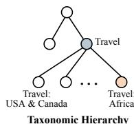
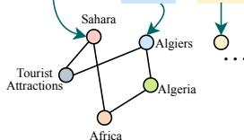
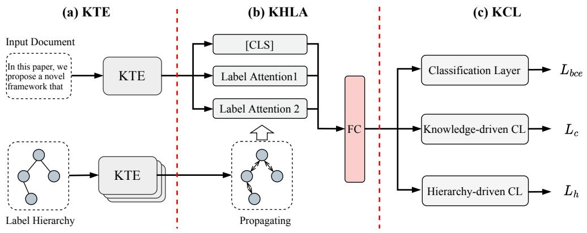
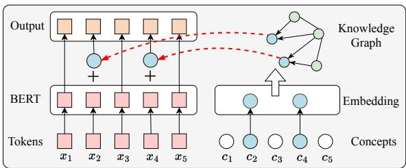
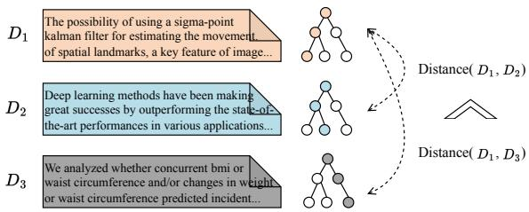
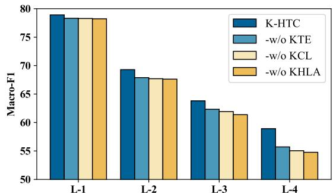
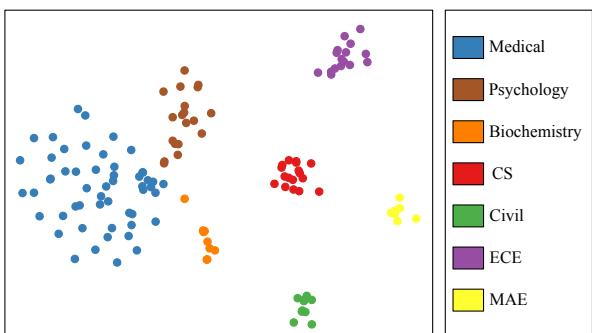

# Enhancing Hierarchical Text Classification through Knowledge Graph Integration

Ye Liu $^{1,3}$ , Kai Zhang $^{1,2,3,*}$ , Zhenya Huang $^{1,2,3}$ , Kehang Wang $^{1,3}$ , Yanghai Zhang $^{2,3}$ , Qi Liu $^{1,2,3}$ , Enhong Chen $^{1,2,3,*}$

$^{1}$ School of Data Science, University of Science and Technology of China

$^{2}$ School of Computer Science and Technology, University of Science and Technology of China

$^{3}$ State Key Laboratory of Cognitive Intelligence

{liuyer, kkzhang0808, wangkehang, apocalypticseh}@mail.ustc.edu.cn

{huangzhy,qiliuql,cheneh}@ustc.edu.cn

# Abstract

Hierarchical Text Classification (HTC) is an essential and challenging subtask of multi-label text classification with a taxonomic hierarchy. Recent advances in deep learning and pretrained language models have led to significant breakthroughs in the HTC problem. However, despite their effectiveness, these methods are often restricted by a lack of domain knowledge, which leads them to make mistakes in a variety of situations. Generally, when manually classifying a specific document to the taxonomic hierarchy, experts make inference based on their prior knowledge and experience. For machines to achieve this capability, we propose a novel Knowledge-enabled Hierarchical Text Classification model (K-HTC), which incorporates knowledge graphs into HTC. Specifically, K-HTC innovatively integrates knowledge into both the text representation and hierarchical label learning process, addressing the knowledge limitations of traditional methods. Additionally, a novel knowledge-aware contrastive learning strategy is proposed to further exploit the information inherent in the data. Extensive experiments on two publicly available HTC datasets show the efficacy of our proposed method, and indicate the necessity of incorporating knowledge graphs in HTC tasks.

# 1 Introduction

Hierarchical Text Classification (HTC), as a particular multi-label text classification problem, has been extensively applied in many real-world applications, such as book categorization (Remus et al., 2019) and scientific paper classification (Kowsari et al., 2017). In HTC, documents are tagged with multiple categories that can be structured as a tree or an acyclic graph (e.g., the taxonomic hierarchy illustrated in the bottom left of Figure 1), which poses a higher challenge than the ordinary text classification problems (Sun and Lim, 2001).

  
D: It is as vast as the USA and so arid that most bacteria cannot survive there. The author came to the Sahara to see it as its inhabitants do, riding its public transport, from Algiers to Dakar...

  
Knowledge Graph   
Figure 1: A toy example of incorporating knowledge graphs into HTC in the BGC dataset.

The existing state-of-the-art approaches for HTC (Zhou et al., 2020; Deng et al., 2021; Chen et al., 2021; Wang et al., 2022b,c) mainly focus on the representation learning from the input text and hierarchical label structure, most of which rely on the pre-trained language models (e.g., BERT (Devlin et al., 2018)). Specifically, Chen et al. (2021) adopted BERT as the encoder and proposed a matching network to mine the relative distance between texts and labels. Wang et al. (2022b) proposed a novel contrastive learning method to embed the hierarchy into BERT encoder.

Despite the success of this paradigm, approaches without domain knowledge have significant limitations and may lead to mistakes in many cases. An example of this can be observed in Figure 1, where machines may classify a document as belonging to the category Travel: USA & Canada simply based on the presence of the phrase The USA in the document. However, if machines are equipped with a relevant knowledge graph, they can mine more information from other concepts, such as Sahara and Algiers. Specifically, Sahara is part of Africa and Algiers is the capital of Algeria in Africa. Further, Sahara and Algiers are both Tourist Attractions. With the above relevant knowledge, machines will be more facilitated to make the correct inference, i.e., Travel and Travel: Africa in the taxonomic hierarchy. Nevertheless, to

the best of our knowledge, few works focused on incorporating knowledge graphs into HTC.

Indeed, many technical challenges are inherent in designing effective solutions to incorporate knowledge graphs (KGs) into HTC. First, the text and KG are organized quite differently. Text is organized as a sequence of tokens, whereas the KG is organized as a graph. How to effectively integrate KGs into popular text representation models (e.g., BERT) is an open issue. Second, compared with ordinary text classification, HTC has a more complex label structure, which provides additional prior knowledge but also poses a significant challenge for label learning and the interaction between labels and documents. Third, documents within the same category may contain more common concepts in the knowledge graph because they describe similar entities or topics, while documents in different categories do not. This provides a new entry point on how we can further leverage KGs in HTC.

In this paper, we propose a Knowledge-enabled Hierarchical Text Classification model (K-HTC) to incorporate knowledge graphs into HTC process. Specifically, we first design a Knowledge-aware Text Encoder (KTE), which can fuse the text representation and its corresponding concept representation learned from KGs at the word granularity, thereby obtaining a more comprehensive and effective representation. Subsequently, to perform label learning more effectively, we create a Knowledge-aware Hierarchical Label Attention (KHLA) module. It employs external knowledge from KGs for label representation and optimizes it based on the hierarchical structure, which further enhances the document representation via a label attention mechanism. After that, we propose a Knowledge-aware Contrastive Learning (KCL) strategy. It employs the shared knowledge concepts and hierarchical labels to learn the relationships between different documents, which can further exploit the information inherent in the data. Finally, extensive experiments on two publicly available datasets demonstrate the effectiveness of our proposed method, and further indicate the necessity to incorporate knowledge graphs, especially for the classification on deeper and more difficult levels.

# 2 Related Work

# 2.1 Hierarchical Text Classification

Hierarchical text classification is a particular multi-label text classification problem, where the docu

ments are assigned to one or more nodes of a taxonomic hierarchy (Wehrmann et al., 2018). Existing works for HTC could be categorized into local and global approaches according to their exploration strategies. The local approaches train multiple classifiers, each responsible for the corresponding local region (e.g., each label or level). For instance, Banerjee et al. (2019) trained a classifier for each label and proposed a strategy to transfer parameters of parent models to its child models. Shimura et al. (2018) designed a CNN-based method to use data in the upper levels to contribute to the categorization in the lower levels.

As for global methods, they build a single classifier for all classes, which will take the class hierarchy as a whole into account. For example, Cai and Hofmann (2004) proposed a hierarchical Support Vector Machine (SVM) algorithm based on discriminant functions. In recent years, with the rapid development of deep neural networks, many deep learning algorithms, such as Attention and Pre-trained Language Models, have been employed in HTC. Huang et al. (2019) designed an attention-based recurrent network to mine the text-class associations. Zhou et al. (2020) adopted a typical structure encoder for modeling label dependencies in both top-down and bottom-up manners. Chen et al. (2021) adopted BERT as encoder and proposed a matching network to mine the relative distance between texts and labels. Wang et al. (2022b) suggested a contrastive learning method to embed the hierarchy into BERT encoder. Wang et al. (2022c) introduced prompt learning into HTC and proposed a novel multi-label MLM perspective. Nevertheless, most of these methods ignore the relevant knowledge in the modeling process and have significant limitations in many cases.

# 2.2 Knowledge Graph

Knowledge Graph (KG) has millions of entries that describe real-world concepts (entities) like people, places and organizations. In a KG, concepts (entities) are represented as nodes, while the relations between concepts are described as edges. Recently, many knowledge graphs have been established in both academia and industry, such as ConceptNet (Speer et al., 2017), DBpedia (Lehmann et al., 2015) and Freebase (Bollacker et al., 2008).

On the basis of KGs, researchers attempt to incorporate them into many downstream application tasks and obtain significant improvements. For in

  
Figure 2: The architecture of K-HTC. It includes three parts: (a) Knowledge-aware Text Encoder (KTE); (b) Knowledge-aware Hierarchical Label Attention (KHLA); (c) Knowledge-aware Contrastive Learning (KCL).

stance, Wang et al. (2017) proposed a CNN-based text classification method, which combined internal representation and external knowledge representation from KGs. Jang et al. (2021) presented a novel knowledge-infused attention mechanism to incorporate high-level concepts into Neural Network models, achieving accurate and interpretable text classification. Lin et al. (2019) proposed a textual inference framework for question answering, which effectively utilized external structured knowledge graphs to perform explainable inferences. As far as we know, there are very few works that have attempted to incorporate knowledge graphs into HTC, making our K-HTC model a pioneering approach in this field.

# 3 Preliminaries

In this section, we first give the problem statement of incorporating KGs into HTC, and then introduce the knowledge preparation for K-HTC model.

# 3.1 Problem Statement

Given the input document $D$ and an external knowledge graph $G_{1} = (E,R,T)$ , HTC aims to predict a subset $y$ of label set $Y$ . The size of label set $Y$ is $K$ . In the knowledge graph $G_{1}$ , $E$ is the set of concepts, $R$ is the set of relations, and $T = E \times R \times E$ is the set of triples.

It is notable that the label set $Y$ is organized as an acyclic graph: $G_{2} = (Y, A)$ , where $A$ is the adjacency matrix of $Y$ . Besides, each label $y_{i} \in Y$ corresponds to a label name $L_{i}$ , which can be seen as a short text description.

# 3.2 Knowledge Preparation

In this subsection, we first identify the concepts mentioned in the input documents and label names

(Concept Recognition), and then pre-train the concept embedding (Concept Pre-training).

Concept Recognition. Given the text $x = \{x_{1}, x_{2}, \dots, x_{N}\}$ , we are expected to match its tokens to the concepts from the given knowledge graph $G_{1}$ (in this paper, we adopt the advanced KG named ConceptNet (Speer et al., 2017)). Following the strategy proposed by (Lin et al., 2019), we set rules like soft matching with lemmatization and filtering of stop words to enhance the n-gram matching performance. After that, we can obtain two sequences:

$$
\begin{array}{l} x = \left\{x _ {1}, x _ {2}, \dots , x _ {N} \right\}, \\ \begin{array}{l} c = \left\{c _ {1}, c _ {2}, \dots , c _ {N} \right\}, \end{array} \tag {1} \\ \end{array}
$$

where $x$ is the original text sequence. $c$ is matched concept sequence, which means that $c_{i}$ is the matched concept of $x_{i}$ . For n-gram concepts, we align them to the first token in its corresponding phrases in $x$ (Zhang et al., 2019). If there is no matched concept for token $x_{i}$ , we set $c_{i} = [PAD]$ .

Concept Pre-training. After the concept recognition process, we can obtain the set of concepts mentioned in the whole dataset. We retain these mentioned concepts and their related concepts (first-order neighbors) in the original knowledge graph $G_{1}$ , thus yielding a new pruned knowledge graph $G_{1}^{\prime}$ . Subsequently, we utilize the TransE (Bordes et al., 2013) model on $G_{1}^{\prime}$ to pretrain concept embedding $U \in \mathbb{R}^{N_c \times v}$ , where $N_{c}$ is the number of concepts, $v$ indicates the embedding size. This pre-trained concept embedding will be used as initialization in KTE module (Section 4.1).

  
Figure 3: Knowledge-aware Text Encoder. The white circle (i.e., $c_{1}, c_{3}, c_{5}$ ) in concepts represents [PAD].

# 4 K-HTC Model

In this section, we will introduce the technical details of K-HTC model. As Figure 2 shows, K-HTC consists of three components: 1) Knowledge-aware Text Encoder (KTE); 2) Knowledge-aware Hierarchical Label Attention (KHLA); 3) Knowledge-aware Contrastive Learning (KCL).

# 4.1 Knowledge-aware Text Encoder

In this part, we aim to obtain the knowledge-aware representation of the given text by integrating external knowledge from KGs. As illustrated in Figure 3, given a token sequence $x = \{x_{1},x_{2},\dots,x_{N}\}$ and its corresponding concept sequence $c = \{c_1,c_2,\dots,c_N\}$ , we first apply the pretrained language encoder (i.e., BERT) to compute its word semantic embedding:

$$
\left\{w _ {1}, \dots , w _ {N} \right\} = B E R T \left(\left\{x _ {1}, \dots , x _ {N} \right\}\right). \tag {2}
$$

Regarding the concept sequence $c$ , we map each concept into the embedding space via the pretrained TransE embedding $U$ :

$$
\left\{u _ {1}, \dots , u _ {N} \right\} = U \left(\left\{c _ {1}, \dots , c _ {N} \right\}\right). \tag {3}
$$

Subsequently, for each concept $c_{i}$ , we randomly select $k$ neighbors in the pruned knowledge graph $G_{1}^{\prime}$ to conduct the GraphSAGE algorithm (Hamilton et al., 2017), which can aggregate its context information in the KG:

$$
u _ {i} ^ {\prime} = \operatorname {G r a p h S A G E} \left(u _ {i}, G _ {k}\right), \tag {4}
$$

where $G_{k}$ is the context graph composed of $c_{i}$ and its $k$ neighbors, $u_{i}^{\prime}\in \mathbb{R}^{v}$ is the aggregated representation of concept $c_{i}$ . After that, we fuse the word semantic representation $w_{i}$ and its corresponding concept representation $u_{i}^{\prime}$ :

$$
\left\{m _ {1}, \dots , m _ {N} \right\} = \left\{w _ {1} + u _ {1} ^ {\prime}, \dots , w _ {N} + u _ {N} ^ {\prime} \right\}, \tag {5}
$$

where $+$ refers to the point-wise addition. We call $\{m_1,\dots,m_N\}$ as knowledge-aware representation.

# 4.2 Knowledge-aware Hierarchical Label Attention

In this part, we first learn the label representation via external knowledge and taxonomic hierarchy, and then conduct label attention to obtain the class-enhanced document representation.

Label Representation Learning. With the Knowledge-aware Text Encoder (KTE), we can obtain the knowledge-aware representation of hierarchical labels via their label names:

$$
R _ {l} ^ {i} = \operatorname {m e a n} \left(K T E \left(L _ {i}\right)\right), i = 1, \dots , K, \tag {6}
$$

$$
R _ {l} = [ R _ {l} ^ {1}, R _ {l} ^ {2}, \dots , R _ {l} ^ {K} ],
$$

where $L_{i}$ is the name of label $i$ , $R_{l}^{i}\in \mathbb{R}^{v}$ is the representation of label $i$ , while $R_{l}\in \mathbb{R}^{K\times v}$ indicates the representation of all labels.

Then, we adopt GCN layer to propagate the representation of labels on the label hierarchy graph $G_{2}$ . Specifically, it takes the feature matrix $H^{(l)}$ and the matrix $\widetilde{A}$ as input, and updates the embedding of the labels by utilizing the information of adjacent labels:

$$
H ^ {(l + 1)} = \sigma \left(\widetilde {D} ^ {- \frac {1}{2}} \widetilde {A} \widetilde {D} ^ {- \frac {1}{2}} H ^ {(l)} W ^ {(l)}\right), \tag {7}
$$

where $\widetilde{A} = A + I$ , $A$ is the adjacency matrix of $G_{2}$ , $I$ is the identity matrix, $\widetilde{D} = \sum_{i}\widetilde{A}_{ij}$ , and $W^{(l)}$ is a layer-specific trainable weight matrix. $\sigma$ denotes a non-linear activation function (e.g., ReLU). We set $H^{(0)} = R_{l}$ , and the last hidden layer is used as the propagated label representation, i.e., $H = H^{(l + 1)}\in \mathbb{R}^{K\times v}$

Label Attention. After that, we apply the propagated label representation $H$ to perform $K$ different classes of attention to the input document:

$$
R _ {d} = K T E (D),
$$

$$
O = \tanh  \left(W _ {o} \cdot R _ {d} ^ {T}\right), \tag {8}
$$

$$
W _ {a t t} = \operatorname {s o f t m a x} (H \cdot O),
$$

where $D$ is the input document, $R_{d} \in \mathbb{R}^{N \times v}$ is the knowledge-aware representation of $D$ . $W_{o} \in \mathbb{R}^{v \times v}$ is a randomly initialized weight matrix, and the softmax() ensures all the computed weights sum up to 1 for each category. $W_{att} \in \mathbb{R}^{K \times N}$ denotes the attention matrix.

Subsequently, we compute weighted sums by multiplying the attention matrix $W_{att}$ and the document representation $R_{d}$ :

$$
M _ {1} = \operatorname {m e a n} \left(W _ {\text {a t t}} \cdot R _ {d}\right), \tag {9}
$$

where $M_1 \in \mathbb{R}^v$ represents the class-enhanced representation for the document.

Furthermore, inspired by (Wang et al., 2022b), we utilize another randomly initialized label embedding $H_{2} \in \mathbb{R}^{K \times v}$ to perform the same operation in Eq.(8-9) and obtain another class-enhanced document representation $M_{2}$ . Finally, we concat the $M_{1}, M_{2}$ and the [CLS] representation from BERT encoder as the final representation:

$$
R _ {c a t} = \operatorname {c o n c a t} \left(M _ {1}, M _ {2}, H _ {[ C L S ]}\right), \tag {10}
$$

$$
R _ {f} = W _ {f} \cdot R _ {c a t} + b _ {f},
$$

where $W_{f}\in \mathbb{R}^{v\times 3v}$ is a randomly initialized weight matrix, $b_{f}\in \mathbb{R}^{v}$ is corresponding bias vector, $R_{f}\in \mathbb{R}^{v}$ is the final document representation.

# 4.3 Knowledge-aware Contrastive Learning

As we discussed in Section 1, the documents in the same category may share more concepts in the knowledge graph, while documents in different categories do not (more analysis about this phenomenon can be found in Appendix A). Therefore, we propose a contrastive learning strategy to further exploit the information inherent in the data. Specifically, we design this from both knowledge-driven and hierarchy-driven perspectives.

Knowledge-driven CL. In this part, we aim to close the distance between documents that share more concepts in the knowledge graph. Specifically, inspired by (Wang et al., 2022a), in a minibatch of size $b$ , we define a function to output all other instances for a specific instance $i$ : $g(i) = \{k|k \in \{1,2,\dots,b\}, k \neq i\}$ . Then the knowledge-driven contrastive loss for each instance pair $(i,j)$ can be calculated as:

$$
L _ {c} ^ {i j} = - \beta_ {i j} \log \frac {e ^ {- d \left(z _ {i} , z _ {j}\right) / \tau}}{\sum_ {k \in g (i)} e ^ {- d \left(z _ {i} , z _ {k}\right) / \tau}}, \tag {11}
$$

$$
c _ {i j} = \left| C _ {i} \cap C _ {j} \right|, \quad \beta_ {i j} = \frac {c _ {i j}}{\sum_ {k \in g (i)} c _ {i k}}, \tag {12}
$$

where $\tau$ is the temperature of contrastive learning, $d(\cdot ,\cdot)$ is the euclidean distance and $z_{i}$ represents the final representation $R_{f}$ of document $i$ . $C_i$ is the concept set in document $i$ , $c_{ij}$ indicates the number of shared concepts in document $i$ and $j$ , and $\beta_{ij}$ is the normalization of $c_{ij}$ .

The contrastive loss for the whole mini-batch is the sum of all the instance pairs: $L_{c} = \sum_{i}\sum_{j\in g(i)}L_{c}^{ij}$ . With this contrastive loss, for an instance pair $(i,j)$ , the more concepts they share,

  
Figure 4: The illustration of the hierarchy-driven contrastive learning.

the larger the weight $\beta_{ij}$ will become, thus increasing the value of their loss term $L_c^{ij}$ . In consequence, their distance $d(z_i,z_j)$ will become closer. On the contrary, if they share fewer concepts, their distance $d(z_i,z_j)$ will be optimized relatively farther.

Hierarchy-driven CL. In addition to the knowledge-driven CL, we can optimize the document representation via hierarchical label structure. As illustrated in Figure 4, document $D_{1}$ and $D_{2}$ share two labels in the hierarchy, while $D_{1}$ and $D_{3}$ only share one. Naturally, the distance between $D_{1}$ and $D_{2}$ should be closer than that between $D_{1}$ and $D_{3}$ . From this perspective, in a mini-batch, we calculate the number of shared labels between document $i$ and $j$ :

$$
l _ {i j} = \left| Y _ {i} \cap Y _ {j} \right|, \tag {13}
$$

where $Y_{i}$ means the label set of document $i$ . Then, we use $l_{ij}$ to replace $c_{ij}$ in Eq.(12), and further calculate another contrastive loss $L_h^{ij}$ following Eq.(11). After that, we sum this loss across the whole mini-batch and obtain the hierarchy-driven contrastive loss $L_{h} = \sum_{i}\sum_{j\in g(i)}L_{h}^{ij}$ .

# 4.4 Output Layer

Output Classifier. Following the previous work (Zhou et al., 2020), in the output layer, we flatten the hierarchy for multi-label classification. We feed the final document representation $R_{f}$ in Eq.(10) to a two-layer classifier:

$$
Q = \varphi \left(W _ {q} \cdot R _ {f} + b _ {q}\right), \tag {14}
$$

$$
P = \sigma \left(W _ {p} \cdot Q + b _ {p}\right),
$$

where $W_{q}\in \mathbb{R}^{v\times v},W_{p}\in \mathbb{R}^{K\times v}$ are randomly initialized weight matrices, $b_{q}\in \mathbb{R}^{v},b_{p}\in \mathbb{R}^{K}$ are corresponding bias vectors, $\varphi$ is a non-linear activation function (e.g.,ReLU), while $\sigma$ is the sigmoid activation. $P$ is a continuous vector and each element in this vector $P_{i}$ denotes the probability that the document belongs to category $i$ .

Table 1: The data statistics of BGC and WOS datasets.   

<table><tr><td>Statistics</td><td>BGC</td><td>WOS</td></tr><tr><td># total categories</td><td>146</td><td>141</td></tr><tr><td># hierarchical levels</td><td>4</td><td>2</td></tr><tr><td># avg categories per instance</td><td>3.01</td><td>2.0</td></tr><tr><td># train instance</td><td>58,715</td><td>30,070</td></tr><tr><td># dev instance</td><td>14,785</td><td>7,518</td></tr><tr><td># test instance</td><td>18,394</td><td>9,397</td></tr></table>

Training. For multi-label classification, we choose the binary cross-entropy loss function for document $i$ on label $j$ :

$$
L _ {b c e} ^ {i j} = - y _ {i j} \log (p _ {i j}) - (1 - y _ {i j}) \log (1 - p _ {i j}), \tag {15}
$$

$$
L _ {b c e} = \sum_ {i} \sum_ {j = 1} ^ {K} L _ {b c e} ^ {i j}, \tag {16}
$$

where $p_{ij}$ is the prediction score, $y_{ij}$ is the ground truth. The final loss is the combination of the classification loss and the two constrastive losses:

$$
L = L _ {b c e} + \lambda_ {c} L _ {c} + \lambda_ {h} L _ {h}, \tag {17}
$$

where $\lambda_{c}$ and $\lambda_{h}$ are hyperparameters that control the weights of two contrastive losses.

# 5 Experiment

# 5.1 Experiment Setup

Datasets and Evaluation Metrics. We conduct experiments on the BlurbGenreCollection-EN $(\mathrm{BGC})^{1}$ and Web-of-Science $(\mathrm{WOS})^{2}$ (Kowsari et al., 2017) datasets. BGC consists of advertising descriptions of books, while WOS contains abstracts of published papers from Web of Science. More statistics about the datasets are illustrated in Table 1. As for the knowledge graph, we adopt the advanced knowledge graph named ConceptNet (Speer et al., 2017).

We measure the experimental results with standard evaluation metrics (Gopal and Yang, 2013; Liu et al., 2020; Zhang et al., 2022), including Macro-Precision, Macro-Recall, Macro-F1 and Micro-F1.

Implementation Details. In the Knowledge Pretraining part, we utilize OpenKE (Han et al., 2018)

to train concept embedding via TransE. The dimension of TransE embedding is set to 768.

We adopt bert-base-uncased from Transformers (Wolf et al., 2020) as the base architecture. In KTE module, when we conduct GraphSAGE to aggregate the neighbor information to concepts, we set the neighbor num $k = 3$ for each concept. We choose the mean aggregator as the aggregation function of GraphSAGE and the layer is set to 1. In KHLA module, the layer of GCN is set to 1. In KCL module, we set the contrastive learning temperature $\tau = 10$ for knowledge-driven CL, while $\tau = 1$ for hierarchy-driven CL. The dimension of hidden states is set to $v = 768$ in this paper. As for the loss weight in Eq.(17), $\lambda_h$ is set to $1e - 4$ on both BGC and WOS, while $\lambda_c$ is set to $1e - 3$ on BGC and $1e - 2$ on WOS $^3$ .

The batch size is set to 16, and our model is optimized by Adam (Kingma and Ba, 2014) with a learning rate of $2e - 5$ . We train the model with train set and evaluate on development set after every epoch, and stop training if the Macro-F1 does not increase for 10 epochs. We run all experiments on a Linux server with two 3.00GHz Intel Xeon Gold 5317 CPUs and one Tesla A100 GPU4.

Benchmark Methods. We compare K-HTC with the state-of-the-art HTC methods.

- HiAGM $^{5}$ (Zhou et al., 2020) exploits the prior probability of label dependencies through a GCN-based structure encoder.   
- HTCInfoMax $^{6}$ (Deng et al., 2021) considers the text-label mutual information maximization and label prior matching in HTC.   
- HiMatch7 (Chen et al., 2021) mines the relative distance between texts and labels, which also provides a plus version based on BERT.   
- HGCLR $^{8}$ (Wang et al., 2022b) designs a contrastive learning method to embed the hierarchy into the BERT encoder.   
- HPT $^9$ (Wang et al., 2022c) introduces prompt learning into HTC problem, which proposes a novel multi-label MLM perspective.

Table 2: Experimental results of our proposed method on the BGC and WOS datasets. For fair comparison, we implement some baselines with BERT encoder. We follow their publicly released codes to obtain the results.   

<table><tr><td rowspan="2">Methods</td><td colspan="4">BGC</td><td colspan="4">WOS</td></tr><tr><td>Precision</td><td>Recall</td><td>Macro-F1</td><td>Micro-F1</td><td>Precision</td><td>Recall</td><td>Macro-F1</td><td>Micro-F1</td></tr><tr><td colspan="9">Hierarchy-Aware Methods</td></tr><tr><td>HiAGM</td><td>57.41</td><td>53.45</td><td>54.71</td><td>74.49</td><td>82.77</td><td>78.12</td><td>80.05</td><td>85.95</td></tr><tr><td>HTCInfoMax</td><td>61.58</td><td>52.38</td><td>55.18</td><td>73.52</td><td>80.90</td><td>77.27</td><td>78.64</td><td>84.65</td></tr><tr><td>HiMatch</td><td>59.50</td><td>52.88</td><td>55.08</td><td>74.98</td><td>83.26</td><td>77.94</td><td>80.09</td><td>86.04</td></tr><tr><td colspan="9">Pre-trained Language Methods</td></tr><tr><td>HiAGM+BERT</td><td>65.61</td><td>61.79</td><td>62.98</td><td>78.62</td><td>81.81</td><td>78.86</td><td>80.09</td><td>85.83</td></tr><tr><td>HTCInfoMax+BERT</td><td>65.47</td><td>62.15</td><td>62.87</td><td>78.47</td><td>79.95</td><td>79.59</td><td>79.33</td><td>85.18</td></tr><tr><td>HiMatch+BERT</td><td>64.67</td><td>62.05</td><td>62.62</td><td>79.23</td><td>82.29</td><td>80.00</td><td>80.92</td><td>86.46</td></tr><tr><td>KW-BERT</td><td>66.39</td><td>62.68</td><td>63.72</td><td>79.24</td><td>82.88</td><td>78.75</td><td>80.30</td><td>86.19</td></tr><tr><td>HGCLR</td><td>67.65</td><td>61.28</td><td>63.64</td><td>79.36</td><td>83.67</td><td>79.30</td><td>81.02</td><td>87.01</td></tr><tr><td>HPT</td><td>70.27</td><td>62.70</td><td>65.33</td><td>80.72</td><td>83.71</td><td>79.74</td><td>81.10</td><td>86.82</td></tr><tr><td>K-HTC (ours)</td><td>71.26</td><td>63.31</td><td>65.99</td><td>80.52</td><td>84.15</td><td>80.01</td><td>81.69</td><td>87.29</td></tr></table>

- KW-BERT (Jang et al., 2021) is the advanced text classification method that incorporates knowledge graphs, which also adopts BERT as the text encoder.

Among these baselines, only HiAGM and HTCInfoMax do not adopt the BERT encoder. For fair comparison, we implement them with BERT encoder, and denote them as HiAGM+BERT and HTCInfoMax+BERT.

# 5.2 Experimental Result

The main results are shown in Table 2. Our proposed K-HTC method outperforms all baselines in all metrics, except for HPT in Micro-F1 on the BGC dataset, which proves the effectiveness of our method and the necessity to incorporate knowledge graphs. Moreover, there are also some interesting phenomena from these results:

First, the differences between the hierarchy-aware methods (i.e., HiAGM, HTCInfoMax and HiMatch) and their BERT-variants are more pronounced on BGC than on WOS. In detail, The depth of WOS is 2, and each document is labeled with one label on each level. However, the depth of BGC is 4, and the number of labels per document is unfixed10. As a result, the BGC dataset is more difficult than WOS, and it may be more conducive to the role of BERT. Another consideration is the pre-trained corpora of BERT. One of the pre-trained datasets of BERT is BookCorpus (Zhu

et al., 2015), which is the same document type as BGC. This also plays a great role in improving the model's effectiveness. Second, with the help of the external KG and the proposed knowledge-infused attention mechanism, KW-BERT achieves good results on both two datasets as well. However, it performs relatively poorly compared with K-HTC, which demonstrates the effectiveness of our model design from another perspective. Third, although HPT achieves a slight ahead over K-HTC in MicroF1 on the BGC dataset, it regresses obviously on other metrics. In detail, Micro-F1 directly takes all the instances into account, while Macro-F1 gives equal weight to each class in the averaging process. For the multi-label classification with complex label structures, Macro-F1 is harder and more differentiated, which can better reflect the model capability. We further conduct the significance test in Appendix B.

# 5.3 Ablation Study

In this subsection, we conduct ablation experiments to prove the effectiveness of different components of K-HTC model. We disassemble K-HTC by removing the KTE, KHLA, and KCL modules in turn. In particular, removing KTE indicates that the text encoder degenerates to the traditional BERT encoder. After removing KHLA, K-HTC pays little attention on the interaction between documents and labels, and thus we directly conduct mean pooling on the output of KTE to obtain the final representation $R_{f}$ of the document. Finally, omitting KCL means that we directly omit two contrastive losses

Table 3: Ablation experiments on the BGC dataset.   

<table><tr><td>Ablation Models</td><td>Macro-F1</td><td>Micro-F1</td></tr><tr><td>K-HTC</td><td>65.99</td><td>80.52</td></tr><tr><td>-w/o KTE</td><td>64.38</td><td>79.29</td></tr><tr><td>-w/o KHLA</td><td>63.63</td><td>78.82</td></tr><tr><td>-w/o KCL</td><td>64.02</td><td>79.43</td></tr></table>

Table 4: Ablation experiments on the WOS dataset.   

<table><tr><td>Ablation Models</td><td>Macro-F1</td><td>Micro-F1</td></tr><tr><td>K-HTC</td><td>81.69</td><td>87.29</td></tr><tr><td>-w/o KTE</td><td>80.57</td><td>86.29</td></tr><tr><td>-w/o KHLA</td><td>80.04</td><td>86.46</td></tr><tr><td>-w/o KCL</td><td>80.18</td><td>86.38</td></tr></table>

in Eq.(17) in the training process.

The results on the BGC and WOS datasets are listed in Table 3 and Table 4, respectively. From these statistics, we can find that there are obvious decreases in all ablation variants, which thoroughly demonstrates the validity and non-redundancy of our K-HTC method. Additionally, on the BGC dataset, the importance of KHLA module is relatively stronger than other modules. It is reasonable as BGC has a more complicated label hierarchy, which puts higher demands for label learning and the interaction between the documents and labels.

# 5.4 Effect of Knowledge on Different Levels

To further verify the effect of incorporating knowledge, we analyze the performance of K-HTC and its ablation variants on different levels of the BGC dataset. Specifically, BGC has four levels of labels, with the granularity of classification getting finer from top to bottom. Figure 5 deposits the performance comparison on different levels. It is clear that as the level deepens, the performance of all methods decreases, indicating the classification difficulty increases significantly. At the same time, the gap between K-HTC and its ablation variants widens as the depth increases. This suggests that incorporating knowledge can help improve the classification effectively, especially for these deeper and more difficult levels. Furthermore, the situation is more evident in the comparison between K-HTC and its variant -w/o KHLA, which is consistent with the analysis in Section 5.3.

  
Figure 5: The Macro-F1 performance of different levels on the BGC dataset.

Table 5: Hyperparameter study on the WOS dataset.   

<table><tr><td>No.</td><td>λc</td><td>λh</td><td>Macro-F1</td><td>Micro-F1</td></tr><tr><td colspan="5">K-HTC</td></tr><tr><td>①</td><td>10-2</td><td>10-4</td><td>81.69</td><td>87.29</td></tr><tr><td colspan="5">Fine-tuning λc</td></tr><tr><td>②</td><td>10-1</td><td>10-4</td><td>80.14</td><td>86.17</td></tr><tr><td>③</td><td>10-3</td><td>10-4</td><td>81.01</td><td>86.90</td></tr><tr><td>④</td><td>10-4</td><td>10-4</td><td>80.60</td><td>86.71</td></tr><tr><td colspan="5">Fine-tuning λh</td></tr><tr><td>⑤</td><td>10-2</td><td>10-1</td><td>77.55</td><td>85.40</td></tr><tr><td>⑥</td><td>10-2</td><td>10-2</td><td>81.04</td><td>86.78</td></tr><tr><td>⑦</td><td>10-2</td><td>10-3</td><td>80.97</td><td>86.84</td></tr><tr><td>⑧</td><td>10-2</td><td>10-5</td><td>80.96</td><td>86.55</td></tr></table>

# 5.5 Parameter Sensitivity

To study the influence of the loss hyperparameters $\lambda_{c}$ and $\lambda_{h}$ in K-HTC, we conduct comprehensive parameter sensitivity experiments on the WOS dataset. The results are reported in Table 5.

The first experiment is the best hyperparameters of our model. In experiment $2 \sim 4$ , we fix $\lambda_{h}$ and fine-tune $\lambda_{c}$ ; in experiment $5 \sim 8$ , $\lambda_{c}$ is fixed and $\lambda_{h}$ is fine-tuned. From the results, we find that the larger or smaller $\lambda_{c}$ will lead to an obvious decrease on the classification performance. The same situation happens to $\lambda_{h}$ . It is reasonable as these two hyperparameters control the weights of two contrastive losses. Too large weight will affect the original BCE classification loss, while too small weight will restrict its own effect.

# 5.6 Case Study

To further illustrate the effect of incorporating knowledge graphs in the K-HTC model, we conduct case study on both WOS and BGC datasets. Specifically, in Figure 6 and 7, we present the in

Figure 6: The case study of K-HTC on the WOS dataset. The document is tagged with two labels in the taxonomic hierarchy.   

<table><tr><td colspan="2">Document:
Multilevel Spin Toque Transfer RAM (STT-RAM) is a suitable storage device for energy-efficient neural network accelerators (nnas), which relies on large-capacity on-chip memory to support brain-inspired large-scale learning models from conventional artificial neural networks to current popular deep convolutional neural networks...</td></tr><tr><td colspan="2">Relevant Knowledge:
(Convolutional_Neural_Network, related_to, Neural_Network)
(Neural_Network, is_a, Machine_Learning)
(Neural_Network, related_to, Computer)
(Artificial_Neural_Network, related_to, Machine_Learning)</td></tr><tr><td>Ground Truth:
1. Computer Science
2. Machine Learning</td><td>Prediction:
1. Computer Science
2. Machine Learning</td></tr></table>

Figure 7: The case study of K-HTC on the BGC dataset. The document is tagged with three labels in the taxonomic hierarchy.   

<table><tr><td colspan="2">Document:
In this completely updated and revised guide to Vietnam, the author&#x27;s enthusiasm for his adopted country is clear in his coverage of all of major sites, including the southern central highlands, the vast Mekong delta ... Experiential sidebars that guide you to get to know Vietnam more intimately, including where to see water puppets, train trips to trail mat, and the new beaches to visit.</td></tr><tr><td colspan="2">Relevant Knowledge:
(Vietnam, related_to, Southeast_Asia)
(Mekong, related_to, Asia)
(Trip, related_to, Travel)
(Visit, related_to, Travel_To)</td></tr><tr><td>Ground Truth:
1. Nonfiction
2. Travel
3. Travel: Asia</td><td>Prediction:
1. Nonfiction
2. Travel
3. Travel: Asia</td></tr></table>

put document, the knowledge retrieved from KG, the ground truth and the prediction of K-HTC, respectively. As shown in Figure 6, with the help of the knowledge (Neural_Network, is_a, Machine_Learning) and (Neural_Network, related_to, Computer), K-HTC reasonably makes the correct inference, i.e., Computer Science and Machine Learning in the taxonomic hierarchy. A similar situation can be found in the case of Figure 7 as well. These intuitively demonstrate the great role of knowledge and further verify the validity of our K-HTC method.

More experimental analyses, such as Visualization and Bad Case Analysis, can be found in Appendix C and D.

# 6 Conclusions

In this paper, we explored a motivated direction for incorporating the knowledge graph into hierarchical text classification. We first analyzed the necessity to integrate knowledge graphs and further proposed a Knowledge-enabled Hierarchical Text Classification model (K-HTC). Specifically, we designed a knowledge-aware text encoder, which could fuse the text representation and its corresponding concept representation learned from KGs. Subsequently, a knowledge-aware hierarchical label attention module was designed to model the interaction between the documents and hierarchical labels. More importantly, we proposed a knowledge-aware contrastive learning strategy, which could further boost the classification performance by exploiting the information inherent in the data. Finally, extensive experiments on two publicly available HTC datasets demonstrated the effectiveness of our proposed method. We hope our work will lead to more future studies.

# Limitations

In our proposed K-HTC method, incorporating the knowledge graph requires the concept recognition and pre-training process, as we introduced in Section 3.2. This process may consume additional time compared with other HTC methods, but it can be done in advance and does not need to be repeated, making it suitable for both research and industrial settings. Besides, due to the errors of concept recognition algorithms, this process may introduce some noisy information in reality. This will interfere with the use of knowledge. In future work, we will attempt to utilize entity linking algorithms (Wang et al., 2023) to further guarantee the quality of recognized knowledge.

Another limitation is that we utilize the label name in the KHLA module. It may not be available for some datasets with only label ids. In response to this, we can select high-frequency keywords from documents in each category, which play the same role as the label name.

# Acknowledgements

This research was partially supported by grants from the National Natural Science Foundation of China (Grants No. U20A20229, No. 62106244), and the National Education Examinations Authority (Grant No. GJK2021009).

# References

Siddhartha Banerjee, Cem Akkaya, Francisco Perez-Sorrosal, and Kostas Tsioutsiouliklis. 2019. Hierarchical transfer learning for multi-label text classification. In Proceedings of the 57th Annual Meeting of the Association for Computational Linguistics, pages 6295-6300.   
Kurt Bollacker, Colin Evans, Praveen Paritosh, Tim Sturge, and Jamie Taylor. 2008. Freebase: a collaboratively created graph database for structuring human knowledge. In Proceedings of the 2008 ACM SIGMOD international conference on Management of data, pages 1247-1250.   
Antoine Bordes, Nicolas Usunier, Alberto Garcia-Duran, Jason Weston, and Oksana Yakhnenko. 2013. Translating embeddings for modeling multi-relational data. Advances in neural information processing systems, 26.   
Lijuan Cai and Thomas Hofmann. 2004. Hierarchical document categorization with support vector machines. In Proceedings of the thirteenth ACM international conference on Information and knowledge management, pages 78-87.   
Haibin Chen, Qianli Ma, Zhenxi Lin, and Jiangyue Yan. 2021. Hierarchy-aware label semantics matching network for hierarchical text classification. In Proceedings of the 59th Annual Meeting of the Association for Computational Linguistics and the 11th International Joint Conference on Natural Language Processing (Volume 1: Long Papers), pages 4370-4379.   
Zhongfen Deng, Hao Peng, Dongxiao He, Jianxin Li, and S Yu Philip. 2021. Htcinfomax: A global model for hierarchical text classification via information maximization. In Proceedings of the 2021 Conference of the North American Chapter of the Association for Computational Linguistics: Human Language Technologies, pages 3259-3265.   
Jacob Devlin, Ming-Wei Chang, Kenton Lee, and Kristina Toutanova. 2018. Bert: Pre-training of deep bidirectional transformers for language understanding. arXiv preprint arXiv:1810.04805.   
Siddharth Gopal and Yiming Yang. 2013. Recursive regularization for large-scale classification with hierarchical and graphical dependencies. In Proceedings of the 19th ACM SIGKDD international conference on Knowledge discovery and data mining, pages 257-265.   
Will Hamilton, Zhitao Ying, and Jure Leskovec. 2017. Inductive representation learning on large graphs. Advances in neural information processing systems, 30.   
Xu Han, Shulin Cao, Xin Lv, Yankai Lin, Zhiyuan Liu, Maosong Sun, and Juanzi Li. 2018. Openke: An open toolkit for knowledge embedding. In Proceedings of the 2018 conference on empirical methods in natural language processing: system demonstrations, pages 139-144.

Wei Huang, Enhong Chen, Qi Liu, Yuying Chen, Zai Huang, Yang Liu, Zhou Zhao, Dan Zhang, and Shijin Wang. 2019. Hierarchical multi-label text classification: An attention-based recurrent network approach. In Proceedings of the 28th ACM international conference on information and knowledge management, pages 1051-1060.   
Hyeju Jang, Seojin Bang, Wen Xiao, Giuseppe Carenini, Raymond Ng, and Young ji Lee. 2021. Kw-attn: Knowledge infused attention for accurate and interpretable text classification. In Proceedings of Deep Learning Inside Out (DeeLIO): The 2nd Workshop on Knowledge Extraction and Integration for Deep Learning Architectures, pages 96-107.   
Diederik P Kingma and Jimmy Ba. 2014. Adam: A method for stochastic optimization. arXiv preprint arXiv:1412.6980.   
Kamran Kowsari, Donald E Brown, Mojtaba Heidarysafa, Kiana Jafari Meimandi, Matthew S Gerber, and Laura E Barnes. 2017. HdtTex: Hierarchical deep learning for text classification. In 2017 16th IEEE international conference on machine learning and applications (ICMLA), pages 364-371. IEEE.   
Jens Lehmann, Robert Isele, Max Jakob, Anja Jentzsch, Dimitris Kontokostas, Pablo N Mendes, Sebastian Hellmann, Mohamed Morsey, Patrick Van Kleef, Soren Auer, et al. 2015. Dbpedia-a large-scale, multilingual knowledge base extracted from wikipedia. Semantic web, 6(2):167-195.   
Bill Yuchen Lin, Xinyue Chen, Jamin Chen, and Xiang Ren. 2019. Kagnet: Knowledge-aware graph networks for commonsense reasoning. In Proceedings of the 2019 Conference on Empirical Methods in Natural Language Processing and the 9th International Joint Conference on Natural Language Processing (EMNLP-IJCNLP), pages 2829-2839.   
Ye Liu, Han Wu, Zhenya Huang, Hao Wang, Jianhui Ma, Qi Liu, Enhong Chen, Hanqing Tao, and Ke Rui. 2020. Technical phrase extraction for patent mining: A multi-level approach. In 2020 IEEE International Conference on Data Mining (ICDM), pages 1142-1147. IEEE.   
Steffen Remus, Rami Aly, and Chris Biemann. 2019. Germeval 2019 task 1: Hierarchical classification of blurbs. In KONVENS.   
Kazuya Shimura, Jiyi Li, and Fumiyo Fukumoto. 2018. Hft-cnn: Learning hierarchical category structure for multi-label short text categorization. In Proceedings of the 2018 Conference on Empirical Methods in Natural Language Processing, pages 811-816.   
Robyn Speer, Joshua Chin, and Catherine Havasi. 2017. Conceptnet 5.5: An open multilingual graph of general knowledge. In *Thirty-first AAAI conference on artificial intelligence*.

Aixin Sun and Ee-Peng Lim. 2001. Hierarchical text classification and evaluation. In Proceedings 2001 IEEE International Conference on Data Mining, pages 521-528. IEEE.

Jin Wang, Zhongyuan Wang, Dawei Zhang, and Jun Yan. 2017. Combining knowledge with deep convolutional neural networks for short text classification. In *IJCAI*, volume 350, pages 3172077–3172295.

Kehang Wang, Qi Liu, Kai Zhang, Ye Liu, Hanqing Tao, Zhenya Huang, and Enhong Chen. 2023. Class-dynamic and hierarchy-constrained network for entity linking. In Database Systems for Advanced Applications: 28th International Conference, DASFAA 2023, Tianjin, China, April 17-20, 2023, Proceedings, Part II, pages 622-638. Springer.

Ran Wang, Xinyu Dai, et al. 2022a. Contrastive learning-enhanced nearest neighbor mechanism for multi-label text classification. In Proceedings of the 60th Annual Meeting of the Association for Computational Linguistics (Volume 2: Short Papers), pages 672-679.

Zihan Wang, Peiyi Wang, Lianzhe Huang, Xin Sun, and Houfeng Wang. 2022b. Incorporating hierarchy into text encoder: a contrastive learning approach for hierarchical text classification. In Proceedings of the 60th Annual Meeting of the Association for Computational Linguistics (Volume 1: Long Papers), pages 7109-7119.

Zihan Wang, Peiyi Wang, Tianyu Liu, Binghuai Lin, Yunbo Cao, Zhifang Sui, and Houfeng Wang. 2022c. Hpt: Hierarchy-aware prompt tuning for hierarchical text classification. In Proceedings of the 2022 Conference on Empirical Methods in Natural Language Processing (EMNLP). Association for Computational Linguistics.

Jonatas Wehrmann, Ricardo Cerri, and Rodrigo Barros. 2018. Hierarchical multi-label classification networks. In International conference on machine learning, pages 5075-5084. PMLR.

Thomas Wolf, Lysandre Debut, Victor Sanh, Julien Chaumond, Clement Delangue, Anthony Moi, Pierric Cistac, Tim Rault, Remi Louf, Morgan Funtowicz, et al. 2020. Transformers: State-of-the-art natural language processing. In Proceedings of the 2020 conference on empirical methods in natural language processing: system demonstrations, pages 38-45.

Kai Zhang, Kun Zhang, Mengdi Zhang, Hongke Zhao, Qi Liu, Wei Wu, and Enhong Chen. 2022. Incorporating dynamic semantics into pre-trained language model for aspect-based sentiment analysis. In *Findings of the Association for Computational Linguistics: ACL* 2022, pages 3599-3610.

Zhengyan Zhang, Xu Han, Zhiyuan Liu, Xin Jiang, Maosong Sun, and Qun Liu. 2019. Ernie: Enhanced language representation with informative entities. In

Proceedings of the 57th Annual Meeting of the Association for Computational Linguistics, pages 1441-1451.

Jie Zhou, Chunping Ma, Dingkun Long, Guangwei Xu, Ning Ding, Haoyu Zhang, Pengjun Xie, and Gongshen Liu. 2020. Hierarchy-aware global model for hierarchical text classification. In Proceedings of the 58th Annual Meeting of the Association for Computational Linguistics, pages 1106-1117.

Yukun Zhu, Ryan Kiros, Rich Zemel, Ruslan Salakhutdinov, Raquel Urtasun, Antonio Torralba, and Sanja Fidler. 2015. Aligning books and movies: Towards story-like visual explanations by watching movies and reading books. In Proceedings of the IEEE international conference on computer vision, pages 19-27.

# A Data Analysis

Table 6: The average number of shared concepts between two arbitrary documents in the same category. "Total" refers to the shared concept situation across the whole dataset.   

<table><tr><td>Hierarchical Level</td><td>BGC</td><td>WOS</td></tr><tr><td>L-1</td><td>4.29</td><td>5.82</td></tr><tr><td>L-2</td><td>4.93</td><td>8.00</td></tr><tr><td>L-3</td><td>5.96</td><td>-</td></tr><tr><td>L-4</td><td>5.94</td><td>-</td></tr><tr><td>Total</td><td>3.12</td><td>4.87</td></tr></table>

We calculate the average number of shared concepts between two arbitrary documents in the same category. Table 6 illustrates this situation on different levels. The "Total" line reports the average number of shared concepts between two arbitrary documents across the whole dataset, which can be adopted as the comparison standard.

We could find that the shared concepts increase as the depth deepens, except for a slight fluctuation on the fourth level of BGC. Besides, the results on different levels are all significantly larger than the "Total" line. These findings provide valid support for the Knowledge-aware Contrastive Learning (KCL) module in Section 4.3.

# B Significance Analysis

Table 7: P-value between K-HTC and HPT   

<table><tr><td>Methods</td><td>BGC</td><td>WOS</td></tr><tr><td>K-HTC / HPT</td><td>0.046</td><td>0.016</td></tr></table>

In Table 2, the experimental results of our K-HTC model and HPT are relatively close. To better demonstrate the superiority of K-HTC, we do the Student t-test to clarify whether K-HTC performs better than HPT. Specifically, we repeat the experiment five times with different seeds on both BGC and WOS datasets, and report the p-value results on Macro-F1. From the results in Table 7, we find that both two results are smaller than the significance level 0.05. Therefore, we reject the hypothesis that the performances between K-HTC and HPT are approximate. It suggests that K-HTC is more effective than HPT in most circumstances.

C Visualization

  
Figure 9: The bad case of K-HTC on the BGC dataset. The document is tagged with three labels in the taxonomic hierarchy.

Figure 8: T-SNE visualization of the label representation on the WOS dataset. Dots with the same color indicate labels with the same parent label.

In K-HTC, we design a Knowledge-aware Hierarchical Label Attention (KHLA) module to learn the label representation, which can further mine the interaction between documents and labels. In the hierarchical label structure, it is expected that labels with the same parent have more similar representations than those with different parents. To verify this, we plot the T-SNE projections of the learned label embedding (i.e., $H$ learned from Eq.(7)) on the WOS dataset. Specifically, the depth of the WOS label hierarchy is 2. In Figure 8, the left part plots child labels on the second level, while the right part indicates the parent labels on the first level. From this figure, we can find that labels with the same parent are clearly clustered together, while labels with different parents are significantly farther apart from each other. This thoroughly demonstrates the effectiveness of the KHLA module.

# D Bad Case Analysis

As we discussed in the Limitations section, we incorporate the knowledge graph via the concept

<table><tr><td colspan="2">Document:
Hikers on mountain trails often see the wilderness just as Lewis and Clark saw it almost 200 years ago ... Scott a. Elias discusses the unique features of each region in his comprehensive natural history of “the backbone of the continent.” Elias examines the physical environment of each of the three regions, looking at geology, important land forms, climatology, soils, water resources, and paleontology. Equally detailed chapters examine botany, ...</td></tr><tr><td colspan="2">Noisy Knowledge:
(Clark, related_to, USA)
(Scott, related_to, USA)</td></tr><tr><td>Ground Truth:
1. Nonfiction
2. Popular Science
3. Science</td><td>Prediction:
1. Nonfiction
2. Popular Science
3. Science
4. Travel: USA &amp; Canada</td></tr></table>

recognition process. This may introduce some noise due to the inevitable errors of the recognition algorithm. More importantly, even with accurate concept recognition results, how to ensure the effectiveness of external knowledge is still a challenge. An example of this can be observed in Figure 9, although our method accurately recognizes the mentioned concepts Clark and Scott, it still introduces the noisy knowledge (Clark, related_to, USA) and (Scott, related_to, USA). As a result, K-HTC makes a wrong prediction, i.e., Travel: USA & Canada. This indicates that we need to focus on the quality of relevant knowledge rather than roughly introducing all of them.

In future work, we will attempt to design a knowledge filtering module to ensure the quality of introduced knowledge, which can further improve the performance of K-HTC.

A For every submission:

A1. Did you describe the limitations of your work?

Section 7 (after the Conclusions)

A2. Did you discuss any potential risks of your work?

Not applicable. Left blank.

A3. Do the abstract and introduction summarize the paper's main claims?

Section 1

A4. Have you used AI writing assistants when working on this paper?

Left blank.

B Did you use or create scientific artifacts?

Section 5.1

B1. Did you cite the creators of artifacts you used?

Section 5.1

B2. Did you discuss the license or terms for use and / or distribution of any artifacts?

Not applicable. Left blank.

B3. Did you discuss if your use of existing artifact(s) was consistent with their intended use, provided that it was specified? For the artifacts you create, do you specify intended use and whether that is compatible with the original access conditions (in particular, derivatives of data accessed for research purposes should not be used outside of research contexts)?

Not applicable. Left blank.

B4. Did you discuss the steps taken to check whether the data that was collected / used contains any information that names or uniquely identifies individual people or offensive content, and the steps taken to protect / anonymize it?

Not applicable. Left blank.

B5. Did you provide documentation of the artifacts, e.g., coverage of domains, languages, and linguistic phenomena, demographic groups represented, etc.?

Section 5.1

B6. Did you report relevant statistics like the number of examples, details of train / test / dev splits, etc. for the data that you used / created? Even for commonly-used benchmark datasets, include the number of examples in train / validation / test splits, as these provide necessary context for a reader to understand experimental results. For example, small differences in accuracy on large test sets may be significant, while on small test sets they may not be.

Section 5.1

C Did you run computational experiments?

Section 5

C1. Did you report the number of parameters in the models used, the total computational budget (e.g., GPU hours), and computing infrastructure used?

Not applicable. The efficiency is not our focus or goal in this work.

The Responsible NLP Checklist used at ACL 2023 is adopted from NAACL 2022, with the addition of a question on AI writing assistance.

C2. Did you discuss the experimental setup, including hyperparameter search and best-found hyperparameter values?

Section 5.1 and Section 5.5

C3. Did you report descriptive statistics about your results (e.g., error bars around results, summary statistics from sets of experiments), and is it transparent whether you are reporting the max, mean, etc. or just a single run?

Section 5 and Appendix B

C4. If you used existing packages (e.g., for preprocessing, for normalization, or for evaluation), did you report the implementation, model, and parameter settings used (e.g., NLTK, Spacy, ROUGE, etc.)?

Section 5.1

D Did you use human annotators (e.g., crowdworkers) or research with human participants?

Left blank.

D1. Did you report the full text of instructions given to participants, including e.g., screenshots, disclaimers of any risks to participants or annotators, etc.?

No response.

D2. Did you report information about how you recruited (e.g., crowdsourcing platform, students) and paid participants, and discuss if such payment is adequate given the participants' demographic (e.g., country of residence)?

No response.

D3. Did you discuss whether and how consent was obtained from people whose data you're using/curating? For example, if you collected data via crowdsourcing, did your instructions to crowdworkers explain how the data would be used?

No response.

D4. Was the data collection protocol approved (or determined exempt) by an ethics review board?

No response.

D5. Did you report the basic demographic and geographic characteristics of the annotator population that is the source of the data?

No response.