# RHGN: Relation-gated Heterogeneous Graph Network for Entity Alignment in Knowledge Graphs

Xukai Liu, Kai Zhang*, Ye Liu, Enhong Chen, Zhenya Huang Linan Yue, Jiaxian Yan

Anhui Province Key Laboratory of Big Data Analysis and Application, University of Science and Technology of China State Key Laboratory of Cognitive Intelligence

{chthollylxk, kkzhang0808, liuyer, lnyue, jiaxianyan} $@$ mail.ustc.edu.cn; {cheneh, huangzhy} $@$ ustc.edu.cn

# Abstract

Entity Alignment, which aims to identify equivalent entities from various Knowledge Graphs (KGs), is a fundamental and crucial task in knowledge graph fusion. Existing methods typically use triples or neighbor information to represent entities, and then align those entities using similarity matching. Most of them, however, fail to account for the heterogeneity among KGs and the distinction between KG entities and relations. To better solve these problems, we propose a Relation-gated Heterogeneous Graph Network (RHGN) for entity alignment in knowledge graphs. Specifically, RHGN contains a relation-gated convolutional layer to distinguish relations and entities in the KG. In addition, RHGN adopts a cross-graph embedding exchange module and a soft relation alignment module to address the neighbor heterogeneity and relation heterogeneity between different KGs, respectively. Extensive experiments on four benchmark datasets demonstrate that RHGN is superior to existing state-of-the-art entity alignment methods.

# 1 Introduction

Knowledge Graphs (KGs), which are sets of triples like (head entity, relation, tail entity), have been widely constructed (Sevgili et al., 2022; Wang et al., 2023) and applied (Liu et al., 2020a; Zhang et al., 2022, 2021) in various fields in recent years, such as DBpedia (Lehmann et al., 2015) and YAGO (Rebele et al., 2016). In the real world, a single KG is usually incomplete as limited sources can be collected by one KG. From this perspective, entity alignment, which aims to determine equivalent entities from various KGs, is a crucial task of knowledge graph fusion and is being increasingly researched (Sun et al., 2020c; Chen et al., 2022).

Specifically, entity alignment is a task to find equivalent entities with the same color across two KGs, as illustrated in Figure 1. As the neighbors

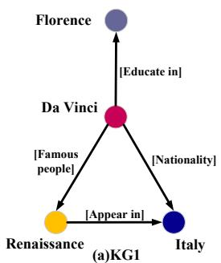

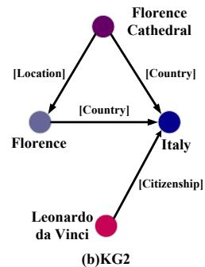  
Figure 1: An example of entity alignment between two KGs. Nodes with the same color refer to the same entity in different graphs.

and relations of the same entity in various KGs are often different, also known as the heterogeneity problem, it is time-consuming to find aligned entities manually. To align the entities efficiently, many embedding-based methods have been proposed. Traditional methods (Chen et al., 2017; Zhu et al., 2017) follow the translational principle, such as TransE (Bordes et al., 2013), to represent entity embedding, which consider the triples but disregard the local neighbors. Recently, many methods (Wang et al., 2018; Sun et al., 2020b) have adopted the Graph Convolutional Network (GCN) and its variants to capture local neighbor information due to the GCNs' remarkable ability (Welling and Kipf, 2016; Velickovic et al., 2017; Wu et al., 2021, 2023). Additionally, researchers have proposed some models to utilize relations as weights (Cao et al., 2019) or information (Mao et al., 2021; Yu et al., 2021) in the GCN-based framework. Despite this, the following two primary challenges have been encountered by the vast majority of prior methods when attempting to use relation information to solve KG heterogeneity:

First, relations should not be directly incorporated into entity representation, since confusing relations with entities leads to smooth entity representations. In DBpedia, there are 4,233,000 enti

ties but only 3,000 relations, making the same relation often established between various entities (e.g., Country in Figure 1(b)). To separate relations from entities, R-GCN (Schlichtkrull et al., 2018) learns relation matrices but numerous relations bring trouble for parameter optimization (Vashishth et al., 2019). Therefore, existing models (Nathani et al., 2019; Mao et al., 2020) employ vectors to represent relations and apply simple functions (e.g., subtraction and projection) as the neighbor message functions. However, these simple functions barely distinguish relations from entities and still bring much noise to entity representation.

Second, due to KG heterogeneity, it is challenging to unify the semantic representations between KGs during the alignment process. Specifically, KG heterogeneity includes (1) neighbor heterogeneity and (2) relation heterogeneity. Neighbor heterogeneity indicates that the same entity in different KGs have different neighbors. As illustrated in Figure 1, neighbor heterogeneity is reflected in that Da Vinci have different neighbors in two KGs, which may make us mistakenly match Da Vinci in KG1 with Florence Cathedral in KG2 as they have more identical neighbors. Relation heterogeneity means that the relation between the same entity pair can be expressed in various ways, even though these relations have similar intentions. As Figure 1 shows, relation heterogeneity is expressed as that the relation between Da Vinci and Italy is Nationality in KG1, while it is Citizenship in KG2, which causes trouble for aligning these triples though they have the similar meaning.

To tackle these obstacles, we propose a Relation-gated Heterogeneous Graph Network (RHGN) for entity alignment. Specifically, we first propose a novel Relation Gated Convolution (RGC) to make entity representations more discriminative. RGC uses relations as signals to control the flow of neighbor information, which separates relations from entities and avoids noise flowing into entities in representation learning. Second, to tackle the neighbor heterogeneity between two KGs, we devise Crossgraph Embedding Exchange (CEE) to propagate information via aligned entities across different KGs, thereby unifying the entity semantics between two KGs. Third, we design Soft Relation Alignment (SRA) to deal with the relation heterogeneity. SRA leverages entity embedding to generate soft labels for relation alignment between KGs, hence reducing the semantic distance of similar relations across

KGs. Finally, extensive experiments on four real-world datasets demonstrate the effectiveness of our proposed method. The source code is available at https://github.com/laquabe/RGHN.

# 2 Related Works

# 2.1 Entity Alignment

Entity alignment is a fundamental task in knowledge graph study. It seeks to recognize identical entities from different KGs (Sun et al., 2020c; Chen et al., 2020). To efficiently find identical entities, embedding-based models have been extensively studied. Traditional models, such as MtransE (Chen et al., 2017), used translation-based models (e.g., TransE (Bordes et al., 2013)) to make the distance between aligned entities get closer. Following this thought, IPTransE (Zhu et al., 2017), JAPE (Sun et al., 2017), and BootEA (Sun et al., 2018) constrained models from semantic space, attributes, and labels, respectively. Traditional models, however, neglect neighbor structures in favor of triples.

Inspired by the great success of Graph Neural Networks (GNNs), numerous methods (e.g., GCN-Align (Wang et al., 2018), AliNet (Sun et al., 2020b)) employed the GNNs and the variants to capture local neighbor information (Zeng et al., 2021). Since the knowledge graph contains abundant relations, RDGCN (Wu et al., 2019a), RSN4EA (Guo et al., 2019), and Dual-AMN (Mao et al., 2021) utilized relations as weights, paths, and projection matrices in GNNs. RREA (Mao et al., 2020) proposed a unified framework for entity alignment using relations. IMEA (Xin et al., 2022) encoded neighbor nodes, triples, and relation paths together with transformers. Unfortunately, they have not paid enough attention to the differences between entities and relations, and ignored semantic differences between different graphs due to KG heterogeneity.

Relation alignment, meantime, greatly aids in entity alignment. MuGNN (Cao et al., 2019) and ERMC (Yang et al., 2021) directly used the relation alignment labels but relation alignment labels are scarce in the real world. RNM (Zhu et al., 2021) and IMEA (Xin et al., 2022) applied post-processing to relation alignment with statistical features. However, post-processing can mine limited aligned relations. HGCN-JE (Wu et al., 2019b) jointly learned entity alignment and relation alignment, which incorporated neighbor relations into

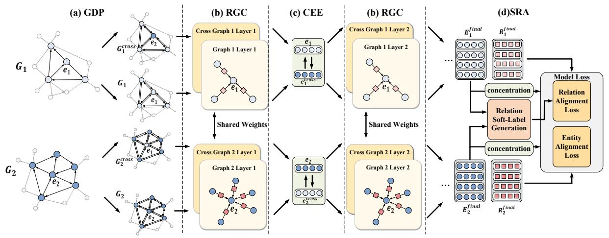  
Figure 2: The illustration of RHGN structure, which contains: (a) Graph Data Preprocessing (GDP); (b) Relation Gated Convolution (RGC); (c) Cross-graph Embedding Exchange (CEE); (d) Soft Relation Alignment(SRA).

entities. Unfortunately, non-aligned entities may also have similar neighbor relations, which means relation alignment and entity alignment should be separated. Therefore, effective relation alignment methods remain to be explored.

# 2.2 Graph Convolutional Network

Graph Convolutional Networks (GCNs) generalize convolution operations from traditional data (e.g., images or grids) to non-Euclidean data structures (Defferrard et al., 2016). The fundamental idea of graph convolutional networks is to enhance node self-representation by using neighbor information. Therefore, GCNs are typically expressed as a neighborhood aggregation or message-passing scheme (Gilmer et al., 2017).

In the broad application of GCNs, GCN (Welling and Kipf, 2016) and GAT (Velickovic et al., 2017) showed the powerful ability to capture neighbor information. Despite this, they performed poorly in KG representation as they ignored relations. To emphasize the essential role of relations in entity representation, R-GCN (Schlichtkrull et al., 2018) used a matrix to represent each relation. However, massive relations in the knowledge graph make it challenging for the relation matrixes to be fully learned. Thus, most follow-up works used vectors to represent relations. For example, KBGAT (Nathani et al., 2019) concentrated the neighbor triples as information. CompGCN (Vashisth et al., 2019) leveraged the entity-relation composition operations from knowledge embedding methods like TransE (Bordes et al., 2013) as message. KE-GCN (Yu et al., 2021) passed the gradient of the scoring function to the central node. Never

theless, none of the above models takes account of the inequality of relations and entities. In contrast, our RHGN is able to make a clear distinction between relations and entities, resulting in more distinct entity representations.

# 3 Preliminaries

In this section, we formalize the problem of entity alignment and give some related definitions.

# 3.1 Problem Definition

In this paper, we formally define a KG as $G = (E, R, T)$ , where $E$ is the set of entities, $R$ is the set of relations, and $T = E \times R \times E$ is the set of triples like (Florence, Country, Italy) as illustrated in Figure 1. Without loss of generality, we consider the entity alignment task between two KGs, i.e., $G_{1} = (E_{1}, R_{1}, T_{1})$ and $G_{2} = (E_{2}, R_{2}, T_{2})$ . The goal is to find the 1-to-1 alignment of entities $S_{KG_{1}, KG_{2}} = \{(e_{1}, e_{2}) \in E_{1} \times E_{2} | e_{1} \sim e_{2}\}$ , where $\sim$ denotes the equivalence relation. To train the model, a small subset of the alignment $S_{KG_{1}, KG_{2}}' \in S_{KG_{1}, KG_{2}}$ is given as the training data, and we call it seed alignment set.

# 3.2 Graph Convolutional Layers

Following previous works (Sun et al., 2020b; Guo et al., 2020; Xin et al., 2022), our RHGN model is built upon GCN framework (Welling and Kipf, 2016) to embed the entities $E$ in KGs. Our model contains multiple stacked GCN layers, which enables entity embeddings to incorporate information from higher-order neighbors. The input for $k$ -th GCN layer is an entity feature matrix, $E^{k} =$

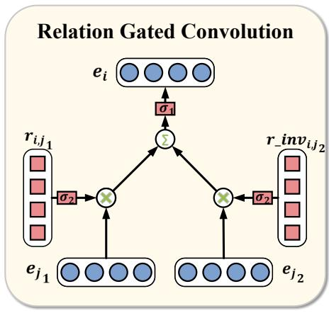  
Figure 3: The Illustration of Relation Gated Convolution

$\{e_1^k,e_2^k,\dots,e_n^k |e_i^k\in G\}$ , where $\mathfrak{n}$ is the number of entities in $G$ . To update the embedding of entities in layer k, the GCN layer aggregates neighbor information, which can be formally described as:

$$
e _ {i} ^ {k + 1} = \gamma^ {k} \left(e _ {i} ^ {k}, A g g _ {j \in N (i)} \phi \left(e _ {i} ^ {k}, e _ {j} ^ {k}, r _ {i, j} ^ {k}\right)\right) \tag {1}
$$

where $\mathrm{N(i)}$ is the neighbors of entity i, $\gamma$ is the transformation function like MLP, $Agg$ is the Aggregate function like sum, mean or max, and $\phi$ is the score function.

# 4 RHGN: Relation-gated Heterogeneous Graph Network

In this section, we first present an overview of our RHGN. Then we introduce the technical details of RHGN.

# 4.1 An Overview of RHGN

As shown in Figure 2, our approach contains four components: (a) Graph Data Preprocessing (GDP), (b) Relation Gated Convolution (RGC), (c) Crossgraph Embedding Exchange (CEE), and (d) Soft Relation Alignment (SRA). Specifically, GDP first preprocesses graphs through two aspects: completing graphs by adding inverse relations and constructing the cross graph by exchanging aligned entities. Then, several RGC layers are devised to aggregate information in both original and cross graphs to get the representation of entities and relations. Meanwhile, CEE exchanges the embedding of original graphs and cross graphs between each RGC layer for efficient information propagation. Finally, SRA employs the embedding of entities to produce soft labels for relation alignment and the embedding of entities and relations will be sent to the model loss for optimization.

# 4.2 Graph Data Preprocessing

In order to make better use of the relations and address heterogeneity, we first perform data preprocessing on graphs to make graphs more complete. In detail, GDP contains two parts: Inverse Relation Embedding and Cross Graph Construction.

# 4.2.1 Inverse Relation Embedding

Since relations in KGs are normally unidirectional, following previous works (Sun et al., 2020b; Vashishth et al., 2019), we also add inverse relation to KGs. The inverse relation is defined as:

$$
r _ {i n v _ {i}} = W _ {i n v} r _ {i}, \tag {2}
$$

where $r_{inv_i}$ is the inverse relation of relation $r_i$ . $W_{inv}$ is the weight matrix of inverse relation transformation. Therefore, we extend graphs as:

$$
T ^ {\prime} = T \cup \left\{\left(t, r _ {i n v}, h\right) | (h, r, t) \in T \right\}, \tag {3}
$$

where $(h,r,t)$ is the triple in the original graph.

# 4.2.2 Cross Graph Construction

As we discussed in Section 1, to address neighbor heterogeneity, in this part, we first construct cross graphs through the aligned entities in the seed alignment set for efficient information propagation across KGs. Specifically, as Figure 2(a) shows, Cross Graph Construction generates cross graphs by exchanging the aligned entities in the seed alignment set $S_{KG_1,KG_2}'$ . The entities $E_1^{cross}$ in the cross graph $G_1^{cross}$ are defined as:

$$
e _ {1} ^ {\text {c r o s s}} = \left\{ \begin{array}{l l} e _ {2} & \text {i f} \quad e _ {1} \in S _ {K G _ {1}, K G _ {2}} ^ {\prime} \text {a n d} e _ {1} \sim e _ {2}, \\ e _ {1} & \text {e l s e .} \end{array} \right. \tag {4}
$$

Similarly, the entities $E_2^{cross}$ in the cross graph $G_2^{cross}$ are defined as:

$$
e _ {2} ^ {\text {c r o s s}} = \left\{ \begin{array}{l l} e _ {1} & \text {i f} \quad e _ {2} \in S _ {K G _ {1}, K G _ {2}} ^ {\prime} \text {a n d} e _ {2} \sim e _ {1}, \\ e _ {2} & \text {e l s e .} \end{array} \right. \tag {5}
$$

Taking Figure 1 as an example, (Da Vinci, Citizenship, Italy) will be in cross KG2 as we exchange Da Vinci in KG1 and Leonardo da Vinci in KG2.

Finally, the cross graphs $G_1^{cross}$ and $G_2^{cross}$ are defined as $G_1^{cross} = (E_1^{cross}, R_1, T_1^{cross})$ and $G_2^{cross} = (E_2^{cross}, R_2, T_2^{cross})$ . The embeddings of entities and relations are randomly initialized.

# 4.3 Relation Gated Convolution

After getting the preprocessed graphs, in Figure 2(b), we use RGC to aggregate neighbors and relations to the central entity. As discussed in Section 1, directly incorporating relation into entity representation may introduce much noise. To tackle this, we separate the semantic space of relations and entities. Specifically, in figure 3, we use a non-linear activation function $(\sigma_{2})$ as a gate to aggregate neighbors and relations. The gate treats relations as control signals to regulate the inflow of neighbor information. For the entity $i$ at $k$ -th layer $e_i^k$ , the embedding of entity $i$ at $k + 1$ -th layer $e_i^{k + 1}$ is computed as follows:

$$
e _ {i} ^ {k + 1} = \sigma_ {1} \left(\sum_ {j \in N (i)} W _ {e} ^ {k} \left(e _ {j} ^ {k} \otimes \sigma_ {2} \left(r _ {i, j} ^ {k}\right)\right)\right), \tag {6}
$$

where $N(i)$ is the set of neighbors of entity $i$ , and $r_{i,j}^{k}$ is the relation from entity $j$ to entity $i$ , $W_{e}^{k}$ is the entity weight matrix of $k$ -th layer, $\otimes$ denotes element-wise multiplication between vectors, $\sigma_{1}(\cdot)$ and $\sigma_{2}(\cdot)$ are non-linear activation functions. We use $\tanh(\cdot)$ for $\sigma_{1}(\cdot)$ and sigmoid( $\cdot$ ) for $\sigma_{2}(\cdot)$ .

Moreover, inspired by (Vashishth et al., 2019), we also update the embedding of relations $r_{i,j}^{k}$ as:

$$
r _ {i, j} ^ {k + 1} = W _ {r} ^ {k} r _ {i, j} ^ {k}, \tag {7}
$$

where $W_{r}^{k}$ is the relation weight matrix of the $k$ -th layer. In order to reduce the semantic gap between the two KGs, we share the weights of the RGCs between two graphs in each layer.

# 4.4 Cross-graph Embedding Exchange

According to Section 4.2, we build the cross graph to address neighbor heterogeneity among different KGs. In this section, to make information propagation across KGs more efficient, we introduce a cross-graph embedding exchange method on both original and cross graphs to reduce the entity semantic distance between KGs. As illustrated in Figure 2(c), we exchange entity embeddings between the original graph and the cross graph at each intermediate layer. Formally, $E^{k}$ and $E_{cross}^{k}$ represent the entity embedding of original graph and cross graph in $k$ -th layer respectively, the $k+1$ -th layer can be computed as:

$$
E ^ {k + 1} = R G C \left(E _ {\text {c r o s s}} ^ {k}, R ^ {k}, G ^ {k}, W ^ {k}\right), \tag {8}
$$

$$
E _ {c r o s s} ^ {k + 1} = R G C \left(E ^ {k}, R _ {c r o s s} ^ {k}, G _ {c r o s s} ^ {k}, W ^ {k}\right). \tag {9}
$$

Compared with previous work (Cao et al., 2019) that adds edges between aligned entities in the seed alignment set, CEE can effectively reduce the distance of information propagation across two KGs. Taking the entity Florence in Figure 1 as an example, if we assume that Italy in two KGs is aligned, the information from Florence in KG1 can propagate to Florence in KG2 only through 3 edges and 2 nodes with the help of CEE. According to Huang et al. (2020), a shorter propagation distance spreads more information across two KGs, making the two graphs' entity semantics closer.

# 4.5 Soft Relation Alignment

As discussed in Section 1, relation heterogeneity also complicates entity alignment. Relation alignment, which seeks out mutually similar ties across KGs, is one direct method for resolving this problem. However, due to the lack of labels, we need to produce soft relation alignment labels by ourselves.

Inspired by prior works (Wu et al., 2019b; Zhu et al., 2021), we make use of entities to produce soft relation alignment labels as shown in Figure 2(d). We define relation label embedding as:

$$
r ^ {\prime} = \operatorname {c o n c a t} \left[ \frac {1}{H _ {r}} \sum_ {e _ {i} \in H _ {r}} e _ {i}, \frac {1}{T _ {r}} \sum_ {e _ {j} \in T _ {r}} e _ {j} \right], \tag {10}
$$

where $H_{r}$ and $T_{r}$ are the sets of head entities and tail entities of relaiton $r$ , respectively. Then, the relation alignment label is defined as:

$$
y _ {i j} = \mathbb {I} \left(\cos \left(r _ {i} ^ {\prime}, r _ {j} ^ {\prime}\right) > \gamma\right), \tag {11}
$$

where $\gamma$ is the hyperparameter of the threshold.

It is noteworthy that our method may either produce multiple alignment labels or no alignment labels for one relation since relation alignment does not obey 1-to-1 constraints. As shown in Figure 1, Nationality and Famous People in KG1 may be similar to Citizenship in KG2, while Location in KG2 has no similar relation KG1. This feature makes us decide to convert relation alignment task to a multi-label classification task in model loss.

# 4.6 Training

In this subsection, we introduce our loss components: the entity alignment loss and the relation alignment loss, which capture alignment information of entities and relations, respectively.

Table 1: The Statistics of OpenEA Datasets   

<table><tr><td>Dataset</td><td>KG</td><td>#Ent.</td><td>#Rel.</td><td>#Rel tr.</td></tr><tr><td rowspan="2">EN-FR</td><td>EN</td><td>15,000</td><td>267</td><td>47,334</td></tr><tr><td>FR</td><td>15,000</td><td>210</td><td>40,864</td></tr><tr><td rowspan="2">EN-DE</td><td>EN</td><td>15,000</td><td>215</td><td>47,676</td></tr><tr><td>DE</td><td>15,000</td><td>131</td><td>50,419</td></tr><tr><td rowspan="2">D-W</td><td>DB</td><td>15,000</td><td>248</td><td>38,265</td></tr><tr><td>WD</td><td>15,000</td><td>169</td><td>42,746</td></tr><tr><td rowspan="2">D-Y</td><td>DB</td><td>15,000</td><td>165</td><td>30,291</td></tr><tr><td>YG</td><td>15,000</td><td>28</td><td>26,638</td></tr></table>

# 4.6.1 Entity Alignment Loss

Following previous work (Sun et al., 2020b; Xin et al., 2022), we minimize the contrastive alignment loss to make the distance between the aligned entities as close as possible, while the distance between the non-aligned entities is very far. The alignment loss is defined as:

$$
\mathcal {L} _ {1} = \sum_ {(i, j) \in A ^ {+}} | | e _ {i} - e _ {j} | | + \sum_ {\left(i ^ {\prime}, j ^ {\prime}\right) \in A ^ {-}} \alpha_ {1} [ \lambda - | | e _ {i ^ {\prime}} - e _ {j ^ {\prime}} | \tag {12}
$$

where $e_i$ is the entity embedding concentration of all layers in the original graph and cross graph. $A^-$ is the set of negative samples generated by truncated- $\epsilon$ negative sampling strategy, $||\cdot||$ denotes $L_2$ distance. $[\cdot]_+ = \max(0, x)$ , and we hope the distance of negative samples to be larger than a margin $\lambda$ . $\alpha_1$ is a hyperparameter to keep the balance between positive and negative samples.

# 4.6.2 Relation Alignment Loss

As we mentioned in Section 4.5, we transform relation alignment into a multi-label classification task. Consequently, we first calculate the cosine similarity of relations in the last layer between graphs:

$$
x _ {i j} = \cos \left(r _ {i}, r _ {j}\right). \tag {13}
$$

Then, we use the soft labels produced in SRA to calculate the relation alignment loss, we adopt the multi-label soft margin loss:

$$
\begin{array}{l} \mathcal {L} _ {2} = - \frac {1}{| R |} \sum_ {i} \left(y _ {i} \cdot \log \left(\frac {1}{1 + \exp \left(- x _ {i}\right)}\right) \right. \tag {14} \\ + (1 - y _ {i}) \cdot l o g \frac {e x p (- x _ {i})}{1 + e x p (- x _ {i})}. \\ \end{array}
$$

Finally, RHGH combines the two losses as:

$$
\mathcal {L} = \mathcal {L} _ {1} + \alpha_ {2} \mathcal {L} _ {2}, \tag {15}
$$

where $\alpha_{2}$ is a hyperparameter to keep the balance between entity alignment and relation alignment.

# 5 Experiments

# 5.1 Dataset

For the reliability and authority of experimental results, we use the dataset (V1) in OpenEA (Sun et al., 2020c) for evaluation since it closely resembles the data distribution of real KGs. It contains two crosslingual settings extracted from multi-lingual DBpedia: English-French and English-German, as well as two monolingual settings among popular KGs: DBpedia-Wikidata and DBpedia-YAGO. We use the setting that datasets contain 15K pairs of reference entity alignment and no reference relation alignment. Table 1 provides further information about the datasets. We adhere to OpenEA's dataset divisions, which use a $20\%$ seed for training, $10\%$ for validation, and $70\%$ for testing.

# 5.2 Implementation Details

We implement our method through PyG (Fey and Lenssen, 2019) on Pytorch. We initialize the trainable parameters with Xavier initialization (Glorot and Bengio, 2010) and optimize loss with Adam (Kingma and Ba, 2015). As for hyper-parameters, we decide the important hyperparameters by grid search and keep them the same in all datasets. For example the number of RGCs' layers is 4, the hidden size of each layer is 256, the batch size is 256, and the learning rate is 0.001. We set $\alpha_{2} = 10$ to keep the balance of alignment loss and semantic loss. We randomly sample 25 negative samples for each pre-aligned entity pair. After every 25 epochs, we resample 25 negative samples based on the CSLS (Lample et al., 2018) and resample 100 head and tail entities respectively to generate soft relation alignment labels. The threshold $\gamma$ is 0.5, the negative sample distance margin $\lambda$ is 1.5 and the negative sample weight $\alpha_{1}$ is 0.1.

Followed the previous work (Sun et al., 2020b; Xin et al., 2022), we also use early stopping to terminate training based on Hits@1 performance on the validation set with a patient of 25 epochs, and the maximum training epochs is 1000. According to most previous work, we report the Hits@1, Hits@5 and MRR (mean reciprocal rank) results to assess entity alignment performance. We conduct the experiments with 5-fold cross-validation to ensure the unbiased evaluation.

Table 2: Entity Alignment Results on OpenEA Datasets   

<table><tr><td colspan="2">Dateset</td><td colspan="3">EN_FR_V1</td><td colspan="3">EN_DE_V1</td><td colspan="3">D_W_V1</td><td colspan="3">D_Y_V1</td></tr><tr><td>Category</td><td>Method</td><td>H@1</td><td>H@5</td><td>MRR</td><td>H@1</td><td>H@5</td><td>MRR</td><td>H@1</td><td>H@5</td><td>MRR</td><td>H@1</td><td>H@5</td><td>MRR</td></tr><tr><td rowspan="4">Triple-based</td><td>MTransE</td><td>0.247</td><td>0.467</td><td>0.351</td><td>0.307</td><td>0.518</td><td>0.407</td><td>0.259</td><td>0.461</td><td>0.354</td><td>0.463</td><td>0.675</td><td>0.559</td></tr><tr><td>IPTransE</td><td>0.169</td><td>0.320</td><td>0.243</td><td>0.350</td><td>0.515</td><td>0.430</td><td>0.232</td><td>0.380</td><td>0.303</td><td>0.313</td><td>0.456</td><td>0.378</td></tr><tr><td>AlignE</td><td>0.357</td><td>0.611</td><td>0.473</td><td>0.552</td><td>0.741</td><td>0.638</td><td>0.406</td><td>0.627</td><td>0.506</td><td>0.551</td><td>0.743</td><td>0.636</td></tr><tr><td>SEA</td><td>0.280</td><td>0.530</td><td>0.397</td><td>0.530</td><td>0.718</td><td>0.617</td><td>0.360</td><td>0.572</td><td>0.458</td><td>0.500</td><td>0.706</td><td>0.591</td></tr><tr><td rowspan="3">Neighbor-based</td><td>GCN-Align</td><td>0.338</td><td>0.589</td><td>0.451</td><td>0.481</td><td>0.679</td><td>0.571</td><td>0.364</td><td>0.580</td><td>0.461</td><td>0.465</td><td>0.626</td><td>0.536</td></tr><tr><td>AliNet</td><td>0.364</td><td>0.597</td><td>0.467</td><td>0.604</td><td>0.759</td><td>0.673</td><td>0.440</td><td>0.628</td><td>0.522</td><td>0.559</td><td>0.690</td><td>0.617</td></tr><tr><td>HyperKA</td><td>0.353</td><td>0.630</td><td>0.477</td><td>0.560</td><td>0.780</td><td>0.656</td><td>0.440</td><td>0.686</td><td>0.548</td><td>0.568</td><td>0.777</td><td>0.659</td></tr><tr><td rowspan="3">Relation-enhanced</td><td>RSN4EA</td><td>0.393</td><td>0.595</td><td>0.487</td><td>0.587</td><td>0.752</td><td>0.662</td><td>0.441</td><td>0.615</td><td>0.521</td><td>0.514</td><td>0.655</td><td>0.580</td></tr><tr><td>KE-GCN</td><td>0.408</td><td>0.670</td><td>0.524</td><td>0.658</td><td>0.822</td><td>0.730</td><td>0.519</td><td>0.727</td><td>0.608</td><td>0.560</td><td>0.750</td><td>0.644</td></tr><tr><td>IMEA</td><td>0.458</td><td>0.720</td><td>0.574</td><td>0.639</td><td>0.827</td><td>0.724</td><td>0.527</td><td>0.753</td><td>0.626</td><td>0.639</td><td>0.804</td><td>0.712</td></tr><tr><td>Ours</td><td>RHGN</td><td>0.500</td><td>0.739</td><td>0.603</td><td>0.704</td><td>0.859</td><td>0.771</td><td>0.560</td><td>0.753</td><td>0.644</td><td>0.708</td><td>0.831</td><td>0.762</td></tr></table>

Table 3: Entity Alignment of Various Convolution   

<table><tr><td>Dateset</td><td colspan="3">EN_FR_V1</td><td colspan="3">D_W_V1</td></tr><tr><td>Method</td><td>H@1</td><td>H@5</td><td>MRR</td><td>H@1</td><td>H@5</td><td>MRR</td></tr><tr><td>GCN</td><td>0.391</td><td>0.612</td><td>0.488</td><td>0.474</td><td>0.649</td><td>0.550</td></tr><tr><td>GAT</td><td>0.362</td><td>0.577</td><td>0.457</td><td>0.448</td><td>0.625</td><td>0.525</td></tr><tr><td>R-GCN</td><td>0.468</td><td>0.708</td><td>0.572</td><td>0.538</td><td>0.736</td><td>0.624</td></tr><tr><td>CompGCN</td><td>0.473</td><td>0.726</td><td>0.584</td><td>0.524</td><td>0.729</td><td>0.613</td></tr><tr><td>RGC</td><td>0.500</td><td>0.739</td><td>0.603</td><td>0.560</td><td>0.753</td><td>0.644</td></tr></table>

# 5.3 Benchmark Methods

To evaluate the effectiveness of RHGN, we compare it with the state-of-the-art supervised structure-based entity alignment methods. We use codes and parameters released by the authors and display the best results among reproduced results and reported results in original articles. In general terms, we can classify them as follows.

- Triple-based Models. These models focus on triple, they usually use TransE (Bordes et al., 2013) to represent entities and relations, including MTransE (Chen et al., 2017), IP-TransE (Zhu et al., 2017), AlignE (Sun et al., 2018), and SEA (Pei et al., 2019).   
- Neighbor-based Models. These models emphasize neighbor information but ignore the relation information, they usually use GNNs to represent entities, including GCNAlign (Wang et al., 2018), AliNet (Sun et al., 2020b), and HyperKA (Sun et al., 2020a).   
- Relation-enhanced Models. These models take into account the importance of relation information and incorporate relation information into entity representations, including

RSN4EA (Guo et al., 2019), KE-GCN (Yu et al., 2021), and IMEA (Xin et al., 2022).

Our model and the above baselines all focus on the structural information of KGs. For a fair comparison, we disregard additional models that incorporate side information (e.g., attributes, entity names and descriptions) like RDGCN (Wu et al., 2019a), KDCoE (Chen et al., 2018) and AttrGNN (Liu et al., 2020b).

# 5.4 Experimental Results

The results of all methods on OpenEA datasets are shown in Table 2. In general, the RHGN model has achieved the best performance compared with these SOTA baselines. Specifically, our method outperforms the best-performing baseline (i.e., IMEA, KE-GCN) on Hits@1 by $3\% -6\%$ , on MRR by $1\% -5\%$ , and on Hits@5 by $1\% -3\%$ (except for D_W_V1). Additionally, we discover some interesting phenomena as follows:

First, on all datasets, relation-enhanced models outperform neighbor-based models, and both outperform triple-based models. This fully demonstrates that relation information plays an important role in neighbor information aggregation. Second, our model has significant improvements on EN_DE_V1 and D_Y_V1, but the improvements of our model are relatively limited on EN_FR_V1 and D_W_V1, and we find that all baselines do not perform well on datasets EN_FR_V1 and D_W_V1. We believe that the semantic distance between the graphs in the two datasets is far apart, which makes it is hard to find aligned entities.

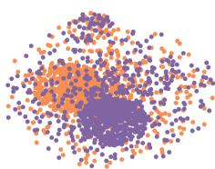  
(a) GCN

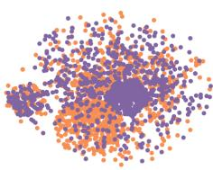  
(b) GAT

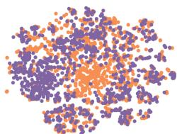  
(c) R-GCN

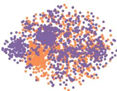  
(d) CompGCN

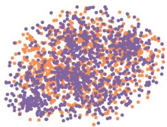  
(e) RHGN

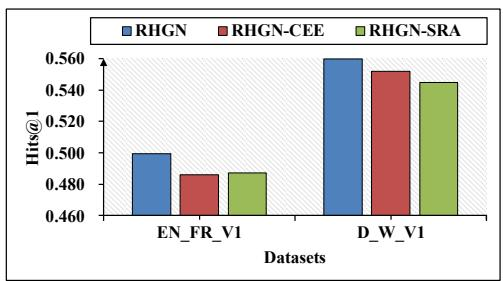  
Figure 4: Visualization of the entity embedding. The same color means the entities are in the same KG.   
Figure 5: The Impact of Different Heterogeneity

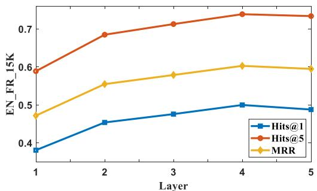  
Figure 6: Results with Various RGC's Layer Numbers

# 5.5 Ablation Study

# 5.5.1 RGC's Ability to Utilize Relations

To compare the ability to utilize relations of various convolutions, We replace the RGC with re-tuned GNN variants GCN (Welling and Kipf, 2016), GAT (Velickovic et al., 2017), R-GCN (Schlichtkrull et al., 2018), and CompGCN (Vashishth et al., 2019) with the same parameters. The results are shown in Table 3. Among these models, our RGC also achieves the best performance, as GCN and GAT ignore the relations, while R-GCN and CompGCN can not take advantage of the relations well. Meanwhile, the result that R-GCN and CompGCN outperform GCN and GAT proves the essential role of relations in entity representation.

# 5.5.2 The Impact of Different Heterogeneity

To verify the impact of different heterogeneity, figure 5 reports the performances after removing CEE and SRA, respectively. We observe that both components contribute to performance improvement, demonstrating that each component design in our framework is reasonable. Meanwhile, the effects of the two components on different datasets are also different, implying that the impact of neighbor heterogeneity and relationship heterogeneity varies between different KGs.

# 5.6 The Distance of Information Propagation

We explore the effect of RGC's layer number on model performance as layer numbers reflect the distance of information propagation. In Figure 6, we present the effect of RGC's layer numbers with 1 to 5 on EN_FR_V1. Obviously, RHGN with 4 layers achieves the best performance over all three metrics. When the number of layers exceeds 4, the performance declines as adding more layers allows the model to collect more distant neighbor data and adds noise during information propagation. We also observe that RHGN with 2 layers has a huge improvement over RHGN with 1 layer. We believe that due to the lack of exchange entity embedding, RHGN with 1 layer cannot obtain information from the other KGs, resulting in poor performance.

Then we calculate the shortest path length from the test set entities to the training set entities in the EN_FR_V1 dataset. The average and median of shortest path length are 1.5 and 1 in EN, and the length is 1.6 and 2 in FR. This shows that most entities need 3 to 4 hops to pass their own information to the aligned entity of another graph with CEE module. As a matter of fact, RHGN with 3 and 4 layers achieves similar performance and is ahead of other variants, which also verifies that our CEE module is effective.

# 5.7 Visualization of Entity Embedding

For a more intuitive comparison of how our proposed model addresses heterogeneity across different KGs with other methods, we conduct visualization on the D_W_V1 datasets. Specifically, we perform dimensionality reduction on entity embedding of GCN, GAT, R-GCN, CompGCN, and RHGN with t-SNE (Van der Maaten and Hinton, 2008). Results are shown in Figure 4, where the same color means entities are in the same KG. Ideally, the entity distributions of two graphs should overlap as much as possible, and entity embeddings should be sparsely distributed.

From Figure 4, we find some phenomena as follows. First, entities represented by previous methods have obvious clustering in space, while incorporating relation can effectively alleviate the clustering. This phenomenon suggests that relations play an essential role in distinguishing entities and preventing over-smoothing. Second, all previous arts have significant space that is not aligned, which demonstrates that they are unable to bridge the semantic space gap caused by KG heterogeneity. However, our RHGN model's entity embeddings are sparsely distributed in space and have a high degree of overlaps, making the model distinguish entities well and easily find aligned entities.

# 6 Limitations

Although we have demonstrated the superiority of our RHGH model compared to previous work on four real-world datasets, there are still two limitations that should be addressed in the future:

(1) As our RGC layer employs the whole graph to learn the embedding of entities and relations, like most GCN's frameworks, the computational resources and time required by our framework increase linearly with the size of KG. To make our RHGH model effective on the KG with millions of entities, it is desirable to apply some graph chunking techniques, such as Cluster-GCN (Chiang et al., 2019), to reduce the size of the KG for our RHGH model to improve computational efficiency.   
(2) Currently, our RHGH model treats each relation individually. However, relation paths consisting of multiple relations will contain more complex semantic information in KGs. Relation paths enable entities to obtain higher-order neighbor information, but it is also more difficult to align relational paths in different knowledge graphs. In future work, we will explore more efficient ways

to utilize the relation path in entity alignment, such as the relation path matching in different KGs.

# 7 Conclusion

In this paper, we studied the problem of entity alignment and proposed the RHGN model, which could distinguish relation and entity semantic spaces, and further address heterogeneity across different KGs. Specifically, we first designed a novel relation-gated convolutional layer to regulate the flow of neighbor information through relations. Then, we proposed an innovative cross-graph embedding exchange module, which reduces the entity semantic distance between graphs to address neighbor heterogeneity. Finally, we devised a soft relation alignment module for the unsupervised relation alignment task, which solves the relation heterogeneity problem between graphs. Extensive experiments on four real-world datasets verified the effectiveness of our proposed methods. In future work, we will explore more ways to utilize the relation information in entity alignment, such as the relation path matching in different KGs.

# Acknowledgements

This research was partially supported by grants from the National Natural Science Foundation of China (Grants No. U20A20229, No. 62106244), and the University Synergy Innovation Program of Anhui Province (No. GXXT-2022-042).

# References

Antoine Bordes, Nicolas Usunier, Alberto Garcia-Duran, Jason Weston, and Oksana Yakhnenko. 2013. Translating embeddings for modeling multi-relational data. Advances in neural information processing systems, 26.   
Yixin Cao, Zhiyuan Liu, Chengjiang Li, Juanzi Li, and Tat-Seng Chua. 2019. Multi-channel graph neural network for entity alignment. In Proceedings of the 57th Annual Meeting of the Association for Computational Linguistics, pages 1452-1461.   
Liyi Chen, Zhi Li, Yijun Wang, Tong Xu, Zhefeng Wang, and Enhong Chen. 2020. Mmea: entity alignment for multi-modal knowledge graph. In Proc. of KSEM.   
Liyi Chen, Zhi Li, Tong Xu, Han Wu, Zhefeng Wang, Nicholas Jing Yuan, and Enhong Chen. 2022. Multi-modal siamese network for entity alignment. In Proc. of KDD.

Muhao Chen, Yingtao Tian, Kai-Wei Chang, Steven Skiena, and Carlo Zaniolo. 2018. Co-training embeddings of knowledge graphs and entity descriptions for cross-lingual entity alignment. In Proceedings of the 27th International Joint Conference on Artificial Intelligence, pages 3998-4004.   
Muhao Chen, Yingtao Tian, Mohan Yang, and Carlo Zaniolo. 2017. Multilingual knowledge graph embeddings for cross-lingual knowledge alignment. In *IJCAI*.   
Wei-Lin Chiang, Xuanqing Liu, Si Si, Yang Li, Samy Bengio, and Cho-Jui Hsieh. 2019. Cluster-gcn: An efficient algorithm for training deep and large graph convolutional networks. In Proceedings of the 25th ACM SIGKDD international conference on knowledge discovery & data mining, pages 257-266.   
Michaël Defferrard, Xavier Bresson, and Pierre Vandergheynst. 2016. Convolutional neural networks on graphs with fast localized spectral filtering. Advances in neural information processing systems, 29.   
Matthias Fey and Jan E. Lenssen. 2019. Fast graph representation learning with PyTorch Geometric. In ICLR Workshop on Representation Learning on Graphs and Manifolds.   
Justin Gilmer, Samuel S Schoenholz, Patrick F Riley, Oriol Vinyals, and George E Dahl. 2017. Neural message passing for quantum chemistry. In International conference on machine learning, pages 1263-1272. PMLR.   
Xavier Glorot and Yoshua Bengio. 2010. Understanding the difficulty of training deep feedforward neural networks. In Proceedings of the thirteenth international conference on artificial intelligence and statistics, pages 249-256. JMLR Workshop and Conference Proceedings.   
Lingbing Guo, Zequn Sun, and Wei Hu. 2019. Learning to exploit long-term relational dependencies in knowledge graphs. In International Conference on Machine Learning, pages 2505-2514. PMLR.   
Lingbing Guo, Weiqing Wang, Zequn Sun, Chenghao Liu, and Wei Hu. 2020. Decentralized knowledge graph representation learning. arXiv preprint arXiv:2010.08114.   
Kexin Huang and Marinka Zitnik. 2020. Graph meta learning via local subgraphs. Advances in Neural Information Processing Systems, 33:5862-5874.   
Diederik P Kingma and Jimmy Ba. 2015. Adam: A method for stochastic optimization. In *ICLR (Poster)*.   
Guillaume Lample, Alexis Conneau, Marc'Aurelio Ranzato, Ludovic Denoyer, and Hervé Jégou. 2018. Word translation without parallel data. In International Conference on Learning Representations.

Jens Lehmann, Robert Isele, Max Jakob, Anja Jentzsch, Dimitris Kontokostas, Pablo N Mendes, Sebastian Hellmann, Mohamed Morsey, Patrick Van Kleef, Soren Auer, et al. 2015. Dbpedia-a large-scale, multilingual knowledge base extracted from wikipedia. Semantic web, 6(2):167-195.   
Ye Liu, Han Wu, Zhenya Huang, Hao Wang, Jianhui Ma, Qi Liu, Enhong Chen, Hanqing Tao, and Ke Rui. 2020a. Technical phrase extraction for patent mining: A multi-level approach. In 2020 IEEE International Conference on Data Mining (ICDM), pages 1142-1147. IEEE.   
Zhiyuan Liu, Yixin Cao, Liangming Pan, Juanzi Li, and Tat-Seng Chua. 2020b. Exploring and evaluating attributes, values, and structures for entity alignment. In Proceedings of the 2020 Conference on Empirical Methods in Natural Language Processing (EMNLP), pages 6355-6364.   
Xin Mao, Wenting Wang, Yuanbin Wu, and Man Lan. 2021. Boosting the speed of entity alignment $10 \times$ : Dual attention matching network with normalized hard sample mining. In Proceedings of the Web Conference 2021, pages 821-832.   
Xin Mao, Wenting Wang, Huimin Xu, Yuanbin Wu, and Man Lan. 2020. Relational reflection entity alignment. In Proceedings of the 29th ACM International Conference on Information & Knowledge Management, pages 1095-1104.   
Deepak Nathani, Jatin Chauhan, Charu Sharma, and Manohar Kaul. 2019. Learning attention-based embeddings for relation prediction in knowledge graphs. In Proceedings of the 57th Annual Meeting of the Association for Computational Linguistics, pages 4710-4723.   
Shichao Pei, Lu Yu, Robert Hoehndorf, and Xiangliang Zhang. 2019. Semi-supervised entity alignment via knowledge graph embedding with awareness of degree difference. In The World Wide Web Conference, pages 3130-3136.   
Thomas Rebele, Fabian Suchanek, Johannes Hoffart, Joanna Biega, Erdal Kuzey, and Gerhard Weikum. 2016. Yago: A multilingual knowledge base from wikipedia, wordnet, and geonames. In International semantic web conference, pages 177-185. Springer.   
Michael Schlichtkrull, Thomas N Kipf, Peter Bloem, Rianne van den Berg, Ivan Titov, and Max Welling. 2018. Modeling relational data with graph convolutional networks. In European semantic web conference, pages 593-607. Springer.   
Özge Sevgili, Artem Shelmanov, Mikhail Arkhipov, Alexander Panchenko, and Chris Biemann. 2022. Neural entity linking:: A survey of models based on deep learning. Semantic Web, 13(3):527-570.   
Zequn Sun, Muhao Chen, Wei Hu, Chengming Wang, Jian Dai, and Wei Zhang. 2020a. Knowledge association with hyperbolic knowledge graph embeddings.

In Proceedings of the 2020 Conference on Empirical Methods in Natural Language Processing (EMNLP), pages 5704-5716.   
Zequn Sun, Wei Hu, and Chengkai Li. 2017. Cross-lingual entity alignment via joint attribute-preserving embedding. In International Semantic Web Conference, pages 628-644. Springer.   
Zequn Sun, Wei Hu, Qingheng Zhang, and Yuzhong Qu. 2018. Bootstrapping entity alignment with knowledge graph embedding. In *IJCAI*, volume 18, pages 4396-4402.   
Zequn Sun, Chengming Wang, Wei Hu, Muhao Chen, Jian Dai, Wei Zhang, and Yuzhong Qu. 2020b. Knowledge graph alignment network with gated multi-hop neighborhood aggregation. In Proceedings of the AAAI Conference on Artificial Intelligence, volume 34, pages 222-229.   
Zequn Sun, Qingheng Zhang, Wei Hu, Chengming Wang, Muhao Chen, Farahnaz Akrami, and Chengkai Li. 2020c. A benchmarking study of embedding-based entity alignment for knowledge graphs. Proceedings of the VLDB Endowment, 13(12).   
Laurens Van der Maaten and Geoffrey Hinton. 2008. Visualizing data using t-sne. Journal of machine learning research, 9(11).   
Shikhar Vashishth, Soumya Sanyal, Vikram Nitin, and Partha Talukdar. 2019. Composition-based multi-relational graph convolutional networks. In International Conference on Learning Representations.   
Petar Velickovic, Guillem Cucurull, Arantxa Casanova, Adriana Romero, Pietro Lio, and Yoshua Bengio. 2017. Graph attention networks. stat, 1050:20.   
Kehang Wang, Qi Liu, Kai Zhang, Ye Liu, Hanqing Tao, Zhenya Huang, and Enhong Chen. 2023. Class-dynamic and hierarchy-constrained network for entity linking. In Database Systems for Advanced Applications: 28th International Conference, DASFAA 2023, Tianjin, China, April 17-20, 2023, Proceedings, Part II, pages 622-638. Springer.   
Zhichun Wang, Qingsong Lv, Xiaohan Lan, and Yu Zhang. 2018. Cross-lingual knowledge graph alignment via graph convolutional networks. In Proceedings of the 2018 conference on empirical methods in natural language processing, pages 349-357.   
Max Welling and Thomas N Kipf. 2016. Semi-supervised classification with graph convolutional networks. In J. International Conference on Learning Representations (ICLR 2017).   
Likang Wu, Zhi Li, Hongke Zhao, Qi Liu, Jun Wang, Mengdi Zhang, and Enhong Chen. 2021. Learning the implicit semantic representation on graph-structured data. In Database Systems for Advanced Applications: 26th International Conference, DAS-FAA 2021, Taipei, Taiwan, April 11–14, 2021, Proceedings, Part I 26, pages 3–19. Springer.

Likang Wu, Hongke Zhao, Zhi Li, Zhenya Huang, Qi Liu, and Enhong Chen. 2023. Learning the explainable semantic relations via unified graph topic-disentangled neural networks. ACM Transactions on Knowledge Discovery from Data.   
Y Wu, X Liu, Y Feng, Z Wang, R Yan, and D Zhao. 2019a. Relation-aware entity alignment for heterogeneous knowledge graphs. In Proceedings of the Twenty-Eighth International Joint Conference on Artificial Intelligence. International Joint Conferences on Artificial Intelligence.   
Y Wu, X Liu, Y Feng, Z Wang, and D Zhao. 2019b. Jointly learning entity and relation representations for entity alignment. In Proceedings of the 2019 Conference on Empirical Methods in Natural Language Processing and the 9th International Joint Conference on Natural Language Processing (EMNLP-IJCNLP), pages 240-249. Association for Computational Linguistics.   
Kexuan Xin, Zequn Sun, Wen Hua, Wei Hu, and Xiaofang Zhou. 2022. Informed multi-context entity alignment. In Proceedings of the Fifteenth ACM International Conference on Web Search and Data Mining, pages 1197-1205.   
Jinzhu Yang, Ding Wang, Wei Zhou, Wanhui Qian, Xin Wang, Jizhong Han, and Songlin Hu. 2021. Entity and relation matching consensus for entity alignment. In Proceedings of the 30th ACM International Conference on Information & Knowledge Management, pages 2331-2341.   
Donghan Yu, Yiming Yang, Ruohong Zhang, and Yuexin Wu. 2021. Knowledge embedding based graph convolutional network. In Proceedings of the Web Conference 2021, pages 1619-1628.   
Kaisheng Zeng, Chengjiang Li, Lei Hou, Juanzi Li, and Ling Feng. 2021. A comprehensive survey of entity alignment for knowledge graphs. AI Open, 2:1-13.   
Kai Zhang, Qi Liu, Hao Qian, Biao Xiang, Qing Cui, Jun Zhou, and Enhong Chen. 2021. Eatn: An efficient adaptive transfer network for aspect-level sentiment analysis. IEEE Transactions on Knowledge and Data Engineering, 35(1):377-389.   
Kai Zhang, Kun Zhang, Mengdi Zhang, Hongke Zhao, Qi Liu, Wei Wu, and Enhong Chen. 2022. Incorporating dynamic semantics into pre-trained language model for aspect-based sentiment analysis. arXiv preprint arXiv:2203.16369.   
Hao Zhu, Ruobing Xie, Zhiyuan Liu, and Maosong Sun. 2017. Iterative entity alignment via knowledge embeddings. In Proceedings of the International Joint Conference on Artificial Intelligence (IJCAI).   
Yao Zhu, Hongzhi Liu, Zhonghai Wu, and Yingpeng Du. 2021. Relation-aware neighborhood matching model for entity alignment. In Proceedings of the AAAI Conference on Artificial Intelligence, volume 35, pages 4749-4756.

Table 4: Entity Alignment of Various Convolution Layers on datasets EN_DE_V1 and D_Y_V1   

<table><tr><td>Dateset</td><td colspan="3">EN_DE_V1</td><td colspan="3">D_Y_V1</td></tr><tr><td>Method</td><td>H@1</td><td>H@5</td><td>MRR</td><td>H@1</td><td>H@5</td><td>MRR</td></tr><tr><td>GCN</td><td>0.622</td><td>0.771</td><td>0.688</td><td>0.611</td><td>0.759</td><td>0.670</td></tr><tr><td>GAT</td><td>0.590</td><td>0.750</td><td>0.661</td><td>0.611</td><td>0.737</td><td>0.667</td></tr><tr><td>R-GCN</td><td>0.680</td><td>0.839</td><td>0.748</td><td>0.688</td><td>0.818</td><td>0.746</td></tr><tr><td>CompGCN</td><td>0.697</td><td>0.857</td><td>0.767</td><td>0.702</td><td>0.825</td><td>0.756</td></tr><tr><td>RGC</td><td>0.704</td><td>0.859</td><td>0.771</td><td>0.708</td><td>0.831</td><td>0.762</td></tr></table>

Table 5: Ablation Study of CEE and SRA on datasets EN_DE_V1 and D_Y_V1   

<table><tr><td>Dataset</td><td colspan="3">EN_DE_V1</td><td colspan="3">D_Y_V1</td></tr><tr><td>Method</td><td>H@1</td><td>H@5</td><td>MRR</td><td>H@1</td><td>H@5</td><td>MRR</td></tr><tr><td>RHGN-CEE</td><td>0.688</td><td>0.846</td><td>0.757</td><td>0.707</td><td>0.828</td><td>0.760</td></tr><tr><td>RHGN-SRA</td><td>0.689</td><td>0.850</td><td>0.758</td><td>0.709</td><td>0.829</td><td>0.762</td></tr><tr><td>RHGN</td><td>0.704</td><td>0.859</td><td>0.771</td><td>0.708</td><td>0.831</td><td>0.762</td></tr></table>

Table 6: Results for Entities with Different Numbers of Neighbors on EN_FR_V1   

<table><tr><td>Num Neighbors</td><td>1</td><td>2</td><td>3-4</td><td>5-6</td><td>7-9</td><td>&gt;9</td></tr><tr><td>H@1</td><td>0.445</td><td>0.467</td><td>0.500</td><td>0.545</td><td>0.561</td><td>0.601</td></tr></table>

# A Supplementary Experiments

We add some experimental results to demonstrate the effectiveness of our framework. Due to space limitations, we present the experimental results in detail in the appendix.

# A.1 Ablation Study on Other Datasets

To verify that our various modules in the RHGH framework (including RGC, CEE, and SRA) are valid, we have presented the experimental results on datasets EN_FR_V1 and D_W_V1 in Table 3 and Figure 5. To fully verify that all our modules are also effective on datasets EN_DE_V1 and D_Y_V1, Table 4 shows the capability of our RGC compared with other GCNs, while Table 5 proves the validity of CEE and SRA.

From Table 4 and Table 5, we find that RHGN achieves the best performance among all variants on most metrics in all datasets, which is consistent with the experimental analysis in Section 5.5. These experiments prove that all components are valid and non-redundant in the model.

# A.2 Sensitivity Analysis of Other Parameters

In section 5.6, we have discussed how the number of layers affects the model performance and

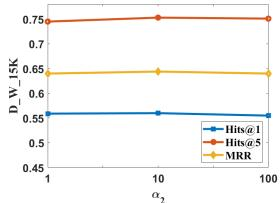  
(a)

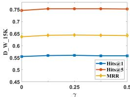  
(b)   
Figure 7: Sensitivity Analysis of (a) Relation Alignment Loss $\alpha_{2}$ and (b) Relation Alignment Label Threshold $\gamma$

found that the number of layers is determined by the distance of information propagation. Meanwhile, other hyper-parameters may also affect the performance of the model, such as relation alignment loss $\alpha_{2}$ and relation alignment label threshold $\gamma$ . Figure 7 reports how these hyper-parameters affect the experiment results on D_W_V1. The effect of these hyper-parameters on model performance is slight and further illustrates the robustness of our RHGN framework. For other hyper-parameters (e.g., negative sample distance margin $\lambda$ and negative sample weight $\alpha_{1}$ ), we follow the previous works(like AliNet (Sun et al., 2020b)).

# A.3 Error Analysis

In order to explore the advantages of our RHGN model, Table 6 shows the results for entities with different numbers of neighbors on EN_FR_V1. We observe that with the increase of neighbor number, the performance of our model improves significantly. In more detail, for entities with various neighbors, our RGC can better avoid the noise caused by multiple relations. However, for entities with fewer neighbors, there is not enough information for them to align. We will attempt to solve this problem by acquiring further neighbors (like relation paths) in future work.

A For every submission:

A1. Did you describe the limitations of your work?

Section 5.4, Section 6 and Section 7

A2. Did you discuss any potential risks of your work?

We do not use huge models and our experiments are fair.

A3. Do the abstract and introduction summarize the paper's main claims?

Section 1

A4. Have you used AI writing assistants when working on this paper?

Left blank.

B Did you use or create scientific artifacts?

Section 5.1 and Section 5.2

B1. Did you cite the creators of artifacts you used?

Section 5.1 and Section 5.2

B2. Did you discuss the license or terms for use and / or distribution of any artifacts?

They are public datasets and open source codes.

B3. Did you discuss if your use of existing artifact(s) was consistent with their intended use, provided that it was specified? For the artifacts you create, do you specify intended use and whether that is compatible with the original access conditions (in particular, derivatives of data accessed for research purposes should not be used outside of research contexts)?

Section 5.1

B4. Did you discuss the steps taken to check whether the data that was collected / used contains any information that names or uniquely identifies individual people or offensive content, and the steps taken to protect / anonymize it?

Date contains no information that names or uniquely identifies individual people or offensive content.

B5. Did you provide documentation of the artifacts, e.g., coverage of domains, languages, and linguistic phenomena, demographic groups represented, etc.?

Section 5.1 and Section 5.2

B6. Did you report relevant statistics like the number of examples, details of train / test / dev splits, etc. for the data that you used / created? Even for commonly-used benchmark datasets, include the number of examples in train / validation / test splits, as these provide necessary context for a reader to understand experimental results. For example, small differences in accuracy on large test sets may be significant, while on small test sets they may not be.

Section 5.1

C Did you run computational experiments?

Section 5

C1. Did you report the number of parameters in the models used, the total computational budget (e.g., GPU hours), and computing infrastructure used?

We do not use huge models and efficiency is not our goal

The Responsible NLP Checklist used at ACL 2023 is adopted from NAACL 2022, with the addition of a question on AI writing assistance.

C2. Did you discuss the experimental setup, including hyperparameter search and best-found hyperparameter values?

Section 5.2

C3. Did you report descriptive statistics about your results (e.g., error bars around results, summary statistics from sets of experiments), and is it transparent whether you are reporting the max, mean, etc. or just a single run?

ection 5.2 and Section 5.4

C4. If you used existing packages (e.g., for preprocessing, for normalization, or for evaluation), did you report the implementation, model, and parameter settings used (e.g., NLTK, Spacy, ROUGE, etc.)?

Section 5.2

D Did you use human annotators (e.g., crowdworkers) or research with human participants?

Left blank.

D1. Did you report the full text of instructions given to participants, including e.g., screenshots, disclaimers of any risks to participants or annotators, etc.?

No response.

D2. Did you report information about how you recruited (e.g., crowdsourcing platform, students) and paid participants, and discuss if such payment is adequate given the participants' demographic (e.g., country of residence)?

No response.

D3. Did you discuss whether and how consent was obtained from people whose data you're using/curating? For example, if you collected data via crowdsourcing, did your instructions to crowdworkers explain how the data would be used?

No response.

D4. Was the data collection protocol approved (or determined exempt) by an ethics review board?

No response.

D5. Did you report the basic demographic and geographic characteristics of the annotator population that is the source of the data?

No response.