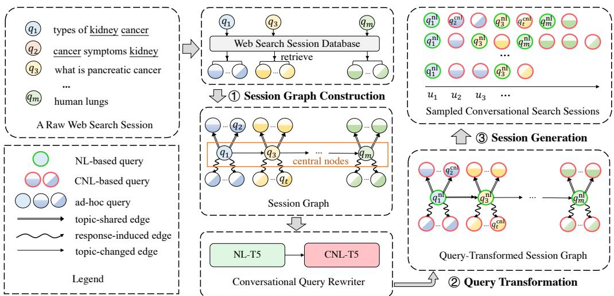
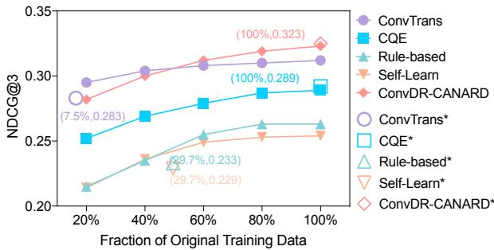
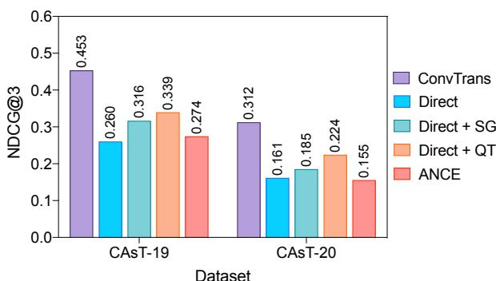

# ConvTrans: Transforming Web Search Sessions for Conversational Dense Retrieval

Kelong Mao $^{1}$ , Zhicheng Dou $^{1*}$ , Hongjin Qian $^{1}$ , Fengran Mo $^{2}$ , Xiaohua Cheng $^{3}$ , Zhao Cao $^{3}$

1Gaoling School of Artificial Intelligence, Renmin University of China

2Université de Montréal, Québec, Canada

$^{3}$ Huawei Poisson Lab

{mk1,dou}@ruc.edu.cn

# Abstract

Conversational search provides users with natural and convenient new search experience. Recently, conversational dense retrieval has shown to be a promising technique to realize conversational search. However, as conversational search systems have not been widely deployed, it is hard to get large-scale real conversational search sessions and relevance labels to support the training of conversational dense retrieval. To tackle this data scarcity problem, previous methods focus on developing better few-shot learning approaches or generating pseudo relevance labels, but the data they use for training still heavily rely on manual generation.

In this paper, we present ConvTrans, a data augmentation method that can automatically transform easily-accessible web search sessions into conversational search sessions to fundamentally alleviate the data scarcity problem for conversational dense retrieval. ConvTrans eliminates the gaps between these two types of sessions in terms of session quality and query form to achieve effective session transformation. Extensive evaluations on two widely used conversational search benchmarks, i.e., CAsT-19 and CAsT-20, demonstrate that the same model trained on the data generated by ConvTrans can achieve comparable retrieval performance as it trained on high-quality but expensive artificial conversational search data.

# 1 Introduction

Conversational search systems support multi-turn interaction with users through conversations to meet various information needs. Such a new search paradigm is more natural, convenient, and user-friendly, which is expected to hugely improve users' search experience in the future (Culpepper et al., 2018). Different from traditional ad-hoc search systems, conversational search systems have to understand the user's real search intent of the current

# Search Session Example

Web: William Shakespeare

Conv: Who is William Shakespeare?

Intent: William Shakespeare

Web: William Shakespeare poems

Conv: Can you show some his poems?

Intent: William Shakespeare poems

Web: When WS wrote hamlet

Conv: When he wrote hamlet?

Intent: Hamlet's finished time

Web: hamlet theme

Conv: What is its theme?

Intent: Theme of Hamlet

# Original vs ConvTrans

Original

train

Artificial

Conversational

Session Encoder

References Relevance Labels

ConvTrans

1 Conversational

Session Encoder

WSS

  
Figure 1: Left: An example of a web search session (WSS) (orange) and a conversational search session (CSS) (blue) sharing similar search intents shift. Right: A high-level illustration of ConvTrans.

sions Relevance Labels

turn based on the history conversation context, facing a more complex search intent understanding problem (Gao et al., 2022).

Recently, inspired by the success of dense retrieval (Karpukhin et al., 2020), conversational dense retrieval has also been developed for conversational search, whose core is to train a conversational session encoder to directly encode the whole conversational search session (i.e., the current query combined with the history conversation context) into an embedding to implicitly represent the real search intents. Although conversational dense retrieval shows to be promising, unfortunately, its development is severely hindered by the lack of data problem. As conversational search systems have not been widely deployed in practice, it is hardly to obtain real large-scale conversational search sessions and corresponding relevance labels to support its training (Yu et al., 2021). Existing methods try to mitigate this data scarcity obstacle by developing better few-shot learning approaches (Yu et al., 2021; Mao et al., 2022) or generating pseudo relevance labels (Lin et al., 2021). Nevertheless, the conversational search sessions

and oracle rewrites that they use for training still rely heavily on manual generation, leading to limited data volume and weak scalability.

Given that the real large-scale conversational search data is naturally unavailable at present and the high cost of artificial data, we propose to leverage the data from another domain, i.e., web search sessions that can be easily collected from existing web search engines, to help train the conversational session encoder. A web search session contains a series of queries and click behaviors of a user in a short period of time, and the click behaviors can be used as relevance labels. It reflects the user's multi-turn interaction with the web search engine, which is similar to the multi-turn interaction in the conversational search session to some extent. As shown in Fig. 1 (left), both the web search session and the conversational search session can share similar search intents shift. These similarities make the web search session be a promising data source for simulating the conversational search process.

However, directly using raw web search sessions may not be effective for training the conversational session encoder due to the following undesirable gaps. First, as shown on the left side of Figure 1, queries in web search sessions are often keyword-based and basically self-contained, while the conversational queries are expressed with natural language and may have some linguistic phenomena, such as ellipsis and co-reference (we call it conversational natural language-based). Second, due to the different forms of search engines, the search behaviors in the two types of sessions are not completely consistent. From the view of conversational search, the search topic shift in the raw web search sessions tends to be more cluttered with more noise, and the session length can be too short or too long because of inaccurate session segmentation. These significant differences in the query form and the session quality are likely to make the conversational session encoder ineffectively trained, resulting in unsatisfactory retrieval performance.

To address these gaps, in this paper, we propose a data augmentation method called ConvTrans, which can automatically transform easily-accessible web search sessions into conversational search sessions to fundamentally alleviate the data scarcity problem for conversational dense retrieval. The right side of Fig. 1 illustrates the idea of such data transformation. Specifically, to facilitate the improvement of the session quality towards con

versational search, we first reorganize the raw web search session into a heterogeneous session graph, whose nodes and edges stand for queries and query relations, respectively. This graph has three types of edges, including response-induced, topic-shared, and topic-changed to simulate three common query (turn) relations in conversational search. Meanwhile, we further add more useful queries retrieved from the whole session database into the graph to enrich its diversity. Then, each query in the graph is transformed into a conversational natural language-based one using a specific conversational query rewritten composed of two T5 models (Raffel et al., 2020). Finally, we perform a random walk sampling on this session graph to generate pseudo conversational search sessions.

By bridging web session search and conversational search, our ConvTrans largely expands available data sources and reduces human efforts to generate new conversational search data, which would also be helpful to solve the cold start problem in deploying real conversational search systems for industry. We apply ConvTrans on MS MARCO search sessions to generate a new dataset and use it to train the conversational session encoder. Extensive evaluations on two widely used conversational search datasets, i.e., CAsT-19 and CAsT-20, show that the same model trained on the dataset generated by ConvTrans can achieve comparable retrieval performance as it trained on high-quality but expensive artificial conversational search data.

Our contributions are summarized as:

- We propose ConvTrans, a data augmentation method which can automatically transform web search sessions into pseudo conversational search sessions to alleviate the data scarcity problem in conversational search.   
- In ConvTrans, we develop a graph-based reorganization method and a specific conversational query rewritten to effectively narrow the gap between the two types of sessions in terms of session quality and query form.   
- We conduct extensive experiments to validate the effectiveness of the conversational search sessions generated by ConvTrans for conversational dense retrieval.

# 2 Related Work

Conversational search. One of the most unique challenges for conversational search is to recover

the users' real information need from the complex conversation context. To solve this problem, there are mainly two types of methods for conversational search, which are query reformulation and conversational dense retrieval. Query reformulation methods (Yu et al., 2020; Voskarides et al., 2020; Lin et al., 2020; Vakulenko et al., 2021; Wu et al., 2021) change conversational search into ad-hoc search by using a query rewriting model to generate an explicit de-contextualized query, while conversational dense retrieval methods (Yu et al., 2021; Lin et al., 2021; Mao et al., 2022; Krasakis et al., 2022; Kim and Kim, 2022; Li et al., 2022) are to encode the conversation context into a high-dimensional space to perform dense retrieval. In contrast, the two-stage query reformulation methods can make better use of the existing ad-hoc search resources, but the integrated conversational dense retrieval methods tend to have lower search latency and are easier to be directly optimized towards retrieval tasks (Lin et al., 2021; Gao et al., 2022). Instead of proposing new learning algorithms or model architectures, our work is to study data augmentation for supporting the training of conversational dense retrieval.

# Data augmentation for conversational search.

A tough problem hindering the development of conversational search is that we are very short of conversational search data, such as conversational search sessions, relevance labels, and oracle rewrites. Data augmentation, as an effective method to alleviate data scarcity problems, has raised attention from the conversational search community. Specifically, Yu et al. (2020) are the first to leverage web search sessions for conversational search. They propose a rule-based method and a self-learn method to transform the web search sessions for training a GPT-based query rewriting model. However, different from our ConvTrans, their work only considers the differences in query forms between these two types of sessions, which is far from enough to build effective conversational search sessions for conversational dense retrieval. Besides, they directly filter out a large number of keyword-based queries, which fails to make full use of the web search sessions. Lin et al. (2021) employ a strong text ranking model to generate pseudo relevance labels for conversational dense retrieval, but they still rely on existing artificial conversational search sessions and oracle rewrites.

Recently, Dai et al. (2022) propose a dialog inpainting method which treats each sentence of a document as a answer and utilize a T5 model to complete the question part to transform a document into a dialog. While the amount of data generated can be very large, this method limits all answers in each conversation (dialog) are come from the same passage, which is not the real case of conversational search. The generated conversation is also not originated from users' real search behaviors.

# 3 Preliminary

# 3.1 Conversational Dense Retrieval

In conversational search, the multi-turn interaction between the user and the search engine constitutes a whole conversational search session $S^{\mathrm{conv}} = \{(u_k,p_k)\}_{k = 1}^n$ , where $u_{k}$ and $p_k$ are the utterance (i.e., conversational query) and the system response passage in the $k$ -th turn, respectively. $n$ is the session length. For the $k$ -th turn, the target of conversational search is to find the passage $p_k$ from a collection $P$ for the utterance $u_{k}$ under its conversation context $C_k = \{(u_i,p_i)_{i = 1}^{k - 1}\}$ . Conversational dense retrieval realizes it by encoding the sub-session of the current turn (i.e., the current utterance $u_{k}$ combined with its conversation context $C_k$ ) and passages into a unified space for matching:

$$
\mathbf {s} _ {\mathbf {k}} = \operatorname {C S E} \left(u _ {k}, C _ {k}\right), \tag {1}
$$

$$
\mathbf {p} = \operatorname {P E} (p), p \in P, \tag {2}
$$

where CSE and PE stand for the conversational session encoder and the passage encoder respectively. The dot product of the conversational session embedding $\mathbf{s_k}$ and the passage embedding $\mathbf{p}$ is used as the retrieval score. Similar to dense retrieval, the negative log likelihood ranking loss is a common choice for training:

$$
\mathcal {L} _ {\text {r a n k}} = - \log \frac {e ^ {\left(\mathbf {s} _ {\mathbf {k}} \cdot \mathbf {p} ^ {+}\right)}}{e ^ {\left(\mathbf {s} _ {\mathbf {k}} \cdot \mathbf {p} ^ {+}\right)} + \sum_ {p ^ {-} \in P} e ^ {\left(\mathbf {s} _ {\mathbf {k}} \cdot \mathbf {p} ^ {-}\right)}}, \tag {3}
$$

where $p^+$ and $p^-$ are the relevant and irrelevant passages for the current turn $k$ . Since there is no obvious difference between ad-hoc search and conversational search from the view of the passage side, the passage encoder is often directly reused from a well-trained ad-hoc passage encoder to save computation cost (Yu et al., 2021; Lin et al., 2021). Correspondingly, the conversational session encoder will be also initialized as a well-trained ad-hoc query encoder. In training, the parameters of the passage

encoder are frozen and only the conversational session encoder will be trained.

# 3.2 Our Motivation

One of the most serious obstacles to conversational dense retrieval is the lack of training data. Currently, most conversational search sessions and query-passage relevance labels are generated by humans, which are limited and expensive. To fundamentally alleviate this data scarcity problem, in this work, we propose to leverage the web search session to help the model training. We choose the web search session because it is not only easily-accessible and large-scale but also reflects the multi-turn interaction of users with the search engine, which is similar to the conversational search session to some extent. Moreover, a large number of users' click behaviors can be used as relevance labels. However, there still exist significant differences in the query form and the session quality between them, making the raw web search sessions not suitable to be directly used as training data for conversational dense retrieval. In the following, we present ConvTrans which tackles the above problems to generate effective pseudo conversational search sessions from raw web search sessions.

# 4 Methodology

Formally, for a raw web search session $S^{\mathrm{web}} = \{(q_k,p_k)\}_{k=1}^m$ , where $q_k$ is the $k$ -th ad-hoc query and $p_k$ is the user's clicked passage for $q_k$ , our ConvTrans is to generate new pseudo conversational search sessions $S^{\mathrm{conv}}$ based on $S^{\mathrm{web}}$ , and the relevance labels of $S^{\mathrm{conv}}$ are directly inherited from $S^{\mathrm{web}}$ . We show an overview of ConvTrans in Fig. 2 and two concrete examples in Appendix C. On the whole, ConvTrans consists of three key steps, including session graph construction, query transformation, and conversational session generation. We elaborate on them in the following.

# 4.1 Session Graph Construction

To facilitate the improvement of the session quality towards conversational search, we first reorganize the raw web search session into a heterogeneous session graph, whose nodes and edges stand for queries and query relations, respectively.

Query relation determination. We define three types of query relations that are common in conversational search, including: (1) response-induced:

A query is induced by the response passage of another query. (2) topic-shared: Two queries share the same main search topic but are on different sub-topics. (3) topic-changed: Two queries are on different main search topics. Specifically, we use the following rules1 to determine the query relation and weight between any two queries $q'$ and $q$ :

- $q'$ has the response-induced relation to $q$ if more than half of terms of $q'$ are in $p^s$ , where $p^s$ is a sentence of the $q$ 's response passage $p$ (i.e., $|q' \cap p^s| > \frac{|q'|}{2}$ ). The weight is defined as $|q' \cap p^s|$ to encourage their similarities. If multiple sentences of the passage $p$ can satisfy the condition, we choose the one with the largest weight.   
- Otherwise, $q'$ has the topic-shared relation to $q$ if more than half of terms of $q$ are in $q'$ (i.e., $|q' \cap q| > \frac{|q|}{2}$ ). The weight is defined as $\frac{|q'|}{|q' \cap q|}$ to encourage the differences between them on the basis of exceeding a similarity threshold.   
- Otherwise, $q'$ has the topic-changed relation to $q$ and the weight is set to a constant.

Notably, the response-induced relation is prioritized because it is harder to be satisfied in the raw session data. The requirement of terms overlap between $q'$ and $p^s$ (or $q$ ) in the first two rules is to inspire ellipsis and co-reference for the subsequent query transformation (Section 4.2).

Graph construction. We sequentially process each query in a raw web search session to construct the session graph. Specifically, the first query $q_{1}$ is first added to the graph as the current central node. Then, we collect a query set $RI(q_{1})$ which contains queries that have the response-induced relation to $q_{1}$ from the remaining queries of this session. Then we add $RI(q_{1})$ to the graph by establishing a response-induced edge from $q_{1}$ to each query of $RI(q_{1})$ . Similarly, then we collect another query set $TS(q_{1})$ from the remaining queries and add $TS(q_{1})$ to the graph with topic-shared edges from $q_{1}$ to the queries of $TS(q_{1})$ . Then, we add the next query $q_{2}$ to the graph by connecting it to the current central node (i.e., $q_{1}$ ) with the topic-changed edge from $q_{1}$ to $q_{2}$ (note that if $q_{2}$ has been already in the graph, the next query will be $q_{3}$ , and so on). Finally, $q_{2}$ becomes the new current

  
Figure 2: Overview of ConvTrans, which contains three key steps (i.e., session graph construction, query transformation, and session generation) to transform raw web search sessions into pseudo conversational search sessions.

central node and we repeat the above process to add all queries of the session to the graph.

However, due to the poor quality of the raw web search session, only very few queries actually satisfy the response-induced or topic-shared relation in the same session. To solve this problem, we resort to the "collaborative power" to enrich the diversity of the graph that improves its quality. Specifically, for $q_{k}$ we not only find its $RI(q_{k})$ and $TS(q_{k})$ in the remaining queries of the session but also additionally retrieve satisfactory queries from the whole session database. Finally, we reduce the noise of the graph by only keeping the Top-5 response-induced and Top-5 topic-shared edges with the largest weights for each central node, but the queries originally in the raw session will be retained first.

# 4.2 Query Transformation

To eliminate the gap between query forms, we propose a conversational query rewriter to transform the ad-hoc queries in the graph into conversational natural language-based ones. Our conversational query rewriter is composed of two T5 models (Raffel et al., 2020) named NL-T5 and CNL-T5.

# 4.2.1 NL-T5

NL-T5 is to transform the keyword-based query into a natural language (NL)-based query. For a natural language-based query $q^{\mathrm{nl}}$ , we employ a keyword extraction method on it to approximately get its corresponding keyword-based query $q^{\mathrm{kw}}$ and use the $(q^{\mathrm{kw}}, q^{\mathrm{nl}})$ pair to train NL-T5. We

use Quora Question Pairs $^2$ dataset, which contains 404,302 natural language-based queries, to build the training pairs. For inference, we simply apply the trained NL-T5 on query nodes that are not natural-language based to transform them into natural-language based ones.

# 4.2.2 CNL-T5

CNL-T5 is to further transform the NL-based query into a conversational natural language (CNL)-based one. Since the query nodes have overlapped terms with their central query nodes or passages, they have the potential to be rewritten as conversational queries. Therefore, we apply CNL-T5 on NL-based query nodes except for those central query nodes to transform them into CNL-based queries. Specifically, for a NL-based query $q^{\mathrm{nl}}$ linked to its central query node $q^{\mathrm{nl}}$ with the topic-shared edge, we get its corresponding CNL-based query $q^{\mathrm{cnl}}$ by:

$$
q ^ {\mathrm {c n l}} = \mathrm {T} 5 \left(\left[ \mathrm {C L S} \right] \circ q ^ {\mathrm {n l}} \circ [ \mathrm {S E P} ] \circ q ^ {\mathrm {n l}} \circ [ \mathrm {S E P} ]\right), \tag {4}
$$

where $\circ$ is the concatenation operation. For $q^{\prime}^{\mathrm{nl}}$ which is linked to its central query node $q^{\mathrm{nl}}$ with the response-induced edge, we get its $q^{\prime}^{\mathrm{cnl}}$ by:

$$
q ^ {\prime} ^ {\mathrm {c n l}} = \mathrm {T} 5 ([ \mathrm {C L S} ] \circ q ^ {\prime \mathrm {n l}} \circ [ \mathrm {S E P} ] \circ p ^ {s} \circ [ \mathrm {S E P} ]). \tag {5}
$$

Notably, an important merit of our CNL-T5 is that, in inference, its input is much shorter than the existing query rewriters for conversational search (Yu et al., 2020; Lin et al., 2020), whose inputs include all of the previous turns. In contrast,

we only need to refer to a short context (i.e., $q^{\mathrm{nl}}$ or $p^s$ ), largely reducing the transformation difficulty.

For training, we use the conversational search sessions of CANARD (Elgohary et al., 2019), a high-quality human-written conversational query reformulation dataset, as the training data. Similar to Yu et al. (2020), we input the concatenation of the oracle queries of the previous turns and the current turn into CNL-T5, and train it to generate the conversational query of the current turn.

# 4.3 Conversational Session Generation

Finally, we develop a specific random walk sampling algorithm to generate pseudo conversational search sessions based on the query-transformed session graph. Algorithm 1 shows the pseudo-code of the whole random walk sampling process. Specifically, we start from the first central node $q_{1}^{\mathrm{nl}}$ and sample it as the first utterance. Then, we sample at most $w$ conversational queries which are linked to $q_{1}^{\mathrm{nl}}$ with topic-shared edges. Then, we continue to sample 0 or 1 conversational query which is linked to $q_{1}^{\mathrm{nl}}$ with the response-induced edge. Then, we move to the next central node along the topic-changed edge and repeat the above process. The intuition of such a random walk order is that users are likely to change to other search topics after raising a query induced by the last response. The whole sampling process stops when the session length meets the pre-defined maximum number of turns $T$ or all query nodes have been sampled.

# 5 Experimental Setup

# 5.1 Datasets and Evaluation Metrics

We collect the raw web search sessions from the MS MARCO Conversational Search DEV dataset3. The dataset is created by joining public queries into private sessions based on embedding similarity, containing 75,193 sessions and 408,389 queries in total. The relevance labels are extracted from the MS MARCO Passage Ranking dataset4.

To evaluate the CSE's retrieval effectiveness after training, we conduct experiments on two widely used conversational search evaluation datasets: CAsT-19 (Dalton et al., 2020) and CAsT-20 (Dalton et al., 2021). These two datasets are manually generated and labeled by the experts of the TREC

Conversational Assistance Track. There are 50 and 25 search-oriented conversations in CAsT-19 and CAsT-20, respectively. Each conversation has around 10 conversational queries (turns) and each conversational query has a corresponding manual oracle rewrite. Compared with CAsT-19, the queries in CAsT-20 can refer to the previous answers and thus is more difficult. The passage collection contains around 38 million passages. Following Dalton et al. (2021), we use MRR5, NDCG@3, and Recall (at cutoff 20 and 100) as the evaluation metrics. NDCG@3 is the primary metric as prescribed by TREC CAsT. All significance tests are conducted with paired t-tests at $p < 0.05$ level.

# 5.2Baselines

We compare ConvTrans with the following baselines: (1) AutoRewriter (Yu et al., 2020): It contains two query rewriting methods: Rule-based and Self-Learn, to transform question-like web search sessions into conversational search sessions and use them to train CSE using the same ranking loss. (2) CQE (Lin et al., 2021): It employs a strong ranking model to generate pseudo relevance labels for the existing CANARD (Elgohary et al., 2019) dataset which contains 5,644 human-written conversational search sessions and uses them to train CSE using the same ranking loss. (3) ConvDR-CANARD (Yu et al., 2021): It uses the conversational search sessions and the oracle query rewrites of the CANARD dataset to train CSE using a knowledge distillation loss. The CSE used in all compared methods are initialized with the same ANCE (Xiong et al., 2021) checkpoint, which is a state-of-the-art ad-hoc query encoder. We also show the results of using the not fune-tuned ANCE as well as only using the current query (i.e., Raw) or the current oracle query (i.e., Oracle) as the model input for reference.

# 5.3 Implementations

We use KeyBERT $^6$ as the keyword extraction method in ConvTrans. The sampling threshold $w$ is set to 3 and the maximum number of turns $T$ is set to 10. We sample one conversational search session for each raw web search session. The conversational session encoder is trained 1 epoch for ConvTrans using the ranking loss (Eq. 3) with the Adam optimizer in batch size 16 and learning rate

Table 1: Retrieval performance comparisons. The best and the second best results are in bold and underlined, respectively. $\dagger$ denotes significant difference between ConvTrans and all the other baselines using paired t-test with $p < 0.05$ . #Sessions is the number of training sessions to train the conversational session encoder.   

<table><tr><td rowspan="2">Method</td><td rowspan="2">#Sessions</td><td colspan="4">CAsT-19</td><td colspan="4">CAsT-20</td></tr><tr><td>MRR</td><td>NDCG@3</td><td>R@20</td><td>R@100</td><td>MRR</td><td>NDCG@3</td><td>R@20</td><td>R@100</td></tr><tr><td>Rule-based</td><td>19,032</td><td>.658</td><td>.382</td><td>.150</td><td>.325</td><td>.398</td><td>.263</td><td>.167</td><td>.322</td></tr><tr><td>Self-Learn</td><td>19,032</td><td>.635</td><td>.374</td><td>.151</td><td>.320</td><td>.379</td><td>.254</td><td>.161</td><td>.313</td></tr><tr><td>CQE</td><td>5,644</td><td>.671</td><td>.409</td><td>.164</td><td>.335</td><td>.423</td><td>.289</td><td>.197</td><td>.356</td></tr><tr><td>ConvDR-CANARD</td><td>5,644</td><td>.717</td><td>.443</td><td>.169</td><td>.332</td><td>.466</td><td>.323</td><td>.183</td><td>.347</td></tr><tr><td>ConvTrans</td><td>75,193</td><td>\( .732^{\dagger} \)</td><td>\( .453^{\dagger} \)</td><td>\( .189^{\dagger} \)</td><td>\( .360^{\dagger} \)</td><td>.459</td><td>\( .312^{\dagger} \)</td><td>\( .211^{\dagger} \)</td><td>\( .387^{\dagger} \)</td></tr><tr><td colspan="10">For Reference</td></tr><tr><td>ANCE</td><td>-</td><td>.491</td><td>.274</td><td>.115</td><td>.254</td><td>.230</td><td>.155</td><td>.129</td><td>.252</td></tr><tr><td>ANCE-Raw</td><td>-</td><td>.420</td><td>.247</td><td>.091</td><td>.187</td><td>.234</td><td>.150</td><td>.075</td><td>.160</td></tr><tr><td>ANCE-Oracle</td><td>-</td><td>.740</td><td>.461</td><td>.195</td><td>.381</td><td>.591</td><td>.422</td><td>.271</td><td>.465</td></tr></table>

5e-7. The input7 to the conversational session encoder (except for ANCE-Raw and ANCE-Oracle) is the concatenation of the current utterance $u_{k}$ , the last response passage $p_{k - 1}$ , and all previous utterances $u_{1:k - 1}$ , with [CLS] in the head and [SEP] to separate turns. The maximum input sequence length is 512 and the maximum length of $p_{k - 1}$ is 384. More implementation details are provided in Appendix B and the released code8.

# 6 Main Results

Table 1 reports the performance comparisons among various methods and we have the following main observations:

(1) ConvTrans significantly outperforms the other baselines w.r.t. Recall. In particular, on the more difficult dataset CAsT-20, ConvTrans achieves $7.1\%$ and $8.7\%$ relative improvements over the second-best results w.r.t. Recall@20 and Recall@100, respectively. In terms of MRR and NDCG@3, ConvTrans also achieves the best performance on CAsT-19 and the second-best performance on CAsT-20, only worse than CQE. Note that the training sessions of ConvTrans and AutoRewriter are transformed from web search sessions while the training sessions of CQE and ConvDR-CANARD are human-written. This result demonstrates that the training sessions generated by ConvTrans are comparably effective as the human-written ones and are significantly better than those of AutoRewriter.   
(2) We find that the five compared methods all obtain large boosts in retrieval performance over

the zero-shot ANCE, indicating that the original ad-hoc query encoder is not effective to solve the complex conversational query understanding problem. It is necessary to generate appropriate conversational search sessions to empower it for conversational search.

(3) ConvDR-CANARD and ConvDR achieve relatively strong performance, especially on MRR and NDCG@3, demonstrating that the knowledge distillation loss is also very effective, but a drawback is that it needs expensive oracle rewrites.   
(4) The numbers of training sessions for different methods are different and ConvTrans has the most training sessions. The reason is: For the two AutoRewriter methods, although they share the same original web search sessions with ConvTrans, they can only use those question-like queries, and thus they finally have fewer available sessions. For CQE and ConvDR-CANARD, their numbers of sessions are strictly limited by the CANARD dataset which only has 5,644 sessions. We emphasize that the ability to freely leverage large-scale raw web search sessions is also an important advantage of our ConvTrans. We further show the study of the impact of the training data size in Section 7.

# 7 Impact of Training Data Size

To study the impact of the amount of training data, we test the performance of the baseline methods and ConvTrans with $20\%$ to $100\%$ of training sessions on CAsT-20. Results are shown in Fig. 3.

We find that with the increase in the amount of training data, the retrieval performance shows an upward trend, but this trend gradually becomes slower. This indicates that although increasing the amount of training data can basically improve the

  
Figure 3: Performance comparisons among different methods with part of training data on CAsT-20. Suffix * means the performance based on 5,644 sessions.

  
Figure 4: Results of ablation studies of ConvTrans.

model effectiveness, simply increasing it may encounter performance bottlenecks. It is necessary to improve the data quality for conversational dense retrieval. In contrast, the performance growth rate of ConvDR-CANARD decreases the slowest with the increase of data volume. The better "sustainability" of ConvDR-CANARD is probably due to its use of high-quality manual oracle rewrites. Unfortunately, we find that ConvTrans becomes incompetent to significantly improve the model performance when the data volume reaches around thirty thousand sessions. This indicates that, although ConvTrans finally achieves decent performance, the quality of the generated sessions may still have a gap with the manually generated data and can be further improved.

Besides, to remove the influence of the training data size for comparisons, we randomly select the same number of training sessions (i.e., 5,644) for all these methods. As shown in Fig. 3, our ConvTrans still significantly outperforms the two AutoRewriter methods and only performs slightly worse than CQE (0.283 v.s 0.289 w.r.t. NDCG@3) whose sessions are human-written, further demonstrating the effectiveness of the training sessions generated by ConvTrans.

Table 2: Performance comparisons among using different session generation strategies.   

<table><tr><td rowspan="2">Ablation</td><td colspan="2">CAsT-19</td><td colspan="2">CAsT-20</td></tr><tr><td>NDCG@3</td><td>R@100</td><td>NDCG@3</td><td>R@100</td></tr><tr><td>ConvTrans-TS</td><td>.449</td><td>.356</td><td>.288</td><td>.361</td></tr><tr><td>ConvTrans-RI</td><td>.311</td><td>.274</td><td>.229</td><td>.292</td></tr><tr><td>ConvTrans</td><td>.453</td><td>.360</td><td>.312</td><td>.387</td></tr></table>

# 8 Ablation Studies

In this section, we investigate the effects of the session graph construction and the query transformation of ConvTrans.

Specifically, we build three ablations: (1) Direct, which directly uses the raw web search sessions as the training data. (2) Direct + SG, which builds session graph to refine the session quality but does not perform query transformation. (3) Direct + QT, which only performs query transformation on the raw web search sessions9. Fig. 4 shows the performance comparisons among these ablations. We find that Direct can only achieve similar performance to the zero-shot ANCE baseline, demonstrating that the raw sessions are not suitable for being the direct training data of the conversational session encoder. After incorporating the session graph (Direct + SG) or the query transformation step (Direct + QT), we observe significant improvements over Direct, verifying that our session graph and query transformation are effective to refine the session quality and transform the query form for the raw web search sessions. However, these two ablations still perform much worse than the complete ConvTrans. This is reasonable since solving only one type of data gap still leads to an out-of-distribution problem for the generated training data, so it is necessary to include both of these two steps in ConvTrans to generate more realistic conversational search sessions.

# 9 Investigation of Using Different Session Generation Strategies

As introduced in Section 4.3, we will sample both topic-shared and response-induced conversational queries for each central query (node). In this section, we investigate the influence of topic-shared and response-induced query relations on the effectiveness of the generated conversational search

Sessions. Specifically, we build two variants: (1) ConvTrans-TS, which only samples topic-shared queries. (2) ConvTrans-RI, which only samples response-induced queries. Results are shown in Table 2. We find that only sampling one type of query will result in performance degradation. In contrast, ConvTrans-TS shows much better performance than ConvTrans-RI, indicating that the topic-shared relation is more important and more common than the response-induced relation in terms of the CAsT datasets. This is also consistent with the actual situation of the two CAsT datasets. In Particular, ConvTrans-TS achieves similar performance to ConvTrans on CAsT-19, but it still performs worse than ConvTrans on CAsT-20. This is because the CAsT-20 dataset has response-induced queries while the CAsT-19 dataset does not.

# 10 Conclusion

In this work, we propose ConvTrans, a data augmentation method which can transform large-scale web search sessions into effective conversational search sessions to support the training of conversational dense retrieval. To mitigate the gaps in terms of the session quality and the query form between the two types of search sessions, we design a graph-based re-organization method and a two-step conversational query rewritten. The pseudo conversational search sessions are generated by performing a tailored random walk on the constructed session graph. We run extensive experiments on two CAsT datasets. Results demonstrate that ConvTrans outperforms state-of-the-art data augmentation baselines for conversational search and can support the model to achieve comparable retrieval performance as using the expensive artificial conversational search data.

Limitations and future work. Our work demonstrates the feasibility of transforming web search sessions for helping the training of conversational dense retrieval. However, we only consider three coarse-grained query relation types (i.e., response-induced, topic-shared, and topic-changed) in this work. In practice, the real conversational search sessions can have more diverse query shifts, such as returning to previous main search topics and referring to more earlier response passages. Studying better ways of session graph construction to handle more complex conversational search behaviors would be a good improvement to this work. Another limitation of this work is that, since we

added some queries and adjusted the order of some queries for the raw web search sessions, their relevance labels may also change to some extent because of changed search session context. But the relevance labels of the generated conversational search sessions are still directly inherited from the raw web search sessions in this work. Therefore, it would be better to develop a method to further check and improve the relevance labels. Finally, as pointed out in Section 7, ConvTrans still has a large improvement space for generating more powerful sessions that can be continuously absorbed by the model to finally achieve better retrieval performance.

# Acknowledgments

Zhicheng Dou is the corresponding author. This work was supported by the National Natural Science Foundation of China No. 61872370, Beijing Outstanding Young Scientist Program NO. BJWZYJH012019100020098, the Fundamental Research Funds for the Central Universities, the Research Funds of Renmin University of China NO. 22XNKJ34, Public Computing Cloud, Renmin University of China, and Intelligent Social Governance Platform, Major Innovation & Planning Interdisciplinary Platform for the "Double-First Class" Initiative, Renmin University of China. The work was partially done at Beijing Key Laboratory of Big Data Management and Analysis Methods, and Key Laboratory of Data Engineering and Knowledge Engineering, MOE.

# References

J Shane Culpepper, Fernando Diaz, and Mark D Smucker. 2018. Research frontiers in information retrieval: Report from the third strategic workshop on information retrieval in lorne (swirl 2018). In ACM SIGIR Forum, volume 52, pages 34-90. ACM New York, NY, USA.   
Zhuyun Dai, Arun Tejasvi Chaganty, Vincent Y Zhao, Aida Amini, Qazi Mamunur Rashid, Mike Green, and Kelvin Guu. 2022. Dialog inpainting: Turning documents into dialogs. In International Conference on Machine Learning, pages 4558-4586. PMLR.   
Jeffrey Dalton, Chenyan Xiong, and Jamie Callan. 2020. Trec cast 2019: The conversational assistance track overview. In In Proceedings of TREC.   
Jeffrey Dalton, Chenyan Xiong, and Jamie Callan. 2021. Cast 2020: The conversational assistance track overview. In In Proceedings of TREC.

Laura Dietz, Manisha Verma, Filip Radlinski, and Nick Craswell. 2017. Trec complex answer retrieval overview. In TREC.   
Ahmed Elgohary, Denis Peskov, and Jordan L. Boyd-Graber. 2019. Can you unpack that? learning to rewrite questions-in-context. In Proceedings of the 2019 Conference on Empirical Methods in Natural Language Processing and the 9th International Joint Conference on Natural Language Processing, EMNLP-IJCNLP 2019, Hong Kong, China, November 3-7, 2019, pages 5917-5923. Association for Computational Linguistics.   
Jianfeng Gao, Chenyan Xiong, Paul Bennett, and Nick Craswell. 2022. Neural approaches to conversational information retrieval. arXiv preprint arXiv:2201.05176.   
Vladimir Karpukhin, Barlas Oguz, Sewon Min, Patrick S. H. Lewis, Ledell Wu, Sergey Edunov, Danqi Chen, and Wen-tau Yih. 2020. Dense passage retrieval for open-domain question answering. In *EMNLP* (1), pages 6769–6781. Association for Computational Linguistics.   
Sungdong Kim and Gangwoo Kim. 2022. Saving dense retriever from shortcut dependency in conversational search. arXiv preprint arXiv:2202.07280.   
Antonios Minas Krasakis, Andrew Yates, and Evangelos Kanoulas. 2022. Zero-shot query contextualization for conversational search. In Proceedings of the 45th International ACM SIGIR conference on research and development in Information Retrieval (SIGIR).   
Yongqi Li, Wenjie Li, and Liqiang Nie. 2022. Dynamic graph reasoning for conversational open-domain question answering. ACM Transactions on Information Systems (TOIS), 40(4):1-24.   
Sheng-Chieh Lin, Jheng-Hong Yang, and Jimmy Lin. 2021. Contextualized query embeddings for conversational search. In Proceedings of the 2021 Conference on Empirical Methods in Natural Language Processing (EMNLP).   
Sheng-Chieh Lin, Jheng-Hong Yang, Rodrigo Nogueira, Ming-Feng Tsai, Chuan-Ju Wang, and Jimmy Lin. 2020. Conversational question reformulation via sequence-to-sequence architectures and pretrained language models. arXiv preprint arXiv:2004.01909.   
Kelong Mao, Zhicheng Dou, and Hongjin Qian. 2022. Curriculum contrastive context denoising for few-shot conversational dense retrieval. In Proceedings of the 45th International ACM SIGIR conference on research and development in Information Retrieval (SIGIR).   
Tri Nguyen, Mir Rosenberg, Xia Song, Jianfeng Gao, Saurabh Tiwary, Rangan Majumder, and Li Deng. 2016. Ms marco: A human generated machine reading comprehension dataset. In CoCo@ NIPS.

Colin Raffel, Noam Shazeer, Adam Roberts, Katherine Lee, Sharan Narang, Michael Matena, Yanqi Zhou, Wei Li, and Peter J. Liu. 2020. Exploring the limits of transfer learning with a unified text-to-text transformer. J. Mach. Learn. Res., 21:140:1-140:67.   
Svitlana Vakulenko, Shayne Longpre, Zhucheng Tu, and Raviteja Anantha. 2021. Question rewriting for conversational question answering. In Proceedings of the 14th ACM International Conference on Web Search and Data Mining (WSDM), pages 355-363.   
Nikos Voskarides, Dan Li, Pengjie Ren, Evangelos Kanoulas, and Maarten de Rijke. 2020. Query resolution for conversational search with limited supervision. In Proceedings of the 43rd International ACM SIGIR conference on research and development in Information Retrieval (SIGIR), pages 921-930.   
Zeqiu Wu, Yi Luan, Hannah Rashkin, David Reitter, and Gaurav Singh Tomar. 2021. Conqrr: Conversational query rewriting for retrieval with reinforcement learning. arXiv preprint arXiv:2112.08558.   
Lee Xiong, Chenyan Xiong, Ye Li, Kwok-Fung Tang, Jialin Liu, Paul N. Bennett, Junaid Ahmed, and Arnold Overwijk. 2021. Approximate nearest neighbor negative contrastive learning for dense text retrieval. In 9th International Conference on Learning Representations, ICLR 2021, Virtual Event, Austria, May 3-7, 2021.   
Shi Yu, Jiahua Liu, Jingqin Yang, Chenyan Xiong, Paul Bennett, Jianfeng Gao, and Zhiyuan Liu. 2020. Few-shot generative conversational query rewriting. In Proceedings of the 43rd International ACM SIGIR conference on research and development in Information Retrieval (SIGIR), pages 1933-1936.   
Shi Yu, Zhenghao Liu, Chenyan Xiong, Tao Feng, and Zhiyuan Liu. 2021. Few-shot conversational dense retrieval. In Proceedings of the 44th International ACM SIGIR conference on research and development in Information Retrieval (SIGIR).

# Appendix

# A Pseudo-Code for Conversational Session Generation

Algorithm 1 Conversational Session Generation

Require: The session graph $G$ , the max number of turns $T$ , a sampling threshold $w$ .

1: Initialize the conversational search session list $S = \left\lbrack  \right\rbrack$ ,the current central query node $c = {q}_{1}^{\mathrm{{nl}}}$ .   
2: while $\text{len}(S) \leq T$ and $c$ is not null do   
3: $S$ .append(c)   
4: $n_1 = \mathrm{randint}(0, w)$ , sampling $n_1$ queries from topic-shared( $G, c$ ) into $S$ .   
5: $n_2 = \mathrm{randint}(0,1)$ , sampling $n_2$ queries from response-induced $(G,c)$ into $S$ .   
6: $c = \text{topic-changed}(G, c)$   
7: end while   
8: $S = S[:T]$   
9: Output $S$

# B More Detailed Experimental Setup

We provide a more detailed introduction of the datasets, implementation, and hyper-parameter settings of ConvTrans and baseline methods in this section.

# B.1 Datasets Details

Table 3: Statistics of the two CAsT datasets and the CANARD dataset.   

<table><tr><td>Statistics</td><td>CAsT-19</td><td>CAsT-20</td><td>CANARD</td></tr><tr><td># Conversations</td><td>50</td><td>25</td><td>5,644</td></tr><tr><td># Turns (queries)</td><td>479</td><td>208</td><td>40,527</td></tr><tr><td># Avg. Queries / Conversation</td><td>9.6</td><td>8.6</td><td>7.2</td></tr></table>

The statistics of the two CAsT datasets and the CANARD dataset are shown in Table 3. In CAsT-19, 173 queries in 20 test conversations have relevance judgments. In CAsT-20, most queries have relevance judgments. The 38 million passages are from MS MARCO (Nguyen et al., 2016) and TREC Complex Answer Retrieval (CAR) (Dietz et al., 2017). All of the conversational search sessions and oracle rewrites of CANARD (i.e., training, development, and test sets) are used in our work.

# B.2 More Implementation Details

# B.2.1 ConvTrans

In the session graph construction, we resort to other web search sessions to obtain more satisfactory queries to refine the graph. Specifically, as the size of the whole session database is very large, we build a term-query inverted index for fast retrieving queries that have the topic-shared relation to $q_{k}$ to expand $TS(q_{k})$ . For expanding $RI(q_{k})$ , we narrow down the range of candidate queries from the whole session database to the queries ever raised after users clicked on passage $p_{k}$ .

When extracting keywords to build the $(q^{\mathrm{kw}}, q^{\mathrm{nl}})$ pairs for training NL-T5, the parameters of KeyBERT are set to: "msmarco-bert-base-dot-v5", keyphrase_ngram_range = (1,2), top_n = 5. The extracted keywords are arranged according to their original order in the query (i.e., $q^{\mathrm{nl}}$ ) to form the keyword-based query $(q^{\mathrm{kw}})$ . NL-T5 and CNL-T5 are based on the HuggingFace T5-base model10.

# B.2.2 Baselines

AutoRewriter. Their original paper also uses the MS MARCO Conversational Search DEV dataset as the raw web search sessions. Therefore, we directly obtain the transformed conversational search sessions of Rule-based and Self-Learn from their original repository11 and use them to train the conversational session encoder. After parameter fine-tuning, we finally train 1 epoch for the conversational session encoder with batch size 16 and learning rate 1e-7.

CQE. In this work, the only difference between CQE and ConvTrans is that CQE uses the CA-NARD dataset with pseudo relevance labels while ConvTrans uses generated conversational search sessions to train the conversational session encoder. We use the pseudo relevance labels released by their official repository12. For CQE, we train the conversational session encoder with batch size 16 and learning rate 1e-6. We use the CAsT-19 training data as the validation set following their original paper.

ConvDR-CANARD. We use their official code13 for implementation and follow their original

settings (i.e., 1e-5 learning rate, 16 batch size, and 1 training epoch) to train ConvDR-CANARD.

ANCE. ANCE is a zero-shot baseline for reference and is also the initial state of the conversational session encoder, which can be downloaded here14.

$u_{6}$ : Is clonazepam a benzo? (from $q_{3}$ )

$u_{7}$ : Does trazodone help? (from $q_{4}$ )

$u_{8}$ : Does it help release serotonin?

$u_{9}$ : What is hydrochlorothiazide? (from $q_{5}$ )

$u_{10}$ : Can it cause leg cramps?

# C Case Studies

In this section, we present two concrete examples of session transformation of ConvTrans. The maximum number of turns $T$ is 10.

# Example #1

The input raw web search session:

$q_{1}$ : a lamborghini cost   
$q_{2}$ : how much is a Tesla   
$q_{3}$ : key west weather   
$q_{4}$ : what is nicki minaj name   
$q_{5}$ : hotels in houston airport

The generated conversational search session:

$u_{1}$ : How much is a lamborghini cost? (from $q_{1}$ )   
$u_{2}$ : How much is the car insurance?   
$u_{3}$ : How much is a Tesla? (from $q_{2}$ )   
$u_{4}$ : How much does it cost to replace its batteries?   
$u_{5}$ : How much electricity can it generate?   
$u_{6}$ : What is the key west weather? (from $q_{3}$ )   
$u_{7}$ : How long does it take to drive to there   
$u_{8}$ : What does the temperature feel like?   
$u_{9}$ : What is nicki minaj name? (from $q_{4}$ )   
$u_{10}$ : What are her tour dates 2015?

# Example #2

The input raw web search session:

$q_{1}$ : what is metoprolol succinate   
$q_{2}$ : what does adipex do   
$q_{3}$ : clonazepam a benzo   
$q_{4}$ : is does trazodone help   
$q_{5}$ : what is hydrochlorothiazide

The generated conversational search session:

$u_{1}$ : What is metoprolol succinate? (from $q_{1}$ )   
$u_{2}$ : Does it cause dry mouth?   
$u_{3}$ : What does a beta blocker?   
$u_{4}$ : What does adipex do? (from $q_{2}$ )   
$u_{5}$ : How long can a doctor write a prescription for?