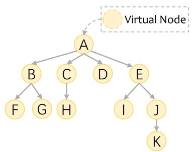
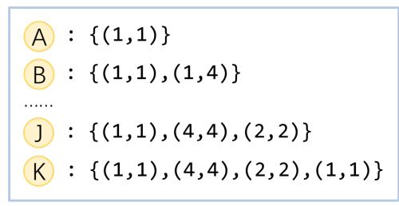
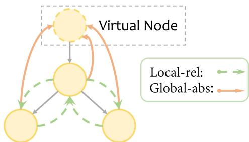

# Rethinking Positional Encoding in Tree Transformer for Code Representation

Han Peng, Ge Li*, Yunfei Zhao, Zhi Jin*

Key Laboratory of High Confidence Software Technologies (Peking University), Ministry of Education; Institute of Software, EECS, Peking University, Beijing, China {phan, lige, zhaoyunfei, zhijin} @pku.edu.cn

# Abstract

Transformers are now widely used in code representation, and several recent works further develop tree Transformers to capture the syntactic structure in source code. Specifically, novel tree positional encodings have been proposed to incorporate inductive bias into Transformer. In this work, we propose a novel tree Transformer encoding node positions based on our new description method for tree structures. Technically, local and global soft bias shown in previous works is both introduced as positional encodings of our Transformer model. Our model finally outperforms strong baselines on code summarization and completion tasks across two languages, demonstrating our model's effectiveness. Besides, extensive experiments and ablation study shows that combining both local and global paradigms is still helpful in improving model performance. We release our code at https://github.com/AwdHanPeng/TreeTransformer.

# 1 Introduction

Machine learning for source code aims to learn the semantic embedding of programs. Due to the format similarity between code and text (Hindle et al., 2016), Transformers (Vaswani et al., 2017) are now widely used in code representation (Hellendoorn et al., 2019; Zügner et al., 2021; Peng et al., 2021). Unlike natural language, source code is more logical and has rich structures such as abstract syntax trees (AST). Therefore, one research topic of code intelligence is representing the syntax tree of code. Several recent works proposed novel tree-based Transformers by defining the position of each node to handle tree structure (Shiv and Quirk, 2019; Kim et al., 2020). In this work, we pursue the research line of tree Transformer for learning code AST.

In Transformer, positional encoding is crucial to exploit potential structures of data (such as code

ASTs or graphs) as other components are entirely position-invariant. Recently, a growing research trend is adapting Transformer to more complex structured data than plain text by modifying positional encoding, not only in language processing (Wang et al., 2019b; Nguyen et al., 2020) but also in graph representation learning field (Dwivedi and Bresson, 2020; Mialon et al., 2021). As for the structure-aware Transformers, the key step of encoding positions is to find a proper description for input structure, which means abstracting the physical structure of data into a suitable mathematical form. For example, the vanilla Transformer (Vaswani et al., 2017) regards the potential text order in natural languages as the arrangement of natural numbers, while the graph Transformers (Kreuzer et al., 2021; Dwivedi and Bresson, 2020) treat the positional relationship between graph nodes as the adjacent matrix or Laplacian further. Intuitively, a good description should be information lossless from which the whole structure of the original data could be precisely reconstructed.

Recently, several tree-based Transformers incorporated with advanced positional encoding are presented to process the code syntax tree. (Shiv and Quirk, 2019) represented the position of each node using sibling orders of all nodes that existed in its path to the root, while (Kim et al., 2020) defined the relative distance between two nodes as the traversing up and down steps along the shortest path connecting them. However, some tree structures are overlooked by these previous approaches: the first method assumes the regular tree with a fixed number of node children, and the second ignores the sibling feature in traversing. In this paper, we present a new description method for node positions from which the corresponding tree can be rebuilt without ambiguity. Specifically, the position of each node is recursively described as a list including multiple 2D coordinates. The coordinate list of each node first inherits from its parent and

then includes a new 2D coordinate of itself, where the first dimension indicates its sibling order and the second is the total child number of its parent.

We incorporate the proposed description method into Transformer, powering it to capture tree structures. Technically, a growing popular approach is to encode structure as soft inductive bias in positional encodings of Transformer, in which attention between all nodes is allowed rather than the strict aspect of message passing. To the best of our knowledge, the soft bias in previous works is usually introduced either in local or global. The local methods integrate the structure relation as one-hop edges only for two adjacent nodes (Hellendoorn et al., 2019; Li et al., 2020), so each node knows its multi-hop subgraph only by stacking model layers. In global approaches, inductive bias is injected into the attention between any nodes regardless of whether adjacent in trees or graphs (Xu et al., 2020; Wang et al., 2019a), in which structures can percolate fully across graphs in a single layer (Shiv and Quirk, 2019).

The local and global methods show expressiveness in previous works, but the relationship between them is still not completely studied to the best of our knowledge. In this paper, we propose a new tree Transformer that integrates our tree description in local and global, exploring the interaction between local and global bias. Our model finally outperforms solid baselines and obtains state-of-the-art in code summarization and completion tasks across two different language datasets. Besides, the ablation results show that both global and local methods are powerful, and the combination improves model performance further. The contributions of this paper are summarized as follows:

1. We propose a novel tree Transformer which significantly outperforms existing baselines across different languages and tasks.   
2. We present a new description method for tree node positions from which tree structure can be reconstructed precisely.   
3. We explore the relationship between the local and global bias proposed in previous works, shedding light on future work.

# 2 Related Work

Representation learning for source code The availability of big code shows opportunities for

representation learning of programs. Traditionally, code intelligence designers have relied predominantly on structure or context. Early research works relied on raw text data for code snippets (Dam et al., 2016; Wang et al., 2016; Allamanis et al., 2016; Iyer et al., 2016), mainly focusing on context and struggle to capture code structure. After that, a growing active research topic is to represent the syntax tree structure of code. (Mou et al., 2016) proposed tree-based convolutional neural networks and (Alon et al., 2018, 2019) treated codes as weighted combination of pairwise paths in AST. (Shiv and Quirk, 2019) proposed a custom positional encoding to extend Transformers to tree-structured data. (Kim et al., 2020) defines the relative distance on the tree as the shorted path between nodes consisting of up and down steps. Our work pursues the research line to model code trees, powering Transformer to learning AST by integrating tree positional encodings. Besides, several works also explored leveraging different code representations jointly, including context, AST structure and other code graphs. (Allamanis et al., 2017) proposed GGNN to represent program graphs consisting of AST with control-flow and data-flow. (Hellendoorn et al., 2019; Zügner et al., 2021; Peng et al., 2021) proposed to learn structure and context together by introducing bias in the self-attention of code context with the underlying tree structure.

Structure-aware Transformers The Transformer model (Vaswani et al., 2017) is the most widely used architecture in language representation learning. Several works have recently explored extending Transformer from plain text to structural data such as graphs and trees. Technically, two approaches exist to integrate inductive bias in Transformer: the hard or soft methods. The hardcoded methods usually use the mask to restrict the attention only to adjacent nodes in graphs or trees (Gao et al., 2021; Wu et al., 2020), that is, the GNN-like message-passing paradigm exists therein. However, there is a growing recognition that inherent limitations exist in message passing, such as over-smoothing and over-squashing (Hamilton, 2020; Alon and Yahav, 2020; Kreuzer et al., 2021). More recently, a growing interest in deep learning is to encode structure as soft inductive bias toward more flexible architectures, such as positional encodings in Transformer. For example, (Mialon et al., 2021) leveraged relative positional encoding in self-attention based on

  
(a)

  
(b)   
Figure 1: Example of a tree and position description for each node therein. A virtual node is added as the parent of each tree node for the sake of description. The position of each node is presented recursively as a list containing multiple 2D coordinates defined in Eq.1.

positive definite kernels on graphs and (Zügner et al., 2021; Ying et al., 2021) incorporate relations such as shortest path distance in Transformer. We follow this research line and explore encoding code AST by integrating tree positional encoding in Transformer as soft inductive bias. Besides, as discussed in the previous section, we further divide the method of introducing soft bias into local and global approaches, and integrate these two paradigms into our proposed model.

Positional encoding for Transformer The absolute positional encoding in vanilla Transformer is presented to capture the potential orders of sequential text. After that, (Shaw et al., 2018) firstly proposed the relative positional encoding to Transformer. Transformer-XL (Dai et al., 2019) then re-parameterized the relative positional encoding of self-attention and T5 (Raffel et al., 2019) simplified the vector representation of relative positions in (Shaw et al., 2018) to scalars. More recently, (Ke et al., 2020; He et al., 2020) proposed the disentangled attention mechanism for positional encoding, showing the irrationality of adding and applying the same projection for position and word embedding. The mechanism of untied positional encoding shows effectiveness in the natural language process (Tsai et al., 2019; Chen et al., 2021a). In this paper, we adopt the idea of the disentangled attention of Transformer and apply it in our model, proving still useful in encoding positions for complex tree structures.

# 3 Approach

In this section, we present our tree Transformer in two parts. We first show the novel two-dimensional description for trees, by which each node's position is converted as a coordinate list. After that, we

embed position from the description for each node and then integrate position encoding in the self-attention of Transformer in local and global.

# 3.1 A 2D recursive description for code AST

Our proposed description for tree structure is defined from the tree root to leaves recursively. Specifically, the position for each node is represented as:

$$
\mathcal {F} (x) = \left\{ \begin{array}{l l} \mathcal {F} (f (x)) + \{(x _ {i}, x _ {j}) \} & i f x \neq r o o t \\ \{(1, 1) \} & i f x = r o o t \end{array} \right. \tag {1}
$$

In Eq.1, $\mathcal{F}(x)$ is the position description for node $x$ including multiply coordinates and $f(x)$ is specified as the parent node for it. It is clearly seen that $\mathcal{F}(x)$ for node $x$ is first inherits from its parent $\mathcal{F}(f(x))$ . After that, a new 2D coordinate is pushed behind the list, in which the first dimension is the sibling order of node $x$ and the second is the total child number of its parent $f(x)$ . The special case is for the tree root because no parent exists. So we add a virtual node as the root's parent, which is also commonly seen in the classical algorithms for trees (Cormen et al., 2022). A clear example of Eq.1 is shown in Fig.1.

Each 2D coordinate is then converted to a vector by the lookup embedding table. In this process, a sample way is first to map each 2D coordinate into a scalar and then retrieve the vector by it. Another method is embedding each dimension first and then adding (or concat) two vectors. Since experiments show no significant difference, we finally pick the first approach. After that, the vector sequence $H_{i}$ for $\mathcal{F}(i)$ is represented as:

$$
H _ {i} = \left[ h \left(i ^ {1}\right), h \left(i ^ {2}\right), \dots , h \left(i ^ {n}\right) \right], \tag {2}
$$

where $n$ is the depth of node $i$ in the tree and $h(i^n)$

is the embedding vector of the nth coordinate in the list.

# 3.2 Encoding tree positions in local and global

Feeding the tree into Transformer requires a linearization method to convert it into a node sequence first. Since the position feature of each node is already represented as the corresponding vector sequence by our tree description, any AST linearization method can be picked for our model. After that, we feed all nodes into Transformer and integrate the position vectors in self-attention by positional encoding.

# 3.2.1 Self-attention and positional encoding

Self-attention is one of the key modules of Transformer and can be formulated as querying the key-value pairs. We omit the index of layer for simplicity and denote $x = (x_{1},x_{2}\dots ,x_{n})$ and $z = (z_{1},z_{2}\dots ,z_{n})$ as the input and output of self-attention in the same layer respectively, where $n$ is the sequence length. The self-attention is presented as:

$$
\alpha_ {i j} = (x _ {i} W ^ {Q}) (x _ {j} W ^ {K}) ^ {T},
$$

$$
z _ {i} = \sum_ {j = 1} ^ {n} \frac {\exp (\alpha_ {i j})}{\sum_ {j ^ {\prime} = 1} ^ {n} \exp (\alpha_ {i j ^ {\prime}})} (x _ {j} W ^ {V}), \tag {3}
$$

where $W^{Q}, W^{K} \in \mathbb{R}^{d_{x} \times d_{k}}, W^{V} \in \mathbb{R}^{d_{x} \times d_{v}}$ is the projection matrices for query, key and value, respectively. We set $d_{k} = d_{v} = d$ . Note that a scaling factor $\frac{1}{\sqrt{d}}$ should be applied for attention score $\alpha_{ij}$ before softmax and we just omit it for the sake of description.

The self-attention in Eq.3 is oblivious to structured input because it effectively views it as an unordered set of vectors. In NLP, a common way to bias Transformer towards potential text order is to add positional encodings. The original Transformer adds the absolute sinusoidal positional encoding to the token embeddings. After that, (Shaw et al., 2018) proposed the first relative positional encoding, in which the real-valued vector represented relative distance is added to the key before the dot-product between the query and key. More recently, several works (Ke et al., 2020; He et al., 2020) proposed that disentangled attention is better than adding and applying the same projection for position and word embedding. The untied absolute positional encoding proposed by (Ke et al., 2020)

is presented as:

$$
\alpha_ {i j} ^ {A B S} = \frac {1}{\sqrt {2}} \left[ \left(a _ {i} W _ {a} ^ {Q}\right) \left(a _ {j} W _ {a} ^ {K}\right) ^ {T} + \alpha_ {i j} \right], \tag {4}
$$

while the disentangled relative positional encoding presented in (He et al., 2020) is:

$$
\begin{array}{l} \alpha_ {i j} ^ {R E L} = \frac {1}{\sqrt {3}} \left[ \left(x _ {i} W ^ {Q}\right) \left(r _ {i j} W _ {r} ^ {K}\right) ^ {T} \right. \tag {5} \\ + (r _ {j i} W _ {r} ^ {Q}) (x _ {j} W ^ {K}) ^ {T} + \alpha_ {i j} ], \\ \end{array}
$$

where $a_{i}, a_{j}$ are the absolute position embedding for position $i$ and $j$ , and $r_{ij}, r_{ji}$ are viewed as the relative position embedding between two positions. $W_{a}^{Q}, W_{a}^{K}, W_{r}^{K}, W_{r}^{Q} \in \mathbb{R}^{d_{x} \times d_{k}}$ are projection matrices for absolute and relative position encodings, and scaling factors $\frac{1}{\sqrt{2}}$ and $\frac{1}{\sqrt{3}}$ are applied to retain magnitudes. In conclusion, the attention score of word embedding $\alpha_{ij}$ presented in Eq.3 is added with the absolute and relative positional attention score in Eq.4-5, respectively. After that, the attention score knowing sequential orders is used to the weighted sum for values.

# 3.2.2 Attention with tree structure

We modify the untied positional encoding in Eq.4-5 to learn code AST structure. The Eq.4 and Eq.5 can both efficiently capture the global positional information in natural languages since both absolute positions and relative distances in texts are tractable, ranging in max length of 512 commonly. As for trees, the absolute position in the tree for each node can be easily drawn from our tree description, shown in the following details. However, it is not trivial to learn relative global relationships between tree nodes since all cases of structure relation are intractable in $\mathcal{O}(n^2)$ where $n$ is the code length. This sticking point is alleviated by only modeling relative distances in trees, such as shortest path distances (Zügner et al., 2021). However, tree structures can not be entirely exploited by distance alone (Peng et al., 2021). Another solution for this crux is only modeling unique relative paths in ASTs (Peng et al., 2021), but the feature coverage is still not guaranteed in theory.

On the other side, previous works (Hellendoorn et al., 2019; Chen et al., 2021b) have proved that introducing local bias as relative one-hop edges only between adjacent nodes is still powerful to model tree structure. The local methods show a different paradigm compared to global approaches, so the intuitive idea is to integrate the local and global

methods. For these reasons, we do not pursue capturing the relative global position but only the local one in this paper. In conclusion, we introduce the global bias by absolute encoding and local bias by relative encoding and then integrate them into the unified Transformer.

The absolute position vector $a_i \in \mathbb{R}^{d_x}$ for node $i$ is presented as:

$$
a _ {i} = L N \left(\operatorname {L i n e a r} \left(\operatorname {C o n c a t} \left(H _ {i}\right)\right)\right), \tag {6}
$$

where we concat vectors in list $H_{i}$ of node $i$ sequentially and feed it into transforming linear and normalization layers. We pad zero vectors for short $H$ lists to max tree depth and truncate last for long lists before concat vectors.

The relative position vector $r_{ij} \in \mathbb{R}^{d_x}$ between node $i$ and $j$ is:

$$
r _ {i j} = \left\{ \begin{array}{c c} L N (L i n e a r (\sum_ {h} H _ {i} - \sum_ {h} H _ {j})) \\ \quad i f f (i) = j \vee f (j) = i \\ \vec {0} \quad i f f (i) \neq j \wedge f (j) \neq i \end{array} \right. \tag {7}
$$

In Eq.7, $f(.)$ is specified as the node's parent. For example, given node $x$ and one of its children $y$ , we sum the vector lists for these two nodes respectively and subtract two sum vectors. Thus, the subtraction vector fed into the linear layer actually is the embedding of coordinate $(y_i, y_j)$ defined by Eq.1, and all cases of it are tractable in $\mathcal{O}(m)$ where $m$ is the size of coordinate embedding table. The linear and normalization layers of relative vectors have different parameters from the absolute ones in Eq.6. The relation vector is set as zero if there is no adjacency between two nodes, and obviously, only the local one-hop relationship is actually embedded in this encoding process.

We first introduce the global absolute position encoding into the self-attention of Transformer. The attention score $\beta_{ij}$ between absolute positions of node $i$ and $j$ is presented as:

$$
\beta_ {i j} = \left(a _ {i} W _ {a} ^ {Q}\right) \left(a _ {j} W _ {a} ^ {K}\right) ^ {T}, \tag {8}
$$

where $W_{a}^{Q}, W_{a}^{K} \in \mathbb{R}^{d_{x} \times d_{k}}$ are projection matrices. After that, the local relative position attention score $\gamma_{ij}$ is presented as:

$$
\begin{array}{l} \gamma_ {i j} = \left(x _ {i} W ^ {Q}\right) \left(r _ {i j} W _ {r} ^ {K}\right) ^ {T} \tag {9} \\ + (r _ {j i} W _ {r} ^ {Q}) (x _ {j} W ^ {K}) ^ {T} \\ \end{array}
$$

where $W_{r}^{Q}, W_{r}^{K} \in \mathbb{R}^{d_{x} \times d_{k}}$ are projection matrices for the query and key.

We integrate $\beta_{ij}$ and $\gamma_{ij}$ into Transformer, adding to the attention score $\alpha_{ij}$ of word embeddings:

$$
\begin{array}{l} A _ {i j} = \frac {1}{\sqrt {2}} \left(\alpha_ {i j} + \beta_ {i j} + \gamma_ {i j}\right), \\ z _ {i} = \sum_ {j = 1} ^ {n} \frac {\exp \left(A _ {i j}\right)}{\sum_ {j ^ {\prime} = 1} ^ {n} \exp \left(A _ {i j ^ {\prime}}\right)} \left(x _ {j} W ^ {V}\right). \tag {10} \\ \end{array}
$$

Although four vector dot-product exist in $A_{ij}$ , we apply the scaling factors as $\frac{1}{\sqrt{2}}$ rather than $\frac{1}{\sqrt{4}}$ since the number of non-zero $\gamma_{i\_}$ for node $i$ is only the number of its adjacent node and far less than the length of input node sequence.

# 3.3 Discussion for tree positional encodings

Our absolute global position encoding for each node extracts structure features from the positional description $\mathcal{F}(.)$ . All nodes' absolute position vectors are scattered in the structural space with virtual nodes as the origin. Comparing $\mathcal{F}(.)$ of two nodes, a path including a series of steps along tree branches shows clearly. Thus, our model has the potential to capture the pairwise path by dot-products in Eq.8 of two position vectors. The main differences of our absolute positional encoding compared to the approach presented in (Shiv and Quirk, 2019) are two folds: firstly, we describe each node position by two dimensions, including not only the sibling orders but the child number of its parent, while (Shiv and Quirk, 2019) only consider the first; secondly, we embed each coordinate into vector directly and integrate it into the disentangled attention, while (Shiv and Quirk, 2019) parameterize the one-hot concat of sibling orders and add the position vector to word embeddings before feeding into Transformer. Therefore, our absolute positional encoding can be seen as the advanced generalization of (Shiv and Quirk, 2019).

Our proposed relative positional encoding focus on the local structural relation between adjacent nodes. The relative position vector presented in Eq.7 contains many structural features: firstly, the asymmetric of $r_{ij}$ and $r_{ji}$ reveals the parent-child relationship and vice versa; secondly, two dimensions of coordinates are embedded in relative vectors. Note that our method is different from GREAT proposed in (Hellendoorn et al., 2019). In GREAT, each parent node knows its children only by two types of edges: parent and child edges (Chirkova and Troshin, 2021), which means the parent does not know the sibling order of its children. Thus,

our proposed local relative positional encoding can be viewed as the extension of GREAT.

In both GREAT and our local module, each node learns structure only from its adjacent nodes, and its receptive field for structure extends only by stacking model layers. The local method of introducing bias differs from the global approaches presented in (Shiv and Quirk, 2019) and our absolute position encoding. In this work, we integrate the global and local methods and further analyze their relationship. See Fig2 for explanation to our model.

  
Figure 2: Example of a simple tree. We assign each node's global position by absolute encoding and introduce the local relationship between adjacent nodes as relative one-hop edges.

# 4 Experiment setup

We focus on two tasks of code representation learning: code summarization and completion. Code summarization is one of the most popular tasks in which the function name is predicted given a function body. The method body typically forms complete logical units, and the function name tends to be precisely descriptive. Therefore, code summarization is widely used as benchmark by several previous works (Allamanis et al., 2016; Alon et al., 2018; Zügner et al., 2021; Peng et al., 2021). The code completion is another useful benchmark, and we mainly focus on the completion for each tree node (Li et al., 2017; Sun et al., 2020; Kim et al., 2020). In this task, AST is linearized in depth-first order for all baselines. Each node is then predicted given the partial tree built on all the previous nodes in depth-first order.

In both summarization and completion tasks, we use the Python150k and JavaScript150k datasets1 preprocessed by (Chirkova and Troshin, 2021). Both datasets consist of program files from Github2 and are widely used to evaluate code represent

tation models. To avoid biased results, duplicate files are removed by the duplication list provided by (Allamanis, 2019), and identical code files and functions are further filtered out by (Chirkova and Troshin, 2021). Both datasets are split into training/validation/testing sets with $60\% / 6.7\% / 33.3\%$ based on GitHub usernames.

In this paper, we mainly compare our model with tree-based Transformer models. Before feeding trees into all compared Transformers, we linearize ASTs in depth-first order and convert them as node sequences. Note that each node in AST is associated with a type, but not all nodes have values (such as non-leaf nodes in trees). Therefore, a special $<\text{empty}>$ value is associated with nodes that do not have values. The type and value embeddings are added as input node features fed into models. For all compared models in both tasks, node tokens are not split into subtokens for computational efficiency following (Chirkova and Troshin, 2021).

# 4.1 Code summarization

In this task, seq2seq models decode function names according to function ASTs. Sequential positional embedding is used in Transformer decoder to capture the order of function names. All top-level functions short than 250 AST nodes are selected from filtered files. After extracting functions from code files, we replace function names with the special <function_name> token and split target function names based on CamelCase or snake(case). The final datasets include $523\mathrm{k} / 56\mathrm{k} / 264\mathrm{k}$ functions for python and $186\mathrm{k} / 23\mathrm{k} / 93\mathrm{k}$ for javascript to training/validation/testing. Multiple metrics are used to comprehensively measure the quality of generated function names, including Bleu (Papineni et al., 2002), F1 and Acc. The generated function name is viewed as a token list for Bleu while seen as an unordered set for F1 and Acc.

# 4.2 Code completion

In this task, Transformer decoders with masked attention are used to predict each node given all previous nodes in depth-first order. Two linear layers with softmax are set on top of Transformer decoder to predict both value and type of the next node. We use full ASTs of filtered files except for sequences less than 2. We split larger ASTs longer than 500 into overlapping chunks with a shift of 250. The overlap in each chunk provides a context for models, and we count loss and metrics over the intersection between chunks only

once. The details of this part are also presented in (Chirkova and Troshin, 2021; Kim et al., 2020). The final datasets include $186\mathrm{k} / 20\mathrm{k} / 100\mathrm{k}$ chunks for python and $270\mathrm{k} / 32\mathrm{k} / 220\mathrm{k}$ for javascript to training/validation/testing. In this task, we measure MRR(mean reciprocal rank) and Acc for type and value, respectively. We assign the zero score for MRR if the correct token is out of the top 10 candidates. Besides, we measure the combined Acc(all) and assign true only when both value and type are correct for each node.

# 4.3 Hyperparameters

Our model and Transformer baselines all have 6 layers, 8 heads, hidden size $D = 512$ and FFN dimension $D_{FF} = 2048$ . The vocabulary sizes for values are $50\mathrm{K} / 100\mathrm{K}$ for summarization and completion tasks respectively, and all types are preserved. We train all Transformers using Adam (Kingma and Ba, 2014) with a starting learning rate of $1e^{-4}$ and batch size of 32. We train all models with 20/60 epochs for summarization and 20/20 epochs for completion in python/javascript. In summarization, we decay the learning rate by 0.9 in python, use a constant learning rate in javascript, and a gradient clipping of 5 for both languages. We use the cosine learning rate schedule with 2k warmup steps with a zero minimal learning rate in completion. In conclusion, the training settings mostly follow (Chirkova and Troshin, 2021) but with slight differences.

In our model, we set the maximum children number for each tree as 16 for all tasks and languages, meaning each dimension in 2D coordinates ranges from 1 to 16. The coordinate beyond the upper limit is set as the maximum of 16. Therefore, the size of the coordinate embedding table is $\frac{16(16 + 1)}{2} = 136$ since the first dimension of 2D coordinates always less than or equal to the second one. We set the embedding dimension 32/32 for summarization and 32/16 for completion in python/javascript, respectively. Thus, the embedding table for coordinates has very few parameters. Besides, we set the max tree depth as 16/16 for summarization and 16/32 for completion in python/javascript. The hyperparameter setting of maximum children and depth covers almost all samples. In our implementation, the positional vectors $a$ and $r$ are shared across different heads, while the projection matrices in Eq.8-9 are different for all heads. These matrices are shared in different layers for efficiency, which means we

calculate the positional attention score only once. In summary, we introduce only about 1.3M new parameters, which is insignificant compared to the full parameters of Transformer architecture.

# 4.4Baselines

Four different Transformers are picked as baselines of our model, including vanilla Transformer (Vaswani et al., 2017), Transformer with relative positional encoding presented in (Shaw et al., 2018) and the tree-based Transformers propose by (Shiv and Quirk, 2019) and (Kim et al., 2020). Before feeding trees into models, ASTs are uniformly linearized into node sequences in depth-first order. Therefore, although the former two Transformers are designed initially for natural language, they still have the potential to capture tree structure from the depth-first order. The Transformers in (Shiv and Quirk, 2019) and (Kim et al., 2020) learn tree structure by different positional encoding for trees rather than traversal orders, similar to our model. All models are trained three times to estimate mean±std on one Tesla V100 GPU, and we set all hyperparameters of baselines following the best practices shown in (Chirkova and Troshin, 2021).

We do not introduce GREAT shown in (Hellen-doorn et al., 2019) as one of the baselines following (Chirkova and Troshin, 2021), also since our model can be seen as the generalization of it discussed in section 3.3. The Transformer models jointly learn from both context and structure (Zügner et al., 2021; Peng et al., 2021) are also not introduced as our baselines. Although it is already proven that combined multiply modality is helpful for representation learning of code, we firmly believe that it is still meaningful to explore tree-based Transformer only for AST structure.

# 5 Results

# 5.1 Overall comparison

The overall results of code completion and summarization tasks are shown in Table 1 and 2, respectively. Note that since slight training differences, the result of baselines are not entirely consistent with (Chirkova and Troshin, 2021), but the overall trend is almost identical.

Our model substantially outperforms baselines almost in all metrics of both tasks. Firstly, our model outperforms baselines for completion task of different languages in almost all metrics shown in Table 1. The only exception is to predict node

Table 1: All results on code completion   

<table><tr><td rowspan="2">Model</td><td colspan="5">Python</td><td colspan="5">JavaScript</td></tr><tr><td>MRR (Type)</td><td>MRR (Value)</td><td>ACC (Type)</td><td>ACC (Value)</td><td>ACC (All)</td><td>MRR (Type)</td><td>MRR (Value)</td><td>ACC (Type)</td><td>ACC (Value)</td><td>ACC (All)</td></tr><tr><td>Transformer</td><td>88.76</td><td>54.28</td><td>81.91</td><td>49.56</td><td>59.27</td><td>89.51</td><td>62.73</td><td>82.73</td><td>57.40</td><td>63.34</td></tr><tr><td rowspan="3">(Shaw et al., 2018)</td><td>±0.09</td><td>±0.02</td><td>±0.13</td><td>±0.06</td><td>±0.11</td><td>±0.01</td><td>±0.02</td><td>±0.01</td><td>±0.02</td><td>±0.03</td></tr><tr><td>89.05</td><td>55.11</td><td>82.34</td><td>50.48</td><td>60.07</td><td>90.07</td><td>64.13</td><td>83.60</td><td>59.09</td><td>64.80</td></tr><tr><td>±0.04</td><td>±0.04</td><td>±0.06</td><td>±0.08</td><td>±0.14</td><td>±0.03</td><td>±0.05</td><td>±0.05</td><td>±0.09</td><td>±0.14</td></tr><tr><td rowspan="2">(Shiv and Quirk, 2019)</td><td>88.74</td><td>54.24</td><td>81.81</td><td>49.40</td><td>59.14</td><td>89.78</td><td>62.90</td><td>83.10</td><td>57.48</td><td>63.64</td></tr><tr><td>±0.10</td><td>±0.20</td><td>±0.14</td><td>±0.26</td><td>±0.21</td><td>±0.10</td><td>±0.15</td><td>±0.15</td><td>±0.20</td><td>±0.15</td></tr><tr><td rowspan="2">(Kim et al., 2020)</td><td>91.26</td><td>54.79</td><td>85.64</td><td>50.04</td><td>62.15</td><td>91.21</td><td>63.49</td><td>85.12</td><td>58.24</td><td>65.42</td></tr><tr><td>±0.03</td><td>±0.02</td><td>±0.05</td><td>±0.02</td><td>±0.02</td><td>±0.04</td><td>±0.09</td><td>±0.06</td><td>±0.10</td><td>±0.11</td></tr><tr><td rowspan="2">Our model</td><td>91.58</td><td>55.62</td><td>86.15</td><td>51.19</td><td>63.19</td><td>91.63</td><td>64.08</td><td>85.91</td><td>58.99</td><td>66.48</td></tr><tr><td>±0.08</td><td>±0.06</td><td>±0.12</td><td>±0.13</td><td>±0.13</td><td>±0.03</td><td>±0.08</td><td>±0.06</td><td>±0.13</td><td>±0.14</td></tr><tr><td rowspan="2">w/o first dim.</td><td>88.81</td><td>54.63</td><td>81.90</td><td>49.86</td><td>59.36</td><td>89.91</td><td>63.25</td><td>83.28</td><td>57.97</td><td>64.02</td></tr><tr><td>±0.11</td><td>±0.09</td><td>±0.17</td><td>±0.14</td><td>±0.26</td><td>±0.06</td><td>±0.22</td><td>±0.10</td><td>±0.28</td><td>±0.29</td></tr><tr><td rowspan="2">w/o second dim.</td><td>90.78</td><td>55.10</td><td>84.87</td><td>50.52</td><td>62.04</td><td>91.08</td><td>63.50</td><td>85.02</td><td>58.30</td><td>65.47</td></tr><tr><td>±0.02</td><td>±0.08</td><td>±0.02</td><td>±0.10</td><td>±0.07</td><td>±0.06</td><td>±0.10</td><td>±0.10</td><td>±0.13</td><td>±0.17</td></tr><tr><td rowspan="2">w/o Global-Abs.</td><td>91.40</td><td>55.25</td><td>85.88</td><td>50.68</td><td>62.70</td><td>91.57</td><td>63.95</td><td>85.84</td><td>58.84</td><td>66.34</td></tr><tr><td>±0.09</td><td>±0.15</td><td>±0.13</td><td>±0.21</td><td>±0.23</td><td>±0.03</td><td>±0.09</td><td>±0.04</td><td>±0.13</td><td>±0.11</td></tr><tr><td rowspan="2">w/o Local-Rel.</td><td>91.35</td><td>55.36</td><td>85.81</td><td>50.81</td><td>62.75</td><td>91.18</td><td>63.51</td><td>85.25</td><td>58.28</td><td>65.67</td></tr><tr><td>±0.07</td><td>±0.03</td><td>±0.12</td><td>±0.08</td><td>±0.15</td><td>±0.07</td><td>±0.15</td><td>±0.11</td><td>±0.18</td><td>±0.12</td></tr></table>

value in javascript, while our model still gains a comparable performance to (Shaw et al., 2018). Interestingly, some baselines only perform well in predicting either type or value. For example, the relative sequential Transformer in (Shaw et al., 2018) performs best to predict node value in javascript but is poor for node type. Thus, we additionally calculate the Acc(all) to measure whether models accurately predict both type and value simultaneously. The final result highlights the effectiveness of our model for predicting both type and value.

Secondly, our model shows effectiveness in summarization task for both languages in Table 2. It is worth noting that although baselines perform similarly, consisting of observations in (Chirkova and Troshin, 2021), our model still improves from them. It may indicate that previous works do not learn code AST structure well and therefore meet the performance bottleneck in this task.

# 5.2 Ablation study

We explore the roles of each part of our approach, including two dimensions in each coordinate and global/local modules to introduce structural bias.

Two dimensions of tree description Our approach describes each node's position as a 2D coordinate list. To verify the benefit of learning from both dimensions, we consider removing one di

mension of each coordinate before feeding it into Transformer. The ablation results for each dimension on different tasks are shown in Table 1 and 2. We find that model's performance shows noticeable declines after removing either dimension, proving that all dimensions are helpful.

Global and local encoding for tree position Our model introduces global and local soft bias to encode tree structures. To explore the roles of each part, we remove either global or local modules in self-attention of Transformer, which means only adding either $\beta$ or $\gamma$ to the attention score $\alpha$ of word embedding in Eq.10. The ablation results are shown in Table 1 and 2. We find that both encoding methods are powerful for each task: only global or local method already outperforms almost all baselines. The comparison again proves that 2D description for trees is beneficial and also shows that the disentangled attention mechanism shown in NLP is still helpful in modelling complex tree positions. We then compare the performance of each part to the whole model and find that model's performance improves further than the single local or global component. For this phenomenon, we speculate that since the local method extracts the relationship between nodes by strictly stacking model layers, local features are less likely to be lost.

Table 2: All results on code summarization   

<table><tr><td rowspan="2">Model</td><td colspan="3">Python</td><td colspan="3">JavaScript</td></tr><tr><td>Bleu</td><td>F1</td><td>Acc</td><td>Bleu</td><td>F1</td><td>Acc</td></tr><tr><td>Transformer</td><td>56.29±0.06</td><td>33.95±0.28</td><td>18.29±0.44</td><td>56.51±0.13</td><td>22.62±0.59</td><td>11.66±0.34</td></tr><tr><td>(Shaw et al., 2018)</td><td>56.86±0.30</td><td>35.58±0.48</td><td>19.51±0.41</td><td>56.75±0.13</td><td>23.22±0.73</td><td>11.32±1.78</td></tr><tr><td>(Shiv and Quirk, 2019)</td><td>56.50±0.19</td><td>34.54±0.38</td><td>18.89±0.48</td><td>57.04±0.23</td><td>24.01±0.21</td><td>11.53±0.53</td></tr><tr><td>(Kim et al., 2020)</td><td>57.02±0.17</td><td>35.55±0.41</td><td>19.29±0.35</td><td>57.33±0.38</td><td>23.47±0.28</td><td>12.07±0.74</td></tr><tr><td>Our model</td><td>57.28±0.16</td><td>36.00±0.10</td><td>19.97±0.17</td><td>57.72±0.19</td><td>25.03±0.37</td><td>13.21±0.24</td></tr><tr><td>w/o first dim.</td><td>57.10±0.14</td><td>35.94±0.21</td><td>19.54±0.20</td><td>57.40±0.25</td><td>24.22±0.65</td><td>12.92±0.27</td></tr><tr><td>w/o second dim.</td><td>56.89±0.15</td><td>35.36±0.10</td><td>19.24±0.48</td><td>57.27±0.09</td><td>24.30±0.29</td><td>12.66±0.69</td></tr><tr><td>w/o Global-Abs.</td><td>56.83±0.14</td><td>35.80±0.29</td><td>19.47±0.10</td><td>57.27±0.32</td><td>23.86±0.10</td><td>12.30±0.65</td></tr><tr><td>w/o Local-Rel.</td><td>56.95±0.10</td><td>35.36±0.37</td><td>19.29±0.66</td><td>57.50±0.05</td><td>23.74±0.18</td><td>13.13±0.09</td></tr></table>

On the other hand, although the global method theoretically knows the complete relationship between arbitrary nodes, global bias is relatively soft and perhaps fragile. As a result, the local way shows benefits to polishing the global perspective. To the best of our knowledge, no previous work explored combining them, while we finally show the benefits of fusing the local and global paradigms.

# 6 Conclusion

We propose a new tree Transformer encoding position for each node based on our novel two-dimensional description of tree structures. Technically, our model introduces soft bias as the positional encoding of Transformer in global and local ways. Our model finally outperforms strong baselines on code summarization and completion tasks across two different languages, highlighting the effectiveness of our approach.

# 7 Acknowledgements

We thank all reviewers for their constructive comments and Kechi Zhang for the discussion on the manuscript. This research is supported by the National Natural Science Foundation of China under Grant No. 62072007, 62192733, 61832009, 62192731, 62192730.

# Limitations

In this work, we propose a new tree transformer and compare it with several baselines in two tasks of different languages. To comprehensively and precisely measure the performance of our model and all baselines, we train all models three times. We do not entirely rely on the results produced by previous work, and just choose them as references.

As a result, our experiments may produce a lot of carbon dioxide and consume electrical power.

In this paper, we mainly focus on the representation learning for source code on the function level (or in similar length as functions) and do not discuss the model scalability to the corpus of extreme long source code (such as full program files). We believe that learning from long source code is an interesting and valuable research topic, and perhaps explore extending our model for it in the future.

We believe our approach should be workable on most tasks related to code trees in theory. However, since additional code graph structure, including data-flow and control-flow, isn't considered in our approach, some related tasks may not be suitable. Besides, the additional context feature of code tokens is also not discussed, and recently Transformer models jointly learn from both context and tree structure are not mentioned as our baselines. To combine context and structure, a starting point is to map tree nodes to code tokens. After that, it should be useful for our model to add positional encoding of code context orders for these assigned nodes, and we perhaps explore it in the future.

# References

Miltiadis Allamanis. 2019. The adverse effects of code duplication in machine learning models of code. In Proceedings of the 2019 ACM SIGPLAN International Symposium on New Ideas, New Paradigms, and Reflections on Programming and Software, pages 143-153.   
Miltiadis Allamanis, Marc Brockschmidt, and Mahmoud Khademi. 2017. Learning to represent programs with graphs. arXiv preprint arXiv:1711.00740.

Miltiadis Allamanis, Hao Peng, and Charles Sutton. 2016. A convolutional attention network for extreme summarization of source code. In International conference on machine learning, pages 2091-2100. PMLR.   
Uri Alon, Shaked Brody, Omer Levy, and Eran Yahav. 2018. code2seq: Generating sequences from structured representations of code. arXiv preprint arXiv:1808.01400.   
Uri Alon and Eran Yahav. 2020. On the bottleneck of graph neural networks and its practical implications. arXiv preprint arXiv:2006.05205.   
Uri Alon, Meital Zilberstein, Omer Levy, and Eran Yahav. 2019. code2vec: Learning distributed representations of code. Proceedings of the ACM on Programming Languages, 3(POPL):1-29.   
Pu-Chin Chen, Henry Tsai, Srinadh Bhojanapalli, Hyung Won Chung, Yin-Wen Chang, and Chun-Sung Ferng. 2021a. A simple and effective positional encoding for transformers. In Proceedings of the 2021 Conference on Empirical Methods in Natural Language Processing, pages 2974-2988.   
Zimin Chen, Vincent Josua Hellendoorn, Pascal Lamblin, Petros Maniatis, Pierre-Antoine Manzagol, Daniel Tarlow, and Subhodeep Moitra. 2021b. PLUR: A unifying, graph-based view of program learning, understanding, and repair. In Advances in Neural Information Processing Systems.   
Nadezhda Chirkova and Sergey Troshin. 2021. Empirical study of transformers for source code. In Proceedings of the 29th ACM Joint Meeting on European Software Engineering Conference and Symposium on the Foundations of Software Engineering, pages 703-715.   
Thomas H Cormen, Charles E Leiserson, Ronald L Rivest, and Clifford Stein. 2022. Introduction to algorithms. MIT press.   
Zihang Dai, Zhilin Yang, Yiming Yang, Jaime Carbonell, Quoc V Le, and Ruslan Salakhutdinov. 2019. Transformer-xl: Attentive language models beyond a fixed-length context. arXiv preprint arXiv:1901.02860.   
Hoa Khanh Dam, Truyen Tran, and Trang Pham. 2016. A deep language model for software code. arXiv preprint arXiv:1608.02715.   
Vijay Prakash Dwivedi and Xavier Bresson. 2020. A generalization of transformer networks to graphs. arXiv preprint arXiv:2012.09699.   
Shuzheng Gao, Cuiyun Gao, Yulan He, Jichuan Zeng, Lun Yiu Nie, and Xin Xia. 2021. Code structure guided transformer for source code summarization. arXiv preprint arXiv:2104.09340.   
William L Hamilton. 2020. Graph representation learning. Synthesis Lectures on Artificial Intelligence and Machine Learning, 14(3):1-159.

Pengcheng He, Xiaodong Liu, Jianfeng Gao, and Weizhu Chen. 2020. Deberta: Decoding-enhanced bert with disentangled attention. arXiv preprint arXiv:2006.03654.   
Vincent J Hellendoorn, Charles Sutton, Rishabh Singh, Petros Maniatis, and David Bieber. 2019. Global relational models of source code. In International conference on learning representations.   
Abram Hindle, Earl T Barr, Mark Gabel, Zhendong Su, and Premkumar Devanbu. 2016. On the naturalness of software. Communications of the ACM, 59(5):122-131.   
Srinivasan Iyer, Ioannis Konstas, Alvin Cheung, and Luke Zettlemoyer. 2016. Summarizing source code using a neural attention model. In Proceedings of the 54th Annual Meeting of the Association for Computational Linguistics (Volume 1: Long Papers), pages 2073-2083.   
Guolin Ke, Di He, and Tie-Yan Liu. 2020. Rethinking the positional encoding in language pre-training. arXiv preprint arXiv:2006.15595.   
Seohyun Kim, Jinman Zhao, Yuchi Tian, and Satish Chandra. 2020. Code prediction by feeding trees to transformers. arXiv preprint arXiv:2003.13848.   
Diederik P Kingma and Jimmy Ba. 2014. Adam: A method for stochastic optimization. arXiv preprint arXiv:1412.6980.   
Devin Kreuzer, Dominique Beaini, Will Hamilton, Vincent Létourneau, and Prudencio Tossou. 2021. Rethinking graph transformers with spectral attention. Advances in Neural Information Processing Systems, 34.   
Jian Li, Yue Wang, Michael R Lyu, and Irwin King. 2017. Code completion with neural attention and pointer networks. arXiv preprint arXiv:1711.09573.   
Zhongli Li, Qingyu Zhou, Chao Li, Ke Xu, and Yunbo Cao. 2020. Improving bert with syntax-aware local attention. arXiv preprint arXiv:2012.15150.   
Grégoire Mialon, Dexiong Chen, Margot Selosse, and Julien Mairal. 2021. Graphit: Encoding graph structure in transformers. arXiv preprint arXiv:2106.05667.   
Lili Mou, Ge Li, Lu Zhang, Tao Wang, and Zhi Jin. 2016. Convolutional neural networks over tree structures for programming language processing. In Thirtieth AAAI Conference on Artificial Intelligence.   
Xuan-Phi Nguyen, Shafiq Joty, Steven CH Hoi, and Richard Socher. 2020. Tree-structured attention with hierarchical accumulation. arXiv preprint arXiv:2002.08046.   
Kishore Papineni, Salim Roukos, Todd Ward, and Wei-Jing Zhu. 2002. Bleu: a method for automatic evaluation of machine translation. In Proceedings of the 40th annual meeting of the Association for Computational Linguistics, pages 311-318.

Han Peng, Ge Li, Wenhan Wang, Yunfei Zhao, and Zhi Jin. 2021. Integrating tree path in transformer for code representation. Advances in Neural Information Processing Systems, 34.   
Colin Raffel, Noam Shazeer, Adam Roberts, Katherine Lee, Sharan Narang, Michael Matena, Yanqi Zhou, Wei Li, and Peter J Liu. 2019. Exploring the limits of transfer learning with a unified text-to-text transformer. arXiv preprint arXiv:1910.10683.   
Peter Shaw, Jakob Uszkoreit, and Ashish Vaswani. 2018. Self-attention with relative position representations. arXiv preprint arXiv:1803.02155.   
Vighnesh Shiv and Chris Quirk. 2019. Novel positional encodings to enable tree-based transformers. Advances in Neural Information Processing Systems, 32:12081-12091.   
Zeyu Sun, Qihao Zhu, Yingfei Xiong, Yican Sun, Lili Mou, and Lu Zhang. 2020. Treegen: A tree-based transformer architecture for code generation. In Proceedings of the AAAI Conference on Artificial Intelligence, volume 34, pages 8984-8991.   
Yao-Hung Hubert Tsai, Shaojie Bai, Makoto Yamada, Louis-Philippe Morency, and Ruslan Salakhutdinov. 2019. Transformer dissection: A unified understanding of transformer's attention via the lens of kernel. arXiv preprint arXiv:1908.11775.   
Ashish Vaswani, Noam Shazeer, Niki Parmar, Jakob Uszkoreit, Llion Jones, Aidan N Gomez, Lukasz Kaiser, and Illia Polosukhin. 2017. Attention is all you need. arXiv preprint arXiv:1706.03762.   
Song Wang, Devin Chollak, Dana Movshovitz-Attias, and Lin Tan. 2016. Bugram: bug detection with n-gram language models. In Proceedings of the 31st IEEE/ACM International Conference on Automated Software Engineering, pages 708-719.   
Xing Wang, Zhaopeng Tu, Longyue Wang, and Shuming Shi. 2019a. Self-attention with structural position representations. arXiv preprint arXiv:1909.00383.   
Yau-Shian Wang, Hung-Yi Lee, and Yun-Nung Chen. 2019b. Tree transformer: Integrating tree structures into self-attention. arXiv preprint arXiv:1909.06639.   
Hongqiu Wu, Hai Zhao, and Min Zhang. 2020. Code summarization with structure-induced transformer. arXiv preprint arXiv:2012.14710.   
Zenan Xu, Daya Guo, Duyu Tang, Qinliang Su, Linjun Shou, Ming Gong, Wanjun Zhong, Xiaojun Quan, Nan Duan, and Daxin Jiang. 2020. Syntax-enhanced pre-trained model. arXiv preprint arXiv:2012.14116.   
Chengxuan Ying, Tianle Cai, Shengjie Luo, Shuxin Zheng, Guolin Ke, Di He, Yanming Shen, and TieYan Liu. 2021. Do transformers really perform badly for graph representation? Advances in Neural Information Processing Systems, 34:28877-28888.

Daniel Zügner, Tobias Kirschstein, Michele Catasta, Jure Leskovec, and Stephan Gunnemann. 2021. Language-agnostic representation learning of source code from structure and context. arXiv preprint arXiv:2103.11318.