# Evaluation Examples Are Not Equally Informative: How Should That Change NLP Leaderboards?

Pedro Rodriguez

University of Maryland

Facebook Reality Labs*

me@pedro.ai

Joe Barrow

University of Maryland

jdbarrow@cs.umd.edu

Alexander Hoyle

University of Maryland

hoyle@umd.edu

John P. Lalor

University of Notre Dame

john.lalor@nd.edu

Robin Jia

University of Southern California

robinjia@usc.edu

Jordan Boyd-Graber

University of Maryland

jbg@umiacs.umd.edu

# Abstract

Leaderboards are widely used in NLP and push the field forward. While leaderboards are a straightforward ranking of NLP models, this simplicity can mask nuances in evaluation items (examples) and subjects (NLP models). Rather than replace leaderboards, we advocate a re-imagining so that they better highlight if and where progress is made. Building on educational testing, we create a Bayesian leaderboard model where latent subject skill and latent item difficulty predict correct responses. Using this model, we analyze the ranking reliability of leaderboards. Afterwards, we show the model can guide what to annotate, identify annotation errors, detect overfitting, and identify informative examples. We conclude with recommendations for future benchmark tasks.

# 1 Leaderboards are Shiny

Leaderboard evaluations—for better or worse—are the de facto standard for measuring progress in question answering (Rajpurkar et al., 2016) and in many NLP tasks (Wang et al., 2019a). An unfortunate side effect of leaderboard popularity is SOTA-chasing, often at the expense of carefully inspecting data and models (Linzen, 2020). For example, the same "super-human" models that top question answering leaderboards (Najberg, 2018) often fail spectacularly (Feng et al., 2018; Wallace et al., 2019a) by learning non-generalizable statistical patterns (McCoy et al., 2019; Niven and Kao, 2019). Finally, focusing solely on metrics conflates progress on a specific task with progress on real-world NLP problems behind the task (Bender and Koller, 2020). Plainly, focusing on headline SOTA numbers "provide(s) limited value for scientific progress absent insight into what drives them" and where they fail (Lipton and Steinhardt, 2019).

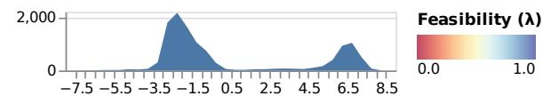

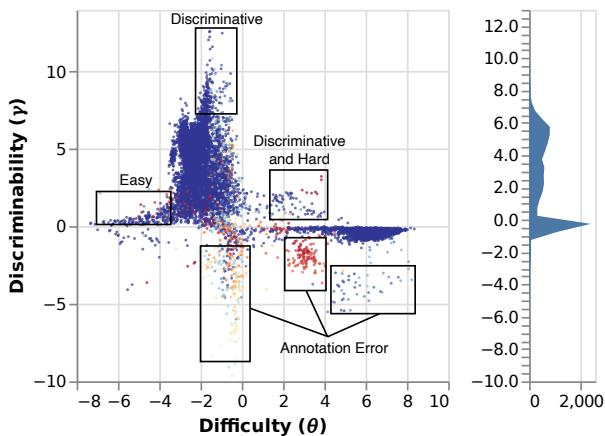  
Figure 1: Difficulty and Ability Discriminating (DAD) leaderboards infer the difficulty, discriminativeness, and feasibility of examples. Negative discriminability suggests an annotation error; for example, the question with most negative discriminability asks "Why did demand for rentals decrease?" when the answer is "demand for higher quality housing increased."

In this work we take leaderboards "as they are," and imagine how they might better support research. Leaderboards establish differences between models on a fixed task. Hence, leaderboards should enable and encourage the comparison of models and inspection of examples. And leaderboards should also signal when they have outlived their usefulness (Boyd-Graber and Borschinger, 2020).

# 1.1 How to Direct Leaderboards' Light

To help focus attention on examples and models of interest, we propose Difficulty and Ability Discriminating (DAD) leaderboards that explicitly model both task and submissions jointly, rather than either in isolation. DAD's underlying model is based on

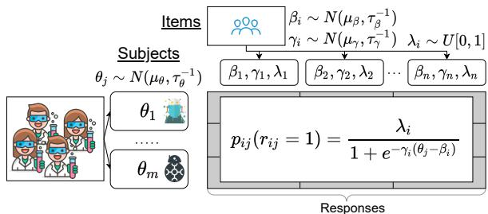  
Figure 2: A DAD leaderboard uses IRT to jointly infer item difficulty $\beta_{i}$ , discriminability $\gamma_{i}$ , feasibility $\lambda_{i}$ , and subject skill $\theta_{j}$ . These predict the likelihood $p_{ij}(r_{ij} = 1)$ of a correct response $r_{ij}$ .

Item Response Theory (Lord et al., 1968; Baker, 2001, IRT, reviewed in §2), a widely used (van Rijn et al., 2016) alternative in educational testing to simple summary statistics (Edgeworth, 1888).

DAD can explicitly identify the difficulty and discriminability of items (Figure 1),[2] which in turn can lead to a more nuanced ranking of models, identifying poor items, and better understanding of a dataset and task. Throughout the paper, we use the question answering (QA) benchmark SQuAD 2.0 (Rajpurkar et al., 2018). For example, DAD can identify questions that are challenging to models and questions that are wrong (incorrectly annotated). In addition to better understanding datasets, it is also helpful for efficiently selecting evaluation items to annotate. We conclude with recommendations for future leaderboards ( $\S 7$ ) and discuss where IRT in NLP can go next ( $\S 8$ ).

# 2 A Generative Story for Leaderboards

Leaderboards are a product of the metrics, evaluation data, and subjects (machine or human) who answer items (Figure 2). For concreteness, let's assume that we have a question-answering task and two subjects: Ken, who is good at trivia, and Burt, who is not. In the simplest IRT models, each subject $j$ has a random variable $\theta_{j}$ corresponding to their skill: Ken's is big, Burt's is small.

But you cannot know that until you start asking them questions of varying difficulty $\beta_{i}$ . Harder questions have a higher difficulty ("what is the airspeed of an unladen swallow") than easy ones ("who is buried in Grant's tomb"). The bigger the margin between a subject's skill $\theta_{j}$ and an item's difficulty $\beta_{i}, \theta_{j} - \beta_{i}$ , the more likely that subject $j$ responds correctly $p_{i,j}(r_{i,j} = 1)$ . This is the simplest IRT model, which we call IRT-base.

Generally, given $n$ test items $\mathcal{X} = (X_1, \ldots, X_n)$ and $m$ subjects $S = (S_1, \ldots, S_m)$ , where each subject answers every item, we want to estimate subject skills and item difficulties. To discover the random variables that best explain the data, we turn to probabilistic inference (Pearl, 1988).

Two additional random variables further improve DAD: discriminability $\gamma_{i}$ and feasibility $\lambda_{i}$ . We first consider discriminability and the margin between a question's difficulty $\beta_{i}$ and a subject's skill $\theta_{j}$ . A discriminative question is challenging but can still be answered correctly by a strong subject. If Ken's ability is higher than most items' difficulty ( $\theta_{j} - \beta_{i}$ is large), item discriminability multiplies this gap by $\gamma_{i}$ in a model called IRT-disc. Questions with low $\gamma_{i}$ are low quality: they have annotation error or do not make sense.

Another way of capturing poor quality questions is the feasibility $\lambda_{i}$ . For example, if the question "who was the first president" has the answer Rajendra Prasad, the question has an unstated implicit assumption that subjects must guess what country or company the question is about. In the model IRT-feas, if a large fraction of subjects all get an item wrong, everyone's probability of getting the item right is capped at $\lambda_{i}$ . In NLP terms, $1 - \lambda_{i}$ corresponds to the prevalence of annotation errors that lead to unsolvable items.

Having introduced all of the constituent elements of the model, we can now present the full generative model:

1. For each subject $j$ :   
(a) Draw skill $\theta_{j}\sim \mathcal{N}(\mu_{\theta},\tau_{\theta}^{-1})$   
2. For each item $i$ :   
(a) Draw difficulty $\beta_{i}\sim \mathcal{N}(\mu_{\beta},\tau_{\beta}^{-1})$   
(b) Draw discriminability $\gamma_{i}\sim \mathcal{N}(\mu_{\gamma},\tau_{\gamma}^{-1})$   
(c) Draw feasibility $\lambda_{i}\sim \mathrm{U}[0,1]$   
3. Draw subject $i$ response on item $j$ ,

$$
\begin{array}{l} r _ {i j} \sim p _ {i j} \left(r _ {i j} \mid \theta_ {j}, \beta_ {i}, \lambda_ {i}\right) = \\ p _ {i j} \left(r _ {i j} = 1 \mid \theta_ {j}\right) = \frac {\lambda_ {i}}{1 + e ^ {- \gamma_ {i} \left(\theta_ {j} - \beta_ {i}\right)}}. \tag {1} \\ \end{array}
$$

For IRT-base, $\gamma_{i}$ and $\lambda_{i}$ are fixed to 1.0, while for IRT-disc, only $\lambda_{i}$ is fixed.

Means $\mu_{\theta}, \mu_{\beta}, \mu_{\gamma}$ are drawn from $\mathcal{N}(0, 10^{6})$ and $\tau_{\theta}, \tau_{\beta}, \tau_{\gamma}$ from a $\Gamma(1, 1)$ prior, as in Lalor et al. (2019) and recommended by Natesan et al. (2016).4

Because it is difficult to completely codify skill and difficulty into a single number, we can rewrite the exponent in Equation 1 as a sum over dimensions $-\gamma_{i}(\sum_{k}\pmb{\theta}_{j,k} - \beta_{i,k})$ , where each dimension captures the interaction between an item's difficulty and a subject's skill. For example, perhaps Burt could better exploit artifacts in one dimension (their skill for $\theta_{j,k = 5}$ is high but everywhere else is low) while Ken might not know much about a particular topic like potent potables $(\theta_{j,k = 2}$ is low but everywhere else is high). We call this model IRT-vec. Multidimensional IRT models (Reckase, 2009) could-in addition to better modeling difficulty-also cluster items for interpretation; we briefly experiment with this (Appendix F), but leave more to future work (8).

# 2.1 Examples are Not Equally Useful

IRT's fundamental assumption is that not all items and subjects are equal. This explains why leaderboards can fail while having "normal looking" accuracies. As a thought experiment, consider a dataset that is one third easy $(\beta_{i}\in [0,1])$ , one third medium difficulty $(\beta_{i}\in [2,3])$ , and one third hard $(\beta_{i}\in [6,7])$ . Suppose that Ken has skill $\theta_{k} = 4$ while Burt has skill $\theta_{b} = 2$ . A standard leaderboard would say that Ken has higher accuracy than Burt. But suppose there's a new subject that wants to challenge Ken; they are not going to reliably dethrone Ken until their skill $\theta_{c}$ is greater than six.

This is a more mathematical formulation of the "easy" and "hard" dataset splits in question answering (Sugawara et al., 2018; Rondeau and Hazen, 2018; Sen and Saffari, 2020). In IRT-feas, this recapitulates the observation of Boyd-Graber and Börschinger (2020) that annotation error can hinder effective leaderboards. DAD helps systematize these observations and diagnose dataset issues.

# 2.2 Inference

To estimate the latent parameters of our model, we use mean-field variational inference (Jordan et al., 1999). In variational inference, we propose a distribution over the latent variables, $q_{\phi}(\cdot)$ , that approximates the true but intractable posterior $p(\cdot)$ . We then minimize the KL-divergence between these distributions, equivalent to maximizing the evidence lower-bound (ELBO) with respect to the variational parameters.

In our case, $q_{\phi}(\cdot)$ is a mean-field distribution, which means it factorizes over each of the latent variables (the product is over the $n \times m$ subject-item pairs)

$$
q _ {\phi} (\boldsymbol {\theta}, \boldsymbol {\beta}, \boldsymbol {\gamma}, \boldsymbol {\mu}, \boldsymbol {\tau}) = q (\boldsymbol {\mu}) q (\boldsymbol {\tau}) \prod_ {i, j} q \left(\theta_ {j}\right) q \left(\beta_ {i}\right) q \left(\gamma_ {i}\right)
$$

Specifically, for our key latent variables $z \in \{\theta, \beta, \gamma\}$ , the associated variational distributions are of the form $q(z) = \mathcal{N}(u_z, t_z^{-1})$ . Recall that in the generative distribution, each latent $z$ is drawn from a $\mathcal{N}(\mu_z, \tau_z^{-1})$ whose parameters are also latent variables; for these variables, we use the variational distributions $q(\mu_z) = \mathcal{N}(u_{\mu_z}, t_{\mu_z}^{-1})$ and $q(\tau_z) = \Gamma(a_{\tau_z}, b_{\tau_z})$ . We optimize the ELBO with respect to the variational parameters

$$
\phi = \left\{\boldsymbol {u} _ {z}, \boldsymbol {t} _ {z}, \boldsymbol {u} _ {\mu_ {z}}, \boldsymbol {t} _ {\mu_ {z}}, \boldsymbol {a} _ {\tau_ {z}}, \boldsymbol {b} _ {\tau_ {z}}, \boldsymbol {\lambda} \right\}
$$

for all $z$ using ADAM (Kingma and Ba, 2015).

With DAD's leaderboard IRT model introduced, we next discuss how leaderboard subjects are statistically compared and alternative methods—such as using IRT parameters—to evaluate whether two models are truly different.

# 3 Ranking and Comparing Subjects

Fundamentally, the objective of comparative evaluations like leaderboards is to decide whether model $A$ is better than model $B$ . A thread of NLP has rightfully advocated for adding rigor to these decisions using statistics (Traub, 1997, Classical Testing Theory) where the objective is to infer a true score $T$ from the observed test score $X = T + E$ given a measurement error $E$ , uniform across subjects. However, in educational testing—a field measuring skill and knowledge in humans—IRT is a primary measurement instrument (Hambleton, 1991, p. 2). A major motivation for IRT is that subjects of different skill have different errors. IRT explicitly accounts for the bandwidth-fidelity dilemma (McBride, 1976): items can either accurately measure a narrow ability range (fidelity) or inaccurately measure large ability ranges (bandwidth). This section and the next contrast methods for identifying the best model and advocate for IRT.

Implicit in nearly all leaderboard evaluations is ranking models by a statistic such as the average accuracy. As we show in §4, naive rankings are noisier than IRT rankings.

# 4 IRT for Leaderboards

Leaderboards should: (1) reliably and efficiently rank better models ahead of worse models (Tague-Sutcliffe, 1992; Voorhees, 2003) and (2) guide inspection of items and subjects ( $\S 5$ ). The first ameliorates the unavoidable randomness of finite evaluations while the second enables error analysis (Wu et al., 2019) and model probing (Belinkov and Glass, 2019; Zhang et al., 2019). First we verify that IRT models accurately predict the responses of subjects ( $\S 4.2$ ). Next, a ranking stability analysis shows that IRT has modestly better reliability than classical rankings ( $\S 4.2.3$ ). Lastly, using IRT to actively sample items for annotation yields rankings with better correlation to complete test data ( $\S 4.4$ ).

# 4.1 Why a Linear Model Baseline

At first blush, the differences between IRT and logistic regression are minimal, but we include the comparison to address natural questions from the NLP community: (1) do the idiosyncrasies of the IRT formulation hurt accuracy? (2) should we add features to better understand phenomena in the questions? (3) why not use deep models?

The next section argues that both IRT and logistic regression are accurate even without laboriously engineered task-specific features. Adding obvious features such as item words (e.g., questions) only minimally improves the accuracy. We explicitly omit less interpretable deep models since our goal is to make leaderboards more interpretable.

# 4.2 Response Prediction is Accurate

Just as educational testing researchers validate IRT models by seeing if they predict subject responses correctly (American Educational Research Association, 2014), we validate how well DAD predicts whether SQuAD models get questions right.

We compare against a logistic regression linear model (LM) implemented with Vowpal Wabbit (Agarwal et al., 2014). Since integrating handcrafted features is easy, we incorporate features derived from subject IDs; item IDs; functions of the SQuAD question, answer, and title; and IRT parameters (details in Appendix B). As in IRT, logistic regression predicts whether a subject correctly responds to an item. Later, we discuss ways to integrate more features into IRT (§8).

# 4.2.1 SQuAD Leaderboard Data

Experiments are on the SQuAD 2.0 leaderboard. Development data are publicly available, and orga

nizens provide test set responses. There are 161 development subjects, 115 test subjects, and 11,873 items (1.9 million total pairs). Experiments that do not need test responses use all development subjects; those that do use the smaller test subset.

# 4.2.2 Evaluation Scheme

Following prior work (Wu et al., 2020), we evaluate IRT and linear models by holding out $10\%$ of responses and computing classification metrics. In SQuAD, predicting whether a response is correct is an imbalanced classification problem ( $80.4\%$ of responses in the development set are correct). Thus, we use ROC AUC, macro F1, and accuracy.

# 4.2.3 IRT Response Prediction is Accurate

IRT models that incorporate more priors into the generative story should be better, but are they? We compare four IRT models: IRT-base, IRT-disc, IRT-feas, and IRT-vec (§2). The more sophisticated models are better and all improve over the LM (Figure 3) and correlate well with each other (Appendix C). To be clear, while higher accuracy than LM is good, our goal is to validate that IRT models are accurate; later, we inspect model errors and identify annotation errors (§5).

# 4.2.4 What Model Features are Predictive?

Integrating additional features into Bayesian models is not trivial, so we instead use the flexibility of linear models to identify useful features. Our leave-one-in ablation compares features (Figure 3): the top ablations both use IRT features, further validating IRT parameters. The subject and item identifier features are also strongly predictive, but item is the stronger of the two. Text-based features are weaker, but this suggests future work to better integrate them into IRT models ( $\S 8$ ).

# 4.3 Ranking with IRT

Leaderboards should produce reliable subject rankings: can DAD rank systems even with a tiny test set? Thus, we compare the correlation both of traditional average accuracy (§3) and IRT rankings on the whole test set compared to the rankings of the same metric on a smaller test set. Our first experiment (§4.3.1) examines the stability of existing items and subjects while the second (§4.4) investigates stability of "new" evaluation data using sampling strategies.

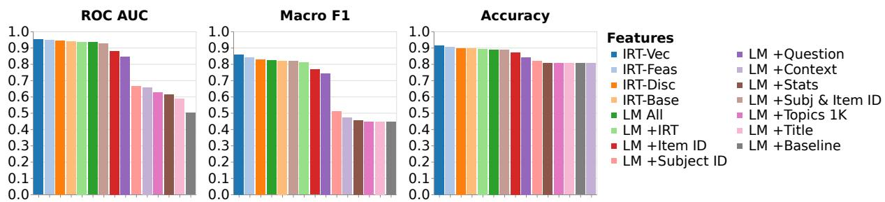  
Figure 3: We compare each IRT and linear model (LM) by how well they predict subject responses. We focus on ROC AUC since predicting responses is an imbalanced classification problem (most subjects are correct). Under that metric, all IRT models improve over the best LM, and the strongest LM ablation only uses IRT features. That textual features are predictive in the LM suggests they could improve future models.

# 4.3.1 IRT Rankings Have Better Reliability

Rankings should be reliable within the same dataset (e.g., on dev set) and generalize to similar datasets (e.g., with a test dataset). To test the first, we measure the ranking stability of mutually exclusive samples of the development data (Buckley and Voorhees, 2000). To test the second, we measure the correlation between development set sample rankings to test set rankings (Voorhees, 1998).

Specifically, for a range of sample sizes8 we (1) sample two partitions of the data, (2) compute the classical ranking9 and the IRT ranking from a refit IRT-feas model, then (3) compute Kendall's correlation (Kendall, 1938) between the samples for each ranking (details in Appendix D). In both cases IRT rankings have higher correlation than classical rankings (Figure 4, left). Since the benefit is strongest at low sample sizes, IRT can improve the reliability of small-scale evaluations.

The second experiment examines ranking generalization: IRT yields more reliable measures of subject skill, implying a greater consistency in subject rankings across evaluation settings. Figure 4 compares the development set sample rankings computed above to rankings obtained using subjects' test set responses (with the same IRT model).

Across all sample sizes, subjects' IRT ability estimated on the development set correlates well test set ability. Crucially, this is better than the corresponding classical metrics like accuracy (Appendix D quantifies the statistical significance of the difference), supporting our original motivation for using IRT. $^{10}$

# 4.4 IRT Improves Cold Start Reliability

IRT can also guide the construction of tests. Just as IRT practitioners prepare tests for humans, we too construct tests for machines. In educational testing, collecting responses from humans is expensive; likewise, although questions are cheap in search-based QA tasks (Nguyen et al., 2016; Kwiatkowski et al., 2019), annotating answers is expensive. Likewise, "grading" machine dialog responses is expensive and IRT helps (Sedoc and Ungar, 2020). To emulate this setting, we use computerized adaptive testing (Weiss and Kingsbury, 1984) to iteratively select SQuAD items to " annotate."

As in human test preparation, we use existing annotations to infer item parameters and iteratively infer the ability of new subjects. This experiment splits $m$ subjects into a training group (80%) and a testing group (20%). The training group represents subjects for which we have full item predictions and annotations; the testing group represents a new group of subjects that we need to rank. To efficiently rank, we should iteratively choose items to annotate that yield the most information about the ranking if all the data were annotated.

This experiment compares how well several item selection strategies work. For each selection method, we (1) choose a sample size, (2), sample from the development set, (3) compute the ranking of subjects, and (4) compute Kendall's rank correlation (Figure 5).11

Which item selection strategies should we compare? As a baseline, we use naive random sampling. Like prior work, we compare selecting items with the highest difficulty and the highest discriminability (Lalor et al., 2019) as well as the sum of the

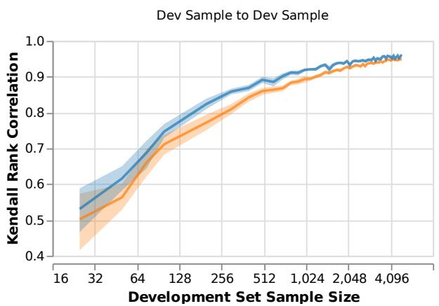

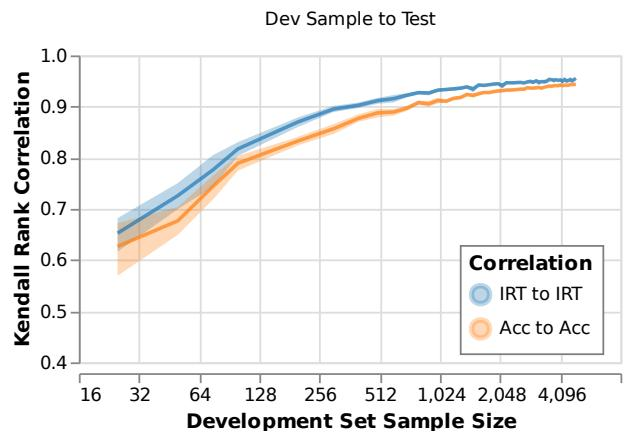  
Figure 4: Compared to the final ranking over a large test set, how well does a small test set correlate? The left shows correlation between mutually exclusive development set samples and the right between development samples and the full test set. In both experiments (panes), ranking systems by IRT ability is more stable—across all sample sizes—than mean accuracy and thus more reliable (Kendall's rank correlation is higher). Bands show $95\%$ confidence intervals of rank correlations across ten trials per sample size.

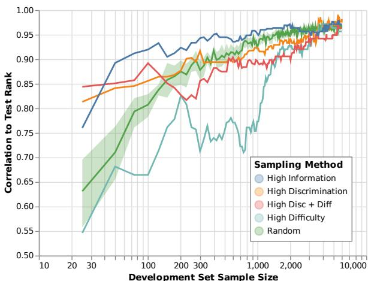  
Figure 5: Suppose we need to cold start and collect annotations for a new subject: what order would most rapidly increase correlation to the full test data? As we expect, the correlations eventually converge, but with little data, IRT has better correlation than other methods. We suspect that the IRT information underperforms early on when the subject ability estimate is unstable.

two. $^{12}$ We propose that items should be selected according to their Fisher information content (Weiss, 1982)

$$
I _ {i} \left(\theta_ {j}\right) = \frac {\left(p _ {i j} ^ {\prime}\right) ^ {2}}{p _ {i j} \left(1 - p _ {i j}\right)} = \gamma_ {i} ^ {2} p _ {i j} \left(1 - p _ {i j}\right) \tag {2}
$$

as derived by Lord et al. (1968, p. 70).

Intuitively, if we do not yet know the true skill $\theta_{j}$ we should pick items whose expected response we are most uncertain about. Our uncertainty (entropy) is maximized when the likelihood of a correct re

sponse $p_{ij}$ is the same as the likelihood of an incorrect response $1 - p_{ij}$ , which corresponds to the maximal value of $I_i(\theta_j)$ ; it is also sensible this value increases as discriminability $\gamma_i$ increases.

To infer the maximally informative items, we estimate the ability $\theta_{j}$ of each subject using the currently selected items, use the ability to compute the information of each yet-to-be-annotated item for each subject, and then aggregate the informativeness

$$
\operatorname {I n f o} (i) = \sum_ {j} I _ {i} \left(\theta_ {j}\right) \tag {3}
$$

by item $i$ summed over subjects $j$ . This approach is similar to uncertainty sampling and reduces to it for the IRT-base model (Lewis and Gale, 1994). We initially seed with the twenty-five most discriminative items (details in Appendix D).

Like computerized adaptive testing (Moreno et al., 1984), Figure 5 shows that at lower sample sizes three of the IRT sampling methods are better than random sampling—difficulty does worse. The other IRT methods have comparable correlation. Thus, by using IRT, DAD can both improve rankings and guide annotation.

# 5 Qualitative Insights on Leaderboards

DAD also helps qualitative analysis of items and subjects. First, IRT identifies overfitting and generalizes partitioning datasets by difficulty. Then we show that—like in educational testing—IRT identifies good and bad items.

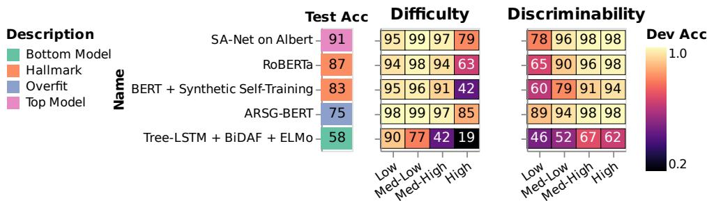  
Figure 6: We partition evaluation data by IRT difficulty and discriminability with accuracy in each quartile. Most improvements in high-accuracy systems come from getting high-difficulty questions right. Items with low discriminability (and thus prone to annotation errors) are difficult for all subjects except the overfit ARGs-BERT model. We include top-performing SQuAD subjects, several notable subjects (systems), and a pair from the bottom of the leaderboard.

# 5.1 Guiding Analysis with IRT

Several works curate easy and hard QA subsets based on how many models answer correctly (Rondeau and Hazen, 2018) or heuristics (Sugawara et al., 2018). IRT can create similar subsets using IRT-feas, the best 1D model. Difficulty finds where subjects improve while discriminability and feasibility can surface items that may be invalid. For example, one low feasibility question (Figure 9) asks "what are two examples of types of Turing machines?" which has two problems: (1) the answer omits five types and (2) span-based evaluation precludes selecting non-contiguous types.

After excluding items with negative discriminability—they are likely erroneous—we sort items into bins. We break both difficulty and discriminability into four bins—taking the $25^{\text{th}}$ , $50^{\text{th}}$ , and $75^{\text{th}}$ percentiles—creating eight total bins. Then we select representative SQuAD subjects with their exact match scores (Figure 6). Let's examine a feasible item with positive difficulty and discriminability like "what reform was attempted following the Nice treaty?"13 In this case, the annotator's span is too long—resulting in almost no correct answers and a low fuzzy match (token F1). In contrast, one highly discriminative question succeeds because there are multiple plausible guesses to "who did the Normans team up with in Anatolia?"14 While both the Armenian state and Turkish forces are superficially plausible answers, only Turkish forces is correct; nonetheless, some models are fooled. Using IRT to guide subject analysis is helpful; next, we test how efficient it is in identifying annotation error.

# 5.2 Identifying Annotation Error

To test if IRT can identify annotation error, we inspect sixty SQuAD development set items. We select ten items from each of these groups: the most negative discriminability, discriminability nearest to zero, the highest discriminability, the least difficult, most difficult, and IRT model errors. For each, we annotate whether the item was correct, was "correct" yet flawed in some way, or simply wrong (Figure 7).15 Inter-annotator agreement between three authors on this three-way annotation with Krippendorff's $\alpha$ (Krippendorff, 2004; Artstein and Poesio, 2008) is 0.344. Despite only modest agreement, just as in the development of education tests, negative discriminability is predictive of bad items. When discriminability is negative, then the probability of getting the answer right is higher when ability is lower, which is undesirable: Ken consistently loses to Burt on those items. This could identify bad items in evaluation sets for removal.

# 6 Related Work

DAD draws together two primary threads: we use IRT to understand datasets, which has been applied to other NLP tasks, and apply it to improving leaderboards. Finally, we explore how the insights of IRT can improve not just the analysis of test sets but to improve the construction of test sets.

IRT in NLP IRT is gaining traction in machine learning research (Martínez-Plumed et al., 2016, 2019) where automated metrics can be misleading (Sedoc et al., 2019): machine translation (Hopkins and May, 2013) and chatbot evaluation (Sedoc

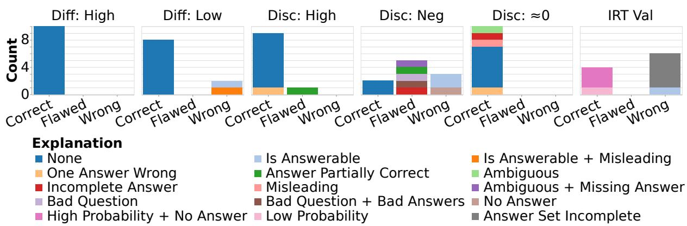  
Figure 7: We annotate SQuAD items by discriminability, difficulty, and IRT prediction errors. For example, one question with negative discriminability was classified as "Wrong" with the explanation that the annotated answer indicates it is not answerable, but the question actually is answerable. Items with negative discriminability or where IRT's prediction is wrong have a much higher rate of annotation error ("Flawed" or "Wrong"). Using similar methodology, errors in datasets could be more rapidly identified.

and Ungar, 2020). Concurrent with our work, Vania et al. (2021) compare NLP test sets with IRT. Closest to our work in NLP is Otani et al. (2016), who rank machine translation subjects and compute correlations with gold scores. Similarly, Martínez-Plumed and Hernández-Orallo (2020) use IRT on non-language AI video game benchmarks. Just as we use IRT to identify difficult or easy items, Lalor et al. (2016) create challenge sets for textual entailment. We test IRT as a way to guide annotation, but it can also train NLP models; for example, deep models learn "easy" examples faster (Lalor et al., 2018) and maintain test accuracy when training data are down-sampled (Lalor et al., 2019).

Improving Leaderboards The rise NLP leaderboards has encouraged critical thought into improving them (Linzen, 2020), improving evaluation more broadly (Eger et al., 2020), and thoughtful consideration of their influence on the direction of research (Sculley et al., 2018; Dotan and Milli, 2020). DAD aims make leaderboard yardsticks (Hernandez-Orallo, 2020) more reliable, interpretable, and part of curating the benchmark itself. In line with our reliability goal, just as statistical tests should appear in publications (Dror et al., 2018; Dodge et al., 2019), they should be "freecies" for leaderboard participants (Ethayarajh and Jurafsky, 2020). Alternatively, Hou et al. (2019) posit that leaderboards could be automatically extracted from publications. How to aggregate multi-task benchmarks (Wang et al., 2019b,a; Fisch et al., 2019) and multi-metric benchmarks (Ma et al., 2021) is an open question which—although we do not address—is one use for IRT.

This work implicitly argues that leaderboards should be continually updated. As a (static) leaderboard ages, the task(s) overfit (Recht et al., 2019) which—although mitigable (Blum and Hardt, 2015; Anderson-Cook et al., 2019)—is best solved by continually collecting new data (Kiela et al., 2021). Ideally, new data should challenge models through adversarial collection (Wallace et al., 2019b; Nie et al., 2020) and related methods (Gardner et al., 2020). However, if making an easy leaderboard more difficult is possible, the leaderboard has outlived its helpfulness and should be retired (Voorhees, 2000).

Part of our work centers on alternate task efficacy rankings, but this naively assumes that task efficacy is the sole use case of leaderboards. Indeed, focusing solely these factors can mislead the public (Paullada et al., 2020) and may not reflect human language capabilities (Schlangen, 2020). Leaderboards are also well positioned to provide incentive structures for participants to prioritize fairness (Bender and Friedman, 2018) and efficiency (Strubell et al., 2019; Schwartz et al., 2020; Min et al., 2021) or incorporate testing of specific capabilities (Ribeiro et al., 2020; Dunietz et al., 2020). To enable these more nuanced analyses, leaderboards should accept runnable models rather than static predictions (Ma et al., 2021).

Active Learning Beyond IRT, the analysis of training dynamics and active learning (Settles, 2009) is helpful for actively sampling specific items or identifying low-quality items (Brodley and Friedl, 1999). For example, Swayamdipta et al. (2020) and Pleiss et al. (2020) propose alternative

training dynamics-based methods for identifying difficult items as well annotation errors. Even closer to goals, Rahman et al. (2020) use active learning to build a test collection. Explicitly measuring how effectively examples separate the best subject from the rest allows test set curators to "focus on the bubble" (Boyd-Graber and Borschinger, 2020), prioritizing examples most likely to reveal interesting distinctions between submitted systems.

Alternate Formulations IRT is an example of convergent evolution of models that predict subject action given an item. Ideal point models (Poole and Rosenthal, 2017) consider how a legislator (subject) will vote on a bill (item) and use a similar mathematical formulation. The venerable ELO model (Glickman and Jones, 1999) and modern extensions (Herbrich et al., 2007) predict whether a player (subject) will defeat an opponent (item) with, again, a similar mathematical model. Certain IRT models can also be formulated as nonlinear mixed models (Rijmen et al., 2003), where the item parameters are fixed effects and the latent subject parameters are random effects. This allows for comparisons between IRT models and other mixed effects models under a consistent framework. IRT-base and IRT-disc can be formulated as nonlinear mixed models, and IRT-feas can be formulated as a discrete mixture model over items. As we discuss further in the next section, DAD's application of IRT can further be improved by adopting interpretable extensions of these models.

# 7 Conclusion

This paper advocates incorporating decades of research in crafting education tests to improve how we evaluate the capabilities of NLP models. We propose and validate an alternate IRT ranking method for leaderboard evaluations, show it can guide annotation, detect annotation error, and naturally partition evaluation data. Just as educators moved from classical testing to IRT, the NLP community should consider future evaluations with IRT.

# 7.1 Limitations

Although there is much to gain through IRT evaluation, there are limitations which make it hard to implement. First, it requires access to item-level responses for all examples for all subjects which are often only available to organizers. Second, Urbano (2016) notes that sampling mutually exclusive subsets has drawbacks—samples are not entirely

independent. Lastly, our work is a proof of concept using SQuAD 2.0 as a test bed and our results may not generalize.

# 8 Future Work

We see a few directions for future work. First, this paper is intended to validate IRT and its usefulness as an active part of the leaderboard lifecycle; the natural next step is to implement it in a leaderboard. Second, our IRT models do not incorporate the item content (e.g., example text) to predict responses, but in principle could; Bayesian models with metadata (Card et al., 2018) and ideal point models from political science (Poole and Rosenthal, 1985) that incorporate bills and speeches do exactly this (Gerrish and Blei, 2011; Nguyen et al., 2015; Kraft et al., 2016). Analogously, IRT for leaderboards can and should also incorporate text from passages, questions, and answers to better model what makes questions difficult. Such a model can also predict which characteristics would create discriminating or difficult items. Lastly, multidimensional IRT models to evaluate multiple skills could aid multitask or multi-metric leaderboards like MRQA (Fisch et al., 2019) and Dynaboard (Ma et al., 2021).

# Acknowledgements

For their work on early iterations of leaderboard visualizations, we thank Jacob Bremerman and Wei Wei Chi. For insightful discussions and ideas we thank Shi Feng, Doug Oard, João Sedoc, Mike Wu, and Patrick Lewis. We thank Peter Rankel for recommendations on statistical testing methods. For discussion and feedback on visualizations, we thank Leo Zhicheng Liu, Calvin Bao, and classmates in UMD's Fall 2020 "Information Visualization" course. For suggestions on topic modeling, we thank Philip Resnik and Maria Antoniak. For feedback on prior versions of this paper, we thank our anonymous ACL reviewers and members of the UMD CLIP lab. Boyd-Graber and Rodriguez's work at UMD were supported by NSF Grant IIS-1822494. The views and conclusions contained herein are those of the authors and should not be interpreted as necessarily representing the official policies, either expressed or implied, of the sponsor. The U.S. Government is authorized to reproduce and distribute reprints for governmental purposes notwithstanding any copyright annotation therein.

# References

Alekh Agarwal, Olivier Chapelle, Miroslav Dudík, and John Langford. 2014. A reliable effective terascale linear learning system. Journal of Machine Learning Research, 15:1111-1133.   
National Council on Measurement in Education, Joint Committee on Standards for Educational and Psychological Testing (U.S.) American Educational Research Association, American Psychological Association. 2014. Standards for educational and psychological testing. American Educational Research Association, Washington, DC.   
Christine M Anderson-Cook, Kary L Myers, Lu Lu, Michael L Fugate, Kevin R Quinlan, and Norma Pawley. 2019. How to host an effective data competition: Statistical advice for competition design and analysis. Statistical Analysis and Data Mining: The ASA Data Science Journal, 12(4):271-289.   
Ron Artstein and Massimo Poesio. 2008. Inter-coder agreement for computational linguistics. Computational Linguistics, 34(4):555-596.   
Frank B Baker. 2001. The Basics of Item Response Theory. ERIC.   
Yonatan Belinkov and James Glass. 2019. Analysis methods in neural language processing: A survey. In Transactions of the Association for Computational Linguistics, pages 49-72.   
Emily M Bender and Batya Friedman. 2018. Data statements for natural language processing: Toward mitigating system bias and enabling better science. Transactions of the Association for Computational Linguistics, 6:587-604.   
Emily M Bender and Alexander Koller. 2020. Climbing towards NLU: On meaning, form, and understanding in the age of data. In Proceedings of the Association for Computational Linguistics. Association for Computational Linguistics.   
James Bergstra, Daniel Yamins, and David Cox. 2013. Making a science of model search: Hyperparameter optimization in hundreds of dimensions for vision architectures. In Proceedings of the 30th International Conference on Machine Learning, volume 28 of Proceedings of Machine Learning Research, pages 115-123. PMLR.   
Eli Bingham, Jonathan P. Chen, Martin Jankowiak, Fritz Obermeyer, Neeraj Pradhan, Theofanis Karaletsos, Rohit Singh, Paul Szerlip, Paul Horsfall, and Noah D. Goodman. 2018. Pyro: Deep Universal Probabilistic Programming. Journal of Machine Learning Research.   
Avrim Blum and Moritz Hardt. 2015. The ladder: A reliable leaderboard for machine learning competitions. In Proceedings of the International Conference of Machine Learning. PMLR.

Jordan Boyd-Graber and Benjamin Borschinger. 2020. What question answering can learn from trivia nerds. In Proceedings of the Association for Computational Linguistics. Association for Computational Linguistics.   
Carla E Brodley and Mark A Friedl. 1999. Identifying mislabeled training data. The journal of artificial intelligence research, 11(1):131-167.   
Chris Buckley and Ellen M Voorhees. 2000. Evaluating evaluation measure stability. In Proceedings of the ACM SIGIR Conference on Research and Development in Information Retrieval.   
Dallas Card, Chenhao Tan, and Noah A Smith. 2018. Neural models for documents with metadata. In Proceedings of the Association for Computational Linguistics. Association for Computational Linguistics.   
Rafael Jaime De Ayala. 2013. The Theory and Practice of Item Response Theory. Guilford Publications.   
Jesse Dodge, Suchin Gururangan, Dallas Card, Roy Schwartz, and Noah A. Smith. 2019. Show your work: Improved reporting of experimental results. Association for Computational Linguistics.   
Ravit Dotan and Smitha Milli. 2020. Value-laden disciplinary shifts in machine learning. In Proceedings of the 2020 Conference on Fairness, Accountability, and Transparency.   
Rotem Dror, Gili Baumer, Segev Shlomov, and Roi Reichart. 2018. The hitchhiker's guide to testing statistical significance in natural language processing. In Proceedings of the Association for Computational Linguistics. Association for Computational Linguistics.   
Jesse Dunietz, Gregory Burnham, Akash Bharadwaj, Owen Rambow, Jennifer Chu-Carroll, and David Ferrucci. 2020. To test machine comprehension, start by defining comprehension. In Proceedings of the Association for Computational Linguistics.   
F Y Edgeworth. 1888. The statistics of examinations. Journal of the Royal Statistical Society, 51(3):599-635.   
Bradley Efron. 1994. An introduction to the bootstrap. Chapman & Hall, New York.   
Steffen Eger, Yang Gao, Maxime Peyrard, Wei Zhao, and Eduard Hovy, editors. 2020. Proceedings of the First Workshop on Evaluation and Comparison of NLP Systems. Association for Computational Linguistics.   
Kawin Ethayarajh and Dan Jurafsky. 2020. Utility is in the eye of the user: A critique of NLP leaderboards. In Proceedings of Empirical Methods in Natural Language Processing. Association for Computational Linguistics.

Shi Feng, Eric Wallace, Alvin Grissom II, Mohit Iyyer, Pedro Rodriguez, and Jordan Boyd-Graber. 2018. Pathologies of neural models make interpretations difficult. In Proceedings of Empirical Methods in Natural Language Processing. Association for Computational Linguistics.   
Adam Fisch, Alon Talmor, Robin Jia, Minjoon Seo, Eunsol Choi, and Danqi Chen. 2019. MRQA 2019 shared task: Evaluating generalization in reading comprehension. In Proceedings of the 2nd Workshop on Machine Reading for Question Answering. Association for Computational Linguistics.   
Matt Gardner, Yoav Artzi, Victoria Basmova, Jonathan Berant, Ben Bogin, Sihao Chen, Pradeep Dasigi, Dheeru Dua, Yanai Elazar, Ananth Gottumukkala, Nitish Gupta, Hanna Hajishirzi, Gabriel Ilharco, Daniel Khashabi, Kevin Lin, Jiangming Liu, Nelson F Liu, Phoebe Mulcaire, Qiang Ning, Sameer Singh, Noah A Smith, Sanjay Subramanian, Reut Tsarfaty, Eric Wallace, Ally Zhang, and Ben Zhou. 2020. Evaluating models' local decision boundaries via contrast sets. In Findings of the Association for Computational Linguistics: EMNLP. Association for Computational Linguistics.   
Sean M Gerrish and David M Blei. 2011. Predicting legislative roll calls from text. In Proceedings of the International Conference of Machine Learning.   
Mark E Glickman and Albyn C Jones. 1999. Rating the chess rating system. Chance, 12.   
Ronald Hambleton. 1991. Fundamentals of item response theory. Sage Publications, Newbury Park, Calif.   
Ralf Herbrich, Tom Minka, and Thore Graepel. 2007. Trueskill™: A bayesian skill rating system. In Proceedings of Advances in Neural Information Processing Systems.   
Jose Hernandez-Orallo. 2020. AI evaluation: On broken yardsticks and measurement scales. In Workshop on Evaluating Evaluation of Ai Systems at AAAI.   
Mark Hopkins and Jonathan May. 2013. Models of translation competitions. In Proceedings of the Association for Computational Linguistics. Association for Computational Linguistics.   
Yufang Hou, Charles Jochim, Martin Gleize, Francesca Bonin, and Debasis Ganguly. 2019. Identification of tasks, datasets, evaluation metrics, and numeric scores for scientific leaderboards construction. In Proceedings of the Association for Computational Linguistics. Association for Computational Linguistics.   
Michael I. Jordan, Zoubin Ghahramani, Tommi S. Jaakkola, and Lawrence K. Saul. 1999. An introduction to variational methods for graphical models. Machine Learning, 37(2):183-233.

M G Kendall. 1938. A new measure of rank correlation. Biometrika, 30(1/2):81-93.   
Douwe Kiela, Max Bartolo, Yixin Nie, Divyansh Kaushik, Atticus Geiger, Zhengxuan Wu, Bertie Vidgen, Grusha Prasad, Amanpreet Singh, Pratik Ringshia, Zhiyi Ma, Tristan Thrush, Sebastian Riedel, Zeerak Waseem, Pontus Stenetorp, Robin Jia, Mohit Bansal, Christopher Potts, and Adina Williams. 2021. Dynabench: Rethinking benchmarking in NLP. In Conference of the North American Chapter of the Association for Computational Linguistics. Association for Computational Linguistics.   
Diederik P. Kingma and Jimmy Ba. 2015. Adam: A method for stochastic optimization. In Proceedings of the International Conference on Learning Representations.   
Peter Kraft, Hirsh Jain, and Alexander M Rush. 2016. An embedding model for predicting Roll-Call votes. In Proceedings of Empirical Methods in Natural Language Processing. Association for Computational Linguistics.   
Klaus Krippendorff. 2004. Content Analysis: an Introduction to its Methodology. Sage: Thousand Oaks, CA. Chapter 11.   
Tom Kwiatkowski, Jennimaria Palomaki, Olivia Redfield, Michael Collins, Ankur Parikh, Chris Alberti, Danielle Epstein, Illia Polosukhin, Jacob Devlin, Kenton Lee, Kristina Toutanova, Llion Jones, Matthew Kelcey, Ming-Wei Chang, Andrew M Dai, Jakob Uszkoreit, Quoc Le, and Slav Petrov. 2019. Natural questions: A benchmark for question answering research. Transactions of the Association for Computational Linguistics, 7:453-466.   
John P Lalor, Hao Wu, Tsendsuren Munkhdalai, and Hong Yu. 2018. Understanding deep learning performance through an examination of test set difficulty: A psychometric case study. In Proceedings of Empirical Methods in Natural Language Processing. Association for Computational Linguistics.   
John P Lalor, Hao Wu, and Hong Yu. 2016. Building an evaluation scale using item response theory. In Proceedings of Empirical Methods in Natural Language Processing. Association for Computational Linguistics.   
John P Lalor, Hao Wu, and Hong Yu. 2019. Learning latent parameters without human response patterns: Item response theory with artificial crowds. In Proceedings of Empirical Methods in Natural Language Processing. Association for Computational Linguistics.   
David D Lewis and William A Gale. 1994. A sequential algorithm for training text classifiers. In Proceedings of the ACM SIGIR Conference on Research and Development in Information Retrieval. Springer-Verlag.

Tal Linzen. 2020. How can we accelerate progress towards human-like linguistic generalization? In Proceedings of the Association for Computational Linguistics. Association for Computational Linguistics.   
Zachary C. Lipton and Jacob Steinhardt. 2019. Troubling trends in machine learning scholarship. Queue, 17(1).   
F M Lord, M R Novick, and Allan Birnbaum. 1968. Statistical theories of mental test scores.   
Zhiyi Ma, Kawin Ethayarajh, Tristan Thrush, Somya Jain, Ledell Wu, Robin Jia, Christopher Potts, Adina Williams, and Douwe Kiela. 2021. Dynaboard: An evaluation-as-a-service platform for holistic next-generation benchmarking.   
F Martínez-Plumed and J Hernández-Orallo. 2020. Dual indicators to analyze AI benchmarks: Difficulty, discrimination, ability, and generality. IEEE Transactions on Computational Intelligence in AI and Games, 12(2):121-131.   
Fernando Martínez-Plumed, Ricardo B C Prudência, Adolfo Martínez-Usó, and José Hernández-Orallo. 2016. Making sense of item response theory in machine learning. In Proceedings of the Twenty-second European Conference on Artificial Intelligence.   
Fernando Martínez-Plumed, Ricardo B C Prudência, Adolfo Martínez-Usó, and José Hernández-Orallo. 2019. Item response theory in AI: Analysing machine learning classifiers at the instance level. Artificial intelligence, 271:18-42.   
James R. McBride. 1976. Bandwidth, fidelity, and adaptive tests. T. J. McConnell, Jr. (Ed.), CAT/C 2 1975: The second conference on computer-assisted test construction. Atlanta GA: Atlanta Public Schools.   
Andrew Kachites McCallum. 2002. Mallet: A machine learning for language toolkit. http://mallet.cs.umass.edu.   
Tom McCoy, Ellie Pavlick, and Tal Linzen. 2019. Right for the wrong reasons: Diagnosing syntactic heuristics in natural language inference. In Proceedings of the Association for Computational Linguistics. Association for Computational Linguistics.   
Sewon Min, Jordan L Boyd-Graber, C Alberti, Danqi Chen, Eunsol Choi, M Collins, Kelvin Guu, Hannaneh Hajishirzi, Kenton Lee, J Palomaki, Colin Raffel, A Roberts, T Kwiatkowski, Patrick Lewis, Y Wu, Heinrich Kuttler, L Liu, Pasquale Minervini, Pontus Stenetorp, Sebastian Riedel, Sohee Yang, Minjoon Seo, Gautier Izacard, F Petroni, L Hosseini, Nicola De Cao, E Grave, Ikuya Yamada, Sonse Shimaoka, Masatoshi Suzuki, Shumpei Miyawaki, S Sato, Ryo Takahashi, J Suzuki, Martin Fajcik, Martin Docekal, Karel Ondrej, P Smrz, Hao Cheng, Y Shen, X Liu, Pengcheng He, W Chen, Jianfeng Gao, Barlas Oğuz, Xilun Chen, V Karpukhin, Stan Peshterliev, Dmytro Okhonko, M Schlichtkrull, Sonal Gupta, Yashar

Mehdad, and Wen-Tau Yih. 2021. NeurIPS 2020 EfficientQA competition: Systems, analyses and lessons learned.   
Kathleen E Moreno, C Douglas Wetzel, James R McBride, and David J Weiss. 1984. Relationship between corresponding armed services vocational aptitude battery (ASVAB) and computerized adaptive testing (CAT) subtests. Applied psychological measurement, 8(2):155-163.   
Adam Najberg. 2018. Alibaba AI model tops humans in reading comprehension.   
Prathiba Natesan, Ratna Nandakumar, Tom Minka, and Jonathan D Rubright. 2016. Bayesian prior choice in IRT estimation using MCMC and variational bayes. Frontiers in psychology, 7:1422.   
Tri Nguyen, Mir Rosenberg, Xia Song, Jianfeng Gao, Saurabh Tiwary, Rangan Majumder, and Li Deng. 2016. MS MARCO: A human generated MAchine Reading CComprehension dataset. In Proceedings of the NIPS Workshop on Cognitive Computation: Integrating neural and symbolic approaches.   
Viet-An Nguyen, Jordan Boyd-Graber, Philip Resnik, and Kristina Miler. 2015. Tea party in the house: A hierarchical ideal point topic model and its application to republican legislators in the 112th congress. In Proceedings of the Association for Computational Linguistics. Association for Computational Linguistics.   
Yixin Nie, Adina Williams, Emily Dinan, Mohit Bansal, Jason Weston, and Douwe Kiela. 2020. Adversarial NLI: A new benchmark for natural language understanding. In Proceedings of the Association for Computational Linguistics. Association for Computational Linguistics.   
Timothy Niven and Hung-Yu Kao. 2019. Probing neural network comprehension of natural language arguments. In Proceedings of the Association for Computational Linguistics. Association for Computational Linguistics.   
Naoki Otani, Toshiaki Nakazawa, Daisuke Kawahara, and Sadao Kurohashi. 2016. IRT-based aggregation model of crowdsourced pairwise comparison for evaluating machine translations. In Proceedings of Empirical Methods in Natural Language Processing. Association for Computational Linguistics.   
Adam Paszke, Sam Gross, Francisco Massa, Adam Lerer, James Bradbury, Gregory Chanan, Trevor Killeen, Zeming Lin, Natalia Gimelshein, Luca Antiga, Alban Desmaison, Andreas Kopf, Edward Yang, Zachary DeVito, Martin Raison, Alykhan Tejani, Sasank Chilamkurthy, Benoit Steiner, Lu Fang, Junjie Bai, and Soumith Chintala. 2019. Pytorch: An imperative style, high-performance deep learning library. In Proceedings of Advances in Neural Information Processing Systems.

Amandalynne Paullada, Inioluwa Deborah Raji, Emily M Bender, Emily Denton, and Alex Hanna. 2020. Data and its (dis)contents: A survey of dataset development and use in machine learning research. In Proceedings of the NeurIPS 2020 Workshop: ML Retrospectives, Surveys and Meta-analyses.   
Judea Pearl. 1988. *Probabilistic Reasoning in Intelligent Systems: Networks of Plausible Inference*. Morgan Kaufmann Publishers Inc., San Francisco, CA, USA.   
Geoff Pleiss, Tianyi Zhang, Ethan R Elenberg, and Kilian Q Weinberger. 2020. Identifying mislabeled data using the area under the margin ranking. In Proceedings of Advances in Neural Information Processing Systems.   
Pavlin G. Policar, Martin Stražar, and Blaž Zupan. 2019. openTSNE: a modular python library for t-sne dimensionality reduction and embedding.   
Keith T Poole and Howard Rosenthal. 1985. A spatial model for legislative roll call analysis. American journal of political science, 29(2):357-384.   
Keith T Poole and Howard Rosenthal. 2017. Ideology & congress: A political economic history of roll call voting, 2 edition. Routledge, London, England.   
Md Mustafizur Rahman, Mucahid Kutlu, Tamer Elsayed, and Matthew Lease. 2020. Efficient test collection construction via active learning. In Proceedings of the 2020 ACM SIGIR on International Conference on Theory of Information Retrieval. Association for Computing Machinery.   
Pranav Rajpurkar, Robin Jia, and Percy Liang. 2018. Know what you don't know: Unanswerable questions for squad. In Proceedings of the Association for Computational Linguistics. Association for Computational Linguistics.   
Pranav Rajpurkar, Jian Zhang, Konstantin Lopyrev, and Percy Liang. 2016. SQuAD: 100,000+ questions for machine comprehension of text. In Proceedings of Empirical Methods in Natural Language Processing. Association for Computational Linguistics.   
Georg Rasch. 1960. Studies in Mathematical Psychology: I. Probabilistic Models for Some Intelligence and Attainment Tests. Studies in Mathematical Psychology: I. Probabilistic Models for Some Intelligence and Attainment Tests. Nielsen & Lydiche, Oxford, England.   
Benjamin Recht, Rebecca Roelofs, Ludwig Schmidt, and Vaishaal Shankar. 2019. Do ImageNet classifiers generalize to ImageNet? In Proceedings of the International Conference of Machine Learning. PMLR.   
Mark D Reckase. 2009. Multidimensional item response theory models. In Reckase, editor, Multidimensional Item Response Theory, pages 79-112. Springer New York, New York, NY.

Marco Tulio Ribeiro, Tongshuang Wu, Carlos Guestrin, and Sameer Singh. 2020. Beyond accuracy: Behavioral testing of NLP models with CheckList. In Proceedings of the Association for Computational Linguistics. Association for Computational Linguistics.   
Frank Rijmen, Francis Tuerlinckx, Paul De Boeck, and Peter Kuppens. 2003. A nonlinear mixed model framework for item response theory. Psychological methods, 8(2):185.   
Peter W van Rijn, Sandip Sinharay, Shelby J Haberman, and Matthew S Johnson. 2016. Assessment of fit of item response theory models used in large-scale educational survey assessments. Large-scale Assessments in Education, 4(1):10.   
Marc-Antoine Rondeau and T J Hazen. 2018. Systematic error analysis of the Stanford question answering dataset. In Proceedings of the Workshop on Machine Reading for Question Answering. Association for Computational Linguistics.   
David Schlangen. 2020. Targeting the benchmark: On methodology in current natural language processing research.   
Roy Schwartz, Jesse Dodge, Noah A Smith, and Oren Etzioni. 2020. Green AI. Communications of the ACM, 63(12):54-63.   
D Sculley, Jasper Snoek, Alexander B Wiltschko, and A Rahimi. 2018. Winner's curse? on pace, progress, and empirical rigor. In Proceedings of the International Conference on Learning Representations.   
Joao Sedoc, Daphne Ippolito, Arun Kirubarajan, Jai Thirani, Lyle Ungar, and Chris Callison-Burch. 2019. Chateval: A tool for chatbot evaluation. In Conference of the North American Chapter of the Association for Computational Linguistics. Association for Computational Linguistics.   
João Sedoc and Lyle Ungar. 2020. Item response theory for efficient human evaluation of chatbots. In Proceedings of the First Workshop on Evaluation and Comparison of NLP Systems. Association for Computational Linguistics.   
Priyanka Sen and Amir Saffari. 2020. What do models learn from question answering datasets? In Proceedings of Empirical Methods in Natural Language Processing. Association for Computational Linguistics.   
Burr Settles. 2009. Active Learning Literature Survey. Technical Report 1648, University of Wisconsin-Madison.   
Emma Strubell, Ananya Ganesh, and Andrew McCallum. 2019. Energy and policy considerations for deep learning in NLP. In Proceedings of the Association for Computational Linguistics. Association for Computational Linguistics.

Saku Sugawara, Kentaro Inui, Satoshi Sekine, and Akiko Aizawa. 2018. What makes reading comprehension questions easier? In Proceedings of Empirical Methods in Natural Language Processing. Association for Computational Linguistics.   
Saku Sugawara, Yusuke Kido, Hikaru Yokono, and Akiko Aizawa. 2017. Evaluation metrics for machine reading comprehension: Prerequisite skills and readability. In Proceedings of the Association for Computational Linguistics. Association for Computational Linguistics.   
Swabha Swayamdipta, Roy Schwartz, Nicholas Lourie, Yizhong Wang, Hannaneh Hajishirzi, Noah A Smith, and Yejin Choi. 2020. Dataset cartography: Mapping and diagnosing datasets with training dynamics. In Proceedings of Empirical Methods in Natural Language Processing. Association for Computational Linguistics.   
Jean Tague-Sutcliffe. 1992. The pragmatics of information retrieval experimentation, revisited. Information processing & management, 28(4):467-490.   
Ross E Traub. 1997. Classical test theory in historical perspective. Educational Measurement, 16:8-13.   
Julián Urbano. 2016. Test collection reliability: a study of bias and robustness to statistical assumptions via stochastic simulation. Information Retrieval Journal, 19(3):313-350.   
Clara Vania, Phu Mon Htut, William Huang, Dhara Mungra, Richard Yuanzhe Pang, Jason Phang, Haokun Liu, Kyunghyun Cho, and Samuel R. Bowman. 2021. Comparing test sets with item response theory. In Proceedings of the Association for Computational Linguistics. Association for Computational Linguistics.   
Ellen M Voorhees. 1998. Variations in relevance judgments and the measurement of retrieval effectiveness. In Proceedings of the ACM SIGIR Conference on Research and Development in Information Retrieval. Association for Computing Machinery.   
Ellen M Voorhees. 2000. The TREC-8 question answering track report.   
Ellen M Voorhees. 2003. Evaluating the evaluation: A case study using the TREC 2002 question answering track. In Conference of the North American Chapter of the Association for Computational Linguistics.   
Eric Wallace, Shi Feng, Nikhil Kandpal, Matt Gardner, and Sameer Singh. 2019a. Universal adversarial triggers for attacking and analyzing NLP. In Proceedings of Empirical Methods in Natural Language Processing. Association for Computational Linguistics.   
Eric Wallace, Pedro Rodriguez, Shi Feng, and Jordan Boyd-Graber. 2019b. Trick me if you can: Human-in-the-loop generation of adversarial question answering examples. In Transactions of the Association for Computational Linguistics, pages 387-401.

Alex Wang, Yada Pruksachatkun, Nikita Nangia, Amanpreet Singh, Julian Michael, Felix Hill, Omer Levy, and Samuel Bowman. 2019a. SuperGLUE: A stickier benchmark for General-Purpose language understanding systems. In Proceedings of Advances in Neural Information Processing Systems.   
Alex Wang, Amapreet Singh, Julian Michael, Felix Hill, Omer Levy, and Samuel R. Bowman. 2019b. GLUE: A multi-task benchmark and analysis platform for natural language understanding. In Proceedings of the International Conference on Learning Representations.   
David J Weiss. 1982. Improving measurement quality and efficiency with adaptive testing. Applied psychological measurement, 6(4):473-492.   
David J Weiss and G Gage Kingsbury. 1984. Application of computerized adaptive testing to educational problems. Journal of educational measurement, 21(4):361-375.   
M Wu, R Davis, B Domingue, C Piech, and Noah D Goodman. 2020. Variational item response theory: Fast, accurate, and expressive. In 13th International Conference on Educational Data Mining.   
Tongshuang Wu, Marco Tulio Ribeiro, Jeffrey Heer, and Daniel Weld. 2019. Errudite: Scalable, reproducible, and testable error analysis. In Proceedings of the Association for Computational Linguistics. Association for Computational Linguistics.   
Jiawei Zhang, Yang Wang, Piero Molino, Lezhi Li, and David S Ebert. 2019. Manifold: A Model-Agnostic framework for interpretation and diagnosis of machine learning models. IEEE transactions on visualization and computer graphics, 25(1):364-373.

Table 1: The linear model integrates a variety of features to determine which are most predictive of a subject responding correctly to an item.   

<table><tr><td>Feature</td><td>Description</td></tr><tr><td>All</td><td>All the features</td></tr><tr><td>IRT</td><td>IRT values for difficulty, discriminability, feasibility, and ability</td></tr><tr><td>Item ID</td><td>The item&#x27;s ID</td></tr><tr><td>Subject ID</td><td>The subject&#x27;s ID</td></tr><tr><td>Question</td><td>Question words</td></tr><tr><td>Context</td><td>Context words</td></tr><tr><td>Stats</td><td>Question &amp; context lengths; answerability, answer position &amp; length; difficuity from Sugawara et al. (2017)</td></tr><tr><td>Subject &amp; Item ID</td><td>Item and Subject ID</td></tr><tr><td>Topics 1K</td><td>Topic weights of question words</td></tr><tr><td>Title</td><td>Wikipedia page title words</td></tr><tr><td>Baseline</td><td>No features, majority class baseline</td></tr></table>

Table 2: Table entries are Kendall's $\tau$ rank correlation of IRT subject ability between rows and columns. Generally, the models agree on the ranking with the IRT-feas and IRT-disc having the strongest correlation.   

<table><tr><td>Ability</td><td>IRT-feas</td><td>IRT-disc</td><td>IRT-base</td></tr><tr><td>IRT-feas</td><td>1.00</td><td>0.947</td><td>0.895</td></tr><tr><td>IRT-disc</td><td>0.947</td><td>1.00</td><td>0.907</td></tr><tr><td>IRT-base</td><td>0.895</td><td>0.907</td><td>1.00</td></tr></table>

# A SQuAD Item Examples

Figures 8, 9, 10, and 11 show previously discussed SQuAD examples (§5) in full. The SQuAD annotations from Figure 7 are included in supplementary materials and at irt.pedro.ai. On the same page, we provide a web interface for inspecting the parameters of the IRT models. Figure 12 shows the feasibility distribution corresponding to Figure 1.

# B Logistic Regression Features

The linear model ( $\S 4.2$ ) includes features based on item IDs, subject IDs, textual features of the question, context, and answer, and topic model features. Table 1 lists the feature names from Figure 3 with descriptions of each. When IRT features or the statistics features are used, they include interaction terms with themselves.

# C IRT Model Type Correlation

Although each IRT model differs in expressiveness, they should—in general—produce similar results. This is confirmed by computing the Kendall's rank correlation between the subject abilities and item difficulties (Table 2).

Table 3: Entries are Kendall's rank correlation between rows and columns. Scores are SQuAD Exact Match (EM) and IRT-disc ability.   

<table><tr><td></td><td>EMdev</td><td>EMtest</td><td>Abilitydev</td><td>Abilitytest</td></tr><tr><td>EMdev</td><td>1.00</td><td>0.953</td><td>0.954</td><td>0.931</td></tr><tr><td>EMtest</td><td>0.953</td><td>1.00</td><td>0.944</td><td>0.947</td></tr><tr><td>Abilitydev</td><td>0.954</td><td>0.944</td><td>1.00</td><td>0.950</td></tr><tr><td>Abilitytest</td><td>0.931</td><td>0.947</td><td>0.950</td><td>1.00</td></tr></table>

# D Ranking Stability Experiments

Here we provide further details for the ranking stability experiments (§4.2.3). First, we filter from the 161 subjects that have development set scores to the 115 that also have test set scores.16 In our simulation, we run 10 trials for every sample size; sample size begins at 100 and with steps of 100. In addition to these, we also run trials for sample sizes 25, 50, and 75. Since each sample can be no larger than half the dataset, we stop at half the dataset.

# D.1 Development and Test Set Correlations

Table 3 uses a IRT-disc model since we noticed that in comparison IRT-feas overfit the data, yielding worse results. The correlations with the full data are all strong, but not the same. We conclude that—at least on SQuAD—IRT rankings are modestly more reliable than classical rankings.

# D.2 Statistical Significance of Difference in Kendall Tau Coefficients

While Figure 4 shows a consistent difference in correlation between ranking methods, it is unclear whether this difference is statistically significant. We estimate the statistical significance of the difference through bootstrap sampling (Efron, 1994).

Since the null case is no difference in correlation coefficients, we seek a symmetric sampling distribution centered at zero that represents a realistic density function. Each ranking stability experiment17 trial results in two lists of number pairs. The lists correspond to subject scores on two datasets;18 each number pair is the subject's accuracy and IRT score. To create the bootstrap distribution, we (1) sample with replacement pairs from one list, (2) compute the correlation between

Discriminability: -9.63 Difficulty: -0.479 Feasibility: 0.614 Mean Exact Match: 0.472

Wikipedia Page: Economic inequality Question ID: 572a1c943f37b319004786e3

Question: Why did the demand for rentals decrease?

Official Answer: demand for higher quality housing

Context: A number of researchers (David Rodda, Jacob Vigdor, and Janna Matlack), argue that a shortage of affordable housing – at least in the US – is caused in part by income inequality. David Rodda noted that from 1984 and 1991, the number of quality rental units decreased as the demand for higher quality housing increased (Rhoda 1994:148). Through gentrification of older neighbourhoods, for example, in East New York, rental prices increased rapidly as landlords found new residents willing to pay higher market rate for housing and left lower income families without rental units. The ad valorem property tax policy combined with rising prices made it difficult or impossible for low income residents to keep pace.

Figure 8: The example from SQuAD with the lowest discriminability. Surprisingly, it had a negative discriminability, implying that the less skilled a subject is, the more likely their response is to be correct.

Discriminability: 3.24 Difficulty: 3.86 Feasibility: 0 Mean Exact Match: 0

Wikipedia Page: Computational Complexity Theory Question ID: 56e1b00ce3433e14004230a1

Question: In the determination of complexity classes, what are two examples of types of Turing machines?

Official Answer: probabilistic Turing machines, non-deterministic Turing machines

Context: Many types of Turing machines are used to define complexity classes, such as deterministic Turing machines, probabilistic Turing machines, non-deterministic Turing machines, quantum Turing machines, symmetric Turing machines and alternating Turing machines. They are all equally powerful in principle, but when resources (such as time or space) are bounded, some of these may be more powerful than others.

Figure 9: This question is regarded as infeasible by the IRT model. Upon further inspection, the answer omits five acceptable answers, but more importantly does not permit all combinations of Turing machines.

the resampled ranking and unused ranking when using accuracy versus IRT score, and (3) compute and store the IRT correlation score minus the accuracy correlation score. We repeat this process 1000 times for each of the 10 trials in the original experiment and aggregate all the differences to build the bootstrap distribution. For each sample size we compute the empirical P-Value on each trial which we show in box and whisker plots (Figure 13).

# E The IRT Statistical Test

The IRT test differs in two substantial ways from other tests: (1) it does not assume that items are equally informative and (2) it does assume that the informativeness of items is a function of the subject's skill $\theta_{j}$ . In the literature, this is closely connected to reliability (Tague-Sutcliffe, 1992) and each item provides information about the location of $\theta_{j}$ ; as we accumulate more evidence for the location of $\theta_{j}$ the error of estimation decreases. It is a well known result in IRT that standard error of estimate (SEE) $\sigma (\hat{\theta} |\theta)$ varies with respect to the agent location parameter $\theta$ (De Ayala, 2013, p. 30) and is connected to the Fisher information

$$
I _ {i} (\theta) = \frac {\left(p _ {i} ^ {\prime}\right) ^ {2}}{p _ {i} \left(1 - p _ {i}\right)} \tag {4}
$$

of each item. For a 2PL model, information

$$
I _ {i} (\theta) = \gamma^ {2} p _ {i} (1 - p _ {i}) \tag {5}
$$

is maximized when $p_i = (1 - p_i)$ . Since Fisher information is additive, the information of the evaluation set is maximal when items have a $50\%$ chance of being responded to correctly. As derived by De Ayala (2013, p. 102), the standard error of estimation

$$
\operatorname {S E E} (\theta) = \sqrt {\frac {1}{\sum_ {i} I _ {i} (\theta)}}. \tag {6}
$$

is computed by accumulating the information gained from each item. Given two subjects $X$ and $Y$ , one can use the probability distribution of score differences

$$
N \left(\theta_ {Y} - \theta_ {X}, \operatorname {S E E} \left(\theta_ {X}\right) ^ {2} + \operatorname {S E E} \left(\theta_ {Y}\right) ^ {2}\right) \tag {7}
$$

to compute the probability that the difference in skill is greater than two standard errors which corresponds to an $\alpha \leq .05$ significance level.

# F Multidimensional IRT Clustering

While we achieve strong held-out accuracy with 10 dimensional IRT (IRT-vec), we had limited success in interpreting parameters. We use TSNE19 plots overlayed with features like item accuracy, the question's Wikipedia page, if the question was answerable, length of questions, and topic model weights. Of these, item accuracy and answerability showed the most obvious patterns (Figure 14).

Discriminability: 2.1 Difficulty: 2.38 Feasibility: 0.995 Mean Exact Match: 0.00621 Mean F1: 0.546

Wikipedia Page: European Union Law Question ID: 57268f2bf1498d1400e8e3c4

Question: What reform was attempted following the Nice Treaty?

Official Answer: an attempt to reform the constitutional law of the European Union and make it more transparent

Context: Following the Nice Treaty, there was an attempt to reform the constitutional law of the European Union and make it more transparent; this would have also produced a single constitutional document. However, as a result of the referendum in France and the referendum in the Netherlands, the 2004 Treaty establishing a Constitution for Europe never came into force. Instead, the Lisbon Treaty was enacted. Its substance was very similar to the proposed constitutional treaty, but it was formally an amending treaty, and – though it significantly altered the existing treaties – it did not completely replace them.

Figure 10: This example shows that the answer span is likely too large, causing models to fail in both SQuAD's exact match and F1 metrics.

Discriminability: 8.01 Difficulty: -1.41 Feasibility: 0.939 Mean Exact Match: 0.64 Mean F1: 0.667

Wikipedia Page: Normas Question ID: 56de10b44396321400ee2595

Question: Who did the Normans team up with in Anatolia?

Official Answer: Turkish forces

Context: Some Normans joined Turkish forces to aid in the destruction of the Armenians vassal-states of Sassoun and Taron in far eastern Anatolia. Later, many took up service with the Armenian state further south in Cilicia and the Taurus Mountains. A Norman named Oursel led a force of "Franks" into the upper Euphrates valley in northern Syria....

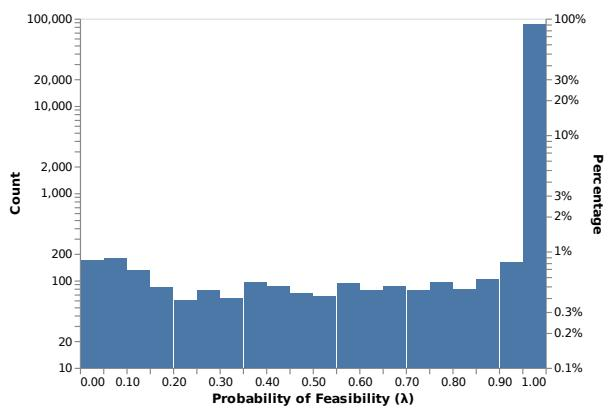  
Figure 11: This highly discriminative question succeeds because there are many plausible answers. For example, although only "Turkish forces" is correct, some models answer "the Armenian state."   
Figure 12: The feasibility parameter $\lambda$ of our IRT model represents the probability that an example is unsolvable. For example, annotation error could lead to an example always being scored incorrectly—regardless of how good the model is. In SQuAD 2.0, $\lambda < .434$ in the $5\%$ percentile, $\lambda < .698$ for the $7.5\%$ , and $\lambda < .931$ in the $10\%$ percentile.

We repeated this approach with the multi-task question answering shared task MRQA (Fisch et al., 2019). However, instead of using 10 dimensions we use 6 to match the number of development set tasks in MRQA. Although questions in NarrativeQA standout (Figure 15), there is not a discernible pattern amongst the other tasks. We leave more sophisticated methods for making multidimensional IRT models interpretable to future work.

# G Reproducibility Checklist

Here we provide reproducibility details to complement our source code (https://irt.pedro.ai).

# G.1 Software and Parameters

All IRT models are implemented in PyTorch (Paszke et al., 2019) and Pyro (Bingham et al., 2018). Linear models are trained with Vowpal Wabbit (Agarwal et al., 2014). The topic model that generates features for the linear model uses Mallet (McCallum, 2002).

The number of IRT model parameters is proportional to the number of subjects $m$ and the number of items $n$ . The IRT-base has one parameter per subject and one per item. The IRT-disc has one parameter per subject and two per item. The IRT-feas has one parameter per subject and three per item. The IRT-vec has ten parameters per subject and thirty per item.

# G.2 Hyperparameters

We did not invest significant effort in hyperparameter tuning the IRT models and instead used the defaults in the py-irt software[20] provided by Lalor et al. (2019). The IRT-base, IRT-disc, and IRT-feas models were trained for 1000 epochs with no early stopping conditions and a learning rate of 0.1 with ADAM (Kingma and Ba, 2015). The IRT-vec model was trained for 2500 epochs and used 10 dimensions.

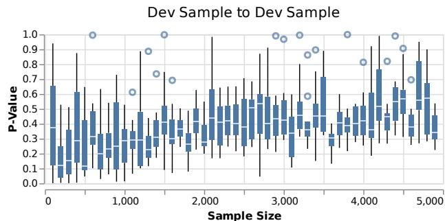

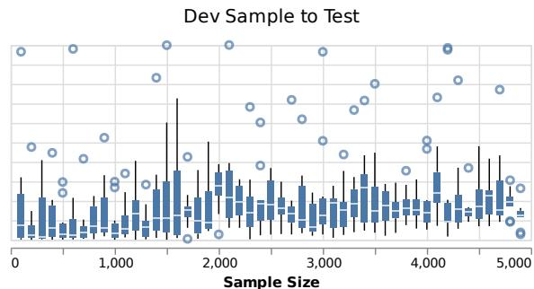  
Figure 13: P-values of the rank correlation difference for each sample size and trial in Figure 4. The inherent noise in dev set sampling makes inferring significance difficult (left); test set driven results (right) are more significant.

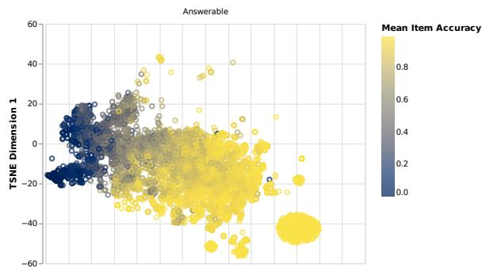

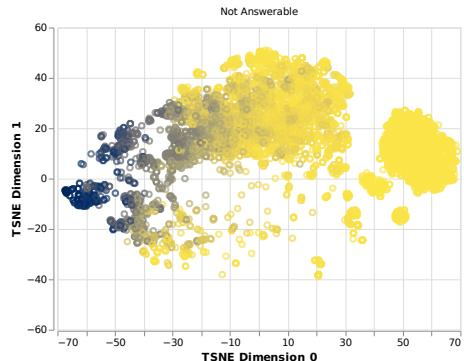  
Figure 14: In SQuAD, TSNE shows a relationship between mean exact match (item accuracy) and answerability with respect to multidimensional difficulty and discriminability.

In the linear model, we used a Hyperopt-based (Bergstra et al., 2013) tool provided by Vowpal Wabbit for hyper parameter search. For each LM, the tool spent 20 iterations optimizing the learning rate, L2 regularization, and number of bits against the logistic loss function. The learning rate was searched from 0.001 to 10 with loguniform sampling, L2 regularization from $1e - 8$ to 1, and bits from 20 to 23 as categorical variables.

The topic model that generated features for the linear model used mallet, and we followed the recommendations of the software to set hyper param

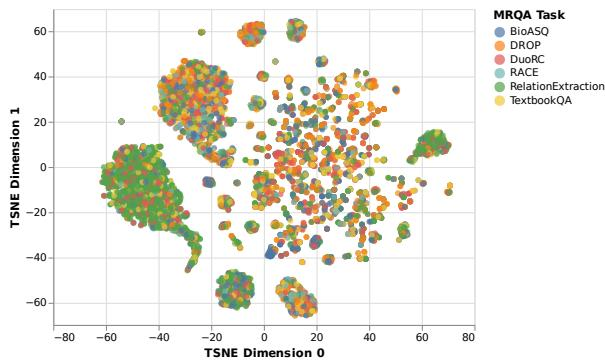  
Figure 15: In MRQA, TSNE shows a relationship between whether the task is NarrativeQA with respect to multidimensional difficulty and discriminability.

eters. $^{22}$ Specifically, we used an optimization interval of 10, removed stop words, trained for 1000 iterations, and used a document-topic threshold of 0.05. Each document was comprised of the Wikipedia page title and the question text.

# G.3 Computational Resources

The majority of experiments were conducted on a single workstation with an Intel i7-7700K CPU, 47GB of RAM, and an Nvidia 1080Ti. The average runtime for the IRT-feas model on CPU is 113 seconds with a standard deviation of 2.31 over 5 trials. The average runtime of the IRT-vec model on GPU is 110 seconds with a standard deviation of 0.5 over 5 trials.

Since each ranking stability experiment required (§4.3.1) re-training an IRT-feas model on each subset, we parallelized this experiment on a CPU cluster where each trial received two CPU cores and 16GB of RAM. In total, this included 520 trials which corresponds to twice that many trained IRT models since one model is trained on each subset of the data.