# SOLVING CHALLENGING MATH WORD PROBLEMS USING GPT-4 CODE INTERPRETER WITH CODE-BASED SELF-VERIFICATION

Aojun Zhou1∗ Ke Wang2∗ Zimu $\mathbf { L } \mathbf { u } ^ { 3 ^ { * } }$ Weikang Shi4∗ Sichun Luo5∗ Zipeng Qin1 Shaoqing Lu 6 Anya Jia 7 Linqi Song5 Mingjie Zhan1† Hongsheng Li1‡

1Multimedia Laboratory (MMLab), The Chinese University of Hong Kong 2Nanjing University 3University of Science and Technology of China 4Tsinghua University 5City University of Hong Kong 6Changsha University of Science and Technology 7Tufts University {aojunzhou, wangk.gm, sichunluo2, zmjdll}@gmail.com luzimu@mail.ustc.edu.cn shiwk20@mails.tsinghua.edu.cn linqi.song@cityu.edu.hk hsli@ee.cuhk.edu.hk

# ABSTRACT

Recent progress in large language models (LLMs) like GPT-4 and PaLM-2 has brought significant advancements in addressing math reasoning problems. In particular, OpenAI’s latest version of GPT-4, known as GPT-4 Code Interpreter, shows remarkable performance on challenging math datasets. In this paper, we explore the effect of code on enhancing LLMs’ reasoning capability by introducing different constraints on the Code Usage Frequency of GPT-4 Code Interpreter. We found that its success can be largely attributed to its powerful skills in generating and executing code, evaluating the output of code execution, and rectifying its solution when receiving unreasonable outputs. Based on this insight, we propose a novel and effective prompting method, explicit code-based self-verification (CSV), to further boost the mathematical reasoning potential of GPT-4 Code Interpreter. This method employs a zero-shot prompt on GPT-4 Code Interpreter to encourage it to use code to self-verify its answers. In instances where the verification state registers as “False”, the model shall automatically amend its solution, analogous to our approach of rectifying errors during a mathematics examination. Furthermore, we recognize that the states of the verification result indicate the confidence of a solution, which can improve the effectiveness of majority voting. With GPT-4 Code Interpreter and CSV, we achieve an impressive zero-shot accuracy on MATH dataset $( 5 3 . 9 \% \to 8 4 . 3 \%$ ).

# 1 INTRODUCTION

Large language models (LLMs) (Brown et al., 2020; OpenAI, 2023; Anil et al., 2023) have shown impressive success in various tasks, such as common sense understanding and code generation. However, they still fall short in mathematical reasoning, often producing nonsensical or inaccurate content and struggling with complex calculations. Previous attempts to tackle these challenges include the Chain-of-Thought (CoT) (Wei et al., 2022) framework, which enhances LLMs’ logical reasoning abilities by generating intermediate steps in their reasoning process. Additionally, PAL (Gao et al., 2023) introduces a novel approach by using the Python programming interpreter to improve computational accuracy.

In recent advancements, OpenAI has unveiled an improved version of GPT-4, namely the GPT-4 Code Interpreter12 or GPT4-Code, which is proficient at providing logical natural language reason-

ing, alongside step-by-step Python code. Notably, it can generate and execute code incrementally, and subsequently present the executed code’s output back to the LLM. The addition of code generation and execution to natural language outputs has shown promising results in solving mathematical reasoning problems. Our initial experiments show that GPT4-Code achieved an impressive zero-shot accuracy of $6 9 . 7 \%$ on the challenging MATH dataset (Hendrycks et al., 2021), marking a significant improvement of $2 7 . 5 \%$ over GPT-4’s performance $( 4 2 . 2 \% )$ .

While GPT4-Code has demonstrated proficiency in solving math problems, there has been a notable absence of systematic analysis focusing on understanding and further enhancing its mathematical problem-solving abilities. A key distinction between GPT4-Code and its predecessor, GPT-4, lies in GPT4-Code’s ability to automatically generate and execute code. Therefore, this paper presents pilot experiments that investigate GPT4-Code’s code generation and execution mechanism using specific code-constrained prompts. The analysis reveals that GPT4-Code’s strong performance is not solely due to its code generation and execution abilities, but also its capacity to adjust its problemsolving strategies based on feedback from code execution—a process we term self-debugging (illustrated in Tab. 7 and Tab. 8). Due to the fact that code generation evolves its reasoning step-by-step and performs self-debugging after code execution errors, there is an increased frequency of code usage. Hence, we introduce the concept of Code Usage Frequency to differentiate these unique prompting strategies to quantitatively analyze the impact of code-constrained prompts on GPT4- Code for mathematical problem-solving.

The step-by-step code generation and self-debugging mechanisms highlight the critical role of code in mathematical problem-solving. Nevertheless, the self-debugging mechanism only verifies each step of the generated code while lacks the verification of the reasoning steps and the final answer, which has been demonstrated to be of vital importance to the math problem-solving abilities of LLMs (Cobbe et al., 2021; Lightman et al., 2023; Weng et al., 2023).

We therefore ask the question: can we fully exploit the code generation and self-debugging mechanisms in GPT4-code, so that it can automatically verify and correct its solutions, without extra assistance from other models or users?

To answer this question, we propose a simple yet effective prompting technique termed the explicit code-based self-verification (CSV), which guides GPT4-Code to generate additional code that verifies the answer and adjusts the reasoning steps if there’s a flaw in reasoning. Unlike previous methods that rely on external language models for verification (Lightman et al., 2023; Cobbe et al., 2021), our approach leverages GPT4-Code’s inherent strengths. This approach offers two key benefits: (1) When the verification indicates an answer is False, GPT4-Code can rectify its prior solution and provide an improved alternative. (2) Solutions verified as True tend to be more reliable, akin to human problem-solving. However, even if a solution is self-verified as False, we do not directly abandon it. Instead, we propose a weighted majority voting strategy that incorporates the code-based solution verification results, as opposed to relying exclusively on the frequency of answers. We assign different weights to the solutions according to their verification states, reflecting the solutions’ varying levels of reliability. In alignment with the Code Usage Frequency analysis from our pilot experiments, our explicit code-based self-verification prompt boosts GPT4-Code’s accuracy in mathematical problem-solving with increased code usage.

Empirical study demonstrates the effectiveness of our proposed framework on the MATH, GSM8K, and MMLU-Math datasets using GPT4-Code. Our approach achieves an impressive accuracy of $8 4 . 3 2 \%$ on the MATH dataset, greatly outperforming the base GPT4-Code and previous state-ofthe-art methods. Additionally, we are making our experimental data on the MMLU-Math and MATH datasets publicly available, enabling result replication and facilitating fine-tuning of open-source LLM models (e.g., LLaMA 2 (Touvron et al., 2023)) to further enhance mathematical problemsolving capabilities with the assistance of code generation.

This paper’s main contributions can be summarized in three key aspects:

• This study provides the first systematic analysis of code generation, execution, and selfdebugging’s role in mathematical problem-solving. Our findings reveal that GPT4-Code’s impressive mathematical problem-solving proficiency is primarily attributed to its step-bystep code generation and dynamic solution refinement based on code execution outcomes.

# Question

# Question:

The greatest common divisor of positive integers $m$ and $n$ is 6. The least common multiple of $m$ and $n$ is 126. What is the least possible value of $m + n ?$ Answer: 60

# (a) Model output

# Prompt 1

You are not allowed to use any code. The problem is: {Question}.

We know that for any two positive integers $_ m$ and $_ n$ , the product of their greatest common divisor (GCD) and least common multiple (LCM) is equal to the product of the two numbers. This can be written as:

$\begin{array} { c } { { G C D ( m , n ) \cdot L C M ( m , n ) } } \\ { { { } } } \\ { { { } = m \cdot n } } \end{array}$

Given that $G C D ( m , n ) = 6$ and $L C M ( m , n ) ~ = ~ 1 2 6$ , we can substitute these values into the equation:

$$
6 \cdot 1 2 6 = m \cdot n
$$

Solving this gives us $m \cdot n = 7 5 6$ Now, we need to find the pair of factors of 756 that add up to the smallest sum, as we want to find the least possible value of $m + n$ .

The pairs of factors of 756 are (1,756), (2,378), (3,252), (4,189), (6,126), (7,108), (9,84), (12,63), (14,54), (18,42), (21,36), (27,28).

We can see that the pair (21,36) gives the smallest sum, which is $^ { 2 1 \mathrm { ~ + ~ } }$ $3 6 = 5 7$ .

So, the least possible value of $m + n$ is 57.

Therefore, the solution to the

problem is 57 .

# (b) Model output

# Prompt 2

You can use code only 1 time. The problem is: {Question}.

First, we should recall that for any two positive integers $_ m$ and $_ n$ , their greatest common divisor (gcd) and least common multiple (lcm) satisfy the relationship:

$$
m \cdot n = \operatorname * {g c d} (m, n) \cdot \operatorname {l c m} (m, n)
$$

In this problem, we’re given that $\operatorname* { g c d } ( m , n ) = 6$ and $\operatorname { l c m } ( m , n ) = 1 2 6$ . We can substitute these values into the formula to get:

$$
m \cdot n = 6 \cdot 1 2 6
$$

We can solve this equation for one variable and then use the fact that $_ m$ and $_ n$ are integers to generate possible pairs $( m , n )$ .

After we have the pairs $( m , n )$ , we can find the pair that minimizes $m + n$ .

# code

import sympy as sp gcd,lcm = 6,126

product = gcd * lcm

pairs $=$ [(d, product // d) for d in sp.divisors(product) if d $< =$ product // d]

min pair = min(pairs, key=sum)

min pair, sum(min pair)

>>> ((27, 28), 55)

The pair (m, n) that minimizes $\textit { m } + \textit { n }$ is (27, 28), and the minimum possible value of $m +$ n is 55 .✗

# (c) Model output

# BasicPrompt

Solve the problem and put your answer in \\boxed{}. The problem is: {Question}.

One important property relating greatest common divisor (GCD) and least common multiple (LCM) is that

$$
\operatorname {G C D} (m, n) \times \operatorname {L C M} (m, n) = m \times n
$$

Given in the problem, we can get

$$
6 \times 1 2 6 = m \times n
$$

Let’s compute the right hand side of the equation first.

# code

gcd,lcm = 6, 126

gcd * lcm

>>> 756

The product of m and $_ n$ is 756.

Since the GCD of $_ m$ and $_ n$ is 6, both $_ m$ and $_ n$ must be multiples of 6.

Let’s find all the pairs of multiples of 6 that multiply to 756. We’ll do this by finding all the factors of 756 that are multiples of 6.

#

[(i, m times n // i) for i in range(6, int(m times n**0.5) + 1, 6) if m times n % $\mathrm { i } = = 0 ]$

$> > >$ [(6, 126), (12, 63), (18, 42)]

The pairs of factors of 756 that are multiples of 6 are: 1. (6, 126) 2. (12, 63) 3. (18, 42)

We want to find the pair with the least sum. Let’s compute the sums for each pair,identify the smallest one.

#

sums $=$ [(pair, sum(pair)) for pair in factor pairs] min(sums, key=lambda x: x[1])

>>> ((18, 42), 60)

The pair with the smallest sum is (18, 42), and the

sum is 60.So, the least possible value is 60 .

  
Figure 1: Example from the 277th number theory problem in the MATH dataset: (a) Prompt 1 generates intermediate text-only reasoning steps. (b) Prompt 2 generates intermediate text reasoning steps and post-hoc Python code, akin to PAL (Gao et al., 2023). (c) Basic prompt that set no constrain on code usage. Details of the three prompts are presented in Sec. 3.1. (For more examples, see Tab. 9 and Tab. 10.)

• We introduce the innovative explicit code-based self-verification (CSV) prompt, which leverages GPT4-Code’s advanced code generation mechanism. This prompt guides the model to verify the answer and then reevaluate its solution with code. CSV not only extends the verification to the logic behind problem-solving but also improves the efficacy of the majority voting method by integrating the verification states.   
• Additionally, we have contributed to the LLM community by creating two new instructionfollowing datasets: MATH-code and MMLU-Math-code. These datasets are designed to enhance the mathematical reasoning capabilities of open-source models.

# 2 RELATED WORK

Chain-of-Thought Reasoning. The Chain-of-Thought (CoT) prompting approach proposed by Wei et al. (2022) is a notable contribution that showcases the multi-step reasoning capabilities of LLMs. By simply adding “Let’s think step by step” before questions, Kojima et al. (2022) implements Zeroshot-CoT, which can serve as a strong zero-shot baseline. Further research extends the reasoning

capabilities of CoT by applying majority voting to improve self-consistency (Wang et al., 2023), choosing few-shot examples and output chains with more complex reasoning steps (Fu et al., 2022), breaking down the problem to simpler sub-problems (Zhou et al., 2023), or even expanding Chainof-thought to Tree-of-Thoughts (Yao et al., 2023). Similar to Zero-shot-CoT, our method apply “step by step”-like prompts to regularize GPT4-Code’s use of code without the careful design of step-bystep few-shot examples. Additionally, We enhance majority voting to verification-guided weighted majority voting, leveraging the results of CSV as voting weights.

Solving Math Problems with Code. Large language models have been found to be less accurate in performing arithmetic calculations, such as addition, subtraction, multiplication, etc (Cobbe et al., 2021; Lewkowycz et al., 2022; Gao et al., 2023; Lu et al., 2022). Consequently, previous works have attempted to solve math problems with the assistance of code. The GSM8K dataset (Cobbe et al., 2021) uses calculation annotations to extract all arithmetic calculations solved by an external calculator: the Python eval function. To further leverage the role of code in LLMs, Program-Aided Language model (PAL) (Gao et al., 2023) as well as Program of Thoughts (PoT) (Chen et al., 2022) interpret the math problems as Python codes and execute the codes with an external Python interpreter to obtain the answer. Although they can get more accurate answers than some non-code methods, many generated codes have execution errors or get wrong answers due to the lack of verification mechanism. Our approach not only utilizes the ability of GPT4-Code to generate multi-step codes and refine codes that fail to run, but also uses CSV to enhance the reliability and accuracy of the answers.

Self-Verification. Human problem solving is not always a one-time success, but rather requires iterative thinking, verification, and refinement. Unlike previous studies that train an additional verifier to verify the correctness of final answers (Cobbe et al., 2021) or intermediate steps (Lightman et al., 2023; Li et al., 2023), Weng et al. (2023) showed the self-verification abilities of LLMs by generating multiple answers and ranking them by self-verification scores. Furthermore, SELF-REFINE proposed by Madaan et al. (2023) iteratively refines its output through self-generated feedback. Unlike these self-verification methods that require LLMs to give verification feedback in natural language, our method applies generated codes to verify the answers and votes on different answers based on the verification results, thus improving the accuracy of the verification and making full use of the information in the verification process.

# 3 METHOD

We first conduct a pilot experiment with GPT4-Code on the challenging MATH dataset (Hendrycks et al., 2021). Remarkably, it achieves an accuracy of $6 9 . 7 \%$ , significantly surpassing the previous state-of-the-art performance of $5 3 . 9 \%$ (Zheng et al., 2023). Encouraged by the compelling performance of GPT4-Code, we strive to systematically explore and analyze its underlying code mechanisms. In Sec. 3.1, we illustrate, via our code-constrained prompts design, that GPT4-Code’s robust performance in solving math problems derives not only from its ability to generate accurate step-by-step code, but also from its self-debugging mechanism. In Sec. 3.2, we aim to leverage GPT4-Code’s self-debugging strengths to further improve its mathematical problem-solving ability.

# 3.1 PILOT EXPERIMENTS ON ANALYZING CODE USAGE OF GPT4-CODE

To explore the impact of code usage on GPT4-Code’s math problem-solving capabilities, we adopt a straightforward approach by constraining GPT4-Code’s interaction with code through thoughtfully constructed prompts. Specifically, we introduce two code-constrained prompts and the basic prompt for comparison:

• Prompt 1: No code usage is allowed: In response to this prompt, GPT4-Code is prohibited from incorporating code into its solutions. This prompts GPT4-Code to rely solely on Natural Language (NL) reasoning chain, resembling solutions in the CoT framework (Wei et al., 2022). The resulting sequence of reasoning steps is depicted as $\mathbf { C } _ { \mathbf { N L } }$ , with an example given in Fig. 1 (a).   
• Prompt 2: Code can be used only once: In this prompt setting, GPT4-Code is permitted to employ code exclusively within a single code block to generate the solution, mirroring

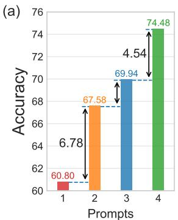  
Basic Prompt   
Prompt 1   
(You are not allowed to use any code.)   
Verification Prompt   
(Please verify your answer using code interpreter by yourself.)   
Prompt 2   
(You can use code only 1 time.)

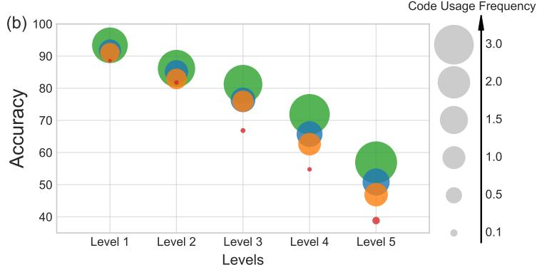  
Figure 2: Performance on MATH dataset of different levels by applying different prompts to adjust the frequency of code usage. (a) Comparison of overall accuracy between the 4 prompts. (b) Code usage frequency is in proportion to accuracy in all five levels and this phenomenon is especially apparent when the problems are relatively complicated (i.e. with higher level).

the PAL approach introduced by Gao et al. (2023). We denote this sequence as $\mathbf { C _ { S L } }$ , representing a series of Symbolic Language (SL), such as Python. An example is shown in Fig. 1 (b).

• Basic Prompt: GPT4-Code is prompted to tackle the problem without any restrictions on code usage. This prompt leads to GPT4-Code’s typical functioning pattern, which can be denoted as $\mathbf { C } = ( ( \mathbf { c 1 } _ { \mathbf { N L } } , \mathbf { c 1 } _ { \mathbf { s L } } )$ , $( \mathbf { c 2 _ { N L } } , \mathbf { c 2 _ { S L } } ) , \ldots )$ , representing a sequential list of reasoning steps, each consisted of both natural language and Python code, with an example shown in Fig. 1 (c).

Apart from the specific example in Fig. 1, we introduce Code Usage Frequency to record the number of the code execution for different prompts. The results of the experiments using these prompts are shown in Fig. 2 (b). This figure illustrates a positive correlation between the better performance of GPT4-Code and the higher Code Usage Frequency. More specifically,

Prompt 1 v.s. Prompt 2: Prompt 1 results in almost negligible code usage, while Prompt 2 results in approximately 1 time’s code usage. Prompt 2 yields an accuracy gain of 6.9 percent over Prompt 1. This suggests that the Python code chains $\mathbf { C _ { S L } }$ , can improve computational capability more than the natural language chains $\mathbf { C _ { N L } }$ . This observation is consistent with the findings in previous Python-based prompting methods (Gao et al., 2023; Chen et al., 2022). However, employing code only once comes with an inherent drawback – the model lacks the ability to self-debugging when the code output triggers an error or produces an implausible outcome.

Prompt 2 v.s. Basic Prompt: The Basic Prompt consistently produces solutions that entail multiple instances of code usage, resulting in a large Code Usage Frequency. Additionally, the Basic Prompt exhibits notably enhanced accuracy. These improvements in Code Usage Frequency and accuracy might be attributable to two unique advantages: (1) Generating code in brief and frequent segments, divided among natural language reasoning steps, tends to result in higher accuracy. (2) The model possesses the capability to evaluate the results of code execution and make corrections to solution steps if the outcomes contain bugs or are deemed illogical, as illustrated in Tab. 7 and Tab. 8.

From these observations, it is plausible to enhance and build upon the favorable attributes of GPT4- Code, to further improve its precision in tackling math problems.

# 3.2 EXPLICIT CODE-BASED SELF-VERIFICATION PROMPTING

Inspired by the observations on Code Usage Frequency analysis, we seek to harness the capabilities of GPT4-Code. These capabilities include the model’s aptitude for generating accurate code, evaluating the outcomes of code execution, and automatically adjusting reasoning steps of solutions when

# Question

# Question:

What is the smallest positive integer solution

$$
\operatorname {t o} \left(\frac {1 0 0 , 0 0 0 , 0 0 0}{x ^ {4}}\right) <   1?
$$

Answer: 101

# (a) Example: w/o self verification

Breaking this down into subproblems, the first step is to rearrange the inequality to isolate $_ x$ .

We can do this by multiplying both sides of the inequality by $x ^ { 4 }$ and then taking the fourth root of both sides.

This gives us x $> \sqrt [ 4 ] { 1 0 0 0 0 0 0 0 0 0 }$

Let’s solve for x.

# code

import math

$$
\mathrm {r o o t} = \mathrm {m a t h . p o w} (1 0 0 0 0 0 0 0, 1 / 4)
$$

$$
\ggg 1 0 0
$$

Since 100 is already a positive integer, the smallest positive integer

solution to the inequality $\frac { 1 0 0 , 0 0 0 , 0 0 0 } { x ^ { 4 } } < 1$ is $x = 1 0 0$ x4

The final answer is 100 X

# (b) Example: w/ self verifications

We can firstly change the inequality into $\mathit { \lambda } > \mathit { \sqrt { 1 0 0 0 0 0 0 0 0 0 } }$

Then let’s evaluate the fourth root of 100,000,000.

# code

import math

$$
\mathrm {r o o t} = \mathrm {m a t h . p o w} (1 0 0 0 0 0 0 0, 1 / 4)
$$

$$
\text {s m a l l e s t} = \text {m a t h . c e i l (r o o t)}
$$

$$
\ggg (1 0 0. 0, 1 0 0)
$$

Thus, the smallest positive integer $_ x$ is 100.

Let’s verify this solution.

# code

$$
\text {v e r i f i c a t i o n} = 1 \mathrm {e} 8 / (\text {s m a l l e s t . i n t e g e r} * * 4) <   1
$$

$$
\ggg \text {F a l s e}
$$

The smallest integer $_ x$ should be the next integer greater than 100, not 100 itself.

Let’s calculate that next integer.

# code

$$
\text {s m a l l e s t} _ {\text {i n t e g e r}} = 1 0 0 + 1
$$

$$
\text {v e r i f i c a t i o n} = 1 \mathrm {e} 8 / (\text {s m a l l e s t . i n t e g e r * *} 4) <   1
$$

$$
\ggg (1 0 1, \text {T r u e})
$$

Upon substituting $x = 1 0 1$ back, it holds true, which verifies our

solution.

The final answer is 101

  
Figure 3: Question from the 712th intermediate algebra problem in the MATH dataset. (a) Without selfverification, the model generates a wrong answer. (b) With self-verification, the model corrects the error and generates the correct answer. The CSV prompt: To solve the problem using code interpreter step by step, and please verify your answer using code interpreter.

needed. However, despite these advantages, GPT4-Code currently falls short in assuring solution correctness. Consequently, our objective is to utilize these strengths to augment solution verification.

To achieve this objective, we propose the technique termed as explicit code-based self-verification (CSV). This method prompts GPT4-Code to explicitly validate its answer through code generation. By implementing this prompt, we introduce an extra verification stage to the solution C, referred to as V. The verification outcome V can be classified as True, False, or Uncertain. An Uncertain classification indicates that GPT4-Code encountered difficulties in identifying an effective method for answer verification, thereby abstaining from delivering a definitive verification result. Leveraging GPT4-Code’s inherent autonomous capabilities, we can formulate the proposed prompting as follows:

$$
\mathbf {C} \rightarrow \mathbf {V} = \left\{\begin{array}{l l}\text {T r u e}&\rightarrow \text {f i n a l a n s w e r}\\\text {F a l s e}&\rightarrow \mathbf {C} _ {\text {n e w}} \rightarrow \mathbf {V} \rightarrow \dots \rightarrow \text {T r u e} \rightarrow \text {f i n a l a n s w e r}\\\text {U n c e r t a i n}&\rightarrow \text {f i n a l a n s w e r}\end{array}\right.
$$

An example is presented in Fig. 3 (b). Incorporated with CSV, the model becomes capable of using code to verify answers, then reviewing and adjusting how it arrived at the solution if the verification result is False, aiming at obtaining the correct answer. Upon refining and correcting the initial solution, we anticipate a notable increase in accuracy. It is worth noting that both the verification and rectification stages are code-based. This inevitably results in increased Code Usage Frequency, akin to the aforementioned analysis, which will be further demonstrated in subsequent experiments.

We perform experiments with CSV, and these results can be found in Fig. 2. The experiment here is conducted with GPT4-Code on MATH (Hendrycks et al., 2021). In Fig. 2 (b), the accuracy achieved with our proposed CSV prompt consistently surpasses that of the Basic Prompt across all designated difficulty levels3. Meanwhile, the Code Usage Frequency receives a clear increase.

Before the advent of GPT4-Code, prior frameworks (Lightman et al., 2023; Cobbe et al., 2021) depended on an external LLM to use natural language for verification and well-designed few-shot example prompts. In contrast, our approach simplifies the process by relying solely on a straightforward prompt for GPT4-Code, all in a zero-shot manner. This enables GPT4-Code to autonomously verify and independently rectify its solutions using the advanced code execution mechanism, thereby eliminating the need for customized few-shot examples.

Given that CSV can effectively verify problem-solving answers, we can naturally integrate the verification states into majority voting, akin to the methodology embraced in self-consistency CoT (Wang et al., 2023). Answers deemed True through verification are generally more trustworthy, reflecting the problem-solving approach seen in human cognition (Newell & Simon, 1972; Wang & Chiew, 2010). This improved reliability can be leveraged in the widely-used majority voting process. To exploit this insight, we introduce verification-guided weighted majority voting, which assigns different weights to the states of the verification process.

In practice, it sometimes occurs that once an answer is confirmed as False, no additional verification is conducted, yielding a False verification state. We allocate corresponding weights these states of True, Uncertain, False: $w _ { \mathbf { T } } , w _ { \mathbf { U } }$ , and $w _ { \mathbf { F } }$ , respectively.

Similar to the Self-consistency with CoT (CoT-SC) (Wang et al., 2023) in Fig. 4 (a)(ii), our framework can sample $k$ paths. For simplicity, we extract pairs of final answers and their corresponding verification results from $k$ solutions, represented as $( \bar { v } ^ { i } , a ^ { i } ) , i = 1 , 2 , . . . , k$ , where $v ^ { i }$ and $a ^ { i }$ denote the $i$ -th final answer and final verification result, respectively.

So the voting score for each candidate answer $a$ can be expressed as:

$$
\operatorname {S c o r e} (a) = \sum_ {\left\{v ^ {i} \right\}} w _ {v} (\# \left\{i \mid a ^ {i} = a \text {a n d} v ^ {i} = v \right\}), \quad v \in \{\text {T r u e}, \text {U n c e r t a i n}, \text {F a l s e} \}, \tag {1}
$$

Here, $a$ represents a candidate answer, $v$ denotes the state of verification, and $w _ { v }$ is an element from the set $\{ w _ { \mathbf { T } } , w _ { \mathbf { U } } , w _ { \mathbf { F } } \}$ . Each $w _ { v }$ signifies the degree of confidence associated with its corresponding verification state.

Finally, we select the answer with the highest score from all candidate answers,

$$
\operatorname {O u t p u t} = \underset {a} {\arg \max } \operatorname {S c o r e} (a), \tag {2}
$$

where Score $( a )$ refers to the score of answer $a$ according to Eq. 1.

It should be noted that when $w _ { v } \ = \ 1$ for all $w _ { v } \in \{ w _ { \mathbf { T } } , w _ { \mathbf { U } } , w _ { \mathbf { F } } \}$ , Eq. 1 becomes equivalent to the naive majority voting employed in Self-Consistency with CoT (CoT-SC) (Wang et al., 2023). Typically, we set $w _ { \mathbf { T } } > w _ { \mathbf { U } } > w _ { \mathbf { F } }$ , which means that an answer verified true has a greater confidence than the one with an uncertain state of verification, while an answer verified false has the lowest degree of confidence. An example of the calculation process within verification-guided weighted majority voting is illustrated in Fig. 4.

# 4 EXPERIMENTS

# 4.1 PERFORMANCE ON MATH

The MATH dataset (Hendrycks et al., 2021) is recognized as the most challenging math word problem dataset, as also highlighted by Chen et al. (Chen et al., 2023). Most of our experiments and the corresponding analyses are performed on the MATH benchmark. Tab. 1 compares the performance of the GPT4-Code against other models. GPT4-Code reaches $6 9 . 6 9 \%$ on MATH (Hendrycks et al., 2020), largely surpassing the previous state of art result $( 5 3 . 9 0 \% )$ ), which shows that GPT4-Code exhibits strong abilities in solving math problems and is used as our baseline for ablation study. On top of GPT4-Code, our method further improves its accuracy, raising the result to $7 3 . 5 4 \%$ after adding explicit code-based self-verification, and $8 4 . 3 2 \%$ after adding both explicit code-based selfverification and verification-guided weighted majority voting (the number of sampled paths is 16).

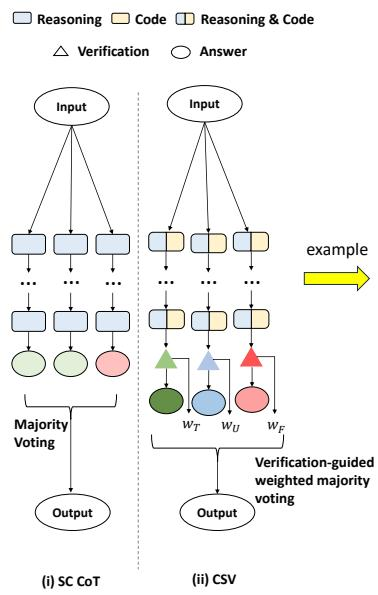  
(a)

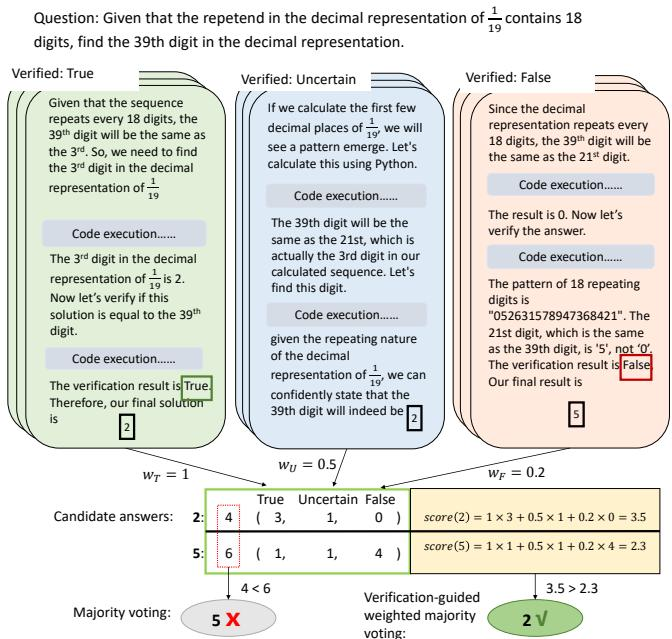  
(b)   
Figure 4: (a) Illustration of the Naive majority voting (Wang et al., 2023) and our Verification-guided weighted majority voting. The full pipeline of the proposed Verification-guided Weighted Majority Voting framework. We use the model to generate several different solutions. Then we detect the self-verification state of each solution, and classify them into three states: True, Uncertain, and False. According to the state of the verification, we assign each solution a different weight, and use the classified result to vote the score of each possible answer.

Table 1: Accuracy $( \% )$ on MATH dataset. VW-voting is the abbreviation for the verification-guided weighted majority voting. (Overall: The results across various MATH subtopics (Hendrycks et al., 2021))   

<table><tr><td></td><td>Code-based Verification</td><td>VW-Voting</td><td>Intermediate Algebra</td><td>Precalculus -</td><td>Geometry -</td><td>Number Theory</td><td>Counting &amp; Probability</td><td>PreAlgebra -</td><td>Algebra -</td><td>Overall MATH</td></tr><tr><td>GPT-4</td><td>✘</td><td>✘</td><td>-</td><td>-</td><td>-</td><td>-</td><td>-</td><td>-</td><td>-</td><td>42.20</td></tr><tr><td>GPT-3.5</td><td>✘</td><td>✘</td><td>14.6</td><td>16.8</td><td>22.3</td><td>33.4</td><td>29.7</td><td>53.8</td><td>49.1</td><td>34.12</td></tr><tr><td>GPT-4 (CoT)</td><td>✘</td><td>✘</td><td>23.4</td><td>26.7</td><td>36.5</td><td>49.6</td><td>53.1</td><td>71.6</td><td>70.8</td><td>50.36</td></tr><tr><td>GPT-4 (PHP)</td><td>✘</td><td>✘</td><td>26.3</td><td>29.8</td><td>41.9</td><td>55.7</td><td>56.3</td><td>73.8</td><td>74.3</td><td>53.90</td></tr><tr><td>GPT4-Code</td><td>✘</td><td>✘</td><td>50.1</td><td>51.5</td><td>53.4</td><td>77.2</td><td>70.6</td><td>86.3</td><td>83.6</td><td>69.69</td></tr><tr><td>GPT4-Code + CSV</td><td>✓</td><td>✘</td><td>56.6</td><td>53.9</td><td>54.0</td><td>85.6</td><td>77.3</td><td>86.5</td><td>86.9</td><td>73.54</td></tr><tr><td>Improvement</td><td></td><td></td><td>+6.5</td><td>+2.4</td><td>+0.6</td><td>+7.6</td><td>+6.7</td><td>+0.2</td><td>+3.3</td><td>+3.85</td></tr><tr><td>GPT4-Code + CSV + Voting</td><td>✓</td><td>✓ (k=16)</td><td>74.4</td><td>67.8</td><td>64.9</td><td>94.1</td><td>89.0</td><td>91.6</td><td>95.6</td><td>84.32</td></tr><tr><td>Improvement</td><td></td><td></td><td>+24.3</td><td>+16.3</td><td>+11.5</td><td>+16.9</td><td>+18.4</td><td>+5.3</td><td>+12.0</td><td>+14.63</td></tr></table>

Note that this astonishingly high result is based on the strong abilities of the base model GPT4-Code, and our method amplifies its good qualities of GPT4-Code, with the ability to verify solutions.

Note that although adding Code-based Self-verification can improve the performance of every individual subject, the extent of improvement varies from subject to subject, from $7 . 6 \%$ to only $0 . 6 \%$ . In particular, the Geometry problem only has an increased accuracy of $0 . 6 \%$ , even though the original GPT4-Code accuracy is only $5 4 . 0 \%$ , which is low among the subjects. This discrepancy may be attributed to the fact that solving geometry problems often requires multi-modality (Chen et al., 2023), a concept beyond the scope of this paper.

# 4.2 PERFORMANCE ON OTHER DATASETS

In addition to the challenging MATH dataset, we have also performed our method on other reasoning datasets such as GSM8K (Cobbe et al., 2021), MMLU-Math, and MMLU-STEM (Hendrycks et al., 2020). The corresponding results can be viewed in Tab. 2 and Tab. 3. When integrated on top of GPT-

Table 2: Performance on GSM8K dataset.   

<table><tr><td>Method</td><td>Sampled paths</td><td>Accuracy(%)</td></tr><tr><td>GPT-3.5 (5-shot)</td><td>-</td><td>57.1</td></tr><tr><td>GPT-4 (5-shot CoT)</td><td>-</td><td>92.0</td></tr><tr><td>GPT-4 (PHP)</td><td>40</td><td>96.5</td></tr><tr><td>GPT-4 (Model selection)</td><td>15</td><td>96.8</td></tr><tr><td>GPT4-Code</td><td>-</td><td>92.9</td></tr><tr><td>GPT4-Code + CSV + Voting</td><td>5</td><td>97.0</td></tr></table>

Table 3: Performances on MMLU dataset.   

<table><tr><td>Method</td><td>Dataset</td><td>Accuracy(%)</td><td>Few-shot</td></tr><tr><td>Chinchilla (Hoffmann et al., 2022)</td><td>Math</td><td>35.7</td><td>5-shot</td></tr><tr><td>Galactica (Taylor et al., 2022)</td><td>Math</td><td>41.3</td><td>5-shot</td></tr><tr><td>GPT4-Code</td><td>Math</td><td>87.5</td><td>zero-shot</td></tr><tr><td>GPT4-Code + CSV + Voting</td><td>Math</td><td>89.2</td><td>zero-shot</td></tr><tr><td>LLaMA 2</td><td>STEM</td><td>58.0</td><td>5-shot</td></tr><tr><td>OpenLLM</td><td>STEM</td><td>70.6</td><td>5-shot</td></tr><tr><td>GPT-4</td><td>STEM</td><td>82.7</td><td>zero-shot</td></tr><tr><td>GPT4-Code</td><td>STEM</td><td>86.8</td><td>zero-shot</td></tr><tr><td>GPT4-Code + CSV + Voting</td><td>STEM</td><td>87.0</td><td>zero-shot</td></tr></table>

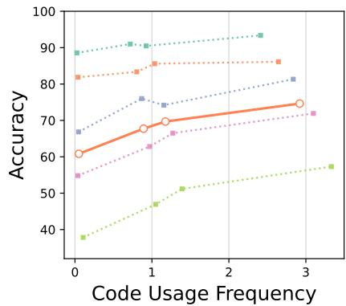  
(a) Level

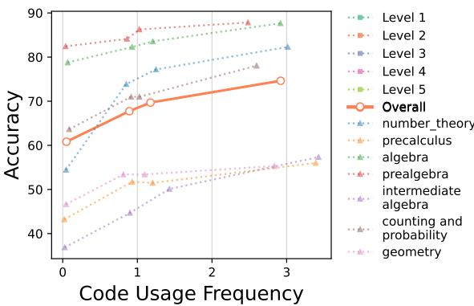  
(b) Subject   
Figure 5: The four points on each curve correspond to results using Prompt 1, Prompt 2, Basic Prompt and Code-based Self-verification Prompt, respectively. (a) The accuracy of different levels at various code usage frequencies. (b) The accuracy of different subjects at various code usage frequencies.

4-code, our method outperforms other methods in the competition, achieving state-of-the-art results across all datasets. Other subjects in MMLU benchmarks are provided in Fig. 8. A comparative analysis of our results with those of previous state-of-the-art techniques and open-source models is also provided.

Tab. 2 illustrates that verification-guided majority voting is an effective framework to reduce the number of sampled paths, compared to GPT-4 with model selection (Zhao et al., 2023) and PHP (Zheng et al., 2023).

Tab. 3 presents a comparison of our model’s performance with existing models (Hoffmann et al., 2022; Taylor et al., 2022) on the MMLU-Math dataset and with state-of-the-art open-sourced models4 on MMLU-STEM. The open-source models remain significantly outpaced by their closedsource counterparts. To address this gap, we have made the dataset and will make it publicly available in the near future. Our intention is to facilitate the fine-tuning of open-source LLMs. For example, the open-source model LLaMA 2 (Touvron et al., 2023) can potentially utilize this data to further bolster its math reasoning capabilities.

# 4.3 CODE USAGE FREQUENCY OF PROPOSED PROMPTS

Analogous to the approach taken in Sec. 3.1, we gather data to elucidate the correlation between accuracy and Code Usage Frequency across various dimensions - prompts (proposed CSV prompt as well as prompts used in pilot experiments), subjects, and difficulty levels. As shown in Fig. 5, the model’s behavior is in accordance with our expectations when adding the code-based prompts. Each line in Fig. 5 has an obvious trend of going upwards, proving that the increase of Code Usage Frequency induces a general improvement in accuracy. The performance gain when using more code is more obvious in the higher difficulty levels, while in lower levels, the performance gain is not very prominent, as shown in Fig. 5 (a). Also, the Code Usage Frequency increases steadily with

Table 4: Comparison Self-verification with/without explicit code-based prompt (Overall:The results across various MATH subtopics (Hendrycks et al., 2021))   

<table><tr><td rowspan="6">GPT4-Code Interpreter</td><td>Verification Method</td><td>Intermediate Algebra</td><td>Precalculus -</td><td>Geometry -</td><td>Number Theory</td><td>Counting &amp; Probability</td><td>PreAlgebra -</td><td>Algebra -</td><td>Overall -</td></tr><tr><td>without Verification</td><td>50.1</td><td>51.5</td><td>53.4</td><td>77.2</td><td>70.6</td><td>86.3</td><td>83.6</td><td>69.69</td></tr><tr><td rowspan="2">Nature Language</td><td>52.6</td><td>48.7</td><td>50.8</td><td>79.9</td><td>72.5</td><td>83.1</td><td>82.6</td><td>69.29</td></tr><tr><td>+2.5</td><td>-2.8</td><td>-2.6</td><td>+2.7</td><td>+1.9</td><td>-3.2</td><td>-1.0</td><td>-0.40</td></tr><tr><td rowspan="2">Code-based</td><td>56.6</td><td>53.9</td><td>54.0</td><td>85.6</td><td>77.3</td><td>86.5</td><td>86.9</td><td>73.54</td></tr><tr><td>+6.5</td><td>+2.4</td><td>+0.6</td><td>+8.4</td><td>+6.7</td><td>+0.2</td><td>+3.3</td><td>+3.85</td></tr></table>

the increase of difficulty levels. This shows that the harder math problems require more frequent code usage, which implies that invoking code multiple times might be an important reason why GPT4-Code have such an advantage in solving difficult math problems. There is a similar trend in Fig. 5 (b).

# 4.4 ABLATION STUDY AND DISCUSSION

Comparisons between Natural Language and Code-based Self-Verification: to underscore the significance of code in the self-verification stage, we employed a distinct natural language selfverification prompt. In this approach, GPT4-Code is directed to verify the solution through natural language instead of relying on code-based verification, as presented in Tab. 4. The accuracy achieved with this method was slightly lower than that of the Basic Prompt. Moreover, we observed a decline in accuracy for 4 of the 7 subtopics, indicating that relying solely on natural language verification can not only compromise accuracy but also negatively impact performance. In contrast, code-based verification enhances accuracy across all 7 subtopics when compared to the Basic Prompt.

Analysis of Verification-guided Weighted Majority Voting: we initially compiled the confusion matrix (TP/TN/FP/FN), capturing solutions with self-verification that matches the True and False states mentioned in Eq. 1 from five distinct sampled paths. The details of the confusion matrix are presented in Appendix A.1.1. From this data, we computed Precision, Recall, and Accuracy. (Solutions in the True state are seen as positive.) The results are presented in Fig. 6. In comparison to Accuracy, we observed numerical enhancements of $2 2 . 3 \%$ and $5 . 6 \%$ in the average Precision and Recall, respectively. In particular, the average Precision registered at $9 5 . 8 8 \%$ . This implies that the Accuracy has the potential to become much higher, if more solutions reach the verified True state before giving the final answer.

Hyper-parameters ablation in Verification-guided Weighted Majority Voting: we also performed ablation studies on the hyper-parameter $w _ { v } \in \{ w _ { \mathbf { T } } , w _ { \mathbf { U } } , w _ { \mathbf { F } } \}$ in Eq. 1. When the hyperparameter setting satisfied $w _ { \mathbf { T } } > w _ { \mathbf { U } } \ge w _ { \mathbf { F } }$ , the performance of the verification-guided weighted majority voting consistently surpassed that of the naive majority voting methods across all sampled paths. In contrast, when we set the hyper-parameter $( w _ { \mathbf { T } } = 0 . 5 , w _ { \mathbf { U } } = 0 . 5 , w _ { \mathbf { F } } = 1 )$ , the performance under this configuration was worse than the naive majority voting. Therefore, our proposed method, verification-guided weighted majority voting, is easy to tune and robust.

# 5 CONCLUSION AND LIMITATION

In this paper, we begin with pilot experiments on GPT4-Code to explore how its use of code impacts its performance in mathematical reasoning. By analyzing Code Usage Frequency and accuracy, we determine that GPT4-Code’s skill in solving math problems can be largely attributed to its ability to generate and execute code, as well as its effectiveness in adjusting and rectifying solutions when confronted with implausible execution outputs. Expanding on this understanding, we introduce the ideas of explicit code-based self-verification and verification-guided weighted majority voting, with the goal of enhancing GPT4-Code’s mathematical capabilities.

However, there are limitations in our work that we plan to explore further in the future. Firstly, our analysis and improvements are currently focused on GPT4-Code, which is somewhat restrictive. We aim to apply the methods to other LLMs. Secondly, our explicit code-based self-verification and verification-guided weighted majority voting technique could potentially create more accurate datasets. These datasets would include detailed step-by-step code-based solution generation and

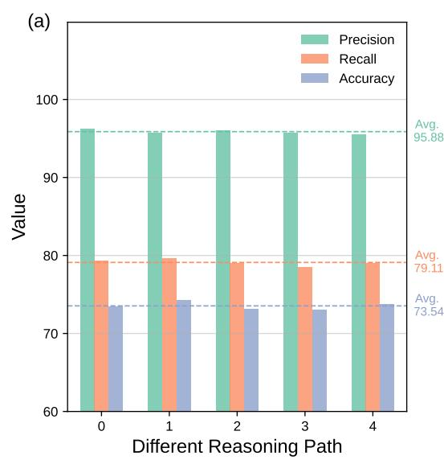

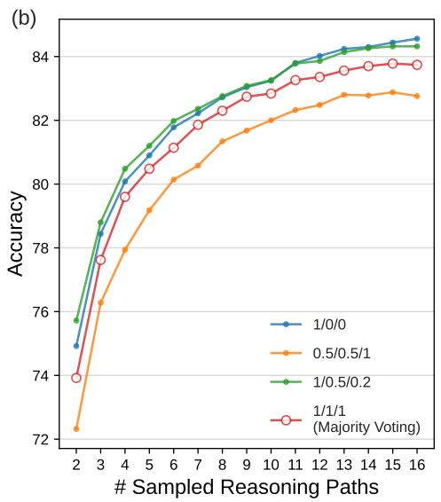  
Figure 6: (a). shows the precision, recall, and accuracy on different reasoning paths. (b). shows the accuracy in response to the number of sampled reasoning paths when the weight is set to different values.

code-based validation, which could help improve open-source LLMs like LLaMA 2 (Touvron et al., 2023) and enhance their mathematical abilities. Although we haven’t yet investigated this approach, we leave it for future work.

# REFERENCES

Rohan Anil, Andrew M Dai, Orhan Firat, Melvin Johnson, Dmitry Lepikhin, Alexandre Passos, Siamak Shakeri, Emanuel Taropa, Paige Bailey, Zhifeng Chen, et al. Palm 2 technical report. arXiv preprint arXiv:2305.10403, 2023.   
Tom Brown, Benjamin Mann, Nick Ryder, Melanie Subbiah, Jared D Kaplan, Prafulla Dhariwal, Arvind Neelakantan, Pranav Shyam, Girish Sastry, Amanda Askell, et al. Language models are few-shot learners. Advances in neural information processing systems, 33:1877–1901, 2020.   
Wenhu Chen, Xueguang Ma, Xinyi Wang, and William W. Cohen. Program of thoughts prompting: Disentangling computation from reasoning for numerical reasoning tasks, 2022.   
Wenhu Chen, Ming Yin, Max Ku, Pan Lu, Yixin Wan, Xueguang Ma, Jianyu Xu, Xinyi Wang, and Tony Xia. Theoremqa: A theorem-driven question answering dataset, 2023.   
Karl Cobbe, Vineet Kosaraju, Mohammad Bavarian, Mark Chen, Heewoo Jun, Lukasz Kaiser, Matthias Plappert, Jerry Tworek, Jacob Hilton, Reiichiro Nakano, Christopher Hesse, and John Schulman. Training verifiers to solve math word problems. arXiv preprint arXiv:2110.14168, 2021.   
Yao Fu, Hao Peng, Ashish Sabharwal, Peter Clark, and Tushar Khot. Complexity-based prompting for multi-step reasoning. arXiv preprint arXiv:2210.00720, 2022.   
Luyu Gao, Aman Madaan, Shuyan Zhou, Uri Alon, Pengfei Liu, Yiming Yang, Jamie Callan, and Graham Neubig. Pal: Program-aided language models. In International Conference on Machine Learning, pp. 10764–10799. PMLR, 2023.   
Dan Hendrycks, Collin Burns, Steven Basart, Andy Zou, Mantas Mazeika, Dawn Xiaodong Song, and Jacob Steinhardt. Measuring massive multitask language understanding. ArXiv, abs/2009.03300, 2020. URL https://api.semanticscholar.org/CorpusID: 221516475.   
Dan Hendrycks, Collin Burns, Saurav Kadavath, Akul Arora, Steven Basart, Eric Tang, Dawn Song, and Jacob Steinhardt. Measuring mathematical problem solving with the math dataset. arXiv preprint arXiv:2103.03874, 2021.   
Jordan Hoffmann, Sebastian Borgeaud, Arthur Mensch, Elena Buchatskaya, Trevor Cai, Eliza Rutherford, Diego de Las Casas, Lisa Anne Hendricks, Johannes Welbl, Aidan Clark, et al. Training compute-optimal large language models. arXiv preprint arXiv:2203.15556, 2022.   
Takeshi Kojima, Shixiang (Shane) Gu, Machel Reid, Yutaka Matsuo, and Yusuke Iwasawa. Large language models are zero-shot reasoners. In Advances in Neural Information Processing Systems, volume 35, pp. 22199–22213, 2022.   
Aitor Lewkowycz, Anders Andreassen, David Dohan, Ethan Dyer, Henryk Michalewski, Vinay Ramasesh, Ambrose Slone, Cem Anil, Imanol Schlag, Theo Gutman-Solo, et al. Solving quantitative reasoning problems with language models. Advances in Neural Information Processing Systems, 35:3843–3857, 2022.   
Yifei Li, Zeqi Lin, Shizhuo Zhang, Qiang Fu, Bei Chen, Jian-Guang Lou, and Weizhu Chen. Making language models better reasoners with step-aware verifier. In Proceedings of the 61st Annual Meeting of the Association for Computational Linguistics (Volume 1: Long Papers), pp. 5315– 5333, 2023.   
Hunter Lightman, Vineet Kosaraju, Yura Burda, Harri Edwards, Bowen Baker, Teddy Lee, Jan Leike, John Schulman, Ilya Sutskever, and Karl Cobbe. Let’s verify step by step. arXiv preprint arXiv:2305.20050, 2023.   
Pan Lu, Liang Qiu, Kai-Wei Chang, Ying Nian Wu, Song-Chun Zhu, Tanmay Rajpurohit, Peter Clark, and Ashwin Kalyan. Dynamic prompt learning via policy gradient for semi-structured mathematical reasoning. arXiv preprint arXiv:2209.14610, 2022.

Aman Madaan, Niket Tandon, Prakhar Gupta, Skyler Hallinan, Luyu Gao, Sarah Wiegreffe, Uri Alon, Nouha Dziri, Shrimai Prabhumoye, Yiming Yang, et al. Self-refine: Iterative refinement with self-feedback. arXiv preprint arXiv:2303.17651, 2023.   
A. Newell and H.A. Simon. Human Problem Solving. ACS symposium series. Prentice-Hall, 1972. ISBN 9780134454030. URL https://books.google.com.hk/books?id= h03uAAAAMAAJ.   
OpenAI. Gpt-4 technical report, 2023.   
Ross Taylor, Marcin Kardas, Guillem Cucurull, Thomas Scialom, Anthony Hartshorn, Elvis Saravia, Andrew Poulton, Viktor Kerkez, and Robert Stojnic. Galactica: A large language model for science. arXiv preprint arXiv:2211.09085, 2022.   
Hugo Touvron, Louis Martin, Kevin Stone, Peter Albert, Amjad Almahairi, Yasmine Babaei, Nikolay Bashlykov, Soumya Batra, Prajjwal Bhargava, Shruti Bhosale, et al. Llama 2: Open foundation and fine-tuned chat models. arXiv preprint arXiv:2307.09288, 2023.   
Xuezhi Wang, Jason Wei, Dale Schuurmans, Quoc V Le, Ed H. Chi, Sharan Narang, Aakanksha Chowdhery, and Denny Zhou. Self-consistency improves chain of thought reasoning in language models. In The Eleventh International Conference on Learning Representations, 2023. URL https://openreview.net/forum?id $\underline { { \underline { { \mathbf { \Pi } } } } } =$ 1PL1NIMMrw.   
Yingxu Wang and Vincent Chiew. On the cognitive process of human problem solving. Cognitive Systems Research, 11(1):81–92, 2010. ISSN 1389-0417.   
Jason Wei, Xuezhi Wang, Dale Schuurmans, Maarten Bosma, brian ichter, Fei Xia, Ed H. Chi, Quoc V Le, and Denny Zhou. Chain of thought prompting elicits reasoning in large language models. In Alice H. Oh, Alekh Agarwal, Danielle Belgrave, and Kyunghyun Cho (eds.), Advances in Neural Information Processing Systems, 2022. URL https://openreview. net/forum?id=_VjQlMeSB_J.   
Yixuan Weng, Minjun Zhu, Fei Xia, Bin Li, Shizhu He, Kang Liu, and Jun Zhao. Large language models are better reasoners with self-verification, 2023.   
Shunyu Yao, Dian Yu, Jeffrey Zhao, Izhak Shafran, Thomas L. Griffiths, Yuan Cao, and Karthik Narasimhan. Tree of thoughts: Deliberate problem solving with large language models. ArXiv, abs/2305.10601, 2023.   
Xu Zhao, Yuxi Xie, Kenji Kawaguchi, Junxian He, and Qizhe Xie. Automatic model selection with large language models for reasoning. arXiv preprint arXiv:2305.14333, 2023.   
Chuanyang Zheng, Zhengying Liu, Enze Xie, Zhenguo Li, and Yu Li. Progressive-hint prompting improves reasoning in large language models. arXiv preprint arXiv:2304.09797, 2023.   
Denny Zhou, Nathanael Scharli, Le Hou, Jason Wei, Nathan Scales, Xuezhi Wang, Dale Schuur-¨ mans, Claire Cui, Olivier Bousquet, Quoc Le, and Ed Chi. Least-to-most prompting enables complex reasoning in large language models, 2023.

# APPENDIX

This Appendix contains two sections. The first section provides the experiment details, including the detailed experiment results on MATH and MMLU datasets. The second section presents some examples of GPT4-Code.

# A EXPERIMENT DETAILS

# A.1 DETAILED EXPERIMENT RESULT ON MATH DATASET

# A.1.1 CONFUSION MATRIX

A confusion matrix is a specific table layout that allows visualization of the performance of an algorithm. It’s particularly useful for classification problems, and we utilize it to analyze the performance of our verification process.

The matrix itself is a two-dimensional grid, $2 \mathbf { x } 2$ , for the binary classification of verification results. Each row of the matrix represents the instances in a predicted class, which is determined by the verification results given by the language model, while each column represents the instances in an actual class, which is determined by the actual correctness of the answer given by the model. Tab. 5 shows how the matrix looks for our verification process:

Table 5: Confusion Matrix of Verification   

<table><tr><td></td><td>Answer Correct</td><td>Answer Wrong</td></tr><tr><td>Verification True</td><td>TP</td><td>FP</td></tr><tr><td>Verification False</td><td>FN</td><td>TN</td></tr></table>

Here’s what the four terms mean:

• True Positive (TP): The cases in which the model’s verification result is ‘True’, and the answer is actually correct.   
• True Negative (TN): The cases in which the model’s verification result is ‘False’, and the answer is actually wrong.   
• False Positive (FP): The cases in which the model’s verification result is ‘True’, but the answer is actually wrong.   
• False Negative (FN): The cases in which the model’s verification result is ‘False’, but the answer is actually correct.

This matrix is very helpful for measuring more than just straightforward accuracy, based on which Precision and Recall are two important metrics. They are defined in Eq. 3 and their meanings are as follows:

• Precision is the fraction of relevant instances among the retrieved instances. It is a measure of the accuracy of the classifier when it predicts the positive class.   
• Recall is the fraction of the total amount of relevant instances that were actually retrieved. It is a measure of the ability of a classifier to find all the positive instances.

$$
\text {P r e c i s i o n} = \frac {\mathrm {T P}}{\mathrm {T P} + \mathrm {F P}}, \text {R e c a l l} = \frac {\mathrm {T P}}{\mathrm {T P} + \mathrm {F N}} \tag {3}
$$

In other words, precision answers the question “What proportion of verified TRUE answers was actually correct?”, while recall answers “What proportion of actual correct answers was verified TRUE?” Given its meaning, verification-guided voting is bounded to be effective when the precision of verification is high.

# A.1.2 PYTHON PACKAGE USAGE ANALYSIS

Tab. 6 outlines the usage of various Python packages in our experiments. Among them, we found that the sympy package is utilized most frequently, highlighting its central role in the computational tasks performed.

Table 6: Python package usage frequency on MATH dataset.   

<table><tr><td>Package</td><td>sympy</td><td>numpy</td><td>math</td><td>fractions</td><td>itertools</td><td>cmath</td><td>scipy</td><td>matplotlib</td><td>functools</td><td>collections</td><td>statistics</td></tr><tr><td>All</td><td>0.4168</td><td>0.0284</td><td>0.1590</td><td>0.0094</td><td>0.0034</td><td>0.0034</td><td>0.0016</td><td>0.0010</td><td>0.0004</td><td>0.0004</td><td>0.0002</td></tr><tr><td>Correct</td><td>0.3907</td><td>0.0241</td><td>0.1638</td><td>0.0110</td><td>0.0029</td><td>0.0026</td><td>0.0009</td><td>0.0003</td><td>0.0003</td><td>0.0006</td><td>0.0003</td></tr><tr><td>correct per code</td><td>0.3323</td><td>0.0205</td><td>0.1393</td><td>0.0094</td><td>0.0025</td><td>0.0022</td><td>0.0007</td><td>0.0003</td><td>0.0003</td><td>0.0005</td><td>0.0003</td></tr><tr><td>Wrong</td><td>0.4724</td><td>0.0383</td><td>0.1493</td><td>0.0058</td><td>0.0045</td><td>0.0052</td><td>0.0032</td><td>0.0026</td><td>0.0007</td><td>0</td><td>0</td></tr><tr><td>wrong per code</td><td>0.3194</td><td>0.0259</td><td>0.1009</td><td>0.004</td><td>0.0031</td><td>0.0035</td><td>0.0022</td><td>0.0018</td><td>0.0004</td><td>0</td><td>0</td></tr><tr><td>c/w per code</td><td>104%</td><td>79%</td><td>138%</td><td>238%</td><td>80%</td><td>63%</td><td>34%</td><td>14%</td><td>57%</td><td>NaN</td><td>NaN</td></tr></table>

# A.2 DETAILED EXPERIMENT RESULT ON MMLU DATASET

Fig. 8 illustrates that GPT4-Code performs relatively poorly in certain domains, such as engineering and the humanities, with a particularly marked deficiency in virology, where it achieves a score of less than $60 \%$ . These observations delineate specific areas that call for further investigation and refinement, thus outlining the direction for future improvements in the model.

# B EXAMPLES

In this section, we provide more examples.

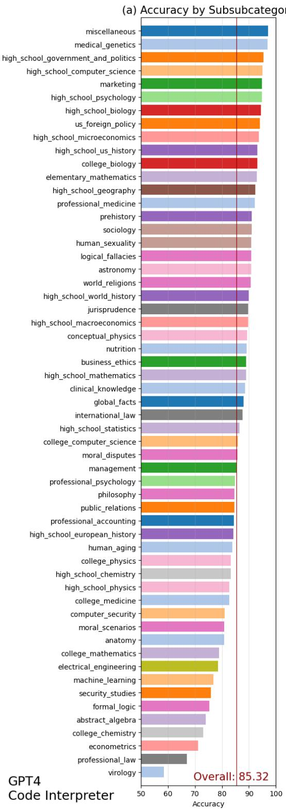

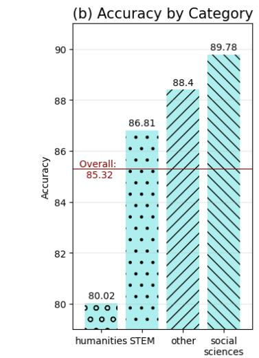

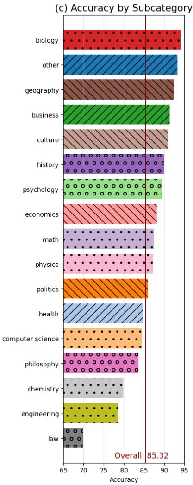  
Figure 7: GPT4-Code performance on MMLU dataset on: (a) subsubcategory, (b) category, (c) subcategory

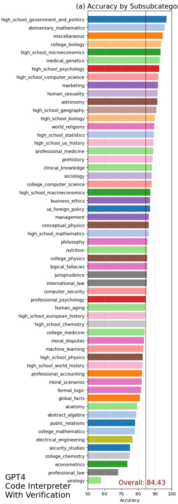

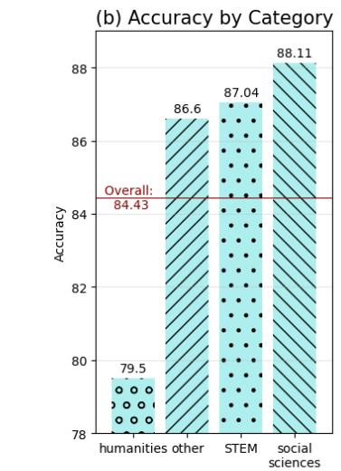

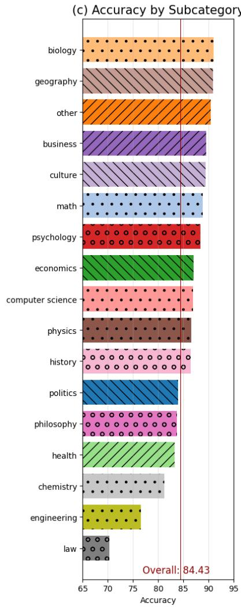  
Figure 8: Model performance on MMLU dataset on: (a) subsubcategory, (b) category, (c) subcategory

Math Problem: 0.54 as a fraction in lowest terms.   
RESULT   
Sure, we can solve this problem by setting up an equation, solving it, and simplifying the fraction.  
Let's call 0.54 as $x$ .  
The decimal 0.54 means that the digits "54" repeat indefinitely. So, we can multiply $x$ by 100 (since "54" is a two-digit number) to get another equation.  
This gives us $100x = 54.54$ .  
By subtracting the original equation from this new one, we eliminate the repeating decimal: $100x - x = 54.54 - 0.54$ .  
Let's perform these steps in the next Python cell.  
# define the symbol $x = \text{symbols}('x')$ # define the equations  
eq1 = Eq(x, 0.54545454545454545454545454545454545454545454545454545454545454545454545454545454545454545454545454545

```txt
TypeError Traceback (most recent call last) 
```

Apologies for the mistake. We can’t directly subtract two equations in Python. Instead, we should subtract the right-hand sides and left-hand sides of the equations separately to get a new equation. Let’s correct that.

```python
subtract the right hand sides and left hand sides of the equations separately  
rhs = simplify(eq2rhs - eq1rhs)  
lhs = simplify(eq2.lhs - eq1.lhs) 
```

RESULT   
Eq(99\*x,54.0)   
After subtraction, we get the equation $99x = 54$ Next, we can solve for $\mathcal{X}$ to express O.54 as a fraction.   
# solve for x solution $=$ solve(new_eq, x)   
solution[0]

RESULT   
0.545454545454545 The solution for $x$ is approximately 0.545454545454545, but we need to express it as a fraction. Let's convert this decimal into a fraction.

RESULT   
```txt
convert the decimal solution to a fraction  
fraction = nsimplify解决问题[0])  
fraction 
```

6/11   
The decimal $0.54$ can be expressed as the fraction $\frac{6}{11}$ .

Answer: $\frac{6}{11}$

Table 7: An example in which GPT4-Code self-debugs when the code execution emits an error.

Math Problem: A bus comes by Jerry’s bus stop every 20 minutes starting at exactly 5:13 a.m. If Jerry shows up at exactly $8 { : } 3 5 ~ \mathrm { a . m } .$ ., how many minutes will he have to wait for the next bus?

Step 1: Calculate the total minutes from 5:13 a.m. to 8:35 a.m.

Total minutes from $5 { : } 1 3 \ \mathrm { a . m }$ . to $8 { : } 3 5 \ \mathrm { a . m }$ . is $1 8 0 + 2 2$ minutes.

Step 2: Calculate how many buses have come by during this time.

Step 3: Calculate the time when the last bus before 8:35 a.m. came by.

- The time when the last bus came by is $5 : 1 3 \mathrm { a . m . } + 2 0 \times \lfloor n \rfloor$ minutes.

Step 4: Calculate the waiting time.

Now, let’s calculate each step.

```txt
Step 1: Calculate the total minutes from 5:13 a.m. to 8:35 a.m.  
total Minutes = 180 + 22 
```

# RESULT

# -311

It seems that there’s a mistake in the calculations. The waiting time cannot be negative. This error might have occurred in Step 3, where I calculated the time of the last bus in minutes past midnight, but then in Step 4, I subtracted this from the total time from $5 { : } 1 3 \ \mathrm { a . m }$ . to $8 { : } 3 5 \ \mathrm { a . m }$ . I should correct Step 4 to calculate the time until the next bus, which is either 0 if a bus has just arrived at 8:35 a.m., or 20 minutes minus the time since the last bus if a bus arrived before 8:35 a.m.

Let’s correct this.

```txt
Corrected Step 4: Calculate the time until the next bus time_since_last_BUS = total Minutes - last_BUS_time 
```

# RESULT

# 331

There still seems to be a mistake in the calculations. The waiting time calculated is significantly more than 20 minutes, which is not possible given that the bus comes every 20 minutes.

Looking back at the calculations, it seems that the error is in Step 3 when calculating the time the last bus came. The last bus time should be calculated from 5:13 a.m., not from midnight. Let’s correct this.

Corrected Step 3: Calculate the time when the last bus before 8:35 a.m. came by. last_BUS_time.corrected $= 5\star 60 + 13 +$ num_buses $\star 20$

# RESULT

# 331

It seems there is still an error. Let’s try a different approach.

1. Calculate the total minutes that have passed since the first bus at $5 { : } 1 3 \ \mathrm { a . m }$ . until 8:35 a.m.   
2. Since the buses come every 20 minutes, calculate how many complete cycles of 20 minutes have passed in the calculated total minutes.   
3. The time Jerry will have to wait is the remainder of the total minutes divided by 20 (which is the time since the last bus) subtracted from 20 (which is the bus cycle).

This approach should give us the correct waiting time. Let’s calculate it.

```txt
Calculate total minutes from 5:13 a.m. to 8:35 a.m.  
total Minutes = 3 * 60 + 22 # 3 hours and 22 minutes 
```

# RESULT

# 18

So, Jerry will have to wait for 18 minutes for the next bus.

Answer: 18

Table 8: An example in which GPT4-Code adjusts its solution based on the result of code execution.

Math Problem: Solve for $x : 3 ^ { 2 x } + 1 9 = 1 0 ^ { x } .$ .

# code 0

This is a difficult equation to solve and there’s no simple analytical solution using elementary functions. In real world scenarios, such equations are typically solved numerically. For example, using a graphing calculator, a computer, or a mathematical software.

However, if you want an approximation of the solution, it is advisable to use numerical methods such as the bisection method, Newton’s method, or others.

If you would like me to provide an algorithm to find the solution numerically, let me know.

# code 1

# Answer:

The equation you’re asking to solve, $\hat { 3 } ^ { 2 x } + 1 \dot { 9 } = 1 0 ^ { x }$ , cannot be solved algebraically due to the nature of the functions and operations involved. Therefore, we’ll need to use numerical methods such as Newton’s method or Bisection method for root finding.

from scipy.optimize import fsolve import numpy as np

# Defining the function def func(x): return 3**(2*x) + 19 - 10**x

# Initial guess for x, it can be anything, 1.0 is chosen arbitrarily here $\mathrm { ~ \bf ~ x 0 ~ } = \mathrm { ~ \bf ~ 1 ~ } . 0$

# Using fsolve to find the root root $=$ fsolve(func, $\mathtt { x 0 }$ ) x = root[0] x

# RESULT 1.001831315399663

So the answer is 1.00.

# code more

# Answer:

Rewrite the equation as:

$3 ^ { 2 x } - 1 0 + 1 { \dot { 9 } } = 0$

Let’s denote $\begin{array} { r l r l } { { 3 } ^ { x } } & { { } = { } } & { a } \end{array}$ , and $1 0 ^ { x } = b$

so $a ^ { 2 } - b + 1 9 = 0$

now we have two equations: 1. $a = 3 ^ { x }$

2. $b = 1 0 ^ { x }$ Let’s solve this with Python.

from scipy.optimize import root

import numpy as np

# Define the system of equations

def equations(vars):

x, a, b $=$ vars

eq1 = a - 3**x

$\mathtt { e q 2 \ = \ \mathtt { b \ - \ 1 0 \star \times X } }$

eq3 = a**2 - b + 19

return [eq1, eq2, eq3]

# RESULT:

#

$3 ^ { 2 . 0 } + 1 9 = 1 0 ^ { 0 }$

The left-hand side becomes $1 + 1 9 = 2 0$ and the right-hand side becomes 1. Thus, the original equation does not hold true for $\scriptstyle \mathbf { X } = 0$ .

Let’s try a different initial guess for the solution to see if that helps.

# Adjust initial guess for x, a, b x0 = [1, 3, 10]

# Solve system of equations solution $=$ root( equations, $\mathtt { x 0 }$

# Extract solution $\begin{array} { r l } { \mathrm { ~ x ~ } } & { { } = } \end{array}$ solution.x[0] x

# RESULT:

# 2.0000000000004463

We know that $3 ^ { 2 \cdot 2 } = 3 ^ { 4 } = 8 1$ and $1 0 ^ { 2 } ~ = ~ 1 0 0$ . The left-hand side becomes 100 and the righthand side is also 100. Thus, the original equation holds true for $x = 2$ .

Answer: 2

Table 9: An example in which no restriction on code use succeeds while not using code and using code only once fails.

Math Problem: What is the sum of the digits in the terminating decimal representation of the fractio n 432157·28 ?

Table 10: An example in which no restriction on code use succeeds while not using code and using code only once fails.   

<table><tr><td>code 0</td><td>code 1</td><td>code more</td></tr><tr><td>The given fraction is\(\frac{4321}{5^7 \cdot 2^8}\)</td><td>Answer:First, we need to simplify the fraction.Given that \(4321 = 2^5 \cdot 3^3 \cdot 5^0 \cdot 7^0 \cdot 11^0 \cdot 13^1\), we can simplify the fraction \(\frac{4321}{5^7 \cdot 2^8}\) to \(\frac{2^{5.3^{3.5^{0.7^{0.11^{0.13^{1}}}}}}{5^7 \cdot 2^8} = 3^3 \cdot 13^1 \cdot 2^{-3} \cdot 5^{-7}\).Next, we need to compute the decimal representation and sum the digits.# Compute the decimal representation of the fraction value = (3**3 * 13**1) / (2**3 * 5**7)# Convert to string and replace the decimal point str_value = str(value).replace(&#x27; &#x27;, &#x27;&#x27;)# Compute the sum of the digits digit_sum = sum(int( digit) for digit in str_value)digit_sumRESULT:18</td><td>Answer:The denominator can be rewritten as \(10^{min(7,8)} \times 5^{max(0,7-8)} \times 2^{max(0,8-7)}\), where min(a,b) is the minimum of a and b, and max(a,b) is the maximum of a and b. Now let&#x27;s calculate the value of min(7,8), max(0,7-8), and max(0,8-7).min_ab = min(a,b)max_0_a_MINUS_b = max(0,a-b)max_0_b_MINUS_a = max(0,b-a)min_ab,max_0_a_MINUS_b,max_0_b_MINUS_a</td></tr></table>

Answer: 14

Math Problem: What is the sum of all positive integers $r$ that satisfy $\operatorname { l c m } [ r , 7 0 0 ] = 7 0 0 0 \uparrow$

Table 11: An example in which True succeeds while Uncertain and False fails.   

<table><tr><td>True
The least common multiple (LCM) of two numbers a and b is given by the formula:
LCM(a,b)=|a×b|/GCD(a,b)</td><td>Uncertain
First, let&#x27;s find the prime factorization of 7000.
Then, we&#x27;ll generate all the factors of 7000 and find which of those factors are multiples of 700.
Finally, we&#x27;ll sum up all the positive integers that satisfy the condition.
import sympy
# Get the prime factorization of 7000
primeFactors = sympy.factororint(7000)
# Generate all factors of 7000
factors = set()
for factor_2_count in range(
    primeFactors[2] + 1):
    for factor_5_count in range(
        primeFactors[5] + 1):
......
RESULT:
(7000, 1000)
Let&#x27;s verify our solution by checking whether the LCM of each possible r and 700 is indeed 7000.
# Verify the solution lcm_values.corrected = [sympy.lcm(r, 700) for r in r_values(corrected]
......
RESULT:
(True, True)
Upon verification, we find that the least common multiple (LCM) of each possible value of r and 700 is indeed 7000. Hence, the sum of all positive integers r that satisfy lcm[r, 700] = 7000 is 1000 + 7000 = 8000. The answer is 8000.</td><td>False
In this problem, we are given that lcm(r, 700) = 7000.
Let&#x27;s first find the prime factors of 700 and 7000.
import sympy
# Find the prime factorization of 700 and 7000
factors_700 = sympy.factororint(700)
......
RESULT:
(2: 2, 5: 2, 7: 1, 2: 3, 5: 3, 7: 1)
Since the LCM of r and 700 is 7000, r must contain all the prime factors of 7000 that are not already in 700.
# Generate all combinations
combinations = list(
product(*[[1, i] for i in extra Factors])
......
RESULT:
([1, 5, 2, 10], 18)
The possible values of r are 1, 2, 5, and 10.
To verify our answer, we can check that the least common multiple of r and 700 is indeed 7000.
# Remove 1 from the possible values of r
possible_r_values.
remove(1)
......
RESULT:
False
It seems that there&#x27;s a mistake.
Not all the calculated values of r satisfy the given condition.
Let&#x27;s correct the calculation.
# All the values of r should have the factors of 700
r_values = [700]
......
RESULT:
([700, 1400, 3500, 7000], 18720)
Therefore, answer is 18720.</td></tr></table>

Answer: 8000

Math Problem: Let $A = \left( 1 , - 1 1 , 2 \right)$ , $B = ( 3 , - 4 , 1 )$ , and $C = ( - 2 , 1 , - 1 )$ . Compute ∠ABC, in degrees.

# True

The angle $A B C$ is the angle between the vectors $\vec { B A }$ and $\vec { B C }$ . We can find these vectors as follows:

$$
\vec {B A} = \vec {A} - \vec {B} = (- 2, - 7, 1)
$$

$$
\vec {B C} = \vec {C} - \vec {B} = (- 5, 5, - 2)
$$

The angle $\theta$ between two vectors $\vec { u }$ and $\vec { v }$ can be found using the formula

$$
\cos (\theta) = \frac {\vec {u} \cdot \vec {v}}{| | \vec {u} | | | | \vec {v} | |}
$$

Let’s calculate these values.

import numpy as np

# Define vectors vec_BA $=$ np.array([1, -11, 2]) - np. array([3, -4, 1])

# RESULT:

# 120.00000000000001

Let’s now verify this answer.

$$
\vec {u} \cdot \vec {v} = | | \vec {u} | | \cdot | | \vec {v} | | \cdot \cos (\theta)
$$

Substituting our values into this formula, we should get the same dot product (-27) that we calculated earlier. Let’s check this.

# Compute the dot product using the formula dot_product_verification $=$ magnitude_BA $\star$ magnitude_BC * np. cos(theta $\star$ np.pi / 180)

# RESULT:

#

which matches the dot product we calculated earlier. Therefore, the computed angle of $1 2 0 ^ { \circ }$ is correct.

Answer: 120◦

# Uncertain

the cosine of the angle $\theta$ between them is given by

$$
\cos \theta = \frac {\mathbf {u} \cdot \mathbf {v}}{| | \mathbf {u} | |   | | \mathbf {v} | |}
$$

In the given problem, we want to find the angle between vectors $\xrightarrow [ A B ] { }$ and $\overrightarrow { B C }$ , where

$$
\overrightarrow {A B} = \mathbf {B} - \mathbf {A} = (2, 7, - 1)
$$

$$
\overrightarrow {B C} = \mathbf {C} - \mathbf {B} = (- 5, 5, - 2)
$$

Now, we’ll calculate the angle using the formula for $\cos \theta$ .

from numpy import array, dot from numpy.linalg import norm import math

# Defining the vectors $\begin{array} { r l } { \mathbb { A } } & { { } = } \end{array}$ array([1, -11, 2])

# RESULT: 60

The angle $\angle A B C$ is $6 0 ^ { \circ }$ .

# False

The vector $\xrightarrow [ A B ] { }$ is given by $B \mathrm { ~ - ~ } A$ , and the vector $\overrightarrow { B C }$ is given by $C - B$ .

The cosine of the angle between two vectors $\mathbf { u }$ and $\mathbf { v }$ is given by

$$
\cos (\theta) = \frac {\mathbf {u} \cdot \mathbf {v}}{\| \mathbf {u} \| \| \mathbf {v} \|}
$$

Let’s calculate.

import numpy as np

# define the points A = np.array([1, -11, 2])

# RESULT:

# 60.00000000000001

The angle $A B C$ is approximately $6 0 . 0 ^ { \circ }$ . Let’s verify this. We can solve for $\cos ( C )$ :

$$
\cos (C) = \frac {a ^ {2} + b ^ {2} - c ^ {2}}{2 a b}
$$

# calculate vector AC $\mathbb { A } \mathbb { C } \mathrm { ~  ~ { ~ = ~ \mathbb ~ { ~ C ~ } ~ - ~ } ~ } \mathbb { A }$

# calculate the magnitudes of AC magnitude_AC $=$ np. linalg.norm(AC)

# RESULT:

# False

I apologize for the confusion; there seems to have been a mistake in the verification.

The discrepancy arises due to the directionality of the vectors.

Therefore, the initial calculation was correct: the angle $A B C$ is approximately $6 0 . 0 ^ { \circ }$ .

Table 12: An example in which True succeeds while Uncertain and False fails.