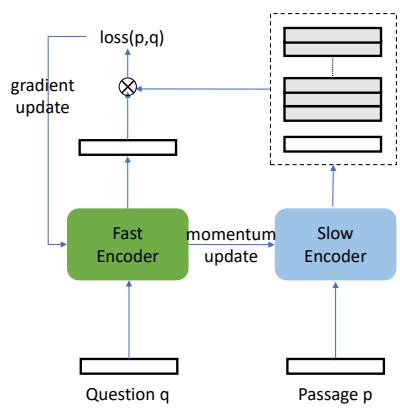
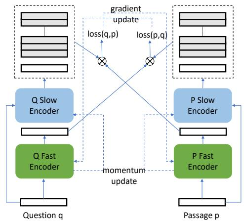
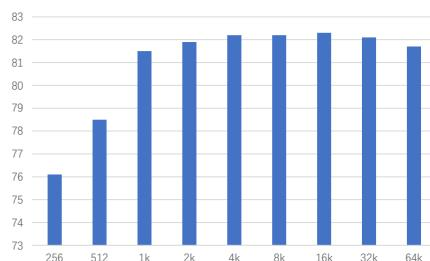

# xMoCo: Cross Momentum Contrastive Learning for Open-Domain Question Answering

Nan Yang, Furu Wei, Binxing Jiao, Daxin Jiang, Linjun Yang  
Microsoft Corporation

{nanya, fuwei, binxjia, djiang, linjya}@microsoft.com

# Abstract

Dense passage retrieval has been shown to be an effective approach for information retrieval tasks such as open domain question answering. Under this paradigm, a dual-encoder model is learned to encode questions and passages separately into vector representations, and all the passage vectors are then pre-computed and indexed, which can be efficiently retrieved by vector space search during inference time. In this paper, we propose a new contrastive learning method called cross momentum contrastive learning (xMoCo), for learning a dual-encoder model for query-passage matching. Our method efficiently maintains a large pool of negative samples like the original MoCo, and by jointly optimizing question-to-passage and passage-to-question matching, enables using separate encoders for questions and passages. We evaluate our method on various open domain QA datasets, and the experimental results show the effectiveness of the proposed approach.

# 1 Introduction

Retrieving relevant passages given certain query from a large collection of documents is a crucial component in many information retrieval systems such as web search and open domain question answering (QA). Current QA systems often employ a two-stage pipeline: a retriever is firstly used to find relevant passages, and then a fine-grained reader tries to locate the answer in the retrieved passages. As recent advancement in machine reading comprehension (MRC) has demonstrated excellent results of finding answers given the correct passages (Wang et al., 2017), the performance of open-domain QA systems now relies heavily on the relevance of the selected passages of the retriever.

Traditionally the retrievers usually utilize sparse keywords matching such as TF-IDF or BM25

(Robertson and Zaragoza, 2009), which can be efficiently implemented with an inverted index. With the popularization of neural network in NLP, the dense passage retrieval approach has gained traction (Karpukhin et al., 2020). In this approach, a dual-encoder model is learned to encode questions and passages into a dense, low-dimensional vector space, where the relevance between questions and passages can be calculated by the inner product of their respective vectors. As the vectors of all passages can be pre-computed and indexed, dense passage retrieval can also be done efficiently with vector space search methods during inference time (Shrivastava and Li, 2014).

Dense retrieval models are usually trained with contrastive objectives between positive and negative question-passage pairs. As the positive pairs are often given by the training data, one challenge in contrastive learning is how to select negative examples to avoid mismatch between training and inference. During inference time, the model needs to find the correct passages from a very large set of pre-computed candidate vectors, but during training, both positive and negative examples need to be encoded from scratch, thus severely limiting the number of negative examples due to computational cost. One promising way to reduce the discrepancy is momentum constrastive learning (MoCo) proposed by He et al. (2020). In this method, a pair of fast/slow encoders are used to encode questions and passages, respectively. The slow encoder is updated as a slow moving average of the fast encoder, which reduces the inconsistency of encoded passage vectors between subsequent training steps, enabling the encoded passages to be stored in a large queue and reused in later steps as negative examples. Unfortunately, directly applying MoCo in question-passage matching is problematic. Unlike the image matching tasks in original MoCo paper, the questions and passages are distinct from

each other and not interchangeable. Furthermore, the passages are only encoded by the slow encoder, but the slow encoder is only updated with momentum from the fast encoder, not directly affected by the gradients. As the fast encoder only sees the questions, the training becomes insensitive to the passage representations and fails to learn properly. To solve this problem, we propose a new contrastive learning method called Cross Momentum Contrastive Learning (xMoCo). xMoCo employs two sets of fast/slow encoders and jointly optimizes the question-passage and passage-question matching tasks. It can be applied to scenarios where the questions and passages require different encoders, while retaining the advantage of efficiently maintaining a large number of negative examples. We test our method on several open-domain QA tasks, and the experimental results show the effectiveness of the proposed approach.

To summarize, the main contributions of this work are as follows:

- We proposes a new momentum contrastive learning method, Cross Momentum Contrast (xMoCo), which can learn question-passage matching where questions and passages require different encoders.   
- We demonstrate the effectiveness of xMoCo in learning a dense passage retrieval model for various open domain question answering datasets.

# 2 Related Work

There are mainly two threads of research work related to this paper.

# 2.1 Passage Retrieval for QA

Retrieving relevance passages is usually the first step in the most QA pipelines. Traditional passage retriever utilizes the keyword-matching based methods such as TF-IDF and BM25 (Chen et al., 2017). Keyword-based approach enjoys its simplicity, but often suffers from term mismatch between questions and passages. Such term mismatch problem can be reduced by either query expansion (Carpineto and Romano, 2012) or appending generated questions to the passages (Nogueira et al., 2019). Dense passage retrieval usually involves learning a dual-encoder to map both questions and passages into dense vectors, where their innerproduct denotes their relevance (Lee et al., 2019).

The challenge in training a dense retriever often lies in how to select negative question-passage pairs. As a small number of randomly generated negative pairs are considered too easy to differentiate, previous work has mainly focused on how to generate "hard" negatives. Karpukhin et al. (2020) selects one negative pair from the top results retrieved by BM25 as hard examples, in addition to one randomly sampled pair. Xiong et al. (2020) uses an iterative approach to gradually produce harder negatives by periodically retrieving top passages for each question using the trained model. In addition to finding hard negatives, Ding et al. (2020) also address the problem of false negatives by filtering them out using a more accurate, fused input model. Different from the above works, our approach aims to address this problem by enlarging the pool of negative samples using momentum contrastive learning, and can be adapted to incorporate harder, cleaner negative samples by other methods.

# 2.2 Momentum Contrastive Learning

Momentum contrastive learning (MoCo) is originally proposed by He et al. (2020). He et al. (2020) learns image representations by training the model to find the heuristically altered images among a large set of other images. It is later improved by constructing better positive pairs (Chen et al., 2020). Different from the image counterpart, many NLP tasks has readily available positive pairs such question-passage pairs. Here the main benefit of momentum contrastive learning is to efficiently maintain a large set of negative samples, thus making the learning process more consistent with the inference. One example of applying momentum contrastive learning in NLP is Chi et al. (2020). In their work, momentum contrastive learning is employed to optimize the InfoNCE lower bound between parallel sentence pairs from different languages. Different from the above works, the questions and passages in our work are not interchangeable and require different encoders, which renders the original MoCo not directly applicable.

# 3 Background

# 3.1 Task description

In this paper, we deal with the task of retrieving relevant passages given certain natural language questions. Given a question $q$ and a collection of $N$ passages $\{q_{1}, q_{2}, \ldots, q_{N}\}$ , a passage retriever aims to return a list of passages $\{q_{i_{1}}, q_{i_{2}}, \ldots, q_{i_{M}}\}$

ranked by their relevance to $q$ . While the number of retrieved passages $M$ is usually in the magnitude of hundreds or thousands, the number of total passages $N$ is typically very large, possibly in millions or billions. Such practical concern places constraints in model choices of the passage retrievers.

# 3.2 Dual-encoder framework for dense passage retrieval

The de-facto "go-to" choice for dense passage retrieval is the dual-encoder approach. In this framework, a pair of encoders $E_{q}$ and $E_{p}$ , usually implemented as neural networks, are used to map the question $q$ and the passage $p$ into their low-dimensional vectors separately. The relevance or similarity score between $q$ and $p$ is calculated as the inner product of the two vectors:

$$
s (q, p) = E _ {q} (q) \cdot E _ {p} (p)
$$

The advantage of this approach is that the vectors of all passages can be pre-computed and stored. During inference, we only need to compute the vector for the question, and the maximum inner product search (MIPS) (Shrivastava and Li, 2014) can be used to efficiently retrieve most relevant passages from a large collection of candidates. It is possible to train a more accurate matching model if the $q$ and $p$ are fused into one input sequence, or if a more sophisticated similarity model is used instead of the simple inner-product, but those changes would no longer permit efficient retrieval, thus can only be used in a later "re-ranking" stage.

The training data $\mathcal{D}$ for passage retrieval consists of a collection of positive question-passage pairs $\{(p_1, q_1), (p_2, q_2), \ldots, (p_n, q_n)\}$ , and an additional $m$ passages $\{p_{n+1}, \ldots, p_{n+m}\}$ without their corresponding questions. The encoders are trained to optimize the negative log-likelihood of all positive pairs:

$$
\mathcal {L} (\mathcal {D}, E _ {q}, E _ {p}) = - \sum_ {i = 1} ^ {n} \log \frac {\exp s (q _ {i} , p _ {i})}{\sum_ {j = 1} ^ {n + m} \exp s (q _ {i} , p _ {j})}
$$

As the number of negative pairs $(n + m - 1)$ is very large, it is infeasible to optimize the loss directly. Instead, only a subset of the negative samples will be selected to compute the denominator in the above equation. The selection of the negative samples is critical to the performance of trained model. Previous works such as Xiong et al. (2020)

and Ding et al. (2020) mainly focus on selecting a few "hard" examples, which hve higher similarity scores with the question and thus contribute more to the sum in the denominator. In this work, we will explore how to use a large set of negative samples to better approximate the sum in the denominator.

# 4 Method

# 4.1 Momentum contrast for passage retrieval

We briefly review momentum contrast and explain why directly applying momentum contrast for passage retrieval is problematic.

Momentum contrast method employs a pair of encoders $E_{q}$ and $E_{p}$ . For each training step, the training pair of $q_{i}$ and $p_{i}$ is encoded as $E_{q}(q_{i})$ and $E_{p}(p_{i})$ respectively, which is identical to other training method. The key difference is that momentum contrast maintains a queue $\mathcal{Q}$ of passage vectors $\{E_{p}(p_{i - k})\}_{k}$ encoded in previous training steps. The passage vectors in the queue serve as negative candidates for the current question $q_{i}$ . The process is computationally efficient since the vectors for negative samples are not re-computed, but it also brings the problem of staleness: the vectors in the queue are computed by the previous, not up-to-date models. To reduce the inconsistency, momentum contrast uses momentum update on the encoder $E_{p}$ , making $E_{p}$ a slow moving-average copy of the question encoder $E_{q}$ . The gradient from the loss function is only directly applied to the question encoder $E_{q}$ , not the passage encoder $E_{p}$ . After each training step, the newly encoded $E_{p_i}$ is pushed into the queue and the oldest vector is discarded, keeping the queue size constant during training. Such formulation poses no problem for the original MoCo paper (He et al., 2020), because their "questions" and "passages" are both images and are interchangeable. Unfortunately, in our passage retrieval problem, the questions and passages are distinct, and it is desirable to use different encoders $E_{q}$ and $E_{p}$ . Even in scenarios where the parameters of the two encoders can be shared, the passages are only encoded by the passage encoder $E_{p}$ , but the gradient from the loss is not applied on the passage encoder. It makes the training process insensitive to the input passages, thus unable to learn reasonable representations.

# 4.2 xMoCo: Cross momentum contrast

To solve the problems mentioned above, we propose a new momentum contrastive learning method,

  
(a) MoCo

  
(b) xMoCo   
Figure 1: Illustration of MoCo and xMoCo. Compared with MoCo, xMoCo utilizes two pairs of fast/slow encoders, employs two separate queues for questions and passages, and jointly optimizes both question-to-passage and passage-to-question matching tasks.

called cross momentum contrast (xMoCo). xMoCo employs two pairs of encoders: $E_{q}^{fast}$ and $E_{q}^{slow}$ for questions; $E_{p}^{fast}$ and $E_{p}^{slow}$ for passages. In addition, two separate queues $\mathcal{Q}_q$ and $\mathcal{Q}_p$ store previous encoded vectors for questions and passages, respectively. In one training step, given a positive pair $q$ and $p$ , the question encoders map $q$ into $E_{q}^{fast}(q)$ and $E_{q}^{slow}(q)$ , while the passage encoders map $p$ into $E_{p}^{fast}(p)$ and $E_{p}^{slow}(p)$ . The two vectors encoded by slow encoders are then pushed into their respective queues $\mathcal{Q}_q$ and $\mathcal{Q}_p$ . We jointly optimize the question-to-passage and passage-to-question tasks by pitting $q$ against all vectors in $\mathcal{Q}_q$ and $p$ against all vectors in $\mathcal{Q}_p$ :

$$
\mathcal {L} _ {q p} = - \log \frac {\exp (E _ {q} ^ {f a s t} (q) \cdot E _ {p} ^ {s l o w} (p))}{\sum_ {p ^ {\prime} \in \mathcal {Q} _ {p}} \exp E _ {q} ^ {f a s t} (q) \cdot E _ {p} ^ {s l o w} (p ^ {\prime})}
$$

$$
\mathcal {L} _ {p q} = - \log \frac {\exp (E _ {p} ^ {f a s t} (p) \cdot E _ {q} ^ {s l o w} (q))}{\sum_ {q ^ {\prime} \in \mathcal {Q} _ {q}} \exp E _ {p} ^ {f a s t} (p) \cdot E _ {q} ^ {s l o w} (q ^ {\prime})}
$$

$$
\mathcal {L} = \lambda \mathcal {L} _ {q p} + (1 - \lambda) \mathcal {L} _ {p q}
$$

where $\lambda$ is a weight parameter and simply set to 0.5 in all experiments in this paper. Like the original MoCo, the gradient update from the loss is only applied to the fast encoders $E_{q}^{fast}$ and $E_{p}^{fast}$ , while the slow encoders $E_{q}^{slow}$ and $E_{p}^{slow}$ are updated with momentum from the fast encoders:

$$
E _ {p} ^ {s l o w} \gets \alpha E _ {p} ^ {f a s t} + (1 - \alpha) E _ {p} ^ {s l o w}
$$

$$
E _ {q} ^ {s l o w} \gets \alpha E _ {q} ^ {f a s t} + (1 - \alpha) E _ {q} ^ {s l o w}
$$

where $\alpha$ controls the update speed of the slow encoders and is typically set to a small positive value. When training is finished, both slow encoders are discarded, and only the fast encoders are used in inference. Hence, the number of parameters for xMoCo is comparable to other dual-encoder methods when employing similar-sized encoders.

In this framework, the two fast encoders $E_{q}^{fast}$ and $E_{p}^{fast}$ are not tightly coupled in the gradient update, but instead influence other through the slow encoders. $E_{p}^{fast}$ updates $E_{p}^{slow}$ through momentum updates, which in turn influences $E_{q}^{fast}$ by gradient updates from optimizing the loss $\mathcal{L}_{qp}$ . $E_{q}^{fast}$ can also influence $E_{p}^{fast}$ through similar path. See Fig. 1 for illustration.

# 4.3 Adaption for Batch Training

Batch training is the standard training protocol for deep learning models due to efficiency and performance reasons. For xMoCo, we also expect our model to be trained in batches. Under the batch training setting, a batch of positive examples are processed together in one training step. The only adaption we need here is to push all vectors computed by slow encoders in one batch into the queues together. It effectively mimics the behavior of the "in-batch negative" strategy employed by previous works such as Karpukhin et al. (2020), where the passages in one batch will serve as negatives examples for their questions.

# 4.4 Encoders

We use pre-trained uncased BERT-base (Devlin et al., 2019) models as our encoders following Karpukhin et al. (2020). The question and passage encoders utilize two sets of different parameters but are initialized from the same BERT-base model. For both question and passage, we use the vectors of the sequence start tokens in the last layer as their representations. Better pre-trained models such as Liu et al. (2019) can lead to better retrieval performance, but we choose the uncased BERT-base model for easier comparison with previous work.

# 4.5 Incorporating hard negative examples

Previous work has shown selecting hard examples can be helpful for training passage retrieval models. Our method can easily incorporate hard negative examples by simply adding an additional loss under the multitask framework:

$$
\begin{array}{l} \mathcal {L} _ {h a r d} \\ = - \log \frac {\exp (E _ {q} ^ {f a s t} (q) \cdot E _ {p} ^ {f a s t} (p))}{\sum_ {p ^ {\prime} \in \mathcal {P} ^ {-}} \bigcup_ {\{p \}} \exp E _ {q} ^ {f a s t} (q) \cdot E _ {p} ^ {f a s t} (p ^ {\prime})} \\ \end{array}
$$

where $\mathcal{P}$ is a set of hard negative examples. The loss only involves the two fast encoders, not the slow encoders. We only add hard negatives for the question-to-passage matching tasks, not the passage-to-question matching tasks. In addition, we also encode these negative passages using the slow passage encoder $E_{p}^{slow}$ and enqueue them to serve as negative passages in calculating loss $\mathcal{L}_{qp}$ .

In this work, we only implement a simple method of generating hard examples following Karpukhin et al. (2020): for each positive pair, we add one hard negative example by randomly sampling from top retrieval results using a BM25 retriever. More elaborate methods of finding hard examples such as Xiong et al. (2020) and Ding et al. (2020) can also be included, but we leave it to future work.

# 4.6 Removing false negative examples

False negative examples are passages that can match the given question but are falsely labeled as negative examples. In xMoCo formulation, false negatives can arise if a previous encoded passage $p$ in the queue can answer current question $q$ . It can happen if the some questions share the same passage as answer, or if the same question-passage pair is sampled another time when its previous encoded vector is still in the queue because the queue

size can be quite large. This is especially important for datasets with small number of positive pairs. To fix the problem, we keep track of the passage ids in the queue and mask out those passages identical to the current passage when calculating the loss.

Labeling issues can also be the source of false negative examples as pointed out in Ding et al. (2020). In their work, an additional model with fused input is trained to reduce the false negatives. We plan to incorporate such model-based approach in the future.

# 5 Experiment

# 5.1 Wikipedia Data as Passage Retrieval Candidates

As many question answering datasets only provide positive pairs of questions and passages, we need to create a large collection of passages for passage retrieval tasks. Following Lee et al. (2019), we extract the passage candidate set from the English Wikipedia dump from Dec. 20, 2018. Following the pre-processing steps in Karpukhin et al. (2020), we first extract clean texts using pre-processing code from DrQA (Chen et al., 2017), and then split each article into non-overlapping chunks of 100 tokens as the passages for our retrieval task. After pre-processing, we get 20,914,125 passages in total.

# 5.2 Question Answering Datasets

We use the five QA datasets from Karpukhin et al. (2020) and follow their training/dev/test splits. Here is a brief description of the datasets.

Natural Questions (NQ) (Kwiatkowski et al., 2019) is a question answer dataset where the questions were real Google search queries and answers were text spans of Wikipedia articles manually selected by annotators.

TriviaQA (Joshi et al., 2017) is a set of trivia questions with their answers. We use the unfiltered version of TriviaQA.

WebQuestions (WQ) (Berant et al., 2013) is a collection of questions from Google Suggest API with answers from Freebase.

CuratedTREC (TREC) (Baudiš and Šedivý, 2015) composes of questions from both TREC QA tracks and Web sources.

SQuAD v1.1 (Rajpurkar et al., 2016) is original used as a benchmark for reading comprehension.

We follow the same procedure in Karpukhin et al. (2020) to create positive passages for all datasets.

For TriviaQA, WQ and TREC, we use the highest-ranked passage from BM25 which contains the answer as positive passage, because these three datasets do not provide answer passages. We discard questions if answer cannot be found at the top 100 BM25 retrieval results. For NQ and SQuAD, we replace the gold passage with the matching passage in our passage candidate set and discard unmatched questions due to differences in processing. Table 1 shows the number of questions in the original training/dev/test sets and the number of questions in training sets after discarding unmatched questions. Note that our numbers are slightly different from Karpukhin et al. (2020) due to small differences in the candidate set or the filtering process.

# 5.3 Settings

Following Karpukhin et al. (2020), we test our model on two settings: a "single" setting where each dataset is trained separately, and a "multi" setting where the training data is combined from NQ, TriviaQA, WQ and TREC (excluding SQuAD).

We compare our model against two baselines. The first baseline is the classic BM25 baseline. The second baseline is the Deep Passage Retrieval (DPR) model from Karpukhin et al. (2020). We also implement the setting where the candidates are re-ranked using a linear combination of BM25 and the model similarity score from either DPR or our xMoCo model.

The evaluation metric for passage retrieval is top-K retrieval accuracy. Here the top-K accuracy means the percentage of questions which have at least one passage containing the answer in the top K retrieved passages. In our experiments, we evaluate the results on both Top-20 and Top-100 retrieval accuracy.

# 5.4 Implementation details

For training, we used batch size of 128 for our models. For the two small datasets TREC and WQ, we trained the model for 100 epochs; for other datasets, we trained the model for 40 epochs. We used the dev set results to select the final checkpoint for testing. The dropout is 0.1 for all encoders. The queue size of negative examples in our model is 16,384. The momentum co-efficient $\alpha$ in the momentum update is set to 0.001. We used Adam optimizer with a learning rate of $3e - 5$ , linear scheduling with $5\%$ warm-up. We didn't do hyperparameter search. We follow their specification in Karpukhin

et al. (2020) when re-implementing DPR baselines. Training was done on 16 32GB Nvidia GPUs, and took less than 12 hours to train each model.

For inference, we use FAISS (Johnson et al., 2017) for indexing and retrieving passage vectors. For BM25, we use Lucene implementation with $b = 0.4$ (length normalization) and $k_{1} = 0.9$ (term frequency scaling) following Karpukhin et al. (2020).

# 5.5 Main Results

We compare our xMoCo model with both BM25 and DPR baselines over the five QA datasets. As shown in Table 2, our model out-performs both BM25 and DPR baselins in most settings when evaluating on top-20 and top-100 accuracy, except SQuAD where xMoCo does slightly worse than BM25. The lower performance on SQuAD than BM25 is consistent with previous observation in Karpukhin et al. (2020). All the baseline numbers are our re-implementations and are comparable but slightly different from the numbers reported in Karpukhin et al. (2020) due to the difference in the pre-processing and random variations in training. The results empirically demonstrate that using a large number of negative samples in xMoCo indeed leads to a better retrieval model. The improvement of top-20 accuracy is larger than that of top-100 accuracy, since top-100 accuracy is already reasonably high for the DPR baselines. Linearly adding BM25 and model scores does not bring consistent improvement, as xMoCo's performance is significantly better than BM25 except for SQuAD dataset. Furthermore, combining training data only brings improvement on smaller datasets and hurts results on larger datasets due to domain differences.

# 5.6 Ablation Study

We perform all ablation experiments on NQ dataset except for the end-to-end QA result evaluation.

# 5.6.1 Size of the queue of negative samples

One main assumption of xMoCo is that using a larger size of negative samples will lead to a better model for passage retrieval. Here we empirically study the assumption by varying the size of the queues of negative samples. The queue size cannot be reduced to zero because we need at least one negative sample to compute the contrastive loss. Instead, we use the two times the batch size as the minimal queue size, when the strategy essentially reverses to "in-batch negatives" used in previous

Table 1: Number of questions in the datasets. Numbers in the training sets are slightly different from the numbers reported in () due to difference in pre-processing.   

<table><tr><td>Dataset</td><td>Train (Original)</td><td>Train (Processed)</td><td>Dev</td><td>Test</td></tr><tr><td>Natural Questions</td><td>79,168</td><td>58,792</td><td>8,757</td><td>3,610</td></tr><tr><td>TriviaQA</td><td>78,785</td><td>60,404</td><td>8,837</td><td>11,313</td></tr><tr><td>WebQuestions</td><td>3,417</td><td>2,470</td><td>361</td><td>2,032</td></tr><tr><td>CuratedTREC</td><td>1,353</td><td>1,126</td><td>133</td><td>694</td></tr><tr><td>SQuAD</td><td>78,713</td><td>70,083</td><td>8,886</td><td>10,570</td></tr></table>

Table 2: Evaluation results on the five open domain test sets. Evaluation metric is Top-K accuracy which means the percentage of any passage in the top K retrieval results contain the answer. "Single" denotes the experiments where the training is performed on its own training data for each dataset, while "Multi" denotes the experiments where the training is performed on the combined training sets from NQ, TriviaQA, WQ and TREC. All DPR results are from our re-implementation, which are slightly different, but comparable to the numbers reported in the original paper.   

<table><tr><td rowspan="2">Training</td><td rowspan="2">Retriever</td><td colspan="6">Top-20</td><td colspan="5">Top-100</td></tr><tr><td>NQ</td><td>TriviaQA</td><td>WQ</td><td>TREC</td><td>SQuAD</td><td>NQ</td><td>TriviaQA</td><td>WQ</td><td>TREC</td><td>SQuAD</td><td></td></tr><tr><td>None</td><td>BM25</td><td>59.0</td><td>66.9</td><td>54.2</td><td>70.9</td><td>68.9</td><td>73.9</td><td>76.6</td><td>71.1</td><td>84.5</td><td>80.3</td><td></td></tr><tr><td rowspan="4">Single</td><td>DPR</td><td>78.6</td><td>79.0</td><td>72.2</td><td>80.1</td><td>64.3</td><td>85.3</td><td>85.1</td><td>81.2</td><td>88.9</td><td>77.1</td><td></td></tr><tr><td>xMoCo</td><td>82.3</td><td>80.2</td><td>76.5</td><td>80.7</td><td>65.1</td><td>86.0</td><td>85.9</td><td>83.1</td><td>89.4</td><td>77.5</td><td></td></tr><tr><td>DPR+BM25</td><td>76.0</td><td>79.7</td><td>72.3</td><td>85.2</td><td>72.3</td><td>83.7</td><td>84.3</td><td>80.1</td><td>92.4</td><td>81.5</td><td></td></tr><tr><td>xMoCo+BM25</td><td>79.2</td><td>80.1</td><td>76.6</td><td>85.8</td><td>73.0</td><td>85.2</td><td>85.2</td><td>83.0</td><td>93.1</td><td>81.2</td><td></td></tr><tr><td rowspan="4">Multi</td><td>DPR</td><td>79.4</td><td>78.5</td><td>74.8</td><td>89.2</td><td>52.8</td><td>85.7</td><td>84.8</td><td>82.9</td><td>93.7</td><td>68.1</td><td></td></tr><tr><td>xMoCo</td><td>82.5</td><td>80.1</td><td>78.2</td><td>89.4</td><td>55.9</td><td>86.3</td><td>85.7</td><td>84.8</td><td>94.1</td><td>70.1</td><td></td></tr><tr><td>DPR+BM25</td><td>78.3</td><td>79.6</td><td>74.9</td><td>88.7</td><td>67.2</td><td>84.0</td><td>83.5</td><td>82.1</td><td>92.1</td><td>78.7</td><td></td></tr><tr><td>xMoCo+BM25</td><td>80.3</td><td>80.0</td><td>76.1</td><td>88.3</td><td>68.3</td><td>85.2</td><td>84.0</td><td>82.5</td><td>93.2</td><td>79.2</td><td></td></tr></table>

  
Figure 2: The effect of queue size of xMoCo. The results are top-20 accuracy on NaturalQuestions dataset.

works. As shown in Fig. 2, the model performance increases as the queue size increases initially, but tapers off past $16k$ . This is different from previous work Chi et al. (2020), where they observe performance gains with queue size up to $130k$ . One possible explanation is that the number of training pairs is relatively small, thus limiting the effectiveness of the larger queue sizes. As for computational efficiency, the size of the queue has little impact on both training speed and memory cost, because both are dominated by the computation of the encoders.

Table 3: Ablation of tied encoders on NaturalQuestions dataset. Tying the parameters in the question and passage encoders decreases the performance of xMoCo.   

<table><tr><td>Setting</td><td>Top-20</td><td>Top-100</td></tr><tr><td>xMoCo</td><td>82.3</td><td>86.0</td></tr><tr><td>+tied encoders</td><td>75.4</td><td>81.2</td></tr></table>

# 5.6.2 Effect of using two set of encoders

xMoCo formulation expands on the original momentum contrastive learning framework MoCo by enabling two different set of encoders for questions and passages respectively. For open-domain QA, it is unclear whether it is beneficial to use two different encoders for questions and passages because both questions and passages are texts. To empirically answer this question, we perform another ablation experiment where the parameters in the question and passage encoders are tied. As can be seen in Table 3, the model with tied encoders gives reasonable results, but still under-performs the model with two different encoders. Furthermore, the flexibility of xMoCo is necessary for tasks such as text-to-image matching where “ques

Table 4: End-to-end QA results.   

<table><tr><td>Training</td><td>Retriever</td><td>NQ</td><td>TriviaQA</td><td>WQ</td><td>TREC</td><td>SQuAD</td></tr><tr><td>None</td><td>BM25</td><td>32.1</td><td>50.1</td><td>30.4</td><td>25.3</td><td>39.2</td></tr><tr><td rowspan="2">Single</td><td>DPR</td><td>42.1</td><td>56.4</td><td>35.6</td><td>26.1</td><td>29.7</td></tr><tr><td>xMoCo</td><td>42.4</td><td>57.1</td><td>35.4</td><td>26.3</td><td>30.1</td></tr><tr><td rowspan="2">Multi</td><td>DPR</td><td>41.9</td><td>56.4</td><td>41.2</td><td>47.3</td><td>24.0</td></tr><tr><td>xMoCo</td><td>42.4</td><td>57.1</td><td>41.1</td><td>48.1</td><td>26.1</td></tr></table>

tions” and “passages” are drastically different.

# 5.6.3 End-to-end QA results

For some open domain QA tasks, after the relevant passages are fetched by the retriever, a "reader" is then applied to the retrieval results to extract fine-grained answer spans. While improving retrieval accuracy is an important goal, it is interesting to see how the improvement would translate into the end-to-end QA results. Following Karpukhin et al. (2020), we implement a simple BERT based reader to predict the answer spans. Give a question $Q$ and N retrieved passages $\{P_{1},\ldots ,P_{N}\}$ , the reader first concatenates the question $Q$ to each passage $P_{i}$ and predicts the probability of span $(P_i^s,P_i^e$ as the answer as:

$$
\begin{array}{l} p (i, s, e | Q, P _ {1}, \dots , P _ {N}) = p _ {r} (i | Q, P _ {1}, \dots , P _ {N}) \\ \times p _ {s t a r t} (s | Q, P _ {i}) \\ \times p _ {e n d} (e | Q, P _ {i}) \\ \end{array}
$$

where $p_r$ is the probability of selecting the $i$ th passage, and $p_{start}$ , $p_{end}$ are the probabilities of the $s$ th and $e$ th tokens being the answer start and end position respectively. $p_{start}$ and $p_{end}$ is computed by the standard formula in the original BERT paper (Devlin et al., 2019), and the $p_r$ is computed by applying softmax over a linear transformation over the vectors of the start tokens of all passages. We follow the training strategy of Karpukhin et al. (2020), and sample one positive passages and 23 negative passages from the top-100 retrieval results during training. Please refer to their paper for the details.

The results are shown in Table 4. While the results from xMoCo are generally better in most cases, the improvements are marginal compared to the results of DPR models. The reason might be that the improvement of xMoCo over DPR on top-100 accuracy is not very large, and it might require better reader to find out the answer spans.

# 6 Discussion

How to select/create negative examples is an essential aspect of passage retrieval model training. xMoCo improves passage retrieval model by efficiently maintaining a large set of negative examples, while previous works mainly focus on finding a few hard examples. It is desirable to design a method to take the best from both worlds. As described in Section 4.5, we can combine the two approaches under a simple multitask framework. But this multitask framework also has its drawbacks. Firstly, it loses the computational efficiency of xMoCo, especially if the method of generating the hard examples is expensive. Secondly, the large set of negative examples in xMoCo and the set of hard examples are two separate sets, while ideally, we want to maintain a large set of hard negative examples. To this end, one possible direction is to employ curriculum learning (Bengio et al., 2009). Assuming the corresponding passages for similar questions can serve as hard examples for each other, we can schedule the order of training examples so that similar questions are trained in adjacent steps, resulting more hard examples to be kept in the queue. We plan to explore this possibility in future work.

# 7 Conclusion

In this paper, we propose cross momentum contrastive learning (xMoCo), for passage retrieval task in open domain QA. xMoCo jointly optimizes question-to-passage and passage-to-question matching, enabling using separate encoders for questions and passages, while efficiently maintains a large pool of negative samples like the original MoCo. We verify the effectiveness of the proposed method on various open domain QA datasets. For future work, we plan to investigate how to better integrate hard negative examples into xMoCo.

# References

Petr Baudis and Jan Šedivý. 2015. Modeling of the question answering task in the yodaqa system. In Proceedings of the 6th International Conference on Experimental IR Meets Multilinguality, Multimodality, and Interaction - Volume 9283, CLEF'15, page 222-228, Berlin, Heidelberg. Springer-Verlag.   
Yoshua Bengio, Jérôme Louradour, Ronan Collobert, and Jason Weston. 2009. Curriculum learning. In Proceedings of the 26th Annual International Conference on Machine Learning, ICML '09, page 41-48, New York, NY, USA. Association for Computing Machinery.   
Jonathan Berant, Andrew Chou, Roy Frostig, and Percy Liang. 2013. Semantic parsing on Freebase from question-answer pairs. In Proceedings of the 2013 Conference on Empirical Methods in Natural Language Processing, pages 1533-1544, Seattle, Washington, USA. Association for Computational Linguistics.   
Claudio Carpineto and Giovanni Romano. 2012. A survey of automatic query expansion in information retrieval. ACM Comput. Surv., 44(1).   
Danqi Chen, Adam Fisch, Jason Weston, and Antoine Bordes. 2017. Reading Wikipedia to answer open-domain questions. In Proceedings of the 55th Annual Meeting of the Association for Computational Linguistics (Volume 1: Long Papers), pages 1870-1879, Vancouver, Canada. Association for Computational Linguistics.   
Xinlei Chen, Haoqi Fan, Ross Girshick, and Kaiming He. 2020. Improved baselines with momentum contrastive learning.   
Zewen Chi, Li Dong, Furu Wei, Nan Yang, Saksham Singhal, Wenhui Wang, Xia Song, Xian-Ling Mao, Heyan Huang, and Ming Zhou. 2020. Infoxlm: An information-theoretic framework for cross-lingual language model pre-training.   
Jacob Devlin, Ming-Wei Chang, Kenton Lee, and Kristina Toutanova. 2019. BERT: Pre-training of deep bidirectional transformers for language understanding. In Proceedings of the 2019 Conference of the North American Chapter of the Association for Computational Linguistics: Human Language Technologies, Volume 1 (Long and Short Papers), pages 4171-4186, Minneapolis, Minnesota. Association for Computational Linguistics.   
Yingqi Qu Yuchen Ding, Jing Liu, Kai Liu, Ruiyang Ren, Xin Zhao, Daxiang Dong, Hua Wu, and Haifeng Wang. 2020. Rocketqa: An optimized training approach to dense passage retrieval for open-domain question answering.   
K. He, H. Fan, Y. Wu, S. Xie, and R. Girshick. 2020. Momentum contrast for unsupervised visual representation learning. In 2020 IEEE/CVF Conference on Computer Vision and Pattern Recognition (CVPR), pages 9726-9735.

Jeff Johnson, Matthijs Douze, and Hervé Jégou. 2017. Billion-scale similarity search with gpus.   
Mandar Joshi, Eunsol Choi, Daniel S. Weld, and Luke Zettlemoyer. 2017. Triviaqa: A large scale distantly supervised challenge dataset for reading comprehension.   
Vladimir Karpukhin, Barlas Oguz, Sewon Min, Patrick Lewis, Ledell Wu, Sergey Edunov, Danqi Chen, and Wen-tau Yih. 2020. Dense passage retrieval for open-domain question answering. In Proceedings of the 2020 Conference on Empirical Methods in Natural Language Processing (EMNLP), pages 6769-6781, Online. Association for Computational Linguistics.   
Tom Kwiatkowski, Jennimaria Palomaki, Olivia Redfield, Michael Collins, Ankur Parikh, Chris Alberti, Danielle Epstein, Illia Polosukhin, Jacob Devlin, Kenton Lee, Kristina Toutanova, Llion Jones, Matthew Kelcey, Ming-Wei Chang, Andrew M. Dai, Jakob Uszkoreit, Quoc Le, and Slav Petrov. 2019. Natural questions: A benchmark for question answering research. Transactions of the Association for Computational Linguistics, 7:453-466.   
Kenton Lee, Ming-Wei Chang, and Kristina Toutanova. 2019. Latent retrieval for weakly supervised open domain question answering. In Proceedings of the 57th Annual Meeting of the Association for Computational Linguistics, pages 6086–6096, Florence, Italy. Association for Computational Linguistics.   
Yinhan Liu, Myle Ott, Naman Goyal, Jingfei Du, Mandar Joshi, Danqi Chen, Omer Levy, Mike Lewis, Luke Zettlemoyer, and Veselin Stoyanov. 2019. Roberta: A robustly optimized bert pretraining approach.   
Rodrigo Nogueira, Wei Yang, Jimmy Lin, and Kyunghyun Cho. 2019. Document expansion by query prediction. CoRR, abs/1904.08375.   
Pranav Rajpurkar, Jian Zhang, Konstantin Lopyrev, and Percy Liang. 2016. SQuAD: 100,000+ questions for machine comprehension of text. In Proceedings of the 2016 Conference on Empirical Methods in Natural Language Processing, pages 2383-2392, Austin, Texas. Association for Computational Linguistics.   
Stephen Robertson and Hugo Zaragoza. 2009. The probabilistic relevance framework: Bm25 and beyond. Found. Trends Inf. Retr., 3(4):333-389.   
Anshumali Shrivastava and Ping Li. 2014. Asymmetric lsh (alsh) for sublinear time maximum inner product search (mips). In Advances in Neural Information Processing Systems, volume 27, pages 2321-2329. Curran Associates, Inc.   
Wenhui Wang, Nan Yang, Furu Wei, Baobao Chang, and Ming Zhou. 2017. Gated self-matching networks for reading comprehension and question answering. In Proceedings of the 55th Annual Meeting of the Association for Computational Linguistics

(Volume 1: Long Papers), pages 189-198, Vancouver, Canada. Association for Computational Linguistics.   
Lee Xiong, Chenyan Xiong, Ye Li, Kwok-Fung Tang, Jialin Liu, Paul Bennett, Junaid Ahmed, and Arnold Overwijk. 2020. Approximate nearest neighbor negative contrastive learning for dense text retrieval.