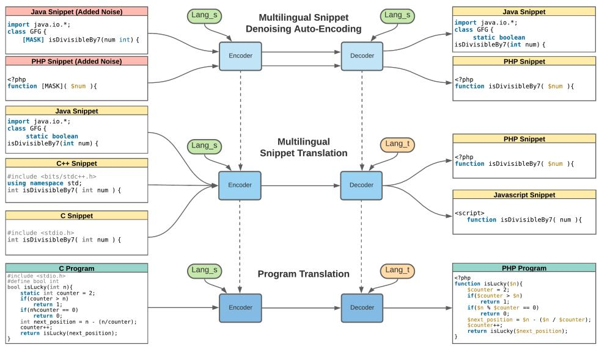

# Multilingual Code Snippets Training for Program Translation

Ming Zhu, Karthik Suresh, Chandan K. Reddy

Department of Computer Science, Virginia Tech, Arlington VA - 22203. mingzhu@vt.edu, karthiks@vt.edu, reddy@cs.vt.edu

# Abstract

Program translation aims to translate source code from one programming language to another. It is particularly useful in applications such as multiple-platform adaptation and legacy code migration. Traditional rule-based program translation methods usually rely on meticulous manual rule-crafting, which is costly both in terms of time and effort. Recently, neural network based methods have been developed to address this problem. However, the absence of high-quality parallel code data is one of the main bottlenecks which impedes the development of program translation models. In this paper, we introduce CoST, a new multilingual Code Snippet Translation dataset that contains parallel data from 7 commonly used programming languages. The dataset is parallel at the level of code snippets, which provides much more fine-grained alignments between different languages than the existing translation datasets. We also propose a new program translation model that leverages multilingual snippet denoising auto-encoding and Multilingual Snippet Translation (MuST) pre-training. Extensive experiments show that the multilingual snippet training is effective in improving program translation performance, especially for low-resource languages. Moreover, our training method shows good generalizability and consistently improves the translation performance of a number of baseline models. The proposed model outperforms the baselines on both snippet-level and program-level translation, and achieves state-of-the-art performance on CodeXGLUE translation task. The code, data, and appendix for this paper can be found at https://github.com/reddy-labcode-research/MuST-CoST.

# Introduction

Program Translation is the problem of converting source code from one programming language to another. Different from computer compilers which translate high-level programming languages to lower-level machine code, it mainly focuses on translation between high-level programming languages. Efficient and accurate program translation is of enormous value in a variety of scenarios, such as: 1) Migrating legacy code to another language. For instance, many industries spend several hundreds of millions of dollars to convert code written in older programming languages (such as FORTRAN and COBOL) to newer ones (such as Java

Copyright © 2022, Association for the Advancement of Artificial Intelligence (www.aaai.org). All rights reserved.

and $\mathrm{C}++$ ) (Roziere et al. 2020a). 2) Adapting software to different operating systems and platforms. For instance, for an Android application to run on iOS and Web browsers, it needs to be re-developed in Objective-C and Javascript. Traditional rule-based program translation usually relies on meticulous manual rule-crafting, which requires expertise in both programming languages, and requires an enormous amount of time and resources.

In recent years, deep learning based methods have been employed to address this problem. The success of transformer-based models (Vaswani et al. 2017) in natural language processing (NLP) has motivated researchers to utilize them for programming languages. A few recent works based on neural machine translation (NMT) have been applied to this task and achieved some impressive results (Roziere et al. 2020a; Ahmad et al. 2021). One of the important requirements for NMT models is the availability of high-quality parallel data for model training. Such data is even more critical for the program translation problem since it requires the generated code to be logically precise as well. However, existing code translation datasets have significant limitations. Most of the commonly used datasets (Lu et al. 2021; Chen, Liu, and Song 2018; Nguyen, Nguyen, and Nguyen 2015; Karaivanov, Raychev, and Vechev 2014; Nguyen, Nguyen, and Nguyen 2013) only contain two languages (Java and C#), and the alignment comes from mining similar function names from open source projects. Github has a huge number of open-source repositories in several languages. However, the data is not parallel and cannot be used for supervised translation. Project CodeNet (Puri et al. 2021) and Google Code Jam datasets contain solutions submitted to coding problems in multiple programming languages. However, given that the alignment comes from solutions to the same problems, they are aligned at the task level. Since programs that solve the same problem can have a high diversity in terms of variable names, method design and logical flow, these datasets are not ideal to train program translation models. This especially becomes a bottleneck in case of low resource languages, since models for those languages cannot be trained using limited data with high variance in distribution.

The scarcity of high quality parallel data has become a

<table><tr><td>Java</td><td>Python</td><td>PHP</td><td>C</td></tr><tr><td>import java.io.*; 
class GFG { 
// Function to check whether a number is divisible by 7 
static boolean isDivisibleBy7(int num) {</td><td># Function to check whether a number is divisible by 7 
def isDivisibleBy7(num) :</td><td>&lt;?php 
// Function to check whether a number is divisible by 7 
function isDivisibleBy7( $num) {</td><td>#include &lt;stdio.h&gt; 
// Function to check whether a number is divisible by 7 
int isDivisibleBy7( int num ) {</td></tr><tr><td>// If number is negative, 
// make it positive 
if( num &lt; 0 ) 
return isDivisibleBy7( -num);</td><td># If number is negative 
# make it positive 
if num &lt; 0 : 
return isDivisibleBy7( -num)</td><td>// If number is negative, 
// make it positive 
if( $num &lt; 0 ) 
return isDivisibleBy7( -$num);</td><td>// If number is negative, 
// make it positive 
if( num &lt; 0 ) 
return isDivisibleBy7( -num);</td></tr><tr><td>// Base cases 
if( num == 0 || num == 7 ) 
return true; 
if( num &lt; 10 ) 
return false;</td><td># Base cases 
if( num == 0 or num == 7 ) : 
return True 
if( num &lt; 10 ) : 
return False</td><td>// Base cases 
if( $num == 0 || $num == 7 ) 
return 1; 
if( $num &lt; 10 ) 
return 0;</td><td>// Base cases 
if( num == 0 || num == 7 ) 
return 1; 
if( num &lt; 10 ) 
return 0;</td></tr><tr><td>// Recur for ( num / 10 - 2 * num % 10 ) 
return isDivisibleBy7(...)</td><td># Recur for ( num / 10 - 2 * num % 
10 ) 
return isDivisibleBy7(...)</td><td>// Recur for ( num / 10 - 2 * num % 
10 ) 
return isDivisibleBy7(...)</td><td>// Recur for ( num / 10 - 2 * num % 
10 ) 
return isDivisibleBy7(...)</td></tr><tr><td>...</td><td>...</td><td>...</td><td>...</td></tr></table>

Figure 1: An example of a program and code snippets in different languages from our CoST dataset. Each column is one program (truncated) in a specific language. Each cell is one snippet. The snippets are aligned by matching the code comments in different languages. We show only four languages due to space constraints. All the remaining languages are shown in the Appendix.

bottleneck in program translation research. In this paper, we introduce CoST (Code Snippet Translation), a new dataset that consists of parallel source code snippets from 7 common programming languages: C++, Java, Python, C#, Javascript, PHP, and C. It contains parallel data at multiple levels, first at the snippet level, and then at the program level, for every pair of languages. To the best of our knowledge, CoST is the only dataset that provides snippet-level alignment for the seven commonly used programming languages. This dataset is not only a great resource to the program translation research community, but also serves as a new benchmark to evaluate the program translation models for upto 42 (7 by 6) programming language pairs at both snippet-level and program-level. In addition to supporting pairwise training, many samples in our dataset contain equivalent code snippets across multiple languages, thus supporting the development of multilingual program translation methods. An example of a program and its snippets in multiple languages is shown in Figure 1.

To demonstrate the effectiveness of using finely-grained alignment from code snippets for program translation, we propose a multilingual program translation model that leverages the similarity between different programming languages and the snippet level alignment of the dataset. Our experimental results show that the proposed model outperforms a number of baseline models on most of the 42 language pairs, on both snippet-level and program-level translation. The improvements are especially significant in case of low resource languages, that greatly benefit from the multilingual training. We also achieved state-of-the-art performance on CodeXGLUE (Lu et al. 2021) translation task. Moreover, our multilingual snippet translation (MuST) pretraining also shows good generalizability across different models. Extensive experiments show that it consistently improves the performance of multiple models on the translation of all the language pairs. In summary, the contributions of this paper are listed below:

- We introduce CoST, a new dataset that consists of both snippet-level and program level parallel data from 7 pro

gramming languages. Our dataset can be used to train program translation models for up to 42 programming language pairs.

- We provide a new benchmark to evaluate program translation model on 42 programming language pairs. Extensive experiments demonstrate that models which achieve the best performance on some languages can do much worse on certain other languages.   
- We propose a multilingual program translation model that leverages the similarity between different programming languages and the snippet level alignment of the dataset. The proposed model outperforms a number of baseline models and achieves state-of-the-art performance on CodeXGLUE translation task.   
- The MuST training method in our model has good generalizability and consistently improves the performance of several other models on program translation.

# Related Work

Methods: One line of work has directly applied recent advances in natural language processing (NLP) to the programming language domain. Inspired by the success of natural language pre-training, CodeBERT (Feng et al. 2020) pretrained a BERT (Kenton and Toutanova 2019) based encoder on the source code, and then added a decoder to perform end-to-end training on program translation. PLBART (Ahmad et al. 2021) utilized an existing natural language translation model, BART (Lewis et al. 2020), and also pre-trained it with source code. Transcoder (Roziere et al. 2020a) combined cross-lingual masked language modeling (Lample and Conneau 2019), denoising auto-encoding, and backtranslation, and applied them to a source code setting. Another line of work incorporates the intrinsic features of programming languages to improve translation performance. (Chen, Liu, and Song 2018) modeled this problem as translating a source tree into a target tree. GraphCodeBERT(Guo et al. 2020) improved upon CodeBERT (Feng et al. 2020) by adding data-flow graph extracted from source code, improving the model's understanding of the code structure. Some

Table 1: Comparison between our dataset and other existing source code translation datasets. Tree-to-tree Dataset (1 and 2) are from (Chen, Liu, and Song 2018). Phrase-Based Dataset is from (Karaivanov, Raychev, and Vechev 2014). * The numbers given in these cases are those of single program samples, and not paired programs.   

<table><tr><td>Dataset</td><td>Alignment</td><td>Labeling</td><td>Size (pairwise)</td><td>Languages</td></tr><tr><td>Google Code Jam</td><td>Program</td><td>Solutions to the same problem</td><td>2,430,000*</td><td>20 programming languages</td></tr><tr><td>Project CodeNet</td><td>Program</td><td>Solutions to the same problem</td><td>13,916,828*</td><td>55 programming languages</td></tr><tr><td>Tree-to-tree Dataset1</td><td>Method</td><td>Compiler translation</td><td>20,000</td><td>CoffeeScript, JavaScript</td></tr><tr><td>Tree-to-tree Dataset2</td><td>Method</td><td>Matching function names</td><td>16,996</td><td>Java, C#</td></tr><tr><td>Phrase-Based Dataset</td><td>Method</td><td>Matching function names</td><td>21,821</td><td>Java, C#</td></tr><tr><td>CodeXGLUE</td><td>Method</td><td>Matching function names</td><td>13,300</td><td>Java, C#</td></tr><tr><td>CoST Dataset</td><td>Snippet</td><td>Matching code comments</td><td>132,046</td><td>C++, Java, Python, C#, JS, PHP, C</td></tr></table>

Table 2: Number of pairwise data in each language-pair. The upper triangle (in normal font) shows the number of parallel code snippets, and the lower triangle (in bold font) shows the number of parallel programs. (Py is short for Python. JS is short for Javascript.)   

<table><tr><td>-</td><td>C++</td><td>Java</td><td>Py</td><td>C#</td><td>JS</td><td>PHP</td><td>C</td></tr><tr><td>C++</td><td>-</td><td>13929</td><td>11930</td><td>13326</td><td>7596</td><td>3165</td><td>2188</td></tr><tr><td>Java</td><td>1497</td><td>-</td><td>11713</td><td>13905</td><td>7729</td><td>3194</td><td>2135</td></tr><tr><td>Py</td><td>1419</td><td>1417</td><td>-</td><td>11404</td><td>7165</td><td>3123</td><td>1779</td></tr><tr><td>C#</td><td>1442</td><td>1495</td><td>1383</td><td>-</td><td>7601</td><td>3192</td><td>2123</td></tr><tr><td>JS</td><td>996</td><td>1009</td><td>962</td><td>994</td><td>-</td><td>2917</td><td>1232</td></tr><tr><td>PHP</td><td>548</td><td>552</td><td>545</td><td>552</td><td>512</td><td>-</td><td>700</td></tr><tr><td>C</td><td>267</td><td>281</td><td>263</td><td>273</td><td>196</td><td>135</td><td>-</td></tr></table>

other works (Rabinovich, Stern, and Klein 2017; Yin and Neubig 2017; Brockschmidt et al. 2018) also make use of abstract syntax tree (AST) derived from the code. DOBF (Roziere et al. 2021) added a de-obfuscation objective to the masked language model pre-training to leverage the structural aspect of programming languages.

Datasets: Many preceding works (Lu et al. 2021; Chen, Liu, and Song 2018; Nguyen, Nguyen, and Nguyen 2015; Karaivanov, Raychev, and Vechev 2014; Nguyen, Nguyen, and Nguyen 2013) consist of parallel Java-C# code from various open source projects. CodeNet (Puri et al. 2021) and Google CodeJam (GCJ) datasets contain code samples from multiple languages that are aligned at the program level.

# The Code Snippets Translation(CoST) Dataset

The Code Snippets Translation (CoST) dataset consists of programs from 7 different languages: C, C++, C#, Python, Java, Javascript, and PHP, spanning across 1625 programming problems. The detailed statistics about the CoST dataset are highlighted in Table 2. We define certain terms used in the context of this paper as follows:

- Programs: These refer to the complete code solution in a specific language to a particular problem or task.   
- Snippets/Code snippet: Each program may consist of one or more snippets which are in parallel to appropriate code snippets in other languages.

# Data Collection and Processing

Our data was collected from the GeeksForGeeks website. The platform has a plethora of problem statements and solutions to those problems in up to 7 programming languages (C, C++, C#, Python, Java, Javascript, PHP). The platform also ensures that its contributors stick to a template in terms of the comments used in their programs and the code corresponding to those comments. By using the template, we could obtain a one-to-one correspondence between the code snippets in one language to those in other languages. In effect, this gives us a good number of parallel instances of code which can then be effectively used for code-to-code translation. However, there were a number of cases where this template did not work as anticipated. These cases include missing snippets, differences in functionality among languages resulting in vastly different program structures, and misaligned cells. To remedy this issue, we manually verified the code to identify different instances of noncompliance, and either modify the alignment or discard the example in extreme cases. Few of the URLs scraped from different pages sometimes pointed to the same program, thus resulting in duplicate files. A duplication detection program was used to identify these duplicates and remove them.

# Dataset Comparisons and Characteristics

As shown in Table 1, many of the existing source code translation datasets such as (Lu et al. 2021; Chen, Liu, and Song 2018) consisting of pairwise samples at the method level collect their samples from very similar publicly available repositories. However, they only have parallel data in two languages; Java and C#. Moreover, their mapping is at the method level, and there are relatively fewer number of method pairs available. Other datasets such as Google Code Jam (GCJ) and CodeNet (Puri et al. 2021) have an abundance of problem statements along with their solutions and span a wide range of languages. However, these datasets suffer from quality issues. For instance, in CodeNet, only about half of the problems are rated by the online judges to be an accepted solution to the problem. This makes less than half the dataset to be wrong solutions and deems these erroneous samples unusable for the translation task. In contrast, our dataset contains programs which have been manually verified to ensure correctness at program and snippet levels,

thereby resulting in higher quality and less noise.

A major drawback of the existing datasets is that the samples are aligned at program level, which implies less supervised alignment. Since program level alignment is based on programs doing similar tasks and achieving similar results on test cases, there is a significant amount of variation between the programs in multiple languages, due to differences in terms of method and variable names, as well as the logic flow. The granularity in our case is at the snippet level, which provides more supervision in contrast to the method level or program level mapping that exists in previous datasets. Moreover, the code snippets in our dataset are consistent in terms of variable and method names, and the programs in each language follow similar logic flow.

# The Proposed Method

# Problem Formulation

Consider $L = \{l_1, \dots, l_k\}$ as the set of all languages, where $l_i$ denotes a programming language. Given a program $\mathbf{X}$ in language $l_i$ , the objective of program translation is to generate a program $\mathbf{Y}$ in the target language $l_j$ . We represent a program consisting of $m$ snippets as $\mathbf{X} = \{\mathbf{x}_1, \dots, \mathbf{x}_m\}$ , where $\mathbf{x}_i = (x_1, \dots, x_n)$ denotes a snippet with $n$ tokens. We further denote the monolingual snippet dataset in language $l_i$ as $\mathcal{D}_{l_i}^{mono}$ , and the bilingual snippet dataset for languages $l_i$ and $l_j$ as $\mathcal{D}_{l_i, l_j}^{bi}$ .

# Model Architecture

Given the sequence-to-sequence nature of the program translation problem, our model draws inspiration from the Transformer model (Vaswani et al. 2017), which has been shown to have state-of-the-art performance on many language generation tasks. The encoder-decoder based transformer model serves as the base model for our translation task. The model consists of an encoder $E$ and a decoder $G$ with parameters $\theta_E$ and $\theta_G$ , respectively, that are augmented to support code from multiple languages. This is done by using a unique identifier $\alpha_{l_i}$ for each language. Given the input token embeddings $\mathbf{x} = (x_1, \dots, x_n)$ , we add the language identifier to each token, such that $(x_1 + \alpha_{l_i}, \dots, x_n + \alpha_{l_i})$ serves as the input to the encoder. The encoder representations $\mathbf{z} = E(\mathbf{x}, \alpha_{l_i})$ are then fed to the decoder along with the target language identifier $\alpha_{l_j}$ to generate output snippet tokens $\mathbf{y} = G(\mathbf{z}, \alpha_{l_j})$ .

# Model Initialization

We initialize the model parameters with the pre-trained weights of the DOBF model (Roziere et al. 2021). DOBF is a Transformer-based model trained with masked language modeling (MLM) and code deobfuscation objectives on Python and Java files from GitHub public dataset available on Google BigQuery. The MLM objective helps the model to learn representations by leveraging the left and right contexts. The deobfuscation objective guides the model to recover the original class, function, and variable names from obfuscated code, which is a more difficult task and requires a deeper understanding of the code, thereby providing a better learning signal to the model. By initializing our model with

the weights of a sequence-to-sequence model pre-trained on source code, we can leverage its knowledge about the syntax and structure of the specific programming languages.

# Multilingual Snippets Denoising Auto-Encoding

To train the model to perform translation on different language pairs, we first need to familiarize the model with all the 7 languages. Although the model is initialized with pre-trained weights from DOBF, the weights were learned from only two languages, Python and Java. Therefore, the model has no knowledge about other languages (C++, C#, Javascript, PHP, C). To address this issue, we first train the model with Denoising Auto-Encoding (DAE) objective (Lample et al. 2018) on snippets from all the languages. There are several advantages of doing this pre-training task. First, the sequence-to-sequence nature of DAE enables the model to decode all the languages, which is necessary for the translation task. Second, by sharing the same encoder and decoder across all the languages, all the languages are mapped into the same latent space. This helps the model to learn the similarities between different languages, which can be useful in the translation of low-resource languages. Third, the DAE only requires monolingual data, which is much more accessible than pairwise data. We use the same set of noise functions as TransCoder (Roziere et al. 2020a), which includes random word shuffle, random word dropout, and random span masking. Considering $C$ as the noise model (non-learnable in this case), and $\mathbf{x}$ as the input sampled from $D_{l_i}^{mono}$ , the DAE objective can be written as:

$$
\begin{array}{l} \mathcal {L} _ {D A E} \left(\theta_ {E}, \theta_ {G}\right) = \\ \sum_ {l _ {i} \in L} \mathbb {E} _ {\mathbf {x} \sim D _ {l _ {i}} ^ {m o n o}, \tilde {\mathbf {x}} \sim C (\mathbf {x})} [ - \log p _ {G} (\mathbf {x} | E (\tilde {\mathbf {x}}, \alpha_ {l _ {i}}), \alpha_ {l _ {i}}) ] \tag {1} \\ \end{array}
$$

# Multilingual Snippet Translation (MuST)

In many language generation tasks, the performance goes down significantly as the length of input sequences increases. This is a common problem in sequence-to-sequence models due to the difficulty of capturing long-distance dependencies. Since source code programs usually contain at least tens of lines, achieving acceptable performance from translation models can be challenging. In order to alleviate this problem, we use code snippets translation as a pretraining method to improve the accuracy of program translation. Since the code snippets are much shorter than programs, they provide a fine-grained supervision to the translation model, and thus can help to address the problem of reduced performance for longer inputs.

Another problem encountered by many existing models is that program translation datasets are usually not balanced in size for all the languages. Some languages may have much less parallel data than others. For example, in CoST dataset, there are 13K snippet pairs for Java and $\mathrm{C + + }$ , but only 700 pairs for C and PHP. Less parallel training data can significantly affect the translation performance on low-resource languages. Therefore, in addition to snippet translation, we propose to leverage the multilingual training to improve the performance on low-resource languages. In CoST dataset,

  
Figure 2: The training paradigm of the proposed MuST-PT model. We first train the model with multilingual snippet denoising auto-encoding, which helps the model to learn the similarity between different languages. Then we apply multilingual snippet translation (MuST) training to leverage the snippet-level alignment to increase the accuracy of program-level translation. Finally, we fine-tune the model on program translation task to bridge the distribution gap between snippet and program data. Lang_s and Lang_t refers to source and target language, respectively. At each step of the training, the model takes both the code and the programming language as inputs.

one code snippet may have corresponding snippets in multiple languages. Moreover, some languages are naturally similar in syntax, such as C++-C, Java-C, and Java-C#. This motivates us to use other languages to improve the translation of low resource languages, e.g. using C++-PHP and Java-PHP data to improve the translation of C-PHP. For a snippet pair $(x,y) \in \mathcal{D}_{l_i,l_j}^{bi}$ , the objective function for this task can be written as:

$$
\mathcal {L} _ {M} \left(\theta_ {E}, \theta_ {G}\right) = \sum_ {l _ {i}, l _ {j} \in L} \mathbb {E} _ {\left(x, y\right) \sim \mathcal {D} _ {l _ {i}, l _ {j}} ^ {b i}} \left[ - \log p _ {G} (\mathbf {y} \mid E (\mathbf {x}, \alpha_ {l _ {i}}), \alpha_ {l _ {j}}) \right] \tag {2}
$$

$$
\mathcal {L} = \mathcal {L} _ {M} + \lambda \mathcal {L} _ {D A E} \tag {3}
$$

The overall training objective of our model is given above. Here, $\lambda$ is a hyperparameter that represents the weight of DAE loss. After the multilingual snippet DAE and MuST pre-training, the model is capable of translating code snippets across all the 42 language pairs. However, because of the difference in length between code snippets and programs, the model cannot directly be used for program translation. Therefore, we further fine-tune the model on the program pairs from our dataset. We adopt similar multilingual training strategy on the program-level pairwise data. The overall training process is illustrated in Fig. 2. We refer to the model as MuST-PT, which is short for the Multilingual Snipet Training for Program Translation model.

# Implementation Details

In our model, the encoder and decoder consist of 12 and 6 transformer layers, respectively. The transformer units have

a model dimension of 768, and 12 attention heads. The weight of the multilingual snippet DAE objective $\lambda$ was set to 1.0 in the beginning, and decayed to 0.1 linearly in 30K steps, and then to 0 in 100K steps. The DOBF model we used for initializing our model is dobf_plus_denoising.pth, which can be found on their GitHub repository. Most of the settings during training were the same as DOBF (Roziere et al. 2021). Float 16 operations were used to speed up the training. The model was trained using Adam optimizer (Kingma and Ba 2014) with a learning rate of 0.0001, and the same learning rate scheduler was used from the Transformer (Vaswani et al. 2017). We used a batch size of 128 on all the 42 language pairs. The batches of different languages pairs were sent to the model alternatively during training. The model was trained with 4 RTX 8000 GPUs with 48GB memory on each GPU.

# Experiments

# Datasets

The datasets used for the experimental evaluation are below:

- CoST Snippets Dataset We used the monolingual snippets to do the multilingual snippet DAE training, and the pairwise snippets to do the multilingual snippet translation (MuST) training. The train-validation-test data is split at the problem level, to ensure no overlapping snippets between the splits in any of the languages. The statistics of the split in each language can be found in the Appendix.   
- CoST Programs Dataset We used the pairwise program data to fine-tune the model for program translation.   
- CodeXGLUE Translation Dataset CodeXGLUE stands

Table 3: Results on the CodeXGLUE translation task. Our model achieves state-of-the-art performance on BLEU score of C#-Java and both BLEU and CodeBLEU on Java-C#.   

<table><tr><td></td><td colspan="2">Java-C#</td><td colspan="2">C++.Java</td></tr><tr><td>Method</td><td>BLEU</td><td>CodeBLEU</td><td>BLEU</td><td>CodeBLEU</td></tr><tr><td>Naive copy</td><td>18.54</td><td>-</td><td>18.69</td><td>-</td></tr><tr><td>PBSMT</td><td>43.53</td><td>42.71</td><td>40.06</td><td>43.48</td></tr><tr><td>Transformer</td><td>55.84</td><td>63.74</td><td>50.47</td><td>61.59</td></tr><tr><td>RoBERTa(code)</td><td>77.46</td><td>83.07</td><td>71.99</td><td>80.18</td></tr><tr><td>CodeBERT</td><td>79.92</td><td>85.1</td><td>72.14</td><td>79.41</td></tr><tr><td>GraphCodeBERT</td><td>80.58</td><td>-</td><td>72.64</td><td>-</td></tr><tr><td>PLBART</td><td>83.02</td><td>87.92</td><td>78.35</td><td>85.27</td></tr><tr><td>MuST-PT</td><td>87.37</td><td>86.82</td><td>85.25</td><td>86.09</td></tr></table>

for General Language Understanding Evaluation benchmark for code. It has 10 source code related tasks, and code to code translation is one of them. We used the translation dataset (Java-C#) from CodeXGLUE for evaluation.

# Evaluation Metrics

- BLEU Given an input code sample, we use BLEU (Papineni et al. 2002) score to evaluate the $n$ -gram overlap between the generated and the ground-truth target code.   
- CodeBLEU CodeBLEU (Ren et al. 2020) is for automatic evaluation of code synthesis. Besides $n$ -gram match as in BLEU, it also evaluates the code syntax via abstract syntax trees (AST) and code semantics via data-flow.

# Baseline Methods

- Naive Copy Naive Copy (Lu et al. 2021) directly copies the input source code as the translation output. This baseline shows how similar two programming languages are.   
- Transformer The sequence-to-sequence transformer model (Vaswani et al. 2017) was originally designed for translation problem. We use it as a baseline to see how well a transformer model performs without any pretraining on source code corpus.   
- CodeBERT CodeBERT (Feng et al. 2020) uses the BERT architecture pre-trained on source code corpus.   
- DOBF DOBF (Roziere et al. 2021) is the model from which the weights are used to initialize our model. It is pre-trained on Java and Python.   
- TransCoder TransCoder (Roziere et al. 2020b) is an unsupervised program translation model pre-trained on Java, Python, and $\mathrm{C + + }$ . We did not include TransCoder in Table 4 because it does not support input languages other than the ones it was pre-trained on (performance not increasing through training).

Due to space limitations, we did not include some baselines (PLBART, GraphCodeBERT, RoBERTa(code) (Liu et al. 2019), PBSMT (Zens, Och, and Ney 2002)) from CodeXGLUE translation task in other experiments.

# Results Analysis

Translation Performance on Snippets Table 4 shows the translation performance of our model and the baseline models on all the 42 language pairs. Every model is evaluated

on both the snippets dataset and the program dataset. The left part of the Table shows BLEU score of each model on the snippets dataset. We can see that our model outperforms the baseline models, with significant performance gains on low resource languages like PHP and C. This shows that the multilingual training in both DAE and MuST is helpful in improving low-resource language translation.

Translation Performance on Programs The right part of the Table 4 shows BLEU score of each model on the program dataset. We can see that almost all the baseline models have much worse performance on program than snippets. This can be attributed to the more challenging nature of program-level translation due to longer sequence length compared to snippets, and less training data than snippet level. However, our model's performance does not drop by much on program-level compared to snippet level. This shows that the MuST pre-training improves the program translation performance.

Translation Performance on CodeXGLUE We also evaluated our model on the CodeXGLUE translation task. Table 3 shows the BLEU and CodeBLEU of our model compared to the models on the CodeXGLUE translation task leaderboard. Our model achieved state-of-the-art performance on BLEU score of both Java-C# and C#. Java, and high CodeBLEU score on C#. Java conversion. This indicates that the DAE and MuST training in our model is effective on other program translation datasets.

Generalizability of MuST Training We combine some of the baselines with MuST training to see if the method is generalizable to more models. Table 5 shows the results of each baseline before and after MuST training. We can see that all the three baselines got significant improvement after MuST training, indicating that MuST is not only effective in our model setting, but also benefits other models. This demonstrates that MuST has good generalizability and can potentially benefit other program translation models.

# Conclusion and Future Work

Scarcity of high quality parallel data has become the bottleneck of program translation research. In this paper, we introduced a new multilingual code translation dataset CoST, with snippet-level parallel data across 7 programming languages. Our dataset provides fine-grained supervision for the translation of 42 language pairs. We also propose a new program translation model that leverages multilingual snippet denoising auto-encoding (DAE) and multilingual snippet translation (MuST) pre-training. Our extensive set of experiments show that DAE and MuST are effective in improving program translation performance, especially for low-resource languages. We also achieved state-of-the-art performance on CodeXGLUE translation task. The MuST training also shows good generalizability and improves the translation performance of a number of baseline models. The new dataset we present can potentially be used for tasks other than translation, such as code summarization, comment generation, and text-to-code generation. The MuST can also potentially improve the performance on these new tasks. We will leave them for future work.

Table 4: BLEU scores of baseline and the proposed MuST-PT model on all the 42 language pairs on both CoST snippet and program datasets. Note that only multilingual DAE and MuST were applied for snippet-level translation. We did program-level fine-tuning for MuST-PT only for program-level translation.   

<table><tr><td colspan="2"></td><td colspan="7">Snippets-level</td><td colspan="7">Program-level</td></tr><tr><td>Lang</td><td>Model</td><td>C++</td><td>Java</td><td>Python</td><td>C#</td><td>JS</td><td>PHP</td><td>C</td><td>C++</td><td>Java</td><td>Python</td><td>C#</td><td>JS</td><td>PHP</td><td>C</td></tr><tr><td rowspan="5">C++</td><td>Naive Copy</td><td>-</td><td>68.87</td><td>35.03</td><td>69.54</td><td>57.71</td><td>37.7</td><td>87.73</td><td>-</td><td>66.57</td><td>36.58</td><td>67.22</td><td>55.24</td><td>36.27</td><td>84.86</td></tr><tr><td>Transformer</td><td>-</td><td>68.74</td><td>57.17</td><td>70.61</td><td>63.26</td><td>60.94</td><td>68.57</td><td>-</td><td>43.93</td><td>33.9</td><td>45.32</td><td>39.02</td><td>35.93</td><td>25.06</td></tr><tr><td>CodeBERT</td><td>-</td><td>71.61</td><td>60.28</td><td>72.31</td><td>72.4</td><td>70.42</td><td>61.29</td><td>-</td><td>53.47</td><td>38.37</td><td>63.01</td><td>46.6</td><td>46.18</td><td>22.25</td></tr><tr><td>DOBF</td><td>-</td><td>79.83</td><td>68.61</td><td>81.74</td><td>79.24</td><td>77.91</td><td>68.09</td><td>-</td><td>29.06</td><td>18.5</td><td>29.14</td><td>22.25</td><td>27.47</td><td>27.05</td></tr><tr><td>MuST-PT</td><td>-</td><td>80.27</td><td>71.2</td><td>82.98</td><td>81.01</td><td>83.29</td><td>87.55</td><td>-</td><td>79.15</td><td>64.1</td><td>81.15</td><td>68.85</td><td>71.18</td><td>84.2</td></tr><tr><td rowspan="5">Java</td><td>Naive Copy</td><td>68.75</td><td>-</td><td>33.8</td><td>77.9</td><td>58.58</td><td>33.6</td><td>70.22</td><td>66.53</td><td>-</td><td>34.56</td><td>77.15</td><td>56.52</td><td>32.14</td><td>67.54</td></tr><tr><td>Transformer</td><td>74.42</td><td>-</td><td>53.98</td><td>84.27</td><td>69.16</td><td>58.5</td><td>46.18</td><td>44.38</td><td>-</td><td>31.22</td><td>47.34</td><td>39.06</td><td>38.26</td><td>25.36</td></tr><tr><td>CodeBERT</td><td>73.19</td><td>-</td><td>59.04</td><td>85.12</td><td>76.79</td><td>7.24</td><td>50.33</td><td>65.48</td><td>-</td><td>38.7</td><td>85.46</td><td>55.92</td><td>47.12</td><td>32.98</td></tr><tr><td>DOBF</td><td>80.83</td><td>-</td><td>64.75</td><td>89.73</td><td>79.89</td><td>66.94</td><td>59.32</td><td>28.34</td><td>-</td><td>18.08</td><td>27.6</td><td>20.2</td><td>27.05</td><td>26.12</td></tr><tr><td>MuST-PT</td><td>85.23</td><td>-</td><td>70.06</td><td>90.13</td><td>81.87</td><td>80.39</td><td>81.16</td><td>84.28</td><td>-</td><td>61.12</td><td>89.93</td><td>69.53</td><td>69.83</td><td>78.71</td></tr><tr><td rowspan="5">Python</td><td>Naive Copy</td><td>35.02</td><td>33.53</td><td>-</td><td>35.11</td><td>41.71</td><td>23.57</td><td>35.29</td><td>36.58</td><td>34.27</td><td>-</td><td>35.69</td><td>40.85</td><td>22.48</td><td>36.53</td></tr><tr><td>Transformer</td><td>60.5</td><td>58.13</td><td>-</td><td>60.9</td><td>55.59</td><td>55.07</td><td>39.37</td><td>37.42</td><td>38.15</td><td>-</td><td>36.91</td><td>38.39</td><td>39.01</td><td>19.99</td></tr><tr><td>CodeBERT</td><td>65.04</td><td>61.79</td><td>-</td><td>63.84</td><td>62.43</td><td>62.6</td><td>45.09</td><td>43.96</td><td>41.35</td><td>-</td><td>46.4</td><td>47.28</td><td>44.38</td><td>46.4</td></tr><tr><td>DOBF</td><td>68.73</td><td>67.91</td><td>-</td><td>69.46</td><td>68.07</td><td>67.8</td><td>34.21</td><td>21.49</td><td>23.45</td><td>-</td><td>21.82</td><td>20.32</td><td>26.53</td><td>13.02</td></tr><tr><td>MuST-PT</td><td>75.37</td><td>70.89</td><td>-</td><td>72.35</td><td>70.46</td><td>75.49</td><td>70.64</td><td>66.16</td><td>64.57</td><td>-</td><td>63.23</td><td>66.47</td><td>70.9</td><td>58.7</td></tr><tr><td rowspan="5">C#</td><td>Naive Copy</td><td>69.5</td><td>78.05</td><td>35.16</td><td>-</td><td>60.23</td><td>35.43</td><td>70.65</td><td>67.16</td><td>77.23</td><td>35.76</td><td>-</td><td>58.4</td><td>33.57</td><td>67.9</td></tr><tr><td>Transformer</td><td>75.68</td><td>84.19</td><td>58.64</td><td>-</td><td>66.97</td><td>60.57</td><td>45.18</td><td>42.65</td><td>45.6</td><td>32.64</td><td>-</td><td>39.66</td><td>38.47</td><td>25.01</td></tr><tr><td>CodeBERT</td><td>74.73</td><td>82.16</td><td>59.74</td><td>-</td><td>77.12</td><td>67.48</td><td>49.64</td><td>67.17</td><td>82.45</td><td>41.1</td><td>-</td><td>51.09</td><td>48.62</td><td>34.33</td></tr><tr><td>DOBF</td><td>81.77</td><td>86.73</td><td>67.96</td><td>-</td><td>80.26</td><td>15.94</td><td>28.35</td><td>26.97</td><td>29.17</td><td>19.71</td><td>-</td><td>19.34</td><td>27.05</td><td>19.11</td></tr><tr><td>MuST-PT</td><td>85.34</td><td>85.8</td><td>71.11</td><td>-</td><td>82.74</td><td>81.64</td><td>81.12</td><td>84.72</td><td>87.76</td><td>62.03</td><td>-</td><td>70</td><td>70.66</td><td>78.78</td></tr><tr><td rowspan="5">JS</td><td>Naive Copy</td><td>57.67</td><td>57.99</td><td>41.73</td><td>60.04</td><td>-</td><td>32.56</td><td>57.6</td><td>55.11</td><td>55.74</td><td>40.9</td><td>58.1</td><td>-</td><td>29.77</td><td>53.89</td></tr><tr><td>Transformer</td><td>65.06</td><td>65.31</td><td>56.92</td><td>64.55</td><td>-</td><td>61.87</td><td>37.34</td><td>39.8</td><td>39.6</td><td>34.3</td><td>41.72</td><td>-</td><td>37.65</td><td>19.78</td></tr><tr><td>CodeBERT</td><td>68.76</td><td>71.66</td><td>58.13</td><td>72.87</td><td>-</td><td>66.35</td><td>37.08</td><td>49.51</td><td>48.91</td><td>46.27</td><td>51.55</td><td>-</td><td>47.95</td><td>24.37</td></tr><tr><td>DOBF</td><td>78.56</td><td>76.94</td><td>64.92</td><td>75.5</td><td>-</td><td>75.53</td><td>52.32</td><td>26.47</td><td>25.93</td><td>21.77</td><td>21.43</td><td>-</td><td>26.73</td><td>18.68</td></tr><tr><td>MuST-PT</td><td>78.95</td><td>78.03</td><td>66.47</td><td>78.91</td><td>-</td><td>78.69</td><td>78.54</td><td>73.01</td><td>73.39</td><td>63.88</td><td>73.32</td><td>-</td><td>76.44</td><td>70.2</td></tr><tr><td rowspan="5">PHP</td><td>Naive Copy</td><td>37.66</td><td>33.65</td><td>23.6</td><td>35.41</td><td>32.66</td><td>-</td><td>37.46</td><td>36.24</td><td>32.17</td><td>22.54</td><td>33.56</td><td>29.97</td><td>-</td><td>35.73</td></tr><tr><td>Transformer</td><td>58.47</td><td>56.06</td><td>51.45</td><td>56.27</td><td>56.43</td><td>-</td><td>29.29</td><td>33.78</td><td>35.67</td><td>31.52</td><td>37.54</td><td>37.07</td><td>-</td><td>20.11</td></tr><tr><td>CodeBERT</td><td>65.08</td><td>60.84</td><td>54.59</td><td>63.77</td><td>63.92</td><td>-</td><td>29.75</td><td>40.43</td><td>37.64</td><td>33.01</td><td>41.33</td><td>41.31</td><td>-</td><td>18.63</td></tr><tr><td>DOBF</td><td>68.18</td><td>65.84</td><td>63.45</td><td>70.14</td><td>63.21</td><td>-</td><td>23.78</td><td>26.69</td><td>26.28</td><td>19.91</td><td>23.52</td><td>20.63</td><td>-</td><td>18.31</td></tr><tr><td>MuST-PT</td><td>79.41</td><td>76.42</td><td>69.34</td><td>77.96</td><td>77.64</td><td>-</td><td>76.67</td><td>70.04</td><td>67.3</td><td>63.97</td><td>70.34</td><td>73.54</td><td>-</td><td>67.88</td></tr><tr><td rowspan="5">C</td><td>Naive Copy</td><td>87.63</td><td>70.29</td><td>35.37</td><td>70.62</td><td>57.74</td><td>37.45</td><td>-</td><td>84.75</td><td>67.56</td><td>36.61</td><td>67.88</td><td>54.17</td><td>35.75</td><td>-</td></tr><tr><td>Transformer</td><td>68.63</td><td>45.42</td><td>36.4</td><td>44.38</td><td>35.37</td><td>31.03</td><td>-</td><td>29.54</td><td>30.73</td><td>24.62</td><td>31.28</td><td>24.55</td><td>24.83</td><td>-</td></tr><tr><td>CodeBERT</td><td>64.18</td><td>51.1</td><td>36.48</td><td>49.81</td><td>33.75</td><td>28.85</td><td>-</td><td>27.96</td><td>35.29</td><td>22.05</td><td>32.82</td><td>21.73</td><td>25.19</td><td>-</td></tr><tr><td>DOBF</td><td>76.85</td><td>64.73</td><td>53.1</td><td>45.11</td><td>30.87</td><td>22.22</td><td>-</td><td>16.84</td><td>23.23</td><td>17.64</td><td>23.96</td><td>20.38</td><td>25.7</td><td>-</td></tr><tr><td>MuST-PT</td><td>88.58</td><td>79.24</td><td>66.49</td><td>80.68</td><td>80.35</td><td>82.94</td><td>-</td><td>84.92</td><td>76.84</td><td>55.71</td><td>78.39</td><td>66.13</td><td>70.62</td><td>-</td></tr></table>

Table 5: Multilingual Snippets Translation (MuST) training consistently improves the performance (measured by BLEU scores) of the baseline models on the CoST program translation dataset. This shows that MuST pre-training method can be generalized to other models and benefit their translation performance.   

<table><tr><td>Model</td><td>Java-Py</td><td>Py-Java</td><td>Java-C++</td><td>C++-Java</td><td>Java-C#</td><td>C#-Java</td><td>Py-C++</td><td>C++-Py</td><td>Py-C#</td><td>C#-Py</td><td>C++-C#</td><td>C#-C++</td></tr><tr><td>Naive Copy</td><td>34.56</td><td>34.27</td><td>66.53</td><td>66.57</td><td>77.15</td><td>77.23</td><td>36.58</td><td>36.58</td><td>35.69</td><td>35.76</td><td>67.22</td><td>67.16</td></tr><tr><td>Transformer</td><td>31.22</td><td>38.15</td><td>44.38</td><td>43.93</td><td>47.34</td><td>45.6</td><td>37.42</td><td>33.9</td><td>36.91</td><td>32.64</td><td>45.32</td><td>42.65</td></tr><tr><td>Transformer+MuST</td><td>40.9</td><td>43.97</td><td>58.35</td><td>54.61</td><td>73.7</td><td>71.68</td><td>42.86</td><td>39.06</td><td>43.42</td><td>42.34</td><td>57.84</td><td>57.49</td></tr><tr><td>CodeBERT</td><td>38.7</td><td>41.35</td><td>65.48</td><td>53.47</td><td>85.46</td><td>82.45</td><td>43.96</td><td>38.37</td><td>46.4</td><td>41.1</td><td>63.01</td><td>67.17</td></tr><tr><td>CodeBERT+MuST</td><td>55.5</td><td>57.66</td><td>81.09</td><td>78.69</td><td>90.47</td><td>86.76</td><td>58.91</td><td>55.98</td><td>59.13</td><td>55.45</td><td>79.05</td><td>81.54</td></tr><tr><td>TransCoder</td><td>24.98</td><td>21.98</td><td>30.09</td><td>30.42</td><td>44.85</td><td>29.4</td><td>23.03</td><td>23.52</td><td>40.4</td><td>18.81</td><td>41.91</td><td>25.3</td></tr><tr><td>TransCoder+MuST</td><td>60.73</td><td>65.53</td><td>87.09</td><td>81.64</td><td>91.74</td><td>27.7</td><td>68.7</td><td>62.92</td><td>66.52</td><td>16.88</td><td>82.4</td><td>29.44</td></tr></table>

# Acknowledgments

This work was supported in part by the US National Science Foundation grants IIS-1838730 and Amazon AWS credits.

# References

Ahmad, W.; Chakraborty, S.; Ray, B.; and Chang, K.-W. 2021. Unified Pre-training for Program Understanding and Generation. In Proceedings of the 2021 Conference of the North American Chapter of the Association for Computational Linguistics: Human Language Technologies, 2655-2668. Online: Association for Computational Linguistics.   
Brockschmidt, M.; Allamanis, M.; Gaunt, A. L.; and Polozov, O. 2018. Generative Code Modeling with Graphs. In International Conference on Learning Representations.   
Chen, X.; Liu, C.; and Song, D. 2018. Tree-to-tree Neural Networks for Program Translation. In Bengio, S.; Wallach, H.; Larochelle, H.; Grauman, K.; Cesa-Bianchi, N.; and Garnett, R., eds., Advances in Neural Information Processing Systems, volume 31. Curran Associates, Inc.   
Feng, Z.; Guo, D.; Tang, D.; Duan, N.; Feng, X.; Gong, M.; Shou, L.; Qin, B.; Liu, T.; Jiang, D.; and Zhou, M. 2020. CodeBERT: A Pre-Trained Model for Programming and Natural Languages. In Findings of the Association for Computational Linguistics: EMNLP 2020, 1536-1547. Online: Association for Computational Linguistics.   
Guo, D.; Ren, S.; Lu, S.; Feng, Z.; Tang, D.; Liu, S.; Zhou, L.; Duan, N.; Svyatkovskiy, A.; Fu, S.; et al. 2020. Graph-codebert: Pre-training code representations with data flow. arXiv preprint arXiv:2009.08366.   
Karaivanov, S.; Raychev, V.; and Vechev, M. 2014. Phrase-based statistical translation of programming languages. In Proceedings of the 2014 ACM International Symposium on New Ideas, New Paradigms, and Reflections on Programming & Software, 173-184.   
Kenton, J. D. M.-W. C.; and Toutanova, L. K. 2019. BERT: Pre-training of Deep Bidirectional Transformers for Language Understanding. In Proceedings of NAACL-HLT, 4171-4186.   
Kingma, D. P.; and Ba, J. 2014. Adam: A method for stochastic optimization. arXiv preprint arXiv:1412.6980.   
Lample, G.; and Conneau, A. 2019. Cross-lingual Language Model Pretraining. arXiv e-prints, arXiv-1901.   
Lample, G.; Conneau, A.; Denoyer, L.; and Ranzato, M. 2018. Unsupervised Machine Translation Using Monolingual Corpora Only. In International Conference on Learning Representations.   
Lewis, M.; Liu, Y.; Goyal, N.; Ghazvininejad, M.; Mohamed, A.; Levy, O.; Stoyanov, V.; and Zettlemoyer, L. 2020. BART: Denoising Sequence-to-Sequence Pre-training for Natural Language Generation, Translation, and Comprehension. In Proceedings of the 58th Annual Meeting of the Association for Computational Linguistics, 7871-7880.   
Liu, Y.; Ott, M.; Goyal, N.; Du, J.; Joshi, M.; Chen, D.; Levy, O.; Lewis, M.; Zettlemoyer, L.; and Stoyanov, V. 2019. Roberta: A robustly optimized bert pretraining approach. arXiv preprint arXiv:1907.11692.

Lu, S.; Guo, D.; Ren, S.; Huang, J.; Svyatkovskiy, A.; Blanco, A.; Clement, C.; Drain, D.; Jiang, D.; Tang, D.; et al. 2021. CodeXGLUE: A Machine Learning Benchmark Dataset for Code Understanding and Generation. arXiv preprint arXiv:2102.04664.   
Nguyen, A. T.; Nguyen, T. T.; and Nguyen, T. N. 2013. Lexical statistical machine translation for language migration. In Proceedings of the 2013 9th Joint Meeting on Foundations of Software Engineering, 651-654.   
Nguyen, A. T.; Nguyen, T. T.; and Nguyen, T. N. 2015. Divide-and-conquer approach for multi-phase statistical migration for source code (t). In 2015 30th IEEE/ACM International Conference on Automated Software Engineering (ASE), 585-596. IEEE.   
Papineni, K.; Roukos, S.; Ward, T.; and Zhu, W.-J. 2002. Bleu: a method for automatic evaluation of machine translation. In Proceedings of the 40th annual meeting of the Association for Computational Linguistics, 311-318.   
Puri, R.; Kung, D. S.; Janssen, G.; Zhang, W.; Domeniconi, G.; Zolotov, V.; Dolby, J.; Chen, J.; Choudhury, M.; Decker, L.; et al. 2021. Project CodeNet: A Large-Scale AI for Code Dataset for Learning a Diversity of Coding Tasks. arXiv preprint arXiv:2105.12655.   
Rabinovich, M.; Stern, M.; and Klein, D. 2017. Abstract Syntax Networks for Code Generation and Semantic Parsing. In ACL (1).   
Ren, S.; Guo, D.; Lu, S.; Zhou, L.; Liu, S.; Tang, D.; Sundaresan, N.; Zhou, M.; Blanco, A.; and Ma, S. 2020. Codebleu: a method for automatic evaluation of code synthesis. arXiv preprint arXiv:2009.10297.   
Roziere, B.; Lachaux, M.-A.; Chanussot, L.; and Lample, G. 2020a. Unsupervised Translation of Programming Languages. In Larochelle, H.; Ranzato, M.; Hadsell, R.; Balcan, M. F.; and Lin, H., eds., Advances in Neural Information Processing Systems, volume 33, 20601-20611. Curran Associates, Inc.   
Roziere, B.; Lachaux, M.-A.; Chanussot, L.; and Lample, G. 2020b. Unsupervised Translation of Programming Languages. In NeurIPS.   
Roziere, B.; Lachaux, M.-A.; Szafraniec, M.; and Lample, G. 2021. DOBF: A Deobfuscation Pre-Training Objective for Programming Languages. arXiv preprint arXiv:2102.07492.   
Vaswani, A.; Shazeer, N.; Parmar, N.; Uszkoreit, J.; Jones, L.; Gomez, A. N.; Kaiser, L.; and Polosukhin, I. 2017. Attention is all you need. In Advances in neural information processing systems, 5998-6008.   
Yin, P.; and Neubig, G. 2017. A Syntactic Neural Model for General-Purpose Code Generation. In Proceedings of the 55th Annual Meeting of the Association for Computational Linguistics (Volume 1: Long Papers), 440-450.   
Zens, R.; Och, F. J.; and Ney, H. 2002. Phrase-based statistical machine translation. In Annual Conference on Artificial Intelligence, 18-32. Springer.